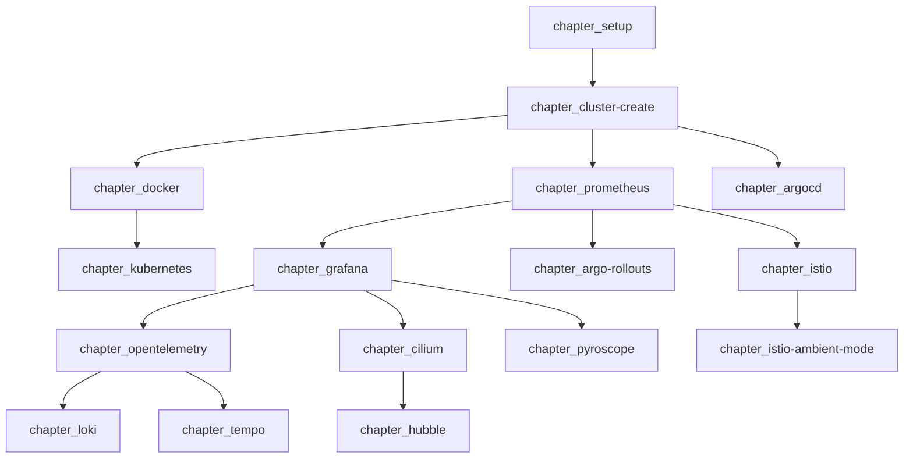

# Co-located Hands-on Event by CNDS2024 Committee
『一日で学ぶクラウドネイティブ技術実践ハンズオン』by CloudNative Days Summer 2024 実行委員会のドキュメントです。

このハンズオンでは、Docker・Kubernetes・Prometheus・Grafana・OpenTelemetry・Argo CD・Argo Rollouts・Istio・Cilium・Hubble Loki Tempo Pyroscopeといったよく利用されるクラウドネイティブな OSS について触れることができるハンズオンです。
これらの OSS についての第一歩を学び、これから先の学習のきっかけにしてください。

## Chapter
準備用chapter＋全15chapterから構成されています。
- [chapter_setup](./chapter_setup/)
- [chapter_cluster-create](./chapter_cluster-create/)
- [chapter_docker](./chapter_docker/)
- [chapter_kubernetes](./chapter_kubernetes/)
- [chapter_prometheus](./chapter_prometheus/)
- [chapter_grafana](./chapter_grafana/)
- [chapter_opentelemetry](./chapter_opentelemetry/)
- [chapter_argocd](./chapter_argocd/)
- [chapter_istio](./chapter_istio/)
- [chapter_cilium](./chapter_cilium/)
- [chapter_argo-rollouts](./chapter_argo-rollouts/)
- [chapter_istio-ambient-mode](./chapter_istio-ambient-mode/)
- [chapter_hubble](./chapter_hubble/)
- [chapter_loki](./chapter_loki/)
- [chapter_tempo](./chapter_tempo/)
- [chapter_pyroscope](./chapter_pyroscope/)

### 進め方
まずは、`chapter_setup`, `chapter_cluster-create`を実施してhandsonを進めるための環境を構築してください。 
その後は、順番にchapterを進めることはもちろん、下記フローチャートのように、気になる技術に焦点を当てたchapterを進めることもできます。

## 免責事項
本ドキュメントに掲載された内容によって生じた損害等の一切の責任を負いかねます。
また、本ドキュメントのコンテンツや情報において、可能な限り正確な情報を掲載するよう努めていますが、情報が古くなったりすることもあります。必ずしも正確性を保証するものではありません。あらかじめご了承ください。
