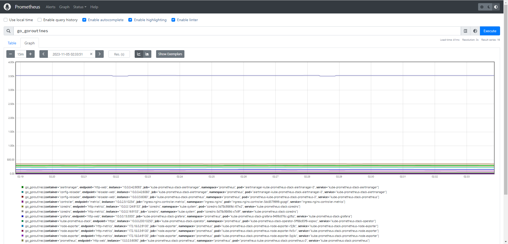

# chapter02_prometheus

この章では、Kubernetes上での様々なメトリクスの基盤としてPrometheusを紹介し、実際に導入してみます。

## Prometheusについて

TODO

## PromQLについて

TODO

## Prometheus Operatorについて

Prometheus Operatorは、Prometheusや関連する監視コンポーネントを管理やKubernetesネイティブなデプロイメントを提供します。
このプロジェクトの目的は、KubernetesクラスターのPrometheusベースの監視スタックの設定を簡素化し、自動化することにあります。

Prometheus Operatorには以下の特徴があります。

Kubernetesカスタムリソース：Kubernetesのカスタムリソースを使用して、PrometheusやAlertmanager、関連するコンポーネントをデプロイし、管理します。

簡素化されたデプロイメント設定：Prometheusの基本設定であるバージョン、永続性、保持ポリシー、KubernetesリソースのReplicaなどを設定することができます。

Prometheusターゲット設定：Prometheus固有の言語を学ぶ必要なく、Kubernetesラベルクエリに基づいて監視ターゲット設定を自動的に生成します。


### メトリクスの収集

メトリクスを収集するために、Prometheus Operator は `ServiceMonitor`や`PodMonitor`を使用して、監視対象のサービスを指定します。

これにより、CPUやメモリ使用率、HTTPリクエスト数、レイテンシーなどのメトリクスを追跡できます。

例として、repricaが3つでport`8080`で以下のようなアプリケーションが公開されていることに前提に説明していきます。

```yaml
apiVersion: apps/v1
kind: Deployment
metadata:
  name: example-app
spec:
  replicas: 3
  selector:
    matchLabels:
      app: example-app
  template:
    metadata:
      labels:
        app: example-app
    spec:
      containers:
        - name: example-app
          image: fabxc/instrumented_app
          ports:
            - name: web
              containerPort: 8080
---
kind: Service
apiVersion: v1
metadata:
  name: example-app
  labels:
    app: example-app
spec:
  selector:
    app: example-app
  ports:
    - name: web
      port: 8080
```

### ServiceMonitorの設定

`ServiceMonitor`オブジェクトは、サービスのエンドポイントからメトリクスを収集することができます。

```yaml
apiVersion: monitoring.coreos.com/v1
kind: ServiceMonitor
metadata:
  name: example-app
  labels:
    team: frontend
spec:
  selector:
    matchLabels:
      app: example-app
  endpoints:
    - port: web
```

### PodMonitorの設定

`PodMonitor`オブジェクトは、個々のポッドから直接メトリクスを収集することができます。

```yaml
apiVersion: monitoring.coreos.com/v1
kind: PodMonitor
metadata:
  name: example-app
  labels:
    team: frontend
spec:
  selector:
    matchLabels:
      app: example-app
  podMetricsEndpoints:
    - port: web
```


## 実践: kube-prometheus-stackのインストール

KubernetesクラスタにPrometheusをインストールする方法として、
Prometheusおよび各種ExporterをDaemonset等でデプロイする方法もありますが、
ここではkube-prometheus-stackというHelm Chartを利用したいと思います。

kube-prometheus-stackでは以下のようなコンポーネントをまとめてインストールすることができ、
各種設定もvalues.yamlで宣言的におこなうことができるため、導入/管理が比較的かんたんに実現できます。

- Prometheus
- Grafana
- AlertManager
- kube-state-metrics
- Node Exporter
- Prometheus Operator

導入のために、以下のようなhelmfileを用意します。

```yaml
# helmfile.yaml

repositories:
  - name: prometheus-community
    url: https://prometheus-community.github.io/helm-charts

releases:
  - name: kube-prometheus-stack
    namespace: prometheus
    createNamespace: true
    chart: prometheus-community/kube-prometheus-stack
    version: 50.3.1
    values:
      - values.yaml
```

また、values.yamlを以下のように指定します。

```yaml
# values.yaml

grafana:
  adminUser: admin
  adminPassword: handson_saiko!
```

実際に各種サービスが起動しているか確認してみましょう。

```bash
$ helmfile sync
$ kubectl get pods -n prometheus
alertmanager-kube-prometheus-stack-alertmanager-0           2/2     Running   0          92s
kube-prometheus-stack-grafana-5f4bf8df47-5csmk              3/3     Running   0          100s
kube-prometheus-stack-kube-state-metrics-776cff966c-x4v7w   1/1     Running   0          100s
kube-prometheus-stack-operator-fdc594c4d-6896k              1/1     Running   0          100s
kube-prometheus-stack-prometheus-node-exporter-7972j        1/1     Running   0          100s
kube-prometheus-stack-prometheus-node-exporter-dbkqx        1/1     Running   0          100s
kube-prometheus-stack-prometheus-node-exporter-jqk58        1/1     Running   0          100s
kube-prometheus-stack-prometheus-node-exporter-tm89f        1/1     Running   0          100s
prometheus-kube-prometheus-stack-prometheus-0               2/2     Running   0          92s
```

kube-prometheus-stack をアンインストールする場合は、以下のコマンドを実行してください。

```zsh
$ kubectl delete -f ingress.yaml
$ helmfile destroy
```

### Ingressによるサービスの公開

続いて、PrometheusやGrafana等の各UIをIngressで公開していきます。
すでにingress-nginxがデプロイされていると思うので、以下のような設定でIngressをデプロイして公開します。
ここで、仮のドメインとして `example.com` を使用します。
このドメインには、 `/etc/hosts` (Windowsの場合 `C:\Windows\System32\drivers\etc\hosts`) を編集してアクセスします。

```yaml
---
apiVersion: networking.k8s.io/v1
kind: Ingress
metadata:
  name: grafana-ingress-by-nginx
  namespace: prometheus
  annotations:
    nginx.ingress.kubernetes.io/ssl-redirect: "false"
spec:
  ingressClassName: nginx
  rules:
    - host: grafana.example.com
      http:
        paths:
          - path: /
            pathType: Prefix
            backend:
              service:
                name: kube-prometheus-stack-grafana
                port:
                  number: 80

---
apiVersion: networking.k8s.io/v1
kind: Ingress
metadata:
  name: prometheus-ingress-by-nginx
  namespace: prometheus
  annotations:
    nginx.ingress.kubernetes.io/ssl-redirect: "false"
spec:
  ingressClassName: nginx
  rules:
    - host: prometheus.example.com
      http:
        paths:
          - path: /
            pathType: Prefix
            backend:
              service:
                name: kube-prometheus-stack-prometheus
                port:
                  number: 9090
```

```bash
$ kubectl apply -f ingress.yaml
```

実際にそれぞれのUIが公開されているか確認してみましょう。
hostsファイルを書き換えた状態で、ブラウザで `prometheus.example.com/grafana.example.com` にアクセスしてみてください。

Grafanaの管理者がvalues.yamlに記載した認証情報でログインできなかった場合は、
以下のコマンドを実行してパスワードを確認し、ログインしてください ( デフォルトでは `prom-operator` になっているはずです)

```bash
kubectl get secrets -n prometheus kube-prometheus-stack-grafana -o json | jq -r .data[\"admin-password\"] | base64 -d
```

## 実践: Prometheus Web UIを触ってみよう

### Alerts

kube-prometheus-stackでデフォルトで導入されているアラートルールを確認することができます。


### Status

現在稼働しているPrometheusの状態確認がおこなえます。
以下のスクリーンショットでは、scrape_configに設定されたexporterに対するスクレイプが正しくおこなえているかどうか等の情報が表示されています。


### PromQL

Prometheus Web UIでは、PromQLを利用してインタラクティブに簡単なモニタリングをおこなうことができます。
ここではkube-prometheus-stackがデフォルトでインストールするExporterの様子を掴むために、
実際にPromQLを使ってメトリクスを見てみましょう。
PromQLの詳細な仕様についてはこちらを御覧ください。

> https://prometheus.io/docs/prometheus/latest/querying/basics/

`prometheus.example.com` にアクセスして、PromQL入力欄に `go_goroutines` と入力してみます。



これは、Go言語で実装されたExporterでよく公開されている、現在のgoroutineの発行数となるメトリックです。
これはGaugeとなっているので、単調増加ではなく微妙に増減しているのが確認できます。
後ほど、いくつかのPromQL実践例を紹介します。

## 実践: Nginx Ingressからメトリクスを収集する

ここでは、`Ingress-Nginx Controller`のメトリクスをPrometheusとGrafanaによる収集方法を説明します。

- `emptyDir`をPrometheusとGrafanaに使っている場合は、データを失う可能性があるので気をつけてください。

### Nginx Ingressのメトリクスを外部公開する

Ingress-Nginx Controllerのメトリクスを外部公開するために、以下の三つの設定の変更を適用します。

1. `controller.metrics.enabled=true`
2. `controller.podAnnotations."prometheus.io/scrape"="true"`
3. `controller.podAnnotations."prometheus.io/port"="10254"`

values.yamlを以下のように変更します。

```yaml
controller:
  metrics:
    enabled: true
  podAnnotations:
    prometheus.io/port: "10254"
    prometheus.io/scrape: "true"
```

### Prometheusの設定変更

デフォルトでPrometheusでは、同じネームスペースの`ServiceMonitors`や`PodMonitor`のみを検知します。

そのため、Prometheusが実行されていない`ingress-nginx`のネームスペースの`ServiceMonitors`や`PodMonitor`を検知することはできません。

他のネームスペースの`ServiceMonitors`や`PodMonitor`を検知するために、以下の設定を反映します。

```yaml
prometheus:
  prometheusSpec:
    podMonitorSelectorNilUsesHelmValues: false
    serviceMonitorSelectorNilUsesHelmValues: false
```


## PromQLチートシート

TODO

## 参考文献

- [Prometheus Operatorの公式ドキュメント](https://prometheus-operator.dev/)
- [Nginx Ingressのメトリクス収集](https://github.com/kubernetes/ingress-nginx/blob/main/docs/user-guide/monitoring.md)
