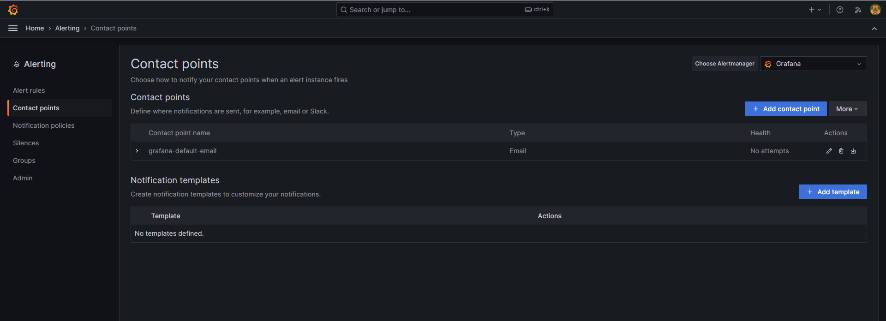
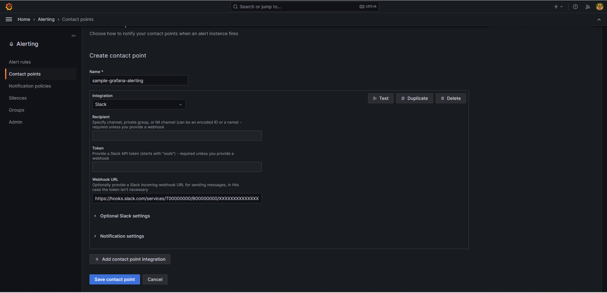
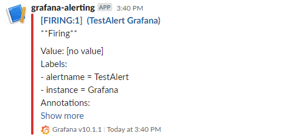

# chapter03_grafana

この章では、Prometheusと併用して使われることが多いGrafanaについて、機能をかんたんに紹介します。

## Grafanaとは

Grafanaとは、メトリクス/ログ/トレースを可視化する基盤として、Prometheusとともによく用いられるOSSです。
組織/ユーザ単位での権限管理や、豊富なプラグインを利用したカスタマイズを行うことができます。

## 実践: kube-prometheus-stackとGrafana

chapter02で導入したkube-prometheus-stackによって、すでにGrafanaは導入されています。
そして、kube-prometheus-stackではデフォルトで多くのDashboardが用意されており、
基本的なモニタリングをすぐに開始することができます。

実際にどのようなDashboardがあるか見てみましょう。
お使いのブラウザで `grafana.example.com` にアクセスしてみてください。
以下のようなDashboardが用意されているはずです。

- AlertManager Overview ... AlertManagerに関する基本的な情報
- CoreDNS ... CoreDNSのDNSレコード別リクエスト/レスポンス数、キャッシュヒット率など
- Grafana Overview ... Grafanaに関する情報(ダッシュボード数や発火中のアラート数など)
- etcd
- Prometheus
  - Overview
- Node Exporter
  - MacOS
  - Nodes
  - USE Method
    - Cluster
    - Node
- Kubernetes
  - API Server ... kube-apiserverに関する基本的なメトリクス(可用性やgoroutine等のメトリクス)
  - Controller Manager
  - Kubelet
  - Persistent Volumes
  - Proxy
  - Scheduler
  - Compute Resources
    - Multi-Cluster
    - Cluster
    - Namespace(Pods)
    - Namespace(Workloads)
    - Node(Pods)
    - Pod
    - Workload
  - Networking
    - Cluster
    - Namespace(Pods)
    - Namespace(Workloads)
    - Pod
    - Workload

## 実践: ハンズオンで利用するDashboardをインポートしてみる

Grafanaでは手作業でDashboardを作成する以外に、
すでに構築されたDashboardの設定をJSONで切り出して保存しておいたものを利用したり、
<https://grafana.com/grafana/dashboards/> 等で提供されている様々なダッシュボードをインポートしたりできます。

<https://grafana.com/docs/grafana/latest/dashboards/manage-dashboards/#import-a-dashboard>

実際にハンズオンでインストールするツールに関するDashboardをインポートしてみましょう。
以下のようなDashboardがありますが、ここではIngress NGINX ControllerのDashboardを導入してみます。

- <https://github.com/kubernetes/ingress-nginx/tree/main/deploy/grafana/dashboards>
- <https://grafana.com/grafana/dashboards/7645-istio-control-plane-dashboard/>
- <https://grafana.com/grafana/dashboards/14584-argocd/>
- <https://grafana.com/grafana/dashboards/16611-cilium-metrics/>
- <https://grafana.com/grafana/dashboards/13539-hubble/>

<http://grafana.example.com/dashboards>

まずは <http://grafana.example.com/dashboards> にアクセスし、 `New` ボタンのプルダウンメニューから `New folder` をクリックし、
`ingress-nginx` というフォルダ名で作成します。

次に、<http://grafana.example.com/dashboards> にもう一度アクセスし、 `New` ボタンのプルダウンメニューから `Import` をクリックします。

その後Dashboardのインポート形式を選択してインポートしますが、
Ingress NGINX Controllerはgrafana.comではなくGitHubでダッシュボードを公開しているので、JSONファイル形式で行います。

<https://github.com/kubernetes/ingress-nginx/blob/main/deploy/grafana/dashboards/nginx.json> を手元にダウンロードしておきます。
Grafana画面で `Upload dashboard JSON file` ボタンをクリックして、
先程ダウンロードしたJSONファイルをアップロードします。

最後に、以下のような画面に遷移するので、
スクリーンショットのように設定し、 `Import` ボタンをクリックします。

インポートに成功すると、以下のようなダッシュボードが表示されるはずです。

## Datasourceについて

Grafanaでは、様々なデータ可視化のソースを利用することができます。このソースをDatasourceと呼びます。
公式ドキュメントでは、ビルトインで利用できるDatasourceが紹介されています。
それ以外にも、自分でプラグインを書いて対応させることもできます。

<https://grafana.com/docs/grafana/latest/datasources/#built-in-core-data-sources>

kube-prometheus-stackをインストールした段階では、デフォルトのDatasourceとしてPrometheusとAlertmanagerの設定が入っています。
これにより、 <http://grafana.example.com/explore> でPromQLを書きこんでメトリクスを表示したり、
Datasourceから読み取れるメトリクスからDashboardを構築することができます。

## Variablesについて

DashboardやGrafana Alertingでは、Dashboard Panelやアラートの内容文等に変数を埋め込むことができます。
これはVariablesという仕組みで提供されています。

<https://grafana.com/docs/grafana/latest/dashboards/variables>

## 実践: Grafana Alertingを試してみる

実際にGrafana Alertingを試してみます。
今回は、Slack Workspaceの特定channelにアラートを流してみましょう。

まずは、Slackに通知するためにWebhook URLを発行します。
<https://api.slack.com/start/quickstart> にアクセスして、 ドキュメントの通りにすすめていけばWebhook URLを取得できます。

Grafana側では <http://grafana.example.com/alerting/notifications> にアクセスして、
右側の `Add contact point` ボタンをクリックします。

画面が遷移したら、以下のような設定を入力して、 `Test` ボタンをクリックしてテストアラートを発行します。

成功すると、以下のようなアラートが発砲されるはずです。

テストアラートと異なり、実際のアラートルールを設定する場合はアラート発砲のトリガーを記述することになりますが、
DatasourceがPrometheusの場合はPromQLを利用することができます。
