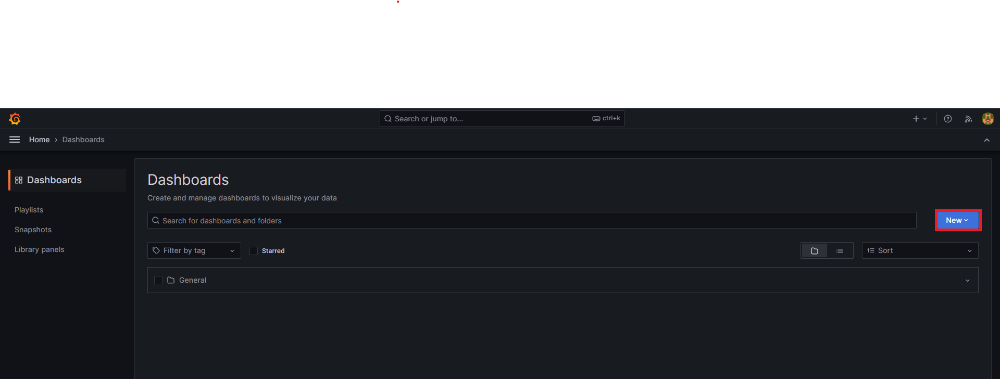
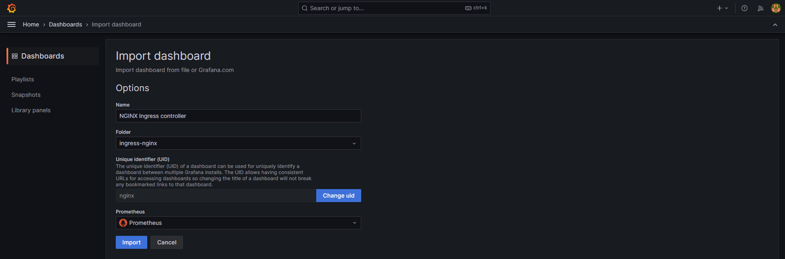

# chapter03_grafana

この章では、Prometheusと併用して使われることが多いGrafanaについて、機能をかんたんに紹介します。

## 実践: kube-prometheus-stackとGrafana

chapter02で導入したkube-prometheus-stackによって、すでにGrafanaは導入されています。
そして、kube-prometheus-stackではデフォルトで多くのダッシュボードが用意されており、
基本的なモニタリングをすぐに開始することができます。

実際にどのようなダッシュボードがあるか見てみましょう。
お使いのブラウザで `grafana.example.com` にアクセスしてみてください。
以下のようなダッシュボードが用意されているはずです。

- AlertManager Overview ... AlertManagerに関する基本的な情報
- CoreDNS ... CoreDNSのDNSレコード別リクエスト/レスポンス数、キャッシュヒット率など
- Grafana Overview ... Grafanaに関する情報(ダッシュボード数や発火中のアラート数など)
- etcd
- Prometheus
  - Overview
- Node Exporter
  - MacOS
  - Nodes
  - USE Method
    - Cluster
    - Node
- Kubernetes
  - API Server ... kube-apiserverに関する基本的なメトリクス(可用性やgoroutine等のメトリクス)
  - Controller Manager
  - Kubelet
  - Persistent Volumes
  - Proxy
  - Scheduler
  - Compute Resources
    - Multi-Cluster
    - Cluster
    - Namespace(Pods)
    - Namespace(Workloads)
    - Node(Pods)
    - Pod
    - Workload
  - Networking
    - Cluster
    - Namespace(Pods)
    - Namespace(Workloads)
    - Pod
    - Workload

## 実践: ハンズオンで利用するダッシュボードをインポートしてみる

Grafanaでは手作業でダッシュボードを作成する以外に、
すでに構築されたダッシュボードの設定をJSONで切り出して保存しておいたものを利用したり、
<https://grafana.com/grafana/dashboards/> 等で提供されている様々なダッシュボードをインポートしたりできます。

実際にハンズオンでインストールするツールに関するダッシュボードをインポートしてみましょう。
以下のようなダッシュボードがありますが、ここではingress-nginxのダッシュボードを導入してみます。

- <https://github.com/kubernetes/ingress-nginx/tree/main/deploy/grafana/dashboards>
- <https://grafana.com/grafana/dashboards/7645-istio-control-plane-dashboard/>
- <https://grafana.com/grafana/dashboards/14584-argocd/>
- <https://grafana.com/grafana/dashboards/16611-cilium-metrics/>
- <https://grafana.com/grafana/dashboards/13539-hubble/>

<http://grafana.example.com/dashboards>

まずは <http://grafana.example.com/dashboards> にアクセスし、 `New` ボタンのプルダウンメニューから `New folder` をクリックし、
`ingress-nginx` というフォルダ名で作成します。

次に、<http://grafana.example.com/dashboards> にもう一度アクセスし、 `New` ボタンのプルダウンメニューから `Import` をクリックします。

その後ダッシュボードのインポート形式を選択してインポートしますが、
ingress-nginxはgrafana.comではなくGitHubでダッシュボードを公開しているので、JSONファイル形式で行います。

<https://github.com/kubernetes/ingress-nginx/blob/main/deploy/grafana/dashboards/nginx.json> を手元にダウンロードしておきます。
Grafana画面で `Upload dashboard JSON file` ボタンをクリックして、
先程ダウンロードしたJSONファイルをアップロードします。

最後に、以下のような画面に遷移するので、
スクリーンショットのように設定し、 `Import` ボタンをクリックします。

インポートに成功すると、以下のようなダッシュボードが表示されるはずです。

## Datasourceについて

## Variablesについて

## Grafana Alertingについて
