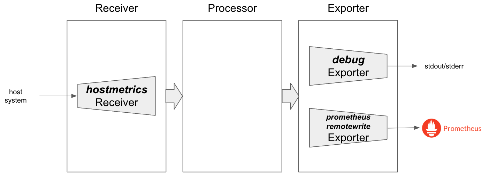

# Open Telemetry

## 概要

OpenTelemetryは、分散システムにおける観測データを収集するためのツール群とAPIを提供するオープンソースプロジェクトです。その目的は、アプリケーションのパフォーマンスと動作を理解し、問題を特定して解決するためのデータを提供することです。OpenTelemetryは、トレーシング、メトリクス、ログといった観測データの収集を自動化し、一貫性のある方法でこれらのデータを分析するための標準化された手段を提供します。これにより、開発者はアプリケーションのパフォーマンスを監視し、問題を特定して解決するための洞察を得ることができます。

OpenTelemetryプロジェクトの代表的なプロダクトは以下のとおりです。

* OpenTelemetry SDK
  * アプリケーションにトレースデータなどを公開するためのライブラリ
  * TraceやLogsなどに対応している
* OpenTelemetry Protocol（OTLP）
  * メトリクス、ログ、トレースなどのテレメトリを転送するためのプロトコル
  * アプリケーションにインストルメンテーションされたSDK、各種エージェント、OpenTelemetry Collectorとの間でテレメトリを転送するために利用
* OpenTelemetry Collector
  * メトリクス、ログ、トレースなどの各種テレメトリの送受信やデータ処理を行うコンポーネント
  * 様々なプロバイダーに対応するためにプラグイン方式を採用している

このハンズオンでは、OpenTelemetry Collectorでメトリクス・ログ・トレースを扱う方法と、OpenTelemetry SDKを用いて分散トレースを行う方法について実際に体験します。

### Open Telemetry Collectorのコンポーネント

OpenTelemetry Collectorは、内部的には4つのコンポーネントで構成されています。

* Receiver
  * データを受け付けるためのコンポーネント
  * プッシュベース、プルベースの両方に対応しており、さまざまなデータソースに対応
* Exporter
  * データを外部へ送信するコンポーネント
  * プッシュベース、プルベースの両方に対応しており、さまざまなデータソースに対応
* Processor
  * データを `Receiver` で受信してから、`Exporter` で送信するまでに処理を行うコンポーネント
* Connector
  * `Exporter` と `Receiver` の両方の役割をもち、パイプラインを接続するコンポーネント
  * あるデータ型からあるデータ型へと変換なども行うことが可能

### CoreプラグインとContribプラグイン

これらのコンポーネントはプラガブルな仕組みになっています。
例えば、`Receiver` ではPrometheusからメトリクスデータを取得するプラグイン・ローカルのJSONファイルからログデータを取得するプラグインなどがあったり、`Exporter` ではPrometheusのRemote Write Endpointにメトリクスデータを出力するプラグイン・Lokiにログデータを出力するプラグイン・Datadogにデータを出力するプラグインなどがあります。

多岐にわたるプラグインは、主要なプラグインだけを含んでいるCoreディストリビューションと、さまざまなプラグインを含んでいるContribディストリビューションが用意されています。他にも、各ベンダーが提供しているカスタムディストリビューションも存在します。

* 「Core ディストリビューション（open-telemetry/opentelemetry-collector）」
* 「Contrib ディストリビューション（open-telemetry/opentelemetry-collector-contrib）」

`opentelemetry-collector-contrib` はさまざまなプラグインが含まれておりバイナリサイズが大きいため、必要があれば自前でビルドすることが推奨されています。

各種コンポーネントで利用可能なプラグインは下記のGitリポジトリで管理されています。

* Receiver
  * [Core Plugin](https://github.com/open-telemetry/opentelemetry-collector/tree/main/receiver)
  * [Contrib Plugin](https://github.com/open-telemetry/opentelemetry-collector-contrib/tree/main/receiver)
* Exporter
  * [Core Plugin](https://github.com/open-telemetry/opentelemetry-collector/tree/main/exporter)
  * [Contrib Plugin](https://github.com/open-telemetry/opentelemetry-collector-contrib/tree/main/exporter)
* Processor
  * [Core Plugin](https://github.com/open-telemetry/opentelemetry-collector/tree/main/processor)
  * [Contrib Plugin](https://github.com/open-telemetry/opentelemetry-collector-contrib/tree/main/processor)
* Connector
  * [Core Plugin](https://github.com/open-telemetry/opentelemetry-collector/tree/main/connector)
  * [Contrib Plugin](https://github.com/open-telemetry/opentelemetry-collector-contrib/tree/main/connector)


## セットアップ

### OpenTelemetry Operatorのインストール

helmfileを使用してOpenTelemetry Operatorをインストールします。
OpenTelemetry Operatorをインストールすることで、OpenTelemetry CollectorなどをKubernetesのリソースで管理することができます。
ValidatingWebhookの兼ね合いで`helmfile sync`が失敗することがあるため、失敗した場合は再度実行してください。

```sh
helmfile sync -f helm/helmfile.yaml
```

monitoring NamespaceにデプロイされたOpenTelemetry OperatorのPodが起動していれば成功です。

```sh
kubectl -n monitoring get pods
```
```sh
# 実行結果
NAME                                      READY   STATUS    RESTARTS   AGE
opentelemetry-operator-677b4d8655-6q5j5   2/2     Running   0          20h
```

## OpenTelemetryCollectorリソースによるCollectorのデプロイと管理

OpenTelemetry Collectorは、メトリクス・ログ・トレースなどのテレメトリの送受信やデータ処理を行うことができるコンポーネントです。
CollectorはDeploymentやDaemonSetとしてデプロイし、その上でさまざまなデータソースからデータを取得し、任意の処理を行った上で、さまざまなデータソースに出力します。

OpenTelemetry Collectorは、こうしたデータ処理のパイプライン定義を設定ファイルで記述します。
下記は設定ファイルの例です。
設定ファイルは主に、下記の4つから構成されています。

* receivers
* processors
* exporters
* service

`receivers` `processors` `exporters` には、それぞれ利用するプラグインの設定を書いていきます。
今回の例だと `hostmetrics` receiver・`debug` exporter・`prometheusremotewrite` exporterの3種類を利用するために設定を行っています。
設定したreceiverなどは、service.pipelinesのところで利用する設定をします。
receiverやexporterによっては、メトリクス・ログ・トレースなどの複数テレメトリをサポートしている場合もあるため、`service.pipelines.metrics`や`service.pipelines.logs`のように、どのテレメトリに対して利用するのかを指定する必要があります。
なお、対応していないテレメトリに対してプラグインを利用する設定を書いた場合、OpenTelemetry Collectorが起動しません。

```yaml
receivers:
  hostmetrics:
    collection_interval: 30s
    scrapers:
      cpu: {}
      memory: {}

processors: {}

exporters:
  debug: {}
  prometheusremotewrite:
    endpoint: "https:/kube-prometheus-stack-prometheus.prometheus.svc:8080/prometheus/remote/write"
    external_labels:
      oteltest: cndt2023

service:
  pipelines:
    metrics:
      receivers: [hostmetrics]
      processors: []
      exporters: [debug, prometheusremotewrite]
```


Open Telemetryの設定ファイルに関しては、[公式サイト](https://opentelemetry.io/docs/collector/configuration/)に情報がまとまっています。また、利用可能なプラグインについては、先ほど「CoreプラグインとContribプラグイン」で紹介しているのでそちらを参照してください。


## Log をOpenTelemetry Collectorで管理する例

最初にログをOpenTelemetry Collectorで扱う例を紹介します。
ログを取り扱う場合は、ちょうど `Fluentd`や`Fluent Bit`と同じようなものだと想像してもらうとイメージしやすいかもしれません。

今回は、`/var/log`ディレクトリにある`cndt-*.json`にマッチするログを`filelog` Receiverで取得し、JSON形式でパースした後、デバッグログとして出力しながら、`file` Exporterでまとめてファイルとしても出力する簡単な例で試してみます。


OpenTelemetry Collectorをデプロイするには、OpenTelemetryCollectorリソースをKubernetesに登録します。
これにより、OpenTelemetry Operatorが自動的にDeploymentやDaemonSetを作成します。

今回はログエージェントとして動作させる想定なため、`.spec.mode`にはdaemonsetを指定し、DaemonSetとして起動します。また、起動するPodにはホスト上の`/var/log`をマウントしておきたいので、`volumeMounts`に関する設定もしておきます。
最後に、先ほど紹介したOpenTelemetry Collectorの設定を`.spec.config`に行っておきます。

```yaml
apiVersion: opentelemetry.io/v1alpha1
kind: OpenTelemetryCollector
metadata:
  name: log-collector
spec:
  mode: "daemonset"
  volumeMounts:
    - name:  host-log-volumes
      mountPath: /var/log
  volumes:
    - name: host-log-volumes
      hostPath:
        path:  /tmp
  config: |
    receivers:
      filelog:
        include: [ /var/log/cndt-*.json ]
        operators:
        - type: json_parser

    exporters:
      debug:
        verbosity: detailed
      file:
        path: /var/log/all.json
        rotation:
          max_megabytes: 1

    service:
      pipelines:
        logs:
          receivers: [filelog]
          processors: []
          exporters: [file, debug]
```

OpenTelemetryCollectorリソースをデプロイすると、自動的にDaemonSetとPodが起動していることがわかります。

```sh
kubectl apply -f manifests/log-collector.yaml
```
```sh
# 実行結果
opentelemetrycollector/log-collector created
```

```sh
kubectl get opentelemetrycollector
```
```sh
# 実行結果
NAME                MODE         VERSION   READY   AGE     IMAGE                                         MANAGEMENT
log-collector       daemonset    0.87.0    1/1     18h     otel/opentelemetry-collector-contrib:0.87.0   managed
```

```sh
kubectl get daemonsets,pods -l app.kubernetes.io/name=log-collector-collector
```
```sh
# 実行結果
NAME                                     DESIRED   CURRENT   READY   UP-TO-DATE   AVAILABLE   NODE SELECTOR   AGE
daemonset.apps/log-collector-collector   2         2         2       2            2           <none>          18h

NAME                                READY   STATUS    RESTARTS   AGE
pod/log-collector-collector-pwl6p   1/1     Running   0          18h
pod/log-collector-collector-gsd8a   1/1     Running   0          18h
```

次に、実際にログをホスト上のディレクトリに書き込んでみましょう。
今回はホスト上の`/var/log/cndt-*.json`のログをまとめてくれるようになっているため、試しに下記の通り書き込んでみます。

```bash
sudo docker exec -it kind-worker sh -c "echo '{\"key1\": \"value1\", \"key2\": \"value2\"}' >> /tmp/cndt-1.json"
```

その後、`file` Exporterによって出力されたファイルを見てみると、確かにReceiverで受け取ったログがExporterで出力されていることが確認できます。

```sh
sudo docker exec -it kind-worker sh -c "cat /tmp/all.json  | jq ."
```

```json
# 実行結果
{
  "resourceLogs": [
    {
      "resource": {},
      "scopeLogs": [
        {
          "scope": {},
          "logRecords": [
            {
              "observedTimeUnixNano": "1698769057617769597",
              "body": {
                "stringValue": "{\"key1\": \"value1\", \"key2\": \"value2\"}"
              },
              "attributes": [
                {
                  "key": "key1",
                  "value": {
                    "stringValue": "value1"
                  }
                }
                {
                  "key": "key2",
                  "value": {
                    "stringValue": "value2"
                  }
                },
                {
                  "key": "log.file.name",
                  "value": {
                    "stringValue": "cndt-1.json"
                  }
                },
              ],
              "traceId": "",
              "spanId": ""
            }
          ]
        }
      ]
    }
  ]
}
```

`/tmp/cndt-2023.json`など、正規表現にマッチするさまざまなファイル名に対してログを出力して`/tmp/all.json`が書き換わることも確認してみてください。
また、余裕がある方は各種Receiver・ExporterのDocsを確認し、さまざまな処理やオプションを試してみてください。

* 利用しているReceiver
  * [filelogreceiver](https://github.com/open-telemetry/opentelemetry-collector-contrib/tree/main/receiver/filelogreceiver)
* 利用しているExporter
  * [debugexporter](https://github.com/open-telemetry/opentelemetry-collector/tree/main/exporter/debugexporter)
  * [fileexporter](https://github.com/open-telemetry/opentelemetry-collector-contrib/tree/main/exporter/fileexporter)

今回は簡単な例でしたが、syslogやFluentdなどさまざまなデータを受け取ってフィルタリングやラベルの追加処理を実施後、Lokiに転送しつつ、S3にgzip圧縮して送るといった複雑なユースケースにも対応することができます。


## Metrics をOpenTelemetryで管理する例

次にメトリクスをOpenTelemetry Collectorで扱う例を紹介します。

今回は、`hostmetrics` Receiverを利用し、ホスト上のCPUやメモリに関するデータを取得し、そのデータを`prometheusremotewrite` Exporterを利用してPrometheusに対してRemote Writeで書き込みを行ってみます。



ログの時と同様に、OpenTelemetryCollectorリソースを利用してKubernetesにデプロイします。
今回はホスト上のメトリクスを取得するエージェントとして動作させる想定なため、`.spec.mode`にはdaemonsetを指定し、DaemonSetとして起動します。
最後に、OpenTelemetry Collectorの設定を`.spec.config`に行っておきます。

```yaml
apiVersion: opentelemetry.io/v1alpha1
kind: OpenTelemetryCollector
metadata:
  name: metrics-collector
spec:
  mode: "daemonset"
  config: |
    receivers:
      hostmetrics:
        collection_interval: 30s
        scrapers:
          cpu: {}
          memory: {}

    processors: {}

    exporters:
      debug: {}
      prometheusremotewrite:
        endpoint: http://kube-prometheus-stack-prometheus.prometheus:9090/api/v1/write
        external_labels:
          oteltest: cndt2023

    service:
      pipelines:
        metrics:
          receivers: [hostmetrics]
          processors: []
          exporters: [debug, prometheusremotewrite]
```

OpenTelemetryCollectorリソースをデプロイすると、自動的にDaemonSetとPodが起動していることがわかります。

```sh
kubectl apply -f manifests/metrics-collector.yaml
```
```sh
# 実行結果
opentelemetrycollector/metrics-collector created
```

```sh
kubectl get opentelemetrycollector metrics-collector
```
```sh
# 実行結果
NAME                MODE        VERSION   READY   AGE   IMAGE                                         MANAGEMENT
metrics-collector   daemonset   0.87.0    1/1     44m   otel/opentelemetry-collector-contrib:0.87.0   managed
```

```sh
kubectl get daemonsets,pods -l app.kubernetes.io/name=metrics-collector-collector
```
```sh
# 実行結果
NAME                                         DESIRED   CURRENT   READY   UP-TO-DATE   AVAILABLE   NODE SELECTOR   AGE
daemonset.apps/metrics-collector-collector   2         2         2       2            2           <none>          3m24s

NAME                                    READY   STATUS    RESTARTS   AGE
pod/metrics-collector-collector-8dvss   2/2     Running   0          3m24s
pod/metrics-collector-collector-mzd9j   2/2     Running   0          3m24s
```

まずは`debug` Exporterが出力しているログを確認してみます。
下記のようにログを確認すると、2つのメトリクスで合計166個のデータポイントが取得されていることが確認できます。
メトリクス名まで確認したい場合には、OpenTelemetryCollectorの`spec.config`の`exporters.debug.verbosity`を`detailed`に設定することで確認することができます。

```sh
kubectl logs -l app.kubernetes.io/name=metrics-collector-collector -f
```
```sh
# 実行結果
2023-11-12T20:08:46.171Z        info    MetricsExporter {"kind": "exporter", "data_type": "metrics", "name": "debug", "resource metrics": 2, "metrics": 2, "data points": 166}
2023-11-12T20:09:16.171Z        info    MetricsExporter {"kind": "exporter", "data_type": "metrics", "name": "debug", "resource metrics": 2, "metrics": 2, "data points": 166}
2023-11-12T20:09:46.171Z        info    MetricsExporter {"kind": "exporter", "data_type": "metrics", "name": "debug", "resource metrics": 2, "metrics": 2, "data points": 166}
...
```

次に、実際にGrafana上からメトリクスを確認してみましょう。
`https://grafana.example.com/explore` に接続し、`system_cpu_time_seconds_total`のメトリクスを確認してみます。
今回利用している`hostmetrics` Receiverで取得しているメトリクスには[Host Metrics Receiver](https://github.com/open-telemetry/opentelemetry-collector-contrib/blob/main/receiver/hostmetricsreceiver/internal/scraper/cpuscraper/documentation.md)のページから確認することができます。
`exporters.prometheusremotewrite.external_labels`の設定で`oteltest=cndt2023`のラベルを付与しているため、ラベルの指定をすることでOpenTelemetry Colelctorが出力したメトリクスのみに絞ることも可能です。


実際に出力されたメトリクスを確認すると、CPUの使用内訳（state）やユニット（cpu）などのラベルが付与された状態でメトリクスが書き込まれていることが確認できます。


* 利用しているReceiver
  * [hostmetricsreceiver](https://github.com/open-telemetry/opentelemetry-collector-contrib/blob/main/receiver/hostmetricsreceiver)
* 利用しているExporter
  * [debugexporter](https://github.com/open-telemetry/opentelemetry-collector/tree/main/exporter/debugexporter)
  * [prometheusremotewrite](https://github.com/open-telemetry/opentelemetry-collector-contrib/tree/main/exporter/prometheusremotewriteexporter)

今回は簡単な例でしたが、OpenMetrics互換のエンドポイントからデータを取得し、Prometheus・Datadog・PubSubにデータをそれぞれ転送するといったユースケースにも対応することができます。
また、ScrapeしてRemote Writeするといったユースケースでは、Prometheusの代替にするために`prometheusreceiver`といったプラグインを利用することもできます。


## Trace をOpenTelemetryで管理する例

TraceをOpenTelemetryで管理するハンズオンを進める前に、TraceバックエンドであるJaegerをインストールします。
Jaeger Operator自体はすでにインストールしているため、`Jaeger`リソースを利用してデプロイします。
今回は簡略化のために、永続化はしない設定を利用します。

```yaml
apiVersion: jaegertracing.io/v1
kind: Jaeger
metadata:
  name: jaeger
  namespace: jaeger
spec:
  strategy: allInOne
  allInOne:
    options:
      log-level: debug
  storage:
    type: memory
    options:
      memory:
        max-traces: 100000
  ingress:
    enabled: true
    hosts:
    - jaeger.example.com
    ingressClassName: nginx
    annotations:
      nginx.ingress.kubernetes.io/ssl-redirect: "false"
```

実際にJaegerをデプロイします。

```bash
kubectl apply -f manifests/jaeger.yaml
```

デプロイされたJaegerリソースを確認し、ステータスがRunningなことを確認してください。

```sh
kubectl -n jaeger get jaeger
```

```sh
# 実行結果
NAME     STATUS    VERSION   STRATEGY   STORAGE   AGE
jaeger   Running   1.49.0    allinone   memory    10m
```

デプロイされたJaegerのUIは、`https://jaeger.example.com/search`から確認することができます。


今回は、`otlp` Receiverを利用し、OpenTelemetry Protocol（OTLP）を利用してトレースデータを受け取ります。そしてそのデータを`otlp` Exporterを利用してJaegerに対して保存、`debug` Exporterを利用して標準出力にもデバッグログを出力します。
Jaegerは以前までは`jaeger`プロトコルを利用していましたが、最近はOTLPにネイティブ対応しています。


ログの時と同様に、OpenTelemetryCollectorリソースを利用してKubernetesにデプロイします。
今回はトレースデータの取得先ホスト上のメトリクスを取得するエージェントとして動作させる想定なため、`.spec.mode`にはdaemonsetを指定し、DaemonSetとして起動します。
最後に、OpenTelemetry Collectorの設定を`.spec.config`に行っておきます。

```yaml
apiVersion: opentelemetry.io/v1alpha1
kind: OpenTelemetryCollector
metadata:
  name: trace-collector
spec:
  mode: "deployment"
  config: |
    receivers:
      otlp:
        protocols:
          grpc:

    processors: {}

    exporters:
      debug: {}
      otlp:
        endpoint: jaeger-collector.jaeger:14250
        tls:
          insecure: true

    service:
      pipelines:
        traces:
          receivers: [otlp]
          processors: []
          exporters: [debug, otlp]
```

OpenTelemetryCollectorリソースをデプロイすると、自動的にDeploymentとPodが起動していることがわかります。
また、OTLPを受け付ける口として、Serviceも作成されています。

```sh
kubectl apply -f manifests/trace-collector.yaml
```
```sh
# 実行結果
opentelemetrycollector/metrics-collector created
```

```sh
kubectl get opentelemetrycollector trace-collector
```
```sh
# 実行結果
NAME              MODE         VERSION   READY   AGE   IMAGE                                         MANAGEMENT
trace-collector   deployment   0.87.0    1/1     10m   otel/opentelemetry-collector-contrib:0.87.0   managed
```
```sh
kubectl get deployments,pods,services -l app.kubernetes.io/name=trace-collector-collector
```
```sh
# 実行結果
NAME                                        READY   UP-TO-DATE   AVAILABLE   AGE
deployment.apps/trace-collector-collector   1/1     1            1           10m

NAME                                             READY   STATUS    RESTARTS   AGE
pod/trace-collector-collector-5bbc5d7c47-jtscf   2/2     Running   0          88s

NAME                                         TYPE        CLUSTER-IP      EXTERNAL-IP   PORT(S)    AGE
service/trace-collector-collector            ClusterIP   10.96.172.252   <none>        4317/TCP   10m
service/trace-collector-collector-headless   ClusterIP   None            <none>        4317/TCP   10m
```


OpenTelemetry Operatorには、各種アプリケーションのトレースデータを自動インスツルメンテーションするための`Instrumentation`リソースが用意されています。
トレースデータを計装する場合には、[SDKを利用してアプリケーションに手動インスツルメンテーション](https://opentelemetry.io/docs/instrumentation/)するか、[サイドカーとしてコンテナをデプロイして自動インスツルメンテーション](https://opentelemetry.io/docs/kubernetes/operator/automatic/)するかの2通りの方法があります。
今回は、アプリケーションに手を加えなくて利用可能な自動インスツルメンテーションを利用します。

自動インスツルメンテーションを行う場合には、`Instrumentation`リソースで設定を行います。今回はデータを取得し、先ほど作成したJaegerのOTLP用のgRPCエンドポイント `jaeger-collector.jaeger:14250` に対してデータを転送する設定を行います。

```yaml
apiVersion: opentelemetry.io/v1alpha1
kind: Instrumentation
metadata:
  name: go-instrumentation
  namespace: handson
spec:
  exporter:
    endpoint: http://jaeger-collector.jaeger:4317
  propagators:
    - tracecontext
    - baggage
  sampler:
    type: parentbased_traceidratio
    argument: "1"
```

```shell
kubectl apply -f manifests/go-instrumentation.yaml
```

自動インスツルメンテーションを利用するには、Podのアノテーションに`instrumentation.opentelemetry.io/inject-go`などの言語ごとの有効化設定を行います。
なお、Goの場合にはeBPFを利用して計装するために、追加で実行しているバイナリをアノテーションで指定する必要があります。
今回の例ではrootディレクトリ直下にある`/rollouts-demo`を実行しているため、下記のような指定をする必要があります。

```yaml
apiVersion: apps/v1
kind: Deployment
metadata:
  name: handson-blue
  namespace: handson
spec:
  template:
    metadata:
      annotations:
        instrumentation.opentelemetry.io/inject-go: go-instrumentation
        instrumentation.opentelemetry.io/otel-go-auto-target-exe: "/rollouts-demo"
    spec: {...}
```

今回はすでにデプロイされている`handson-blue` Deploymentに対して設定を行います。kubectl patchコマンドを利用してこれらのアノテーションを付与します。

```shell
kubectl -n handson patch deployment handson-blue -p '{"spec":{"template":{"metadata":{"annotations":{"instrumentation.opentelemetry.io/inject-go": "go-instrumentation"}}}}}'
kubectl -n handson patch deployment handson-blue -p '{"spec":{"template":{"metadata":{"annotations":{"instrumentation.opentelemetry.io/otel-go-auto-target-exe": "/rollouts-demo"}}}}}'
```

作成されたPodを確認すると、Podにサイドカーとして`opentelemetry-auto-instrumentation`コンテナが含まれた形で作成されていることが確認できます。

```bash
kubectl -n handson get pods
```
```bash
# 実行結果
NAME                               READY   STATUS   RESTARTS   AGE
sample-app-blue-5fb8dc75fd-7cvxg   2/2     Ready    0          30s
```


次に、実際にJaeger上からメトリクスを確認してみましょう。
まず、`http://app.example.com/` に接続し、一定量のトレースデータを出力します。
`https://jaeger.example.com/explore` に接続し、Service名に`sample-app-blue`を指定してみると、トレースデータが確認できます。
今回は複雑なマイクロサービスではないため、シンプルな表示になっていますが、サービス間の通信がある場合はもう少し複雑なトレースデータを確認することができます。


最後にこの章でアプリケーションに加えた変更をクリーンアップしておきます。

```shell
kubectl -n handson patch deployment handson-blue -p '{"spec":{"template":{"metadata":{"annotations":{"instrumentation.opentelemetry.io/inject-go": null}}}}}'
kubectl -n handson patch deployment handson-blue -p '{"spec":{"template":{"metadata":{"annotations":{"instrumentation.opentelemetry.io/otel-go-auto-target-exe": null}}}}}'
```

* 利用しているReceiver
  * [otlp](https://github.com/open-telemetry/opentelemetry-collector/blob/main/receiver/otlpreceiver)
* 利用しているExporter
  * [debugexporter](https://github.com/open-telemetry/opentelemetry-collector/tree/main/exporter/debugexporter)
  * [otlp](https://github.com/open-telemetry/opentelemetry-collector/tree/main/exporter/otlpexporter)


## 中央集権的にデータを扱う

OpenTelemetryでは、OpenTelemetry Protocol（OTLP）を利用して、OpenTelemetry CollectorからOpenTelemetry Collectorへテレメトリデータを転送することもできます。
複数のノードからデータを取得し、サンプリングするAggregator層を挟むなど、処理を中継させたりすることなども可能です。


## 推奨される Processor

今回の例ではProcessorは利用しませんでしたが、Processorも非常に重要なコンポーネントの1つです。
例えば、大規模な環境で多くのテレメトリデータが出力される場合、それらのデータを適切に処理するにはProcessorが必要不可欠です。
Prosessorではメモリ制限・サンプリング・バッチ処理などを行うこともできるため、そうした処理を間に挟むことで負荷を削減することもできます。

[推奨されるProcessor](https://github.com/open-telemetry/opentelemetry-collector/tree/main/processor#recommended-processors)については、Docsを確認してください。


