# chapter04b_argocd
この章では、Kubernetes上でGitOpsを可能とするCDツールであるArgo CDについて紹介し、導入します。

## GitOpsとCI/CDについて
CI/CDは、継続的インテグレーション（CI）と継続的デリバリー/デプロイメント（CD）を実現するための手法です。
CIは、アプリケーションのビルド、テスト、およびコードの統合を自動化するプロセス
CDは、アプリケーションのデプロイメントを自動化するプロセスです。
テストやデプロイを自動化することで、オペミスや作業量を減らすことで余ったリソースでアリケーションやソフトウェアの品質を高めたり、リソースサイクルを早めることを目的としている。

GitOpsは、CI/CDを実現するための手法の一つで、Gitのリポジトリの変更をトリガーにCI/CDを実行することで、アプリケーションのデプロイメントを自動化するプロセスです。


## Argo CDについて 
Kubrnetes用のGitOpsツールで、Gitリポジトリに格納されたマニフェストをデプロイすることができる。WEB GUIとCLIの両方で操作することができ、アプリケーションやKuberenetesのリソースの状態を可視化し簡単に管理する事が可能になっています。
ArgoCDはGitHub等からのWebhookを受け取り、Gitリポジトリに格納されたマニフェストをデプロイすることができるため、開発者のコードPushやPRをトリガーにデプロイまで実行することができます。


### Argo CDのアーキテクチャ


Argo CDは三つのコアコンポーネントで構成されています。
- API Server
- Repository Server
- Application Controller


## OutOfSync/Synced
アプリケーションがGitリポジトリの定義と設定と一致しているかどうかを示すステータスです。
#### OutOfSync
Gitリポジトリとアプリケーションの状態が一致せず、アプリケーションに変更があったか、同期エラーが発生したことを示します。
#### Synced
Gitリポジトリとアプリケーションの状態が一致し、アプリケーションが期待どおりに機能していることを示します。

## Healthy/Degrated/Processing 
アプリケーションの状態を示す異なるステータスで、アプリケーションの健全性や動作状態を示すステータスです。
#### Healthy
アプリケーションのコンポーネントやサーバーが期待どおりに応答し、エラーや障害がない状態です。
#### Degrated
アプリケーションが完全に停止していないが、一部の問題が存在する状態です。
#### Processing
アプリケーションやサービスが現在、新しいリクエストやデプロイメントなどの操作を処理していることを示し"Healthy" または "Degraded" の状態に変わります。

## Refresh/Hard Refresh/Sync の違いについて
これらの三つの処理は、GitレポジトリとArgo CDの状態を同期させるための処理ですが細かな違い存在します。
#### Refresh
最新のGit上のマニュフェストとRepository Server内にあるマニュフェストを比較し、差分を反映します。
通常の更新はデフォルトで3分ごとに行われます。
#### HardRefresh
HelmやKustomizeなどのコードから生成されたマニフェストをキャッシュしているマニフェストキャッシュをクリアし、新たにRefresh処理を行う操作です。これにより、マニフェストの変更の有無にかかわらず、マニフェストを再生成できます。
デフォルトで24時間ごとに、マニフェストキャッシュの有効期限が切れたときに行われる。
#### Sync
Kubernetes clusterをGitの状態に同期させるため、マニュフェストの反映（デプロイ）をします。

## セットアップ
### ローカル環境での準備
今回デプロイするWEBサービスのドメインは登録していないため、WEBサービスを利用する際にはハンズオンで利用する端末のhostsファイルを書き込む必要があります。

hostsファイルのpathはOSによって様々なので環境によって変わりますが主要なpathは下記の通りです

MacやLinuxの場合
```/etc/hosts```

Windowsの場合
```C:\Windows\System32\drivers\etc\hosts```

この章で利用するドメインは下記の通りになります。

* argocd.example.com
* app.argocd.example.com
* dev.kustomize.argocd.example.com
* prd.kustomize.argocd.example.com
* helm.argocd.example.com

### Argo CDのインストール
helmファイルを利用してArgo CDをインストールします。
```
helmfile apply -f helm/helmfile.yaml
```
作成されるリソースは下記の通りです。
```
kubectl get service,deployment  -n argo-cd
```
```
# 実行結果
NAME                                               TYPE        CLUSTER-IP      EXTERNAL-IP   PORT(S)             AGE
service/argo-cd-argocd-applicationset-controller   ClusterIP   10.96.209.173   <none>        7000/TCP            26d
service/argo-cd-argocd-dex-server                  ClusterIP   10.96.116.27    <none>        5556/TCP,5557/TCP   26d
service/argo-cd-argocd-redis                       ClusterIP   10.96.28.90     <none>        6379/TCP            26d
service/argo-cd-argocd-repo-server                 ClusterIP   10.96.249.188   <none>        8081/TCP            26d
service/argo-cd-argocd-server                      ClusterIP   10.96.152.238   <none>        80/TCP,443/TCP      26d

NAME                                                       READY   UP-TO-DATE   AVAILABLE   AGE
deployment.apps/argo-cd-argocd-applicationset-controller   1/1     1            1           26d
deployment.apps/argo-cd-argocd-dex-server                  1/1     1            1           26d
deployment.apps/argo-cd-argocd-notifications-controller    1/1     1            1           26d
deployment.apps/argo-cd-argocd-redis                       1/1     1            1           26d
deployment.apps/argo-cd-argocd-repo-server                 1/1     1            1           26d
deployment.apps/argo-cd-argocd-server                      1/1     1            1           26d
```
ingressを作成し、Argo CDのWEB UIにアクセス出来るようにします。
```
kubectl apply -f ingress/ingress.yaml
```
http://argocd.example.com/
へアクセスします。下記のページにアクセス出来るか確認して下さい。
* ユーザ名: admin
* パスワード: 以下のコマンドをサーバ上で実行した値

```kubectl -n argo-cd get secret argocd-initial-admin-secret -o jsonpath="{.data.password}" | base64 -d```


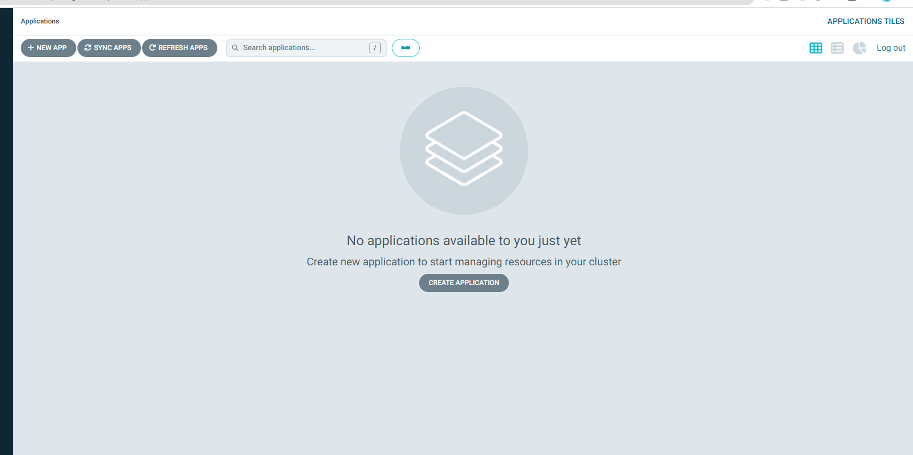
### レポジトリの登録

同期させるGitのレポジトリを登録します。

Settings - > Repositories と進み CONEECT REPOをクリック　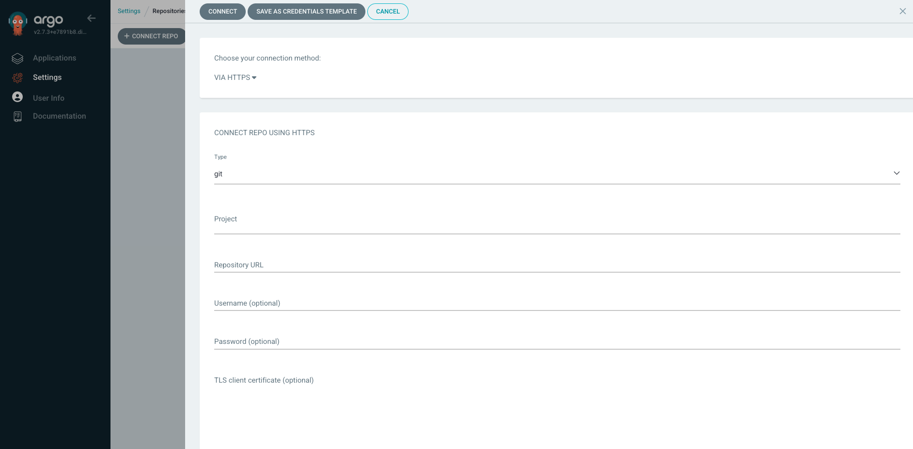
上の画面上で各項目を次のように設定
```
Choose you connection method: VIA HTTPS
Type: git
Project: default
Repository URL: https://github.com/cloudnativedaysjp/cndt2023-handson
Username (optional):username
password (optional):pass
```
CONNECTをクリックして、下記のように表示されていることを確認して下さい。
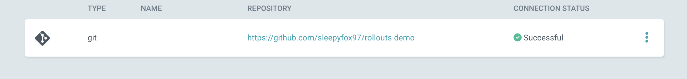


## デモアプリのデプロイ
試しにデモアプリのデプロイを行い、Argo CDの一連の操作を行います。

Argo CDに同期させるGitのブランチを準備します。
```bash
git colne https://github.com/cloudnativedaysjp/cndt2023-handson.git
git checkout -b new_branch_name
git push orign　new_branch_name
```
Applicationsの画面において + NEW APPをクリックします
上の画面上で各項目を次のように設定します。
```
GENERAL
  Application Name: test
  Project Name: default
  SYNC POLICY: Manual
  SYNC OPTIONS: AUTO CREATE NAMESPACE [v]
  SOURCE
    Repository URL: https://github.com/cloudnativedaysjp/cndt2023-handson
    Revision: new_branch_name
    Path: chapter04b_argocd/app/default
  DESTINATION
    Cluster URL: https://kubernetes.default.svc
    Namespace: test
```
設定できたら、CREATEをクリックして、下記のように表示されていることを確認して下さい。
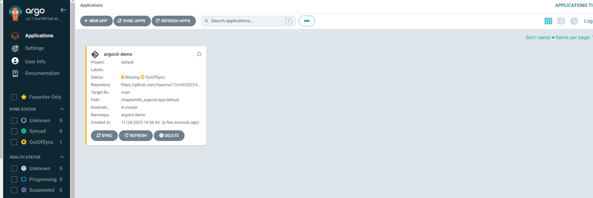
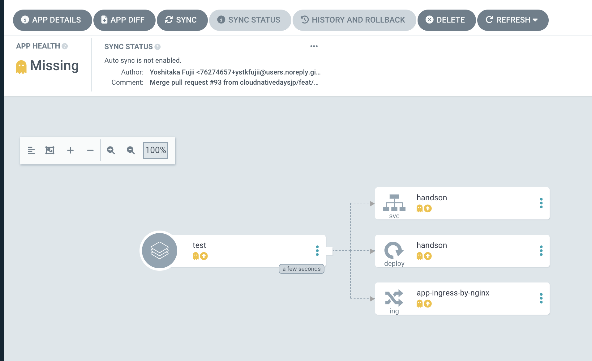

ページ上部にあるSYNCをクリックして、無事デプロイされると下記のように表示されていることを確認して下さい。

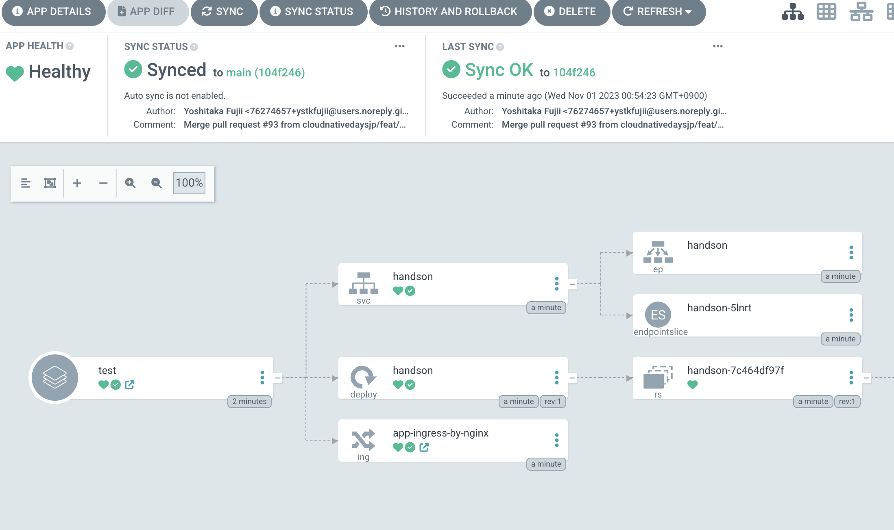
ブラウザから
http://app.argocd.example.com
へアクセスして確認してみてください。アプリケーションが表示され青い色のタイルが出てくるのが確認できます。


上記の手順でGitに保存しているマニュフェストを参照して、アプリケーションのデプロイを行いました。次にGitの変更にKubernetes Clusterを同期させます。

app/default/deployment.yamlの編集を行います。 imageのtagをblueからgreenに変更します。
```
image: argoproj/rollouts-demo:green
```
差分をremoteのnew_branch_nameブランチ（Argo cdのappを作成する際に指定したブランチ）に取り込みます。
```
git push origin new_branch_nam
```
Argo　CDはデフォルトでは3分に一回の頻度でブランチを確認し、差分を検出しています。 3分待てない場合には、ページ上部にある [REFRESH]をクリックします。下記のようにdeploymentにおいて差分が検出されます。（黄色で表示されているOutOfSyncが差分があることを示しています） ちなみにAppの設定において、SYNC POLICYをManualでなくAutoにしていた場合には、ここでOutOfSyncを検知すると自動でArgoCDがSyncを実行します。
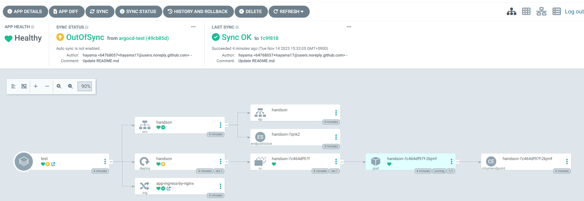
Gitの変更をKubernetes Clusterに反映させるためにページ上部にあるSYNCをクリックして、下記のように表示されていることを確認して下さい。
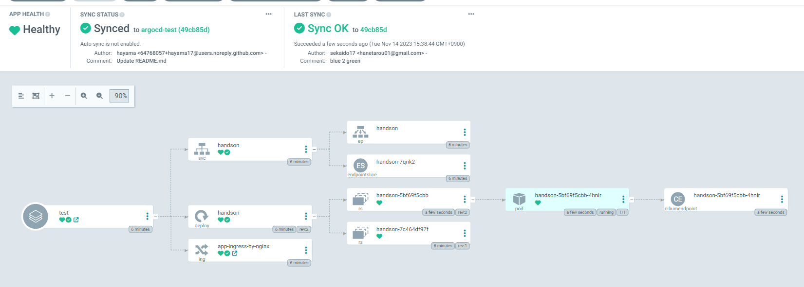
http://app.argocd.example.com
へアクセスして確認するとタイルが青から緑に変わったことが確認できます。
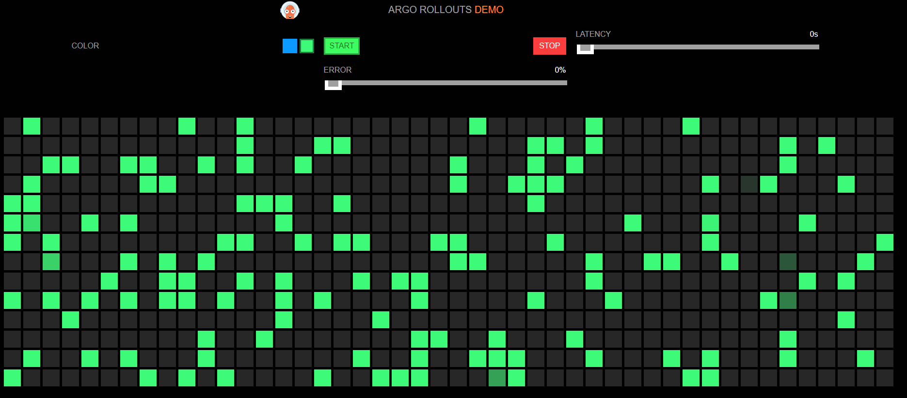
## Kustomizeを使ったデプロイ
ArgoCD上でマニュフェストの管理ツールである「Kustomize」を利用した、開発環境と本番環境の2つのマニュフェスト管理を行います。

Applicationsの画面において + NEW APPをクリック
上の画面上で各項目を次のように設定します。(開発環境と本番環境はここのPathだけ変更になります)
```
GENERAL
  Application Name: kustomize
  Project Name: default
  SYNC POLICY: Manual
  SYNC OPTIONS: AUTO CREATE NAMESPACE [v]
  SOURCE
    Repository URL: https://github.com/cloudnativedaysjp/cndt2023-handson
    Revision: new_branch_name
    Path:
        開発環境： chapter04b_argocd/app/Kustomize/overlays/dev
        本番環境： chapter04b_argocd/app/Kustomize/overlays/prd
  DESTINATION
    Cluster URL: https://kubernetes.default.svc
    Namespace: kustomize
```
設定できたら、CREATEをクリック
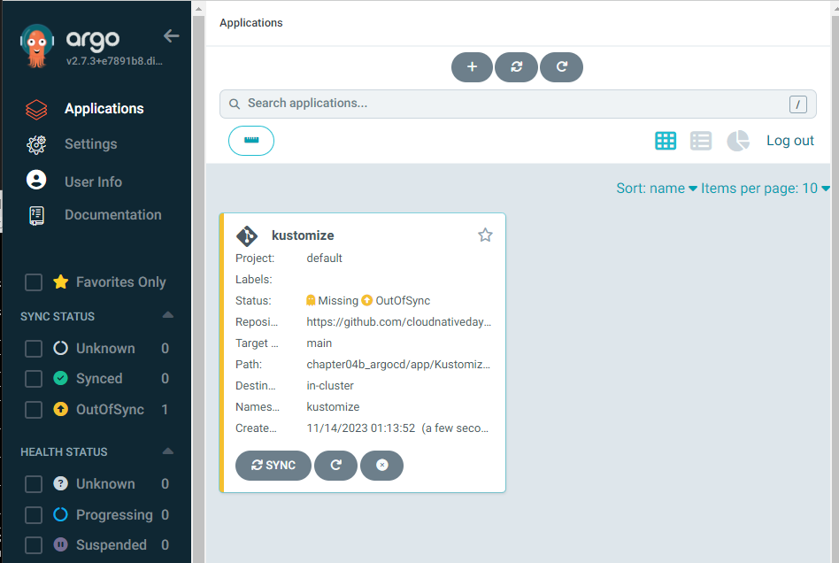
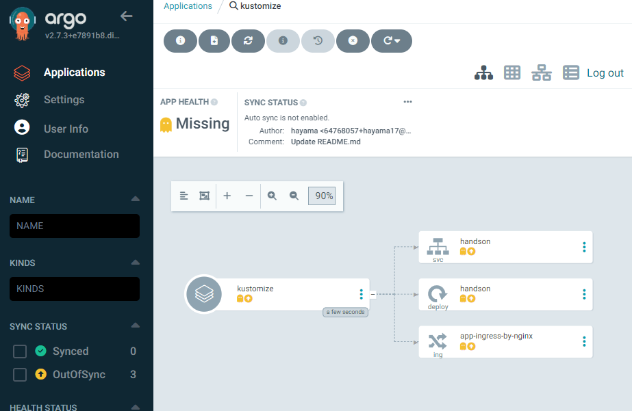
ページ上部にある SYNCをクリック(開発環境の場合はpodが1個、本番環境の場合はpodが2個出来るのが確認できます。)
### 開発環境
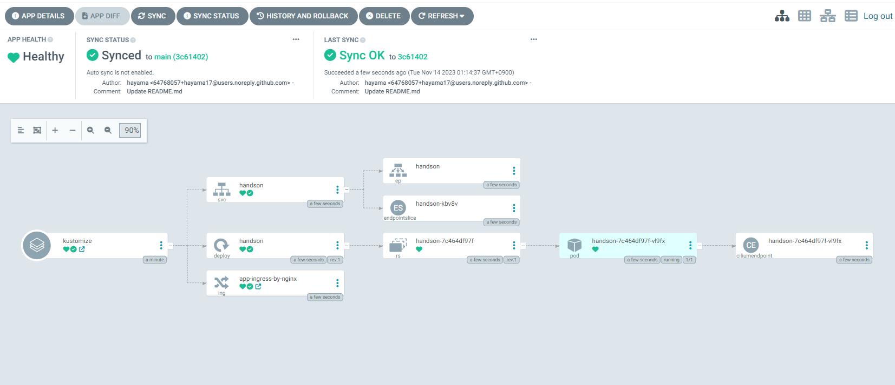
### 本番環境


ブラウザで各環境へアクセスして確認してみてください。タイルの色が開発環境と本番環境で違う事が確認できます。
  * 開発環境: dev.kustomize.argocd.example.com
  * 本番環境: prd.kustomize.argocd.example.com
## Helmを使ったデプロイ
KubernetesのパッケージマネージャーのHelmを利用したデプロイを行います。

Applicationsの画面において + NEW APPをクリック

上の画面上で各項目を次のように設定します。
```
GENERAL
  Application Name: helm
  Project Name: default
  SYNC POLICY: Manual
  SYNC OPTIONS: AUTO CREATE NAMESPACE [v]
  SOURCE
    Repository URL: https://github.com/cloudnativedaysjp/cndt2023-handson
    Revision: new_branch_name
    Path: chapter04b_argocd/app/Helm/rollouts-demo
  DESTINATION
    Cluster URL: https://kubernetes.default.svc
    Namespace: helm
```
設定できたら、CREATEをクリック
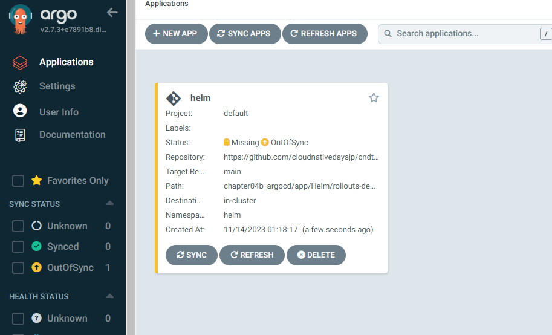

ページ上部にある SYNCをクリック（無事デプロイされると下記のようになります）
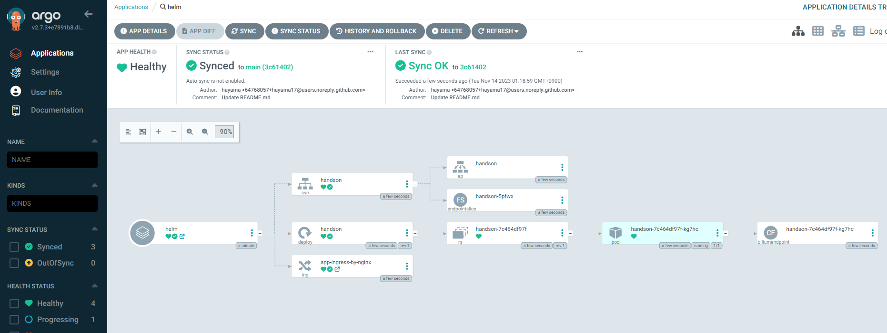
ブラウザで
helm.argocd.example.com
アクセスして確認してみてください。Helmを使ってデプロイが出来てる事が確認できます。
