# Istio
本chapterではサービスメッシュを実現するためのソフトウェアであるIstioを用いて、メッシュ内のトラフィック管理、可視化、およびセキュリティの担保をどのように実現するのか体験します。

## 概要

## セットアップ
### Istioインストール
helmfileを使用してIstio componentsをインストールします。
```sh
helmfile apply -f helm/helmfile.d/istio.yaml
```

インストールされるcomponentsは下記の通りです。
```sh
NAME                           TYPE        CLUSTER-IP     EXTERNAL-IP   PORT(S)                                 AGE
service/istiod                 ClusterIP   10.96.123.76   <none>        15010/TCP,15012/TCP,443/TCP,15014/TCP   12m
service/istio-ingressgateway   ClusterIP   10.96.109.97   <none>        15021/TCP,80/TCP                        12m

NAME                                   READY   UP-TO-DATE   AVAILABLE   AGE
deployment.apps/istiod                 1/1     1            1           12m
deployment.apps/istio-ingressgateway   1/1     1            1           12m

NAME                                                   MODE     AGE
peerauthentication.security.istio.io/mtls-strict-all   STRICT   12m
```

- istiod: Pilot・Citadel・Galleyの3つのコンポーネントから構成されたIstio control plane
- istio-ingressgateway: Istio mesh内アプリケーションのIngressトラフィックを管理
- peerauthentication: Istioのcustom resourceでenvoy proxy間の通信方法を設定。本設定では、mTLS通信を必須としています。

### アプリケーションdeploy
Envoy sidecar proxyをアプリケーションpodに自動注入するようIstioに指示するために、deploy先のKubernetes namespaceにラベルを追加します。
```sh
kubectl label namespace default istio-injection=enabled
```

アプリケーションをdeployします。
- `chapter01.5_demo-deploy`でdeploy済みの場合
アプリケーションを再起動してpodにenvoy sidecar proxyが追加されるようにします。
```sh
kubectl rollout restart deployment/sample-app-blue
```

- 未deployの場合
```sh
kubectl apply -f ../chapter01.5_demo-deploy/manifest/
```

アプリケーション再起動、またはdeploy完了後のKubernetes resourceは下記の通りです。Podが`Running`状態になった後に、アプリケーションpod内でcontainerが2つ動作していることを確認してください。
```sh
kubectl get pod -l app=sample-app

# 出力結果例
NAME                               READY   STATUS    RESTARTS   AGE
sample-app-blue-646467ccfc-7dc9b   2/2     Running   0          62s
```

アプリケーションが正しく起動しているか確認をするために疎通確認をします。現時点ではKubernetes cluster外からはアクセス出来ないため、アプリケーションのKubernetes serviceをport-forwardしてホスト側から疎通確認をします。

- port forward
```sh
kubectl port-forward service/sample-app 18080:8080 >/dev/null &
```

- 疎通確認
```sh
curl -i http://127.0.0.1:18080/
```
HTTP status code 200、およびHTMLが無事出力されたら疎通確認完了です。 Port forwardのjobを停止してしてください。
```sh
jobs

# 出力結果例
[1]  + running    kubectl port-forward svc/sample-app 18080 > /dev/null

# `kubectl port-forward`を実行しているjobを停止。
kill %1
```

### 外部からのアプリケーション疎通
アプリケーションの疎通確認ができたので、次は外部(インターネット)からアクセスできるようにします。

まずはIstio mesh外からのアクセスをIstio mesh内のアプリケーションにルーティングできるようするためにIstio gateway/virtual serviceを作成します。
```sh
kubectl apply -f networking/gateway.yaml
kubectl apply -f networking/simple-routing.yaml
```

次に外部(インターネット)からのアクセスを先ほど作成したIstio gatewayにルーティングするためにingress resourceを作成します。
```sh
kubectl apply -f ingress/app-ingress.yaml
```

しばらくすると、ingress resourceにIPが付与されます。
```sh
kubectl -n istio-system get ingress -l app=sample-app

# 出力結果例
NAME           CLASS   HOSTS             ADDRESS        PORTS   AGE
app-by-nginx   nginx   app.example.com   10.96.88.164   80      81s
```

これで外部からアクセス出来る準備ができました。ブラウザから`http://app.exmaple.com`にアクセスしてアプリケーションが表示されることを確認してください。


## サービスメッシュ可視化のためのダッシュボードdeploy
Istioサービスメッシュ内のトラフィックを可視化するために、[Kiali](https://kiali.io/)をインストールします。KialiはIstioサービスメッシュ用のコンソールであり、Kialiが提供するダッシュボードから、サービスメッシュの構造の確認、トラフィックフローの監視、および、サービスメッシュ設定の確認、変更をすることが可能です。

Kialiはトポロジーグラフ、メトリクス等の表示のためにPrometheusを必要とします。Prometheusがまだインストールされていない場合は、下記コマンドを実行してインストールしてください。すでにインストール済みの場合は、スキップをしてKialiをインストールしてください。
```sh
helmfile sync -f ../chapter02_prometheus/helmfile.yaml
```

helmfileを使ってKialiをインストールします。
```sh
helmfile apply -f helm/helmfile.d/kiali.yaml
```

deployされるresourceは下記の通りです。
```sh
kubectl -n istio-system get pod,service -l app.kubernetes.io/name=kiali

# 出力結果例
NAME                         READY   STATUS    RESTARTS   AGE
pod/kiali-7484ccf9f8-5vmgj   1/1     Running   0          2m31s

NAME            TYPE        CLUSTER-IP     EXTERNAL-IP   PORT(S)              AGE
service/kiali   ClusterIP   10.96.58.190   <none>        20001/TCP,9090/TCP   2m31s
```

外部(インターネット)からKialiにアクセスできるようにするためにIngress resourceを作成します。
```sh
kubectl apply -f ingress/kiali-ingress.yaml
```

しばらくすると、ingress resourceにIPが付与されます。
```sh
kubectl -n istio-system get ingress -l app=kiali

# 出力結果例
NAME             CLASS   HOSTS               ADDRESS        PORTS   AGE
kiali-by-nginx   nginx   kiali.example.com   10.96.88.164   80      2m5s
```

ブラウザから`http://kiali.example.com`にアクセスをしてKiali dashboardが表示されることを確認してください。

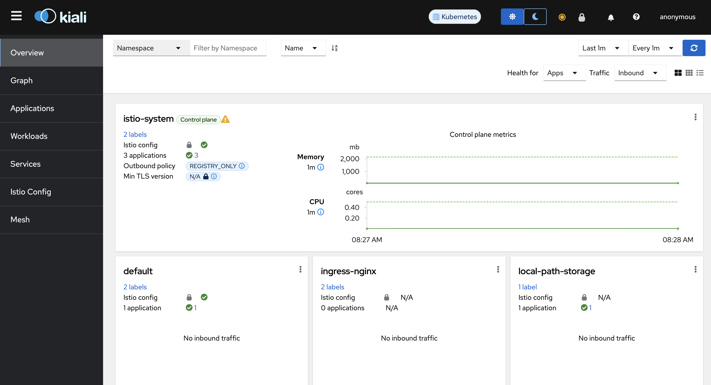

## 加重ルーティング
Istio virtual service/destination ruleを用いて加重ルーティングを実装します。旧バージョンから新バージョンへのアプリケーションの段階的な移行がユースケースとして挙げられます。本ケースでは、まず追加のアプリケーションをdeployし、トラフィックを50%ずつ振り分けて、最終的に新しいアプリケーションに移行するシナリオを想定します。

[セットアップ](#セットアップ)が完了していることを前提とします。

### 追加アプリケーションdeploy
まずは、[アプリケーションdeploy](#アプリケーションdeploy)でdeployされた不要なresourceを削除します。
```sh
kubectl delete -f networking/simple-routing.yaml
```

加重ルーティング実装のための追加アプリケーションをdeployします。
```sh
kubectl apply -f app/sample-app-yellow.yaml
```

2つのアプリケーションが`default`namespace下で起動していることを確認してください。
```sh
kubectl get pod -l app=sample-app

# 出力結果例
NAME                                 READY   STATUS    RESTARTS   AGE
sample-app-blue-5979d657bd-fw6pf     2/2     Running   0          54m
sample-app-yellow-58c8c8d6d6-zkpgd   2/2     Running   0          41s
```

### Kiali設定
`http://kiali.example.com`にアクセスしてKialiダッシュボードを表示して、TOP画面左のサイドメニューの`Graph`をクリックしてください。併せて、画面上部にある表示項目を下記の通り設定してください。
- `Namespace`の`default`にチェック

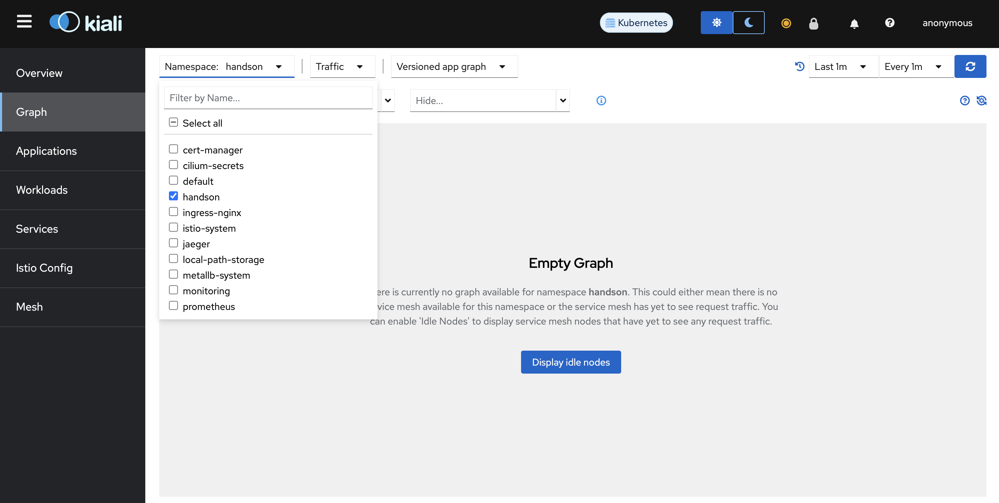

- `Versioned app graph`から`Workload graph`に変更

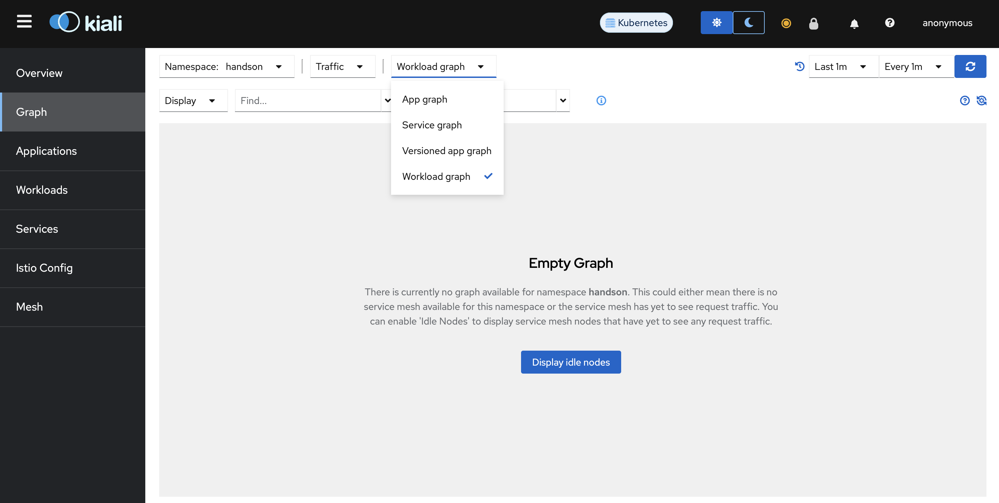

- `Display`項目から`Traffic Distribution`を追加チェック

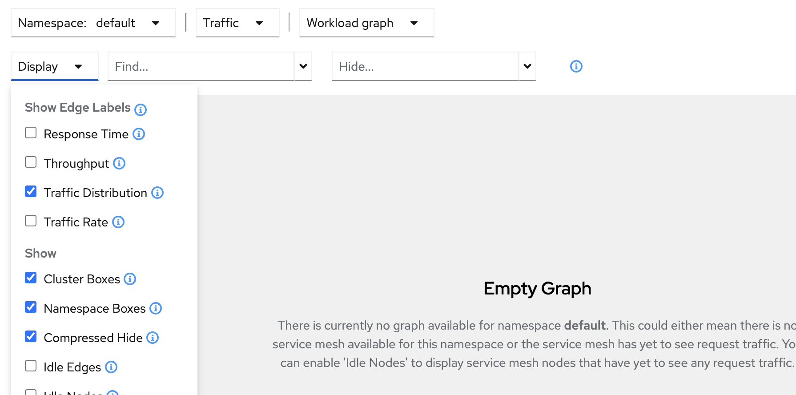

トラフィックは何も流れていないので、グラフには何も表示されていません。

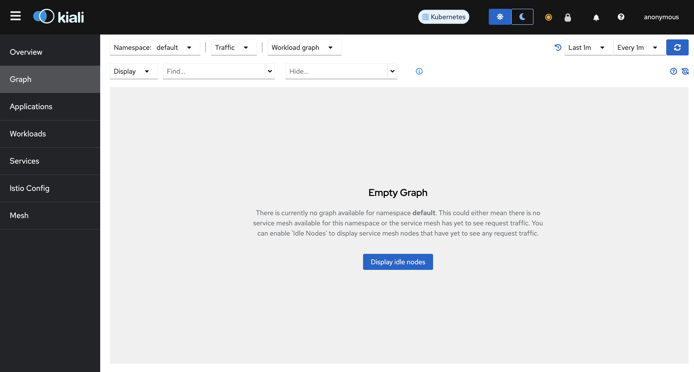

### トラフィック移行
まずは、50%ずつ加重ルーティングされるようにIstio virtual service, およびIstio destination ruleを作成します。
```sh
kubectl apply -f networking/weight-based-routing.yaml
```

実際にリクエストを流して、期待した通り50%ずつトラフィックが流れているかKialiで確認してみましょう。ローカル端末から下記コマンドを実行してください。
```sh
while :; do curl -s -o /dev/null http://app.example.com -w '%{http_code}\n';sleep 1;done
```

しばらくすると、グラフが表示されます(なかなか表示されない場合は、ページを数回リロードしてください)。トラフィックが凡そ均等にルーティングされていることを確認してください。
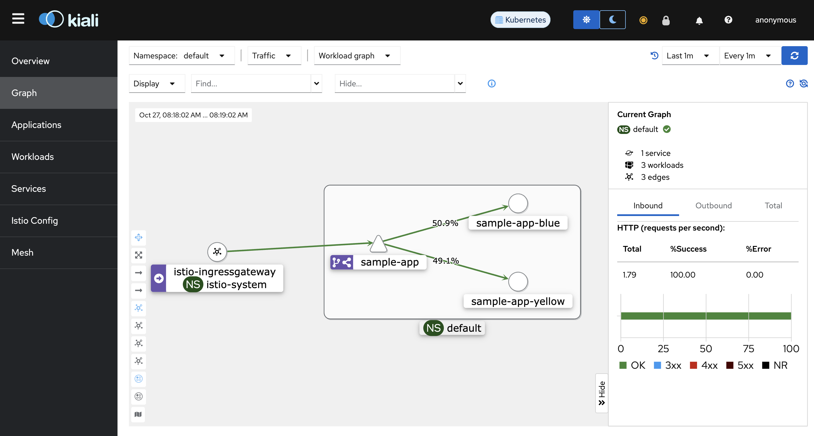

それでは、新しいアプリケーションにトラフィックが100%ルーティングされるように設定を変更します。
```sh
kubectl patch virtualservice weight-based-routing --type merge --patch-file networking/weight-based-routing-patch.yaml
```

しばらくすると、新しいアプリケーションにトラッフィックが100%ルーティングされていることが確認できます(変化が見られない場合は、数回ブラウザをリロードしてください)。
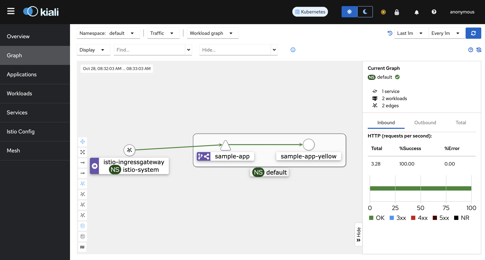

Istio virtual service/destination ruleを使用して、加重ルーティングを実装しました。Istioの機能を利用することで、アプリケーション側にロジックを追加することなく複数アプリケーション間のトラフィック移行を実現することができます。

ローカル端末にて実施しているリクエストは停止してください。

### クリーンアップ
追加でdeployしたアプリケーション、およびIstio virtual service/destination ruleを削除し、本項の初期状態に戻します。
```sh
kubectl delete -f networking/weight-based-routing.yaml,app/sample-app-yellow.yaml
kubectl apply -f networking/simple-routing.yaml
```

## L4アクセス管理
Istio authorization policyを用いてL4レベルのアクセス管理を実装します。Istio mesh内において、あるワークロードに対して特定のワークロードからのL4レベル(トランスポート層)でのアクセスを制御したい時がユースケースとして挙げられます。本ケースでは`sample-app`ワークロードにアクセスをするワークロードを2つ用意し、一つからはアクセスを許可、もう一つからのアクセスは拒否するケースを想定します。

[セットアップ](#セットアップ)が完了していることを前提とします。

### 追加アプリケーションdeploy
`sample-app`ワークロードにアクセスする追加のワークロードを2つdeployします。
```sh
kubectl apply -f app/curl-allow.yaml,app/curl-deny.yaml
```

Deployされたリソースは下記の通りです。
```sh
kubectl get po -l content=layer4-authz

# 出力結果例
NAME         READY   STATUS    RESTARTS   AGE
curl-allow   2/2     Running   0          109s
curl-deny    2/2     Running   0          109s
```

それでは双方のpodから`sample-app`ワークロードに対してリクエストをします。
```sh
while :; do \
kubectl exec curl-allow -- /bin/sh -c "echo -n 'curl-allow: ';curl -s -o /dev/null sample-app:8080 -w '%{http_code}\n'"; \
kubectl exec curl-deny -- /bin/sh -c "echo -n 'curl-deny:  ';curl -s -o /dev/null sample-app:8080 -w '%{http_code}\n'"; \
echo ----------------;sleep 1; \
done
```

`curl-allow`, `curl-deny` pod双方からのリクエストは成功していることが分かります。
```
# 出力結果
curl-allow: 200
curl-deny:  200
----------------
curl-allow: 200
curl-deny:  200
----------------
curl-allow: 200
curl-deny:  200
----------------
.
.
.
```

Kiali dashboardからも確認してみましょう。リクエストを流した状態でブラウザから`http://kiali.example.com`にアクセスをしてください。`curl-allow`, `curl-deny` podの双方が`sample-app`ワークロードにアクセス出来ていることが確認できます。下記図のようになっていない場合は、ブラウザを数回リロードしてください。

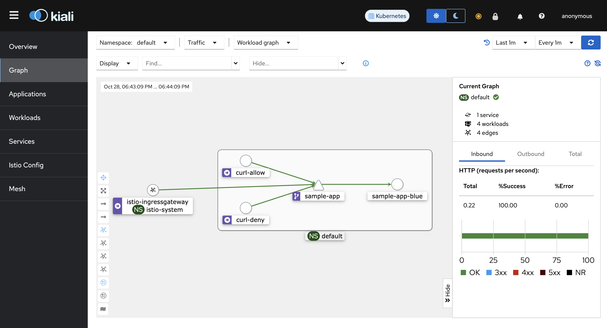

ここで`sample-app`ワークロードへのリクエストは一旦停止してください。

### Istio Authorization Policy適用
それでは、Istio authorization policyを適用して、`curl-deny` podから`sample-app`ワークロードへのアクセスを拒否します。
```sh
kubectl apply -f networking/L4-authorization-policy.yaml
```

作成されたresourceは下記の通りです。
```sh
kubectl get authorizationpolicy -l content=layer4-authz

# 出力結果例
NAME           AGE
layer4-authz   27s
```

`sample-app`ワークロードに対して`curl-allow`, `curl-deny` podから再度リクエストをします。
```sh
while :; do \
kubectl exec curl-allow -- /bin/sh -c "echo -n 'curl-allow: ';curl -s -o /dev/null sample-app:8080 -w '%{http_code}\n'"; \
kubectl exec curl-deny -- /bin/sh -c "echo -n 'curl-deny:  ';curl -s -o /dev/null sample-app:8080 -w '%{http_code}\n'"; \
echo ----------------;sleep 1; \
done
```

しばらくすると、`curl-deny` podからのリクエストは拒否されるようになります。

```
# 出力結果例
curl-allow: 200
curl-deny:  200
----------------
curl-allow: 200
curl-deny:  200
----------------
curl-allow: 200
curl-deny:  403
----------------
curl-allow: 200
curl-deny:  403
----------------
.
.
.
```

改めてKiali dashboardから確認してみましょう。ブラウザから`http://kiali.example.com`にアクセスをしてください。しばらくすると、`curl-allow` podからのリクエストは許可されている一方で、`curl-deny` podからのリクエストは拒否されていることが確認できます。

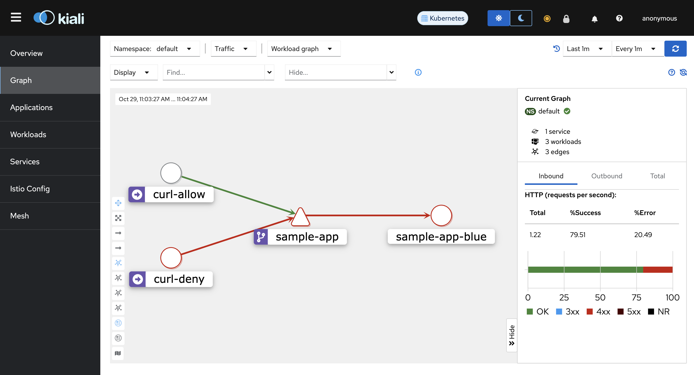

Istio authorization policyを使用して、Istio mesh内のL4レベルのアクセス管理を実装しました。Istioの機能を利用することで、アプリケーション側にロジックを追加することなく、L4レベルのアクセス管理を実現することができます。

`sample-app`ワークロードへのリクエストは忘れずに停止してください。

### クリーンアップ
追加でdeployしたアプリケーション、およびIstio authorization policyを削除し、本項の初期状態に戻します。
```sh
kubectl delete -f networking/L4-authorization-policy.yaml
kubectl delete -f app/curl-allow.yaml,app/curl-deny.yaml
```

## L7アクセス管理
Istio authorization policyを用いてL7レベルのアクセス管理を実装します。Istio mesh内において、あるワークロードに対して特定のワークロードからのL7レベル(アプリケーション層)でのアクセスを制御したい時がユースケースとして挙げられます。本ケースでは`sample-app`ワークロードにアクセスをするワークロードを1つ用意し、`GET`メソットのみ許可し、それ以外は拒否をするケースを想定します。

[セットアップ](#セットアップ)が完了していることを前提とします。

### 追加アプリケーションdeploy
`sample-app`ワークロードにアクセスする追加のワークロードをdeployします。
```sh
kubectl apply -f app/curl.yaml
```

Deployされたリソースは下記の通りです。
```sh
kubectl get po -l content=layer7-authz

# 出力結果例
NAME   READY   STATUS    RESTARTS   AGE
curl   2/2     Running   0          24s
```

それでは、`curl`podから`sample-app`ワークロードに対してリクエストをします。
```sh
while :; do kubectl exec curl -- curl -s -o /dev/null sample-app:8080 -w '%{http_code}\n';sleep 1;done
```

`curl` podからのリクエストは成功していることが分かります。

```
# 出力結果
200
200
200
.
.
.
```

Kiali dashboardからも確認してみましょう。リクエストを流した状態でブラウザから`http://kiali.example.com`にアクセスをしてください。`curl` podから`sample-app`ワークロードにアクセス出来ていることが確認できます。下記図のようになっていない場合は、ブラウザを数回リロードしてください。

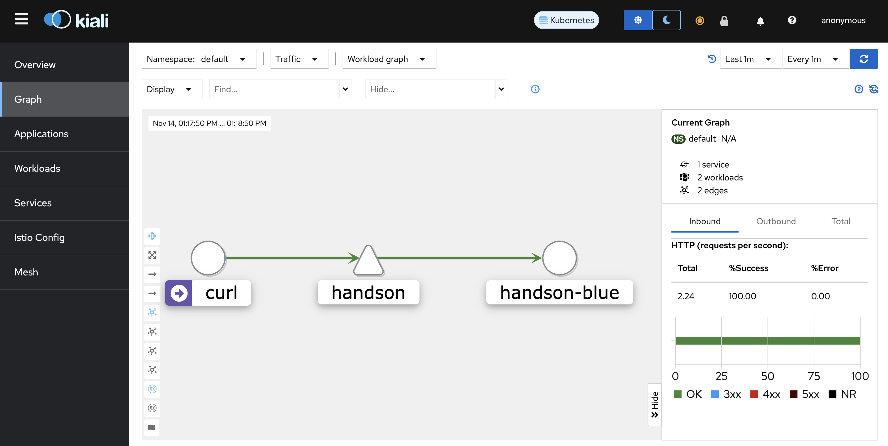

ここで`sample-app`ワークロードへのリクエストは一旦停止してください。

### Istio Authorization Policy適用
それでは、Istio authorization policyを適用して、`curl` podから`sample-app`ワークロードへの`GET`のみを許可し、それ以外は拒否します。
```sh
kubectl apply -f networking/L7-authorization-policy.yaml
```

作成されたresourceは下記の通りです。
```sh
kubectl get authorizationpolicy -l content=layer7-authz

# 出力結果例
NAME           AGE
layer7-authz   2m24s
```

`sample-app`ワークロードに対して`curl` podからまずは`GET`リクエストをします。
```sh
while :; do kubectl exec curl -- curl -s -o /dev/null sample-app:8080 -w '%{http_code}\n';sleep 1;done
```

先ほどと変わらずリクエストは成功していることが分かります。
```
# 出力結果
200
200
200
.
.
.
```

`sample-app`ワークロードへのリクエストは一旦停止してください。

それでは、`POST`メソッドでリクエストをしてみましょう。今回はテストなので、postするデータはありません。
```sh
while :; do kubectl exec curl -- curl -X POST -s -o /dev/null sample-app:8080 -d '{}' -w '%{http_code}\n';sleep 1;done
```

しばらくすると、`curl` podからのリクエストは403にて拒否されるようになります。
```
# 出力結果例
200
200
403
403
403
.
.
.
```

改めてKiali dashboardから確認してみましょう。ブラウザから`http://kiali.example.com`にアクセスをしてください。しばらくすると、`curl` podからの`POST`リクエストは拒否されていることが確認できます。

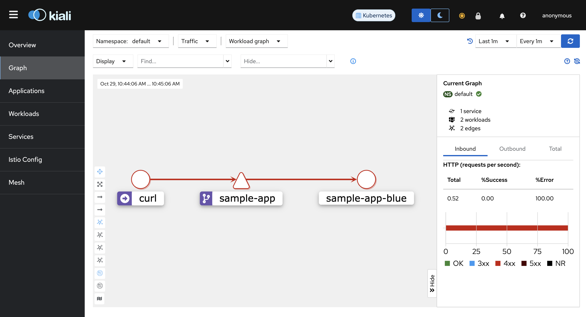

Istio authorization policyを使用して、Istio mesh内のL7レベルのアクセス管理を実装しました。Istioの機能を利用することで、アプリケーション側にロジックを追加することなく、L7レベルのアクセス管理を実現することができます。

`sample-app`ワークロードへのリクエストは忘れずに停止してください。

### クリーンアップ
追加でdeployしたアプリケーション、およびIstio authorization policyを削除し、本項の初期状態に戻します。
```sh
kubectl delete -f networking/L7-authorization-policy.yaml
kubectl delete -f app/curl.yaml
```

## クリーンアップ
