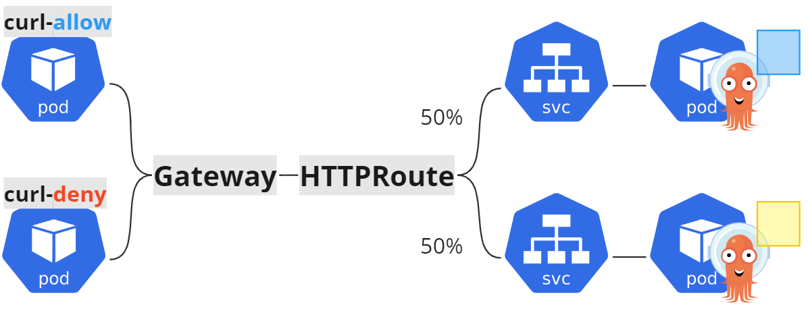
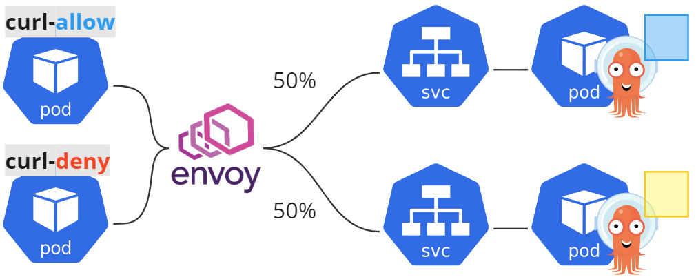

# Chapter 04d Cilium

[What is Cilium](https://cilium.io/get-started/)で説明されるように、CiliumはKubernetesクラスターやその他のクラウドネイティブ環境にネットワーキング、セキュリティ、可観測性を提供するオープンソースプロジェクトです。
Ciliumの基盤となっているのは、eBPFと呼ばれるLinuxカーネルの技術であり、セキュリティや可視性、ネットワーク制御ロジックをLinuxカーネルに動的に挿入することが可能です。
eBPFについては[eBPF.io](https://ebpf.io/)をご確認ください。


## CNI (Container Network Interface)

Ciliumは広義的にはCNIの1つとして挙げられます。では、CNIとは一体何なのでしょうか？

- CNIとは、Cloud Native Computing Foundationプロジェクトの1つになります
- CNIは、LinuxやWindowsコンテナーのネットワーク機能を抽象化し、APIインターフェース仕様として切り出したものです
- コンテナのネットワーク接続性にのみ関与し、コンテナが削除されると割り当てられたリソースを削除します
- CNIの仕様など詳細については、[こちら](https://www.cni.dev/)をご参照ください

Cilium以外にもCNIとして提供されているプラグインは数多くあります。その中のいくつかをご紹介します。

- [Flannel](https://github.com/flannel-io/flannel)
  - シンプルなセットアップで利用可能で、クラスタ内でのネットワーク通信を容易にするために適しています
  - VXLANやHost-GWモードを使用したオーバーレイネットワークにもサポートしてます
  - 単一クラスタのシンプルなネットワーキングが必要なときや、シンプルな設定と高い拡張性が求められる場合に適しています
- [Calico](https://github.com/projectcalico/calico)
  - BGPを使用したルーティングでスケーラビリティが高いと言われています
  - セキュリティポリシーやセグメンテーションの管理が可能です
  - また、ポリシードリブンで柔軟な通信制御も可能です
  - 大規模かつ複雑なネットワーク環境がある場合や、セキュリティポリシーを重視し、通信の制御が必要な場合に適しています
- [Weave](https://github.com/weaveworks/weave)
  - メッシュネットワークを提供し、コンテナの動的な発見が可能です
  - オーバーレイネットワークをサポートしており、シンプルで軽量な設計です
  - 動的なワークロードディスカバリが必要な場合や、シンプルで効率的なネットワーキングが求められる場合に適しています

## Components

Ciliumは下記の主要コンポーネントで構成されています。
詳細については[Component Overview](https://docs.cilium.io/en/stable/overview/component-overview/#component-overview)をご参照ください。

- Agent
  - Kubernetesクラスターの各ノードで実行され、Kubernetes APIサーバーとの接続を確立し、ネットワークおよびセキュリティポリシーを維持する役割を果たします
  - Linuxカーネルがコンテナーのネットワークアクセスを制御するために使用するeBPFプログラムの管理を行います
- Operator
  - クラスター全体の管理を行います。
  - 一時的に利用できなくてもクラスターは機能し続けますが、IPアドレス管理の遅延やAgentの再起動につながるkvstoreの不調の原因になります
- Client(CLI)
  - Cilium Agentとともにインストールされるコマンドラインツールです
  - 同じノード上で動作するCilium AgentのREST APIと対話を行うことができ、Agentの状態やステータスの検査ができます
  - Cliumのインストールや管理、トラブルシュートなどに使用されるCLIとは別物になります
- CNI Plugin
  - PodがNode上でスケジュールまたは終了される時にKubernetesによって呼び出されます
  - Cilium APIと対話し、ネットワーキング/ロードバランシング/ネットワークポリシーを提供するために必要な設定を起動します

Chapter01 Cluster Createで導入したCiliumに対して、上記のコンポーネントを簡単に確認してみます。

```console
$ # AgentはDaemonsetリソース、OperatorはDeploymentリソースとしてデプロイされます
$ kubectl get -n kube-system -l app.kubernetes.io/part-of=cilium ds,deploy
NAME                    DESIRED   CURRENT   READY   UP-TO-DATE   AVAILABLE   NODE SELECTOR            AGE
daemonset.apps/cilium   3         3         3       3            3           kubernetes.io/os=linux   11m

NAME                              READY   UP-TO-DATE   AVAILABLE   AGE
deployment.apps/cilium-operator   2/2     2            2           11m
$
$ # Client(CLI)のバージョン確認
$ kubectl exec -n kube-system ds/cilium -c cilium-agent -- cilium version
Client: 1.14.2 a6748946 2023-09-09T20:59:33+00:00 go version go1.20.8 linux/amd64
Daemon: 1.14.2 a6748946 2023-09-09T20:59:33+00:00 go version go1.20.8 linux/amd64
```

この章ではCiliumの機能として下記について説明します

- Networking
  - Network Policy
- ServiceMesh
  - Ingress
  - Gateway API
  - Traffic Management

> **Info**
> Observabilityについては[Chapter5d Hubble](./../chapter05d_hubble/)にて説明します。

## CNI


## Networking

### Network Policy

Ciliumでは3種類のリソースでネットワークポリシーを定義できます。
詳細は[Network Policy](https://docs.cilium.io/en/stable/network/kubernetes/policy/#network-policy)を参照してください。

- NetworkPolicy
  - PodのIngress/Egressに対しL3/L4のポリシーを定義することが可能です
  - 詳細は[Network Policies](https://kubernetes.io/docs/concepts/services-networking/network-policies/)を参照してください
- CiliumNetworkPolicy
  - NetworkPolicyリソースとよく似ていますが、NetworkPolicyと異なりL7のポリシーを定義することが可能です
- CiliumClusterwideNetworkPolicy
  - クラスター全体のポリシーを設定するためのリソースです
  - CiliumNetworkPolicyと同じ設定が可能ですが、CiliumNetworkPolicyと異なり名前空間の指定はありません

この節では`CiliumNetworkPolicy`の動作確認を行います。

まず動作確認用のアプリケーションをデプロイします。

```sh
kubectl apply -Rf manifest/app
```

次にアプリケーションに接続するためのクライアントを2種類デプロイします。

```sh
kubectl run curl-allow -n handson-cilium --image=curlimages/curl --labels="app=curl-allow" --command -- sleep infinity
kubectl run curl-deny  -n handson-cilium --image=curlimages/curl --labels="app=curl-deny"  --command -- sleep infinity
```

下記図のような構成になります。


現状は`curl-allow`/`curl-deny`の両方から`/`と`/color`にアクセスすると、すべてHTTPステータスコードが200となっていることを確認します。

```sh
kubectl exec -n handson-cilium curl-allow -- /bin/sh -c "echo -n 'curl-allow: ';curl -s -o /dev/null handson:80 -w '%{http_code}\n'"
kubectl exec -n handson-cilium curl-deny  -- /bin/sh -c "echo -n 'curl-deny:  ';curl -s -o /dev/null handson:80 -w '%{http_code}\n'"
kubectl exec -n handson-cilium curl-allow -- /bin/sh -c "echo -n 'curl-allow:color: ';curl -s -o /dev/null handson:80/color -w '%{http_code}\n'"
kubectl exec -n handson-cilium curl-deny  -- /bin/sh -c "echo -n 'curl-deny:color:  ';curl -s -o /dev/null handson:80/color -w '%{http_code}\n'"
```

```console
curl-allow: 200
curl-deny:  200
curl-allow:color: 200
curl-deny:color:  200
```

動作確認として下記のような設定の`CiliumNetworkPolicy`をデプロイしてみます。
- `/`へは`curl-allow`からのみアクセス可能
- `/color`へは`curl-allow`と`curl-deny`の両方からアクセスが可能

```sh
kubectl apply -f manifest/cnp_ch4d-1.yaml
```

実際にアクセスし確認すると、想定通りの動作になっていることが分かります。

```sh
kubectl exec -n handson-cilium curl-allow -- /bin/sh -c "echo -n 'curl-allow: ';curl -s -o /dev/null handson:80 -w '%{http_code}\n'"
kubectl exec -n handson-cilium curl-deny  -- /bin/sh -c "echo -n 'curl-deny:  ';curl -s -o /dev/null handson:80 -w '%{http_code}\n'"
kubectl exec -n handson-cilium curl-allow -- /bin/sh -c "echo -n 'curl-allow:color: ';curl -s -o /dev/null handson:80/color -w '%{http_code}\n'"
kubectl exec -n handson-cilium curl-deny  -- /bin/sh -c "echo -n 'curl-deny:color:  ';curl -s -o /dev/null handson:80/color -w '%{http_code}\n'"
```

下記のように、`/`にアクセスしたcurl-denyのみHTTPステータスコード403が返ってくることを確認します。

```console
curl-allow: 200
curl-deny:  403
curl-allow:color: 200
curl-deny:color:  200
```

次節へ行く前に、作成したCiliumNetworkPolicyを削除しておきます。

```sh
kubectl delete -f manifest/cnp_ch4d-1.yaml
```

## Service Mesh

### Ingress

[Kubernetes Ingress Support](https://docs.cilium.io/en/stable/network/servicemesh/ingress/)に記載があるように、CiliumはIngressリソースをサポートしています。
第1章でNginx Controllerをデプロイしましたが、Nginx Controllerを使わずともCilium単体でIngressリソースを利用できます。
この節では、IngressClassとしてCiliumを利用したトラフィックルーティングを行います。

まずingressControllerを有効にします。

```bash
helmfile apply -f helmfile
```

`ingressClassName`フィールドに`cilium`を設定したIngressをアプライすればIngressリソースを利用できます。

```bash
kubectl apply -f manifest/ingress.yaml
```

curlコマンドでHTTPステータスコード200が返ってくることを確認します。

```console
$ curl -I app.cilium.example.com:8080
HTTP/1.1 200 OK
accept-ranges: bytes
content-length: 1395
content-type: text/html; charset=utf-8
last-modified: Tue, 22 Jun 2021 05:40:33 GMT
date: Wed, 01 Nov 2023 18:08:01 GMT
x-envoy-upstream-service-time: 0
server: envoy
```

### Gateway API

CiliumはGatweay APIをサポートしており、Gatway APIを利用することで、トラフィックの分割、ヘッダー変更、URLの書き換えなどのより高度なルーティング機能を利用することが可能です。
この節ではGateway APIを利用したトラフックの分割を行います。
Gateway APIの詳細は[Kubernetes Gateway API](https://gateway-api.sigs.k8s.io/)を参照してください。

まず、Gateway APIのCRDをデプロイします。

```sh
kubectl apply -f https://raw.githubusercontent.com/kubernetes-sigs/gateway-api/v0.7.0/config/crd/standard/gateway.networking.k8s.io_gatewayclasses.yaml
kubectl apply -f https://raw.githubusercontent.com/kubernetes-sigs/gateway-api/v0.7.0/config/crd/standard/gateway.networking.k8s.io_gateways.yaml
kubectl apply -f https://raw.githubusercontent.com/kubernetes-sigs/gateway-api/v0.7.0/config/crd/standard/gateway.networking.k8s.io_httproutes.yaml
kubectl apply -f https://raw.githubusercontent.com/kubernetes-sigs/gateway-api/v0.7.0/config/crd/standard/gateway.networking.k8s.io_referencegrants.yaml
kubectl apply -f https://raw.githubusercontent.com/kubernetes-sigs/gateway-api/v0.7.0/config/crd/experimental/gateway.networking.k8s.io_tlsroutes.yaml
```

今回は下記のようにトラフィックを50:50に分割してみます。



トラフィックを分割するためにGatewayリソースとHTTPRouteリソースをデプロイします。

```sh
kubectl apply -n handson-cilium  -f manifest/gateway_ch4d-2.yaml
```

上記をデプロイすると、`Type:Loadbalancer`が作成されることが分かります。

```console
$ kubectl get svc -n handson-cilium
NAME                      TYPE           CLUSTER-IP      EXTERNAL-IP      PORT(S)        AGE
cilium-gateway-color-gw   LoadBalancer   10.96.196.114   172.24.255.200   80:30485/TCP   97s
handson                   ClusterIP      10.96.172.207   <none>           80/TCP         19m
handson-blue              ClusterIP      10.96.232.207   <none>           80/TCP         19m
handson-yellow            ClusterIP      10.96.62.8      <none>           80/TCP         19m
```

LBのIPアドレスを取得します。

```sh
LB_IP=$(kubectl get -n handson-cilium  svc -l io.cilium.gateway/owning-gateway=color-gw -o=jsonpath='{.items[0].status.loadBalancer.ingress[0].ip}')
```

LBのIPアドレス宛に10回ほどアクセスし、おおよそ50:50に分散していることを確認します。

```sh
for in in {1..10}; do \
curl ${LB_IP}/color;echo
sleep 0.1
done
```

次節に行く前に、作成したGatewayリソースとHTTPRouteリソースを削除しておきます。

```sh
kubectl delete -f manifest/gateway_ch4d-2.yaml
```

> **Info**
> 今回のようなルーティング機能はCilium Service Meshの機能を利用しても提供することができます。
> Cilium Service Meshを利用したトラフィック分割のデモを後述します。

### Traffic Management

Ciliumでは、CRDとして定義された`CiliumEnvoyConfig`と`CiliumCllusterwideEnvoyConfig`を利用したL7トラフィック制御も可能です。
これらのリソースを使用することで、Cilium AgentのEnvoyに対して設定を行えます。
詳細は[L7-Aware Traffic Management](https://docs.cilium.io/en/latest/network/servicemesh/l7-traffic-management/)を参照してください。

Envoyの[Supported API versions](https://www.envoyproxy.io/docs/envoy/latest/api/api_supported_versions)にも記載がありますが、Envoy APIにはv1/v2/v3の3種類が存在します。
このうちCiliumでは、Envoy API v3のみをサポートしています。
また、Envoy Extension Resource Typeへの対応状況は[Envoy extensions configuration file](https://github.com/cilium/proxy/blob/main/envoy_build_config/extensions_build_config.bzl)を確認してください。

この節では、`envoy.filters.http.router`を利用したトラフィックシフトを行います。

`handson-blue"`に10%、`handson-yellow`に90%のトラフィックを流すように設定します。

```sh
kubectl delete -f manifest/cec.yaml
```




下記コマンドを実行すると、`handson-blue"`に10%、`handson-yellow`に90%のトラフィックが流れることが確認できます。

```sh
for in in {1..10}; do \
kubectl exec -n handson-cilium curl-allow -- /bin/sh -c "echo -n 'curl-allow:color: ';curl -s handson:80/color -w '\n'"
sleep 0.1
done
```
