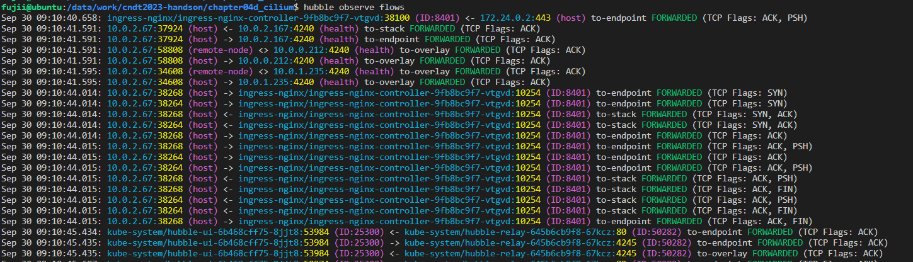
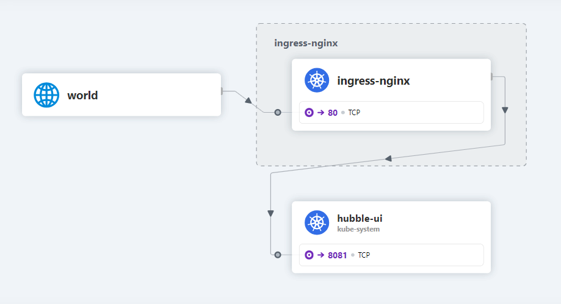

## はじめに

この節ではHubbleを利用したフロー情報の可視化を説明します。

## Hubbleの概要

HubbleはCiliumのために開発されたネットワークとセキュリティのObservabilityプラットフォームです。
Hubbleは下記のコンポーネントで構成されます。


- Hubble Server
  - 各NodeのCilium Agentに組み込まれており、Prometheusメトリクスやネットワークおよびアプリケーションプロトコルレベルでのフロー情報の可視性を提供します
- Hubble Relay
  - クラスターをスコープとするHubble APIを提供します
- Hubble UI
  - グラフィカルなサービス依存関係マップと接続性マップを提供します
- Hubble CLI
  - コマンドラインバイナリであり、Hubble RelayのgRPC APIまたはローカルサーバーのいずれかに接続してフローイベントを取得します


## 構築

Hubble RelayとHubble UIを構築します。

```
helmfile apply -f helmfile
```

下記コマンドでHubbleのステータスがOKになっていることを確認します

```
cilium status
```

## 動作確認

### Hubble Relayへのアクセス

Hubble Relayへアクセスする方法として、下記の2種類の方法があります。

- Hubble CLIを利用する方法
- Hubble UIを利用する方法

#### Hubble CLIの利用

Hubble CLIを利用してHubble Relayにアクセスします。

まずは、Hubble CLIをインストールします。

```bash
./install-tools.sh
```

次に、Hubble RelayへのReachabilityを確保します。
やり方はいろいろありますが、今回は下記のコマンドを使用します。

```bash
# 別のコンソールを開き実行
kubectl port-forward -n kube-system deploy/hubble-relay 4245 4245
```

下記コマンドでStatusを確認し、HealthcheckがOKとなっていることを確認します。

```bash
hubble status
```

Hubble Relay経由で取得したHubble Serverのフロー情報は、下記コマンドで出力できます。

```bash
hubble observe flows
```

コマンドを実行すると下記のような情報が出力されます。



### Hubble UIの利用

Hubble UIからHubble Relayにアクセスし、Hubble Serverの情報を取得します。

Hubble UIにアクセスするために、Ingressリソースを作成します。

```
kubectl apply -f ingress.yaml
```

ブラウザで`hubble.example.com`にアクセスすると、ingress-nginxのnamespaceを確認すると下記のような画面が出力されます。
これより、インターネット側からingress-nginxの80ポートにアクセスがあり、その後hubble-uiの8081ポートにアクセスがあったことが分かります。




## 参考文献

- https://isovalent.com/blog/post/hubble-series-re-introducing-hubble/