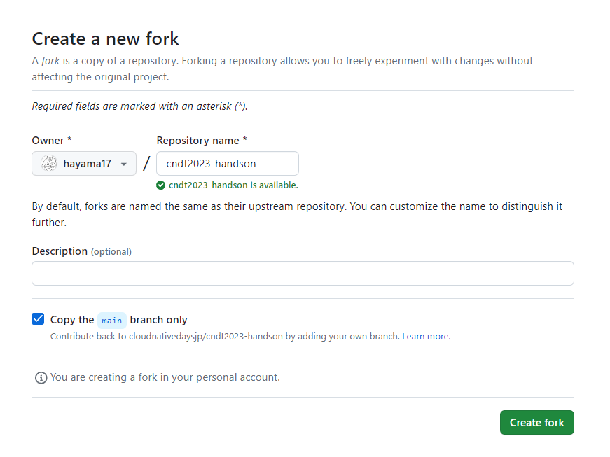

# Argo CD with WebUI
この章では、Kubernetes上でGitOpsを可能とするCDツールであるArgo CDについて紹介し、導入します。
ArgocdをWebUIでの構築を想定しています。

## GitOpsとCI/CDについて
CI/CDは、継続的インテグレーション（CI）と継続的デリバリー/デプロイメント（CD）を実現するための手法です。
CIは、アプリケーションのビルド、テスト、およびコードの統合を自動化するプロセス
CDは、アプリケーションのデプロイメントを自動化するプロセスです。
テストやデプロイを自動化することで、オペミスや作業量を減らすことで余ったリソースでアリケーションやソフトウェアの品質を高めたり、リソースサイクルを早めることを目的としている。

GitOpsは、CI/CDを実現するための手法の一つで、Gitのリポジトリの変更をトリガーにCI/CDを実行することで、アプリケーションのデプロイメントを自動化するプロセスです。


## Argo CDについて 
Kubrnetes用のGitOpsツールで、Gitリポジトリに格納されたマニフェストをデプロイすることができます。WEB GUIとCLIの両方で操作することができ、アプリケーションやKuberenetesのリソースの状態を可視化し簡単に管理する事が可能になっています。
ArgoCDはGitHub等からのWebhookを受け取り、Gitリポジトリに格納されたマニフェストをデプロイすることができるため、開発者のコードPushやPRをトリガーにデプロイまで実行することができます。


### Argo CDのアーキテクチャ


Argo CDは三つのコアコンポーネントで構成されています。
- API Server
- Repository Server
- Application Controller


## OutOfSync/Synced
アプリケーションがGitリポジトリの定義と設定と一致しているかどうかを示すステータスです。
#### OutOfSync
Gitリポジトリとアプリケーションの状態が一致せず、アプリケーションに変更があったか、同期エラーが発生したことを示します。
#### Synced
Gitリポジトリとアプリケーションの状態が一致し、アプリケーションが期待どおりに機能していることを示します。

## Healthy/Degrated/Processing 
アプリケーションの状態を示す異なるステータスで、アプリケーションの健全性や動作状態を示すステータスです。
#### Healthy
アプリケーションのコンポーネントやサーバーが期待どおりに応答し、エラーや障害がない状態です。
#### Degrated
アプリケーションが完全に停止していないが、一部の問題が存在する状態です。
#### Processing
アプリケーションやサービスが現在、新しいリクエストやデプロイメントなどの操作を処理していることを示し"Healthy" または "Degraded" の状態に変わります。

## Refresh/Hard Refresh/Sync の違いについて
これらの三つの処理は、GitレポジトリとArgo CDの状態を同期させるための処理ですが細かな違いが存在します。
#### Refresh
最新のGit上のマニフェストとRepository Server内にあるマニフェストを比較し、差分を反映します。
通常の更新はデフォルトで3分ごとに行われます。
#### HardRefresh
HelmやKustomizeなどのコードから生成されたマニフェストをキャッシュしているマニフェストキャッシュをクリアし、新たにRefresh処理を行う操作です。これにより、マニフェストの変更の有無にかかわらず、マニフェストを再生成できます。
デフォルトで24時間ごとに、マニフェストキャッシュの有効期限が切れたときに行われます。
#### Sync
Kubernetes clusterをGitの状態に同期させるため、マニフェストの反映（デプロイ）をします。

### Gitリポジトリの準備(ローカル環境)
Argo CDを利用する上では、GitHubへのPush等の変更が必要不可欠になります。そのため、このハンズオンのリポジトリをforkして操作する為の準備をします。

[このハンズオン](https://github.com/cloudnativedaysjp/cndt2023-handson)にアクセスし、forkをクリックします


Create fork をクリックします


自身のアカウントでforkされていることが確認できます


GitHubのリポジトリの登録やPushはforkした自身のリポジトリを利用して下さい
### Argo CDのインストール
helmファイルを利用してArgo CDをインストールします。
```
helmfile sync  -f helm/helmfile.yaml
```
作成されるリソースは下記の通りです。
```
kubectl get service,deployment  -n argo-cd
```
```
# 実行結果
NAME                                               TYPE        CLUSTER-IP      EXTERNAL-IP   PORT(S)             AGE
service/argo-cd-argocd-applicationset-controller   ClusterIP   10.96.209.173   <none>        7000/TCP            26d
service/argo-cd-argocd-dex-server                  ClusterIP   10.96.116.27    <none>        5556/TCP,5557/TCP   26d
service/argo-cd-argocd-redis                       ClusterIP   10.96.28.90     <none>        6379/TCP            26d
service/argo-cd-argocd-repo-server                 ClusterIP   10.96.249.188   <none>        8081/TCP            26d
service/argo-cd-argocd-server                      ClusterIP   10.96.152.238   <none>        80/TCP,443/TCP      26d

NAME                                                       READY   UP-TO-DATE   AVAILABLE   AGE
deployment.apps/argo-cd-argocd-applicationset-controller   1/1     1            1           26d
deployment.apps/argo-cd-argocd-dex-server                  1/1     1            1           26d
deployment.apps/argo-cd-argocd-notifications-controller    1/1     1            1           26d
deployment.apps/argo-cd-argocd-redis                       1/1     1            1           26d
deployment.apps/argo-cd-argocd-repo-server                 1/1     1            1           26d
deployment.apps/argo-cd-argocd-server                      1/1     1            1           26d
```
ingressを作成し、Argo CDのWEB UIにアクセス出来るようにします。
```
kubectl apply -f ingress/ingress.yaml
```
http://argocd.vmXX.handson.cloudnativedays.jp/
へアクセスします。下記のページにアクセス出来るか確認して下さい。
* ユーザ名: admin
* パスワード: 以下のコマンドをサーバ上で実行した値
    * `kubectl -n argo-cd get secret argocd-initial-admin-secret -o jsonpath="{.data.password}" | base64 -d ; echo`


### レポジトリの登録

同期させるGitのレポジトリを登録します。

Settings - > Repositories と進み CONEECT REPOをクリックします　

上の画面上で各項目を次のように設定
```
Choose your connection method: VIA HTTPS
Type: git
Project: default
Repository URL: https://github.com/自身のアカウント名/cndt2023-handson
```
CONNECTをクリックして、下記のように表示されていることを確認して下さい。


## デモアプリのデプロイ
試しにデモアプリのデプロイを行い、Argo CDの一連の操作を行います。

Argo CDに同期させるGitリポジトリをを準備します。
```bash
git clone https://github.com/自身のアカウント名/cndt2023-handson.git
```
Applicationsの画面において + NEW APPをクリックします
上の画面上で各項目を次のように設定します。
```
GENERAL
  Application Name: argocd-demo
  Project Name: default
  SYNC POLICY: Manual
  SYNC OPTIONS: AUTO CREATE NAMESPACE [v]
  SOURCE
    Repository URL: https://github.com/自身のアカウント名/cndt2023-handson
    Revision: main
    Path: chapter05_argocd/app/default
  DESTINATION
    Cluster URL: https://kubernetes.default.svc
    Namespace: argocd-demo
```
設定できたら、CREATEをクリックして、下記のように表示されていることを確認して下さい。


ページ上部にあるSYNCをクリックして、無事デプロイされると下記のように表示されていることを確認して下さい。


ブラウザから
http://app.argocd.vmXX.handson.cloudnativedays.jp
へアクセスして確認してみてください。アプリケーションが表示され青い色のタイルが出てくるのが確認できます。


上記の手順でGitに保存しているマニフェストを参照して、アプリケーションのデプロイを行いました。次にGitの変更にKubernetes Clusterを同期させます。

app/default/deployment.yamlの編集を行います。 imageのtagをblueからgreenに変更します。
```
image: argoproj/rollouts-demo:green
```
差分をforkしたmainブランチ（Argo CDのappを作成する際に指定したブランチ）に取り込みます。
```
git push origin main
```
Argo CDはデフォルトでは3分に一回の頻度でブランチを確認し、差分を検出しています。 3分待てない場合には、ページ上部にある [REFRESH]をクリックします。下記のようにdeploymentにおいて差分が検出されます。（黄色で表示されているOutOfSyncが差分があることを示しています） ちなみにAppの設定において、SYNC POLICYをManualでなくAutoにしていた場合には、ここでOutOfSyncを検知すると自動でArgoCDがSyncを実行します。

Gitの変更をKubernetes Clusterに反映させるためにページ上部にあるSYNCをクリックして、下記のように表示されていることを確認して下さい。

http://app.argocd.vmXX.handson.cloudnativedays.jp
へアクセスして確認するとタイルが青から緑に変わったことが確認できます。

## Kustomizeを使ったデプロイ
ArgoCD上でマニフェストの管理ツールである「Kustomize」を利用した、開発環境と本番環境の2つのマニフェスト管理を行います。

Applicationsの画面において + NEW APPをクリックし、本番環境・開発環境それぞれのアプリケーションを作成します。
[Applications](./image/demoapp/new-app.png)
上の画面上で各項目を次のように設定します。(開発環境と本番環境で分けて表示してある項目は、それぞれ設定してください)
```
GENERAL
  Application Name: 
    開発環境: argocd-kustomize-dev
    本番環境: argocd-kustomize-prd
  Project Name: default
  SYNC POLICY: Manual
  SYNC OPTIONS: AUTO CREATE NAMESPACE [v]
  SOURCE
    Repository URL: https://github.com/自身のアカウント名/cndt2023-handson
    Revision: main
    Path:
      開発環境: chapter05_argocd/app/Kustomize/overlays/dev
      本番環境: chapter05_argocd/app/Kustomize/overlays/prd
  DESTINATION
    Cluster URL: https://kubernetes.default.svc
    Namespace: 
      開発環境: argocd-kustomize-dev
      本番環境: argocd-kustomize-prd
```
設定できたら、CREATEをクリックします

### 開発環境

### 本番環境

ページ上部にある SYNCをクリックします(開発環境の場合はpodが1個、本番環境の場合はpodが2個出来るのが確認できます。)
### 開発環境

### 本番環境


ブラウザで各環境へアクセスして確認してみてください。タイルの色が開発環境と本番環境で違う事が確認できます。
  * 開発環境: dev.kustomize.argocd.vmXX.handson.cloudnativedays.jp
  * 本番環境: prd.kustomize.argocd.vmXX.handson.cloudnativedays.jp
## Helmを使ったデプロイ
KubernetesのパッケージマネージャーのHelmを利用したデプロイを行います。

Applicationsの画面において + NEW APPをクリックします

上の画面上で各項目を次のように設定します。
```
GENERAL
  Application Name: argocd-helm
  Project Name: default
  SYNC POLICY: Manual
  SYNC OPTIONS: AUTO CREATE NAMESPACE [v]
  SOURCE
    Repository URL: https://github.com/自身のアカウント名/cndt2023-handson
    Revision: main
    Path: chapter05_argocd/app/Helm/rollouts-demo
  DESTINATION
    Cluster URL: https://kubernetes.default.svc
    Namespace: argocd-helm
```
設定できたら、CREATEをクリックします


ページ上部にある SYNCをクリックします（無事デプロイされると下記のようになります）

ブラウザで
helm.argocd.vmXX.handson.cloudnativedays.jp
アクセスして確認してみてください。Helmを使ってデプロイが出来ている事が確認できます。

## 作成したデモアプリを削除
各アプリのDELETEをクリックします

Applications画面の場合は、一番右下の端に、


詳細画面の場合は、右上の2番目にあります。


削除する際にアプリケーション名の入力があるので入力してOKをクリックします。


全てのアプリケーションを削除して、初めてアクセスした画面と同じようにして下さい。


namespaceの削除を行います。
```
kubectl delete namespace argocd-demo argocd-kustomize-dev argocd-kustomize-prd argocd-helm
```
<br><br>

#### **Argo CD with argocli**
# Argo CD with argocli
この章では、Kubernetes上でGitOpsを可能とするCDツールであるArgo CDについて紹介し、導入します。


## GitOpsとCI/CDについて
CI/CDは、継続的インテグレーション（CI）と継続的デリバリー/デプロイメント（CD）を実現するための手法です。
CIは、アプリケーションのビルド、テスト、およびコードの統合を自動化するプロセス
CDは、アプリケーションのデプロイメントを自動化するプロセスです。
テストやデプロイを自動化することで、オペミスや作業量を減らすことで余ったリソースでアリケーションやソフトウェアの品質を高めたり、リソースサイクルを早めることを目的としている。

GitOpsは、CI/CDを実現するための手法の一つで、Gitのリポジトリの変更をトリガーにCI/CDを実行することで、アプリケーションのデプロイメントを自動化するプロセスです。


## Argo CDについて 
Kubrnetes用のGitOpsツールで、Gitリポジトリに格納されたマニフェストをデプロイすることができます。WEB GUIとCLIの両方で操作することができ、アプリケーションやKuberenetesのリソースの状態を可視化し簡単に管理する事が可能になっています。
ArgoCDはGitHub等からのWebhookを受け取り、Gitリポジトリに格納されたマニフェストをデプロイすることができるため、開発者のコードPushやPRをトリガーにデプロイまで実行することができます。


### Argo CDのアーキテクチャ


Argo CDは三つのコアコンポーネントで構成されています。
- API Server
- Repository Server
- Application Controller


## OutOfSync/Synced
アプリケーションがGitリポジトリの定義と設定と一致しているかどうかを示すステータスです。
#### OutOfSync
Gitリポジトリとアプリケーションの状態が一致せず、アプリケーションに変更があったか、同期エラーが発生したことを示します。
#### Synced
Gitリポジトリとアプリケーションの状態が一致し、アプリケーションが期待どおりに機能していることを示します。

## Healthy/Degrated/Processing 
アプリケーションの状態を示す異なるステータスで、アプリケーションの健全性や動作状態を示すステータスです。
#### Healthy
アプリケーションのコンポーネントやサーバーが期待どおりに応答し、エラーや障害がない状態です。
#### Degrated
アプリケーションが完全に停止していないが、一部の問題が存在する状態です。
#### Processing
アプリケーションやサービスが現在、新しいリクエストやデプロイメントなどの操作を処理していることを示し"Healthy" または "Degraded" の状態に変わります。

## Refresh/Hard Refresh/Sync の違いについて
これらの三つの処理は、GitレポジトリとArgo CDの状態を同期させるための処理ですが細かな違いが存在します。
#### Refresh
最新のGit上のマニフェストとRepository Server内にあるマニフェストを比較し、差分を反映します。
通常の更新はデフォルトで3分ごとに行われます。
#### HardRefresh
HelmやKustomizeなどのコードから生成されたマニフェストをキャッシュしているマニフェストキャッシュをクリアし、新たにRefresh処理を行う操作です。これにより、マニフェストの変更の有無にかかわらず、マニフェストを再生成できます。
デフォルトで24時間ごとに、マニフェストキャッシュの有効期限が切れたときに行われます。
#### Sync
Kubernetes clusterをGitの状態に同期させるため、マニフェストの反映（デプロイ）をします。

### Gitリポジトリの準備(ローカル環境)
Argo CDを利用する上では、GitHubへのPush等の変更が必要不可欠になります。そのため、このハンズオンのリポジトリをforkして操作する為の準備をします。

[このハンズオン](https://github.com/cloudnativedaysjp/cnd-handson)にアクセスし、forkをクリックします


Create fork をクリックします
<br>

<br>
自身のアカウントでforkされていることが確認できます


GitHubのリポジトリの登録やPushはforkした自身のリポジトリを利用して下さい


### argocd cliのインストール
こちらはじしんの端末で実施してください。
https://argo-cd.readthedocs.io/en/stable/cli_installation/
#### Linux
```
## Homebrew
brew install argocd

or

## Download with Curl
curl -sSL -o argocd-linux-amd64 https://github.com/argoproj/argo-cd/releases/latest/download/argocd-linux-amd64
sudo install -m 555 argocd-linux-amd64 /usr/local/bin/argocd
rm argocd-linux-amd64
```
#### Mac(M1)
```
VERSION=$(curl --silent "https://api.github.com/repos/argoproj/argo-cd/releases/latest" | grep '"tag_name"' | sed -E 's/.*"([^"]+)".*/\1/')
curl -sSL -o argocd-darwin-amd64 https://github.com/argoproj/argo-cd/releases/download/$VERSION/argocd-darwin-amd64
```
```
sudo install -m 555 argocd-darwin-arm64 /usr/local/bin/argocd
rm argocd-darwin-arm64
```
#### Mac
```
brew install argocd
```
```
VERSION=$(curl --silent "https://api.github.com/repos/argoproj/argo-cd/releases/latest" | grep '"tag_name"' | sed -E 's/.*"([^"]+)".*/\1/')
curl -sSL -o argocd-darwin-amd64 https://github.com/argoproj/argo-cd/releases/download/$VERSION/argocd-darwin-amd64
```

#### Windows
Download With PowerShell: Invoke-WebRequest
```
$version = (Invoke-RestMethod https://api.github.com/repos/argoproj/argo-cd/releases/latest).tag_name
[Environment]::SetEnvironmentVariable("Path", "$env:Path;C:\Path\To\ArgoCD-CLI", "User")
```

### Argo CDのインストール
こちらのインストールは、VM上で実施します。
helmファイルを利用してArgo CDをインストールします。
```
helmfile sync  -f helm/helmfile.yaml
```
作成されるリソースは下記の通りです。
```
kubectl get service,deployment  -n argo-cd
```
```
# 実行結果
NAME                                               TYPE        CLUSTER-IP      EXTERNAL-IP   PORT(S)             AGE
service/argo-cd-argocd-applicationset-controller   ClusterIP   10.96.209.173   <none>        7000/TCP            26d
service/argo-cd-argocd-dex-server                  ClusterIP   10.96.116.27    <none>        5556/TCP,5557/TCP   26d
service/argo-cd-argocd-redis                       ClusterIP   10.96.28.90     <none>        6379/TCP            26d
service/argo-cd-argocd-repo-server                 ClusterIP   10.96.249.188   <none>        8081/TCP            26d
service/argo-cd-argocd-server                      ClusterIP   10.96.152.238   <none>        80/TCP,443/TCP      26d

NAME                                                       READY   UP-TO-DATE   AVAILABLE   AGE
deployment.apps/argo-cd-argocd-applicationset-controller   1/1     1            1           26d
deployment.apps/argo-cd-argocd-dex-server                  1/1     1            1           26d
deployment.apps/argo-cd-argocd-notifications-controller    1/1     1            1           26d
deployment.apps/argo-cd-argocd-redis                       1/1     1            1           26d
deployment.apps/argo-cd-argocd-repo-server                 1/1     1            1           26d
deployment.apps/argo-cd-argocd-server                      1/1     1            1           26d
```
ingressを作成し、Argo CDのWEB UIにアクセス出来るようにします。
```
kubectl apply -f ingress/ingress.yaml
```

* ユーザ名: admin
* パスワード: 以下のコマンドをサーバ上で実行した値
    * `kubectl -n argo-cd get secret argocd-initial-admin-secret -o jsonpath="{.data.password}" | base64 -d ; echo`

## argocdへログイン
こちらはじしんの端末で実施してください。
```
argocd login --insecure argocd.example.com
```
ログイン成功時
```
# 実行結果
WARN[0000] Failed to invoke grpc call. Use flag --grpc-web in grpc calls. To avoid this warning message, use flag --grpc-web.
Username: admin
Password: (上記kubectlを実行して返ってきた値)
'admin:login' logged in successfully
Context 'argocd.example.com' updated
```
以下のように、WebUIでログインした状態と同じです。

### レポジトリの登録

同期させるGitのレポジトリを登録します。
```
argocd repo add https://github.com/<自分のgithubアカウント>/cnd-handson
```
以下のように、WebUIでSettings - > Repositories と進み CONEECT REPOをクリックした状態と同様。


GUIでも、下記のように表示されていることをWebUI上でもRepositoryが登録されていることも確認してください。


## デモアプリのデプロイ
試しにデモアプリのデプロイを行い、Argo CDの一連の操作を行います。

Argo CDに同期させるGitリポジトリをを準備します。
```bash
git clone https://github.com/自身のアカウント名/cnd-handson.git
```
アプリケーションの追加
```
argocd app create argocd-demo --repo https://github.com/自身のアカウント名/cnd-handson --sync-option CreateNamespace=true --path chapter05_argocd/app/default --dest-server https://kubernetes.default.svc --dest-namespace argocd-demo
```

アプリケーションが追加されたことをWebUI上でも確認ができます。


SYNCして、無事デプロイされると下記のように表示されていることを確認して下さい。
```
argocd app sync argocd-demo
```
アプリケーションのステータス確認
```
argocd app get argocd-demo
```
argocd-demoアプリケーションが動作していること
```
# 実行結果例
Name:               argo-cd/argocd-demo
Project:            default
Server:             https://kubernetes.default.svc
Namespace:          argocd-demo
URL:                https://argocd.example.com/applications/argocd-demo
Repo:               https://github.com/akiran123/cnd-handson
Target:
Path:               chapter05_argocd/app/default
SyncWindow:         Sync Allowed
Sync Policy:        <none>
Sync Status:        Synced to  (935fc73)
Health Status:      Healthy

GROUP              KIND        NAMESPACE    NAME                  STATUS   HEALTH   HOOK  MESSAGE
                   Namespace                argocd-demo           Running  Synced         namespace/argocd-demo created
                   Service     argocd-demo  handson               Synced   Healthy        service/handson created
apps               Deployment  argocd-demo  handson               Synced   Healthy        deployment.apps/handson created
networking.k8s.io  Ingress     argocd-demo  app-ingress-by-nginx  Synced   Healthy        ingress.networking.k8s.io/app-ingress-by-nginx created
```


ブラウザから
http://app.argocd.example.com
へアクセスして確認します。するとアプリケーションが表示され青い色のタイルが出てくるのが確認できます。


上記の手順でGitに保存しているマニフェストを参照して、アプリケーションのデプロイを行いました。次にGitにあるmanifest変更Kubernetes Clusterを同期させます。

app/default/deployment.yamlの編集を行います。 imageのtagをblueからgreenに変更します。
```
image: argoproj/rollouts-demo:green
```
差分をforkしたmainブランチ（Argo CDのappを作成する際に指定したブランチ）に取り込みます。
```
git push origin main
```
Argo CDはデフォルトでは3分に一回の頻度でブランチを確認し、差分を検出しています。 3分待てない場合には、ページ上部にある [REFRESH]をクリックします。下記のようにdeploymentにおいて差分が検出されます。（黄色で表示されているOutOfSyncが差分があることを示しています） ちなみにAppの設定において、SYNC POLICYをManualでなくAutoにしていた場合には、ここでOutOfSyncを検知すると自動でArgoCDがSyncを実行します。
<br>
SYNCして、青色 → 緑色のタイルに変わるることを確認して下さい。
```
argocd app sync argocd-demo
```

もちろん、WebUIから設定することも可能です。

Gitの変更をKubernetes Clusterに反映させるためにページ上部にあるSYNCをクリックして、下記のように表示されていることを確認して下さい。

http://app.argocd.example.com
へアクセスして確認するとタイルが青から緑に変わったことが確認できます。

<br>
## Kustomizeを使ったデプロイ
ArgoCD上でマニフェストの管理ツールである「Kustomize」を利用した、開発環境と本番環境の2つのマニフェスト管理を行います。
Kustomize とは、Kuberbets コミュニティの sig-cli が提供しているマニフェストのテンプレーティングツールです。
環境ごとにマニフェストを生成したり、特定のフィールドを上書きするといった機能が提供されており、効率的にマニフェストを作ることができます。


Applicationsの画面において + NEW APPをクリックし、本番環境・開発環境それぞれのアプリケーションを作成します。
[Applications](./image/demoapp/new-app.png)
上の画面上で各項目を次のように設定します。(開発環境と本番環境で分けて表示してある項目は、それぞれ設定してください)
```
GENERAL
  Application Name: 
    開発環境: argocd-kustomize-dev
    本番環境: argocd-kustomize-prd
  Project Name: default
  SYNC POLICY: Manual
  SYNC OPTIONS: AUTO CREATE NAMESPACE [v]
  SOURCE
    Repository URL: https://github.com/自身のアカウント名/cnd-handson
    Revision: main
    Path:
      開発環境: chapter05_argocd/app/Kustomize/overlays/dev
      本番環境: chapter05_argocd/app/Kustomize/overlays/prd
  DESTINATION
    Cluster URL: https://kubernetes.default.svc
    Namespace: 
      開発環境: argocd-kustomize-dev
      本番環境: argocd-kustomize-prd
```
開発環境のアプリを作成します。
```
argocd app create argocd-kustomize-dev --repo https://github.com/自身のアカウント名/cnd-handson --sync-option CreateNamespace=true --path chapter05_argocd/app/Kustomize/overlays/dev --dest-server https://kubernetes.default.svc --dest-namespace argocd-kustomize-dev
```
SYNCして、ステータスを確認します。
```
argocd app sync argocd-kustomize-dev
```
```
argocd app get argocd-kustomize-dev
```
```
# 実行結果
Name:               argocd/argocd-kustomize-dev
Project:            default
Server:             https://kubernetes.default.svc
Namespace:          argocd-kustomize-dev
URL:                https://dev.kustomize.argocd.example.com/applications/argocd-kustomize-dev
Repo:               https://github.com/自身のアカウント/cnd-handson
Target:
Path:               chapter05_argocd/app/Kustomize/overlays/dev
SyncWindow:         Sync Allowed
Sync Policy:        <none>
Sync Status:        Synced to  (935fc73)
Health Status:      Progressing

GROUP              KIND        NAMESPACE             NAME                  STATUS  HEALTH       HOOK  MESSAGE
                   Service     argocd-kustomize-dev  handson               Synced  Healthy            service/handson unchanged
apps               Deployment  argocd-kustomize-dev  handson               Synced  Healthy            deployment.apps/handson unchanged
networking.k8s.io  Ingress     argocd-kustomize-dev  app-ingress-by-nginx  Synced  Healthy            ingress.networking.k8s.io/app-ingress-by-nginx unchanged
```

本番環境のアプリを作成します。
```
argocd app create argocd-kustomize-prd --repo https://github.com/自身のアカウント名/cnd-handson --sync-option CreateNamespace=true --path chapter05_argocd/app/Kustomize/overlays/prd --dest-server https://kubernetes.default.svc --dest-namespace argocd-kustomize-prd
```
SYNCして、ステータスを確認します。
```
argocd app sync argocd-kustomize-prd
```
```
argocd app get argocd-kustomize-prd
```
```
# 実行結果
Name:               argocd/argocd-kustomize-prd
Project:            default
Server:             https://kubernetes.default.svc
Namespace:          argocd-kustomize-prd
URL:                http://prd.kustomize.argocd.example.com/applications/argocd-kustomize-prd
Repo:               https://github.com/自身のアカウント/cnd-handson
Target:
Path:               chapter05_argocd/app/Kustomize/overlays/prd
SyncWindow:         Sync Allowed
Sync Policy:        <none>
Sync Status:        Synced to  (935fc73)
Health Status:      Progressing

GROUP              KIND        NAMESPACE             NAME                  STATUS  HEALTH       HOOK  MESSAGE
                   Service     argocd-kustomize-prd  handson               Synced  Healthy            service/handson unchanged
apps               Deployment  argocd-kustomize-prd  handson               Synced  Healthy            deployment.apps/handson unchanged
networking.k8s.io  Ingress     argocd-kustomize-prd  app-ingress-by-nginx  Synced  Healthy            ingress.networking.k8s.io/app-ingress-by-nginx unchanged
```

ブラウザで各環境へアクセスして確認してみてください。タイルの色が開発環境と本番環境で違う事が確認できます。
  * 開発環境: http://dev.kustomize.argocd.example.com
  * 本番環境: http://prd.kustomize.argocd.example.com

WebUIでも確認してみると、argocd-kustomise-dev/argocd-kustomise-prdの２つのアプリケーションが追加されています。

### 開発環境

### 本番環境

ページ上部にある SYNCをクリックします(開発環境の場合はpodが1個、本番環境の場合はpodが2個出来るのが確認できます。)
### 開発環境

### 本番環境


<br>
## Helmを使ったデプロイ
KubernetesのパッケージマネージャーのHelmを利用したデプロイを行います。

```
GENERAL
  Application Name: argocd-helm
  Project Name: default
  SYNC POLICY: Manual
  SYNC OPTIONS: AUTO CREATE NAMESPACE [v]
  SOURCE
    Repository URL: https://github.com/自身のアカウント名/cnd-handson
    Revision: main
    Path: chapter05_argocd/app/Helm/rollouts-demo
  DESTINATION
    Cluster URL: https://kubernetes.default.svc
    Namespace: argocd-helm
```
Helmからアプリを作成します。
```
argocd app create argocd-helm --repo https://github.com/自身のアカウント名/cnd-handson --sync-option CreateNamespace=true --path chapter05_argocd/app/Helm/rollouts-demo --dest-server https://kubernetes.default.svc --dest-namespace argocd-helm
```
SYNCして、ステータスを確認します。
```
argocd app sync argocd-helm
```
```
argocd app get argocd-helm
```
```
Name:               argocd/argocd-helm
Project:            default
Server:             https://kubernetes.default.svc
Namespace:          argocd-helm
URL:                http://helm.argocd.example.com/applications/argocd-helm
Repo:               https://github.com/akiran123/cnd-handson
Target:
Path:               chapter05_argocd/app/Helm/rollouts-demo
SyncWindow:         Sync Allowed
Sync Policy:        <none>
Sync Status:        Synced to  (935fc73)
Health Status:      Progressing

GROUP              KIND        NAMESPACE    NAME                  STATUS   HEALTH       HOOK  MESSAGE
                   Namespace                argocd-helm           Running  Synced             namespace/argocd-helm created
                   Service     argocd-helm  handson               Synced   Healthy            service/handson created
apps               Deployment  argocd-helm  handson               Synced   Healthy            deployment.apps/handson created
networking.k8s.io  Ingress     argocd-helm  app-ingress-by-nginx  Synced   Healthy            ingress.networking.k8s.io/app-ingress-by-nginx created
```
ブラウザで
http://helm.argocd.example.com
アクセスして青いタイルのアプリが動いていることが確認できます。こちらでHelmを使ってデプロイが出来ている事が確認できます。

## 作成したデモアプリケーションを削除
作成したアプリケーションを削除していきます。
```
argocd app delete argocd-demo
```
削除して良いか確認して、"y"を入力。
```
Are you sure you want to delete 'argocd-demo' and all its resources? [y/n] y
```
同様に、他のアプリケーションも削除していきます。
```
argocd app delete argocd-kustomize-dev
```
```
argocd app delete argocd-kustomize-prd
```
```
argocd app delete argocd-helm
```

最後に、作成したnamespaceの削除を行います。
```
kubectl delete namespace argocd-demo argocd-kustomize-dev argocd-kustomize-prd argocd-helm
```


<!-- tabs:end -->

