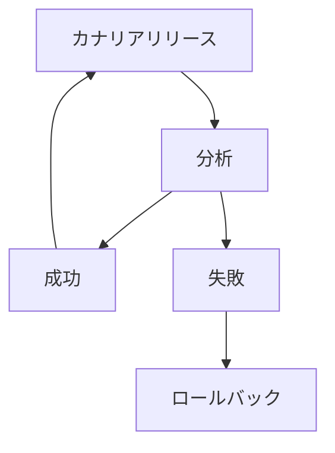

# chapter05b_argo-rollouts
## 概要説明
### プログレッシブデリバリーについて
プログレッシブデリバリー（Progressive Delivery）はアプリケーションの新機能や変更をユーザーに段階的に提供し、リスクを最小限に抑えながら品質を確保する方法です。

実現するために、一部のユーザに対してアプリケーションを提供するトラフィック制御（カナリアリリース）、提供したアプリケーションの新機能に対する分析、分析をもとに自動化されたロールバックの三つの機能が必要になります


  
### Argo Rolloutsについて

Argo Rolloutsは、Kubernetesコントローラおよび一連のカスタムリソース定義（CRD）で、KubernetesにBlue/Green Deployment、カナリアリリース、分析、およびプログレッシブデリバリーの機能が追加されます。


- Argo Rollouts controller
  - クラスター内のイベントを監視し、Rolloutタイプのリソースが変更されるたびに処理を行うカスタムコントローラー
  - Deploymentに代わり、Rollout resouce　に指定された状態にクラスターを持っていく処理を行っています。
- Rollout resource
  - ネイティブのKubernetes Deploymentリソースとほぼ互換性があるカスタムKubernetesリソース
  - KubernetesにBlue/Green Deployment、カナリアリリースなど高度なデプロイ方法を追加し、サポートします。
- AnalysisTemplate
  -　どのメトリクスをクエリするかを記載するテンプレート的なカスタムリソース
  - Rolloutまたはクラスター全体で定義でき、複数のRolloutで共有するためにClusterAnalysisTemplateとしても使用が可能です。 
- AnalysisRun
  - 　AnalysisTemplateを元に実際に動いたjob的なカスタムリソース
 

Argo CDとの連携が可能で、簡単に既存のGit Opsにプログレッシブデリバリーができる

## Analysis Metrics
### JOB
Analysis実行時にjobをデプロイし、jobの実行結果によってPromteするかどうかを判断する
### WEB
Analysis実行時にリクエストを送信し、レスポンスの内容にてよってPromteするかどうかを判断する
* Json形式のレスポンスの場合Jsonの中身を見て判断することが可能
* Json形式以外のレスポンスの場合はstatus codeが200であるかどうかの判断になる
### Prometheus
Analysis実行時にPrometheusにPromQLを送信し、その結果によってPromteするかどうかを判断する
### 他のMetrics
* Datadog
* NewRelic
* Wavefront
* Kayenta
* CloudWatch
* Graphite
* InfluxDB
* Apache SkyWalking
* 独自Plugin

### 事前に準備が必要なもの
#### nginx-ingress 
```
helm upgrade ingress-nginx ingress-nginx/ingress-nginx \
--namespace ingress-nginx \
--set controller.metrics.enabled=true \
--set controller.metrics.serviceMonitor.enabled=true \
--set controller.metrics.serviceMonitor.additionalLabels.release="prometheus"
```


#### prometheus
```
helm upgrade kube-prometheus-stack prometheus-community/kube-prometheus-stack \
--namespace prometheus  \
--set prometheus.prometheusSpec.podMonitorSelectorNilUsesHelmValues=false \
--set prometheus.prometheusSpec.serviceMonitorSelectorNilUsesHelmValues=false
