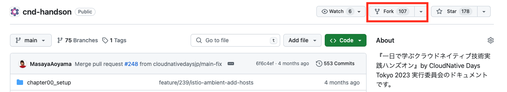
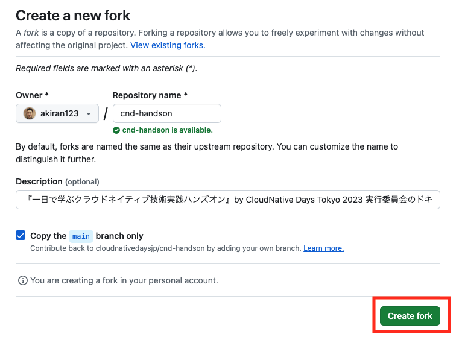
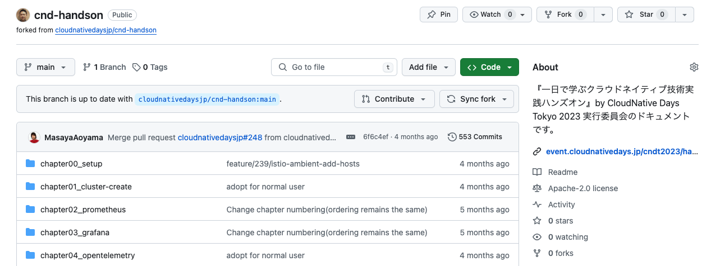

# Argo CD

この章では、Kubernetes 上で GitOps を行う CD ツール、Argo CD を使います。

- Argo CD を入れて、Web UI を開きます。
- Application を YAML で書き、`kubectl apply` で作ります。
- Git を変えると、クラスタに反映されることを確かめます。
- クラスタを手で変えると、Git の状態に戻ることを確かめます。
- Kustomize と Helm のマニフェストをデプロイします。

Argo CD の Config Management Plugin（CMP）を試したい方は、この章のあとに [Argo CD with CMP](./README_cmp.md) に進んでください。

## GitOps と Argo CD

GitOps は、Git にあるマニフェストを正として、クラスタをその状態に保つ運用です。

- デプロイは、Git への push で行います。
- クラスタの状態がずれたら、Git の状態に戻します。
- 変更の履歴とレビューは、Git に残ります。

Argo CD は、Git のマニフェストとクラスタの状態を比べ続けます。差分があれば、クラスタを Git に合わせます。

### Argo CD のアーキテクチャ


Argo CD は、次のコンポーネントで動きます。

| コンポーネント | 役割 |
|---|---|
| API Server（`argocd-server`） | Web UI と API を提供する |
| Repository Server（`argocd-repo-server`） | Git からマニフェストを取り出す。Helm や Kustomize の描画もここで行う |
| Application Controller（`argocd-application-controller`） | Git とクラスタを比べ、差分をクラスタに反映する |
| ApplicationSet Controller（`argocd-applicationset-controller`） | テンプレートから Application をまとめて作る |
| Notifications Controller（`argocd-notifications-controller`） | 同期の結果を Slack などに通知する |
| Dex（`argocd-dex-server`） | GitHub などの外部 ID でログインできるようにする |
| Redis（`argocd-redis`） | 描画したマニフェストなどをキャッシュする |

### Application

Argo CD では、デプロイの単位を Application というカスタムリソースで書きます。

```yaml
apiVersion: argoproj.io/v1alpha1
kind: Application
metadata:
  name: argocd-demo
  namespace: argo-cd
spec:
  source:        # どの Git の、どのディレクトリを使うか
    repoURL: https://github.com/<GITHUB_USER>/cnd-handson
    targetRevision: main
    path: chapter_argocd/app/default
  destination:   # どのクラスタの、どの namespace に入れるか
    server: https://kubernetes.default.svc
    namespace: argocd-demo
```

Web UI や `argocd` コマンドで作った Application も、中身はこのリソースです。この章では YAML で書き、`kubectl apply` で作ります。

### 同期の状態

Git とクラスタが一致しているかを表します。

| 状態 | 意味 |
|---|---|
| Synced | クラスタが Git と一致している |
| OutOfSync | クラスタが Git と一致していない |
| Unknown | 比べられなかった。Git に繋がらないときなどに出る |

### ヘルスの状態

デプロイしたリソースが正しく動いているかを表します。

| 状態 | 意味 |
|---|---|
| Healthy | 正しく動いている |
| Progressing | 動き出す途中。時間が経つと Healthy か Degraded になる |
| Degraded | 失敗している。Pod が起動しないときなどに出る |
| Suspended | 止まっている。CronJob を止めたときなどに出る |
| Missing | Git にはあるが、クラスタにない |
| Unknown | 判定できない |

### Refresh、Hard Refresh、Sync

| 操作 | 内容 |
|---|---|
| Refresh | Git の最新のマニフェストとクラスタを比べ直す |
| Hard Refresh | マニフェストのキャッシュを捨ててから、Refresh する |
| Sync | クラスタを Git の状態に合わせる |

- Refresh は、2〜3 分ごとに自動で行われます。既定の間隔は 120 秒で、そこに最大 60 秒の揺らぎが足されます。
- Helm や Kustomize で描画したマニフェストは、キャッシュされます。キャッシュは 24 時間で切れます。
- 待てないときは、Web UI の REFRESH ボタンで Refresh できます。

## 準備

### リポジトリを fork する

Argo CD は Git の変更を見てデプロイします。この章では GitHub 上でファイルを変えるので、このリポジトリを自分のアカウントに fork します。

[このハンズオンのリポジトリ](https://github.com/cloudnativedaysjp/cnd-handson)を開き、Fork をクリックします。



Create fork をクリックします。



自分のアカウントに fork されたことを確かめます。



fork は clone しません。Git の変更は GitHub の画面で行います。

自分のアカウント名を変数に入れ、VM にあるこのリポジトリの `chapter_argocd` に移ります。

```bash
export GITHUB_USER=<自分の GitHub アカウント名>
cd ~/cnd-handson/chapter_argocd
```

以降の手順は、`chapter_argocd` で実行します。

### Argo CDのインストール

helmfile で Argo CD を入れます。

```bash
helmfile sync -f helm/helmfile.yaml
```

Pod がすべて Running になるまで待ちます。

```bash
kubectl -n argo-cd get pods
```

```
# 実行結果
NAME                                                       READY   STATUS      RESTARTS   AGE
argo-cd-argocd-application-controller-0                    1/1     Running     0          60s
argo-cd-argocd-applicationset-controller-d68c4c54d-zct8m   1/1     Running     0          60s
argo-cd-argocd-dex-server-f68dccffb-smmlp                  1/1     Running     0          60s
argo-cd-argocd-notifications-controller-545b4749f4-7l5gm   1/1     Running     0          60s
argo-cd-argocd-redis-86c47569c-jwzwf                       1/1     Running     0          60s
argo-cd-argocd-redis-secret-init-pksjj                     0/1     Completed   0          75s
argo-cd-argocd-repo-server-5489fdcf4b-frk86                2/2     Running     0          60s
argo-cd-argocd-server-7c99cfccdb-dghsj                     1/1     Running     0          60s
```

repo-server の Pod には、コンテナが 2 つあります。2 つ目は CMP 用のコンテナで、[Argo CD with CMP](./README_cmp.md) で使います。

### Web UI を開く

HTTPRoute を作り、Web UI を開けるようにします。HTTPRoute は、[chapter_cluster-create](../chapter_cluster-create/) で作った `handson-gateway` に紐付けます。

```bash
kubectl apply -f httproute/httproute.yaml
```

admin のパスワードを確かめます。

```bash
kubectl -n argo-cd get secret argocd-initial-admin-secret -o jsonpath="{.data.password}" | base64 -d ; echo
```

http://argocd.example.com を開き、ログインします。

- ユーザー名: `admin`
- パスワード: 上で確かめた値


この章では、Web UI は状態を見るために使います。Application は YAML で作ります。

> [!NOTE]
> 公開リポジトリは、Argo CD に登録しなくても使えます。プライベートリポジトリを使うときは、Settings > Repositories で認証情報を登録します。

## Application の中身を読む

Application を作る前に、この章で使う YAML を読みます。[applications/demo.yaml](applications/demo.yaml) は、デモアプリを入れる Application です。

```yaml
apiVersion: argoproj.io/v1alpha1
kind: Application
metadata:
  name: argocd-demo
  namespace: argo-cd
  finalizers:
  - resources-finalizer.argocd.argoproj.io/foreground
spec:
  project: default
  source:
    repoURL: https://github.com/<GITHUB_USER>/cnd-handson
    targetRevision: main
    path: chapter_argocd/app/default
  destination:
    server: https://kubernetes.default.svc
    namespace: argocd-demo
  syncPolicy:
    syncOptions:
    - CreateNamespace=true
```

| フィールド | 意味 |
|---|---|
| `metadata.namespace` | Application 自体を置く namespace。Argo CD を入れた argo-cd にする |
| `metadata.finalizers` | Application を消したときに、デプロイしたリソースも消す |
| `spec.project` | Application をまとめる単位。この章では既定の default を使う |
| `spec.source.repoURL` | マニフェストを取り出す Git リポジトリ |
| `spec.source.targetRevision` | 使うブランチ。タグやコミットも書ける |
| `spec.source.path` | リポジトリの中の、マニフェストがあるディレクトリ |
| `spec.destination.server` | デプロイ先のクラスタ。`https://kubernetes.default.svc` は Argo CD 自身が動くクラスタ |
| `spec.destination.namespace` | デプロイ先の namespace |
| `spec.syncPolicy.syncOptions` | 同期の細かい設定。`CreateNamespace=true` で、namespace がなければ作る |

`path` のディレクトリに何があるかで、Argo CD はマニフェストの作り方を変えます。

- YAML が並んでいるだけなら、そのまま使う
- `kustomization.yaml` があれば、Kustomize で描画する
- `Chart.yaml` があれば、Helm で描画する

`syncPolicy` に `automated` を書くと、Git が変わったときに自動で同期します。demo.yaml には書いていないので、同期は手で行います。

## バックエンドを入れる

デモアプリは、タスク管理のアプリ [cnd-handson-app](https://github.com/cloudnativedaysjp/cnd-handson-app) です。画面には 2 つの版があります。

- legacy: 表形式の画面
- modern: カンバンの画面

画面を出すには、ログインやタスクを扱うバックエンドが要ります。バックエンドは handson namespace に 1 つだけ入れます。この章のデモアプリは、どれもこのバックエンドにつなぎます。

Argo CD は Helm chart を `helm template` で描画します。chart に Secret を作らせると、同期のたびにパスワードが変わります。そのため、Secret を先に作ります。

```bash
kubectl create namespace handson
kubectl -n handson create secret generic handson-secrets \
  --from-literal=DB_PASSWORD="$(openssl rand -hex 16)" \
  --from-literal=IDP_SIGNING_KEY="$(openssl genpkey -algorithm RSA -pkeyopt rsa_keygen_bits:2048 | base64 | tr -d '\n')" \
  --from-literal=IDP_DEMO_PASSWORD=demo-password
```

バックエンドの Application は [applications/backend.yaml](applications/backend.yaml) です。demo.yaml との違いは 3 つです。

```yaml
spec:
  source:
    repoURL: https://github.com/cloudnativedaysjp/cnd-handson-app
    targetRevision: main
    path: deploy/helm/handson
    helm:
      values: |
        secret:
          create: false
        entry:
          variants: null
  syncPolicy:
    automated: {}
```

- `source` は、cnd-handson-app リポジトリにある Helm chart です。`path` に `Chart.yaml` があるので、Helm で描画します。
- `helm.values` で、chart の values を上書きします。Secret は先に作ったものを使います。画面（`entry`）は各デモアプリが入れるので、ここでは入れません。
- `automated` を書いているので、作るとすぐに同期します。

Application を作ります。

```bash
kubectl apply -f applications/backend.yaml
```

handson-backend が Synced と Healthy になるまで待ちます。

```bash
kubectl -n argo-cd get applications
```

```
# 実行結果
NAME              SYNC STATUS   HEALTH STATUS
handson-backend   Synced        Healthy
```

## Application を作る

[Application の中身を読む](#application-の中身を読む) で見た demo.yaml を作ります。[app/default](app/default) のマニフェストを、argocd-demo namespace に入れます。

`repoURL` の `<GITHUB_USER>` を自分のアカウント名に置き換えて、作ります。

```bash
sed "s/<GITHUB_USER>/${GITHUB_USER}/" applications/demo.yaml | kubectl apply -f -
```

`syncPolicy` に `automated` を書いていないので、自動では同期しません。Application は OutOfSync のまま止まります。

```bash
kubectl -n argo-cd get applications argocd-demo
```

```
# 実行結果
NAME          SYNC STATUS   HEALTH STATUS
argocd-demo   OutOfSync     Missing
```

Web UI で argocd-demo を開くと、Git にあるリソースが、まだクラスタにないことが分かります。


画面上部の SYNC をクリックし、SYNCHRONIZE をクリックします。リソースが作られ、Synced と Healthy になります。


http://app.argocd.example.com を開きます。ログイン画面が出たら、次のユーザーでログインします。

- メールアドレス: `demo@example.com`
- パスワード: `demo-password`

表形式の画面（legacy）が表示されます。


## 自動で同期する

Git を変えたら、自動でクラスタに反映されるようにします。

applications/demo.yaml の `syncPolicy` に `automated` を足します。

```yaml
  syncPolicy:
    automated:
      selfHeal: true
    syncOptions:
    - CreateNamespace=true
```

- `automated` を書くと、Git が変わったときに自動で同期します。
- `selfHeal: true` を書くと、クラスタが手で変えられたときも、Git の状態に戻します。

Application を更新します。

```bash
sed "s/<GITHUB_USER>/${GITHUB_USER}/" applications/demo.yaml | kubectl apply -f -
```

### Git を変えて反映する

fork の [app/default/deployment.yaml](app/default/deployment.yaml) を GitHub の画面で変えます。

ブラウザで次の URL を開きます。`<GITHUB_USER>` は自分のアカウント名に置き換えます。

```
https://github.com/<GITHUB_USER>/cnd-handson/blob/main/chapter_argocd/app/default/deployment.yaml
```

右上の鉛筆アイコンをクリックし、編集画面を開きます。


image のタグを、`legacy` から `modern` に変えます。

```yaml
      - image: ghcr.io/cloudnativedaysjp/cnd-handson-app/handson:modern
```

Commit changes をクリックします。Commit directly to the `main` branch を選んだまま、もう一度 Commit changes をクリックします。


Argo CD が変更に気づくまで、最大 3 分かかります。待てないときは、Web UI で argocd-demo を開き、REFRESH をクリックします。

Argo CD が自動で同期し、新しい Pod に入れ替わります。


http://app.argocd.example.com を開き直すと、カンバンの画面（modern）に変わっています。ログイン画面が出たときは、同じユーザーでログインします。


### 手で変えた状態を戻す

kubectl で Deployment のレプリカ数を 3 に変えます。

```bash
kubectl -n argocd-demo scale deployment handson --replicas=3
```

レプリカ数を見ます。

```bash
kubectl -n argocd-demo get deployment handson -w
```

Git のレプリカ数は 1 です。Argo CD が差分に気づき、1 に戻します。確かめたら Ctrl+C で止めます。

```
# 実行結果
NAME      READY   UP-TO-DATE   AVAILABLE   AGE
handson   1/1     1            1           10m
handson   1/3     1            1           10m
handson   1/1     1            1           10m
```

このように、クラスタの状態は Git に保たれます。変えたいときは、Git を変えます。

> [!NOTE]
> Git からマニフェストを消しても、クラスタのリソースは既定では消えません。消すには、`automated` に `prune: true` を足します。

## Kustomize と ApplicationSet

Kustomize で、開発環境（dev）と本番環境（prd）のマニフェストを作り分けます。

| 環境 | ディレクトリ | 画面 | レプリカ数 |
|---|---|---|---|
| dev | [app/Kustomize/overlays/dev](app/Kustomize/overlays/dev) | legacy | 1 |
| prd | [app/Kustomize/overlays/prd](app/Kustomize/overlays/prd) | modern | 2 |

どちらも [app/Kustomize/base](app/Kustomize/base) を元にしています。各 overlay では、違うところだけを上書きします。

2 つの環境の Application は、ほとんど同じです。違うのは、環境の名前だけです。このようなときは、ApplicationSet を使います。ApplicationSet は、テンプレートから Application をまとめて作ります。

[applications/kustomize.yaml](applications/kustomize.yaml) では、`generators` に環境の一覧を書きます。テンプレートの `{{ .env }}` が、一覧の値に置き換わります。

```yaml
  generators:
  - list:
      elements:
      - env: dev
      - env: prd
  template:
    metadata:
      name: argocd-kustomize-{{ .env }}
```

ApplicationSet を作ります。

```bash
sed "s/<GITHUB_USER>/${GITHUB_USER}/" applications/kustomize.yaml | kubectl apply -f -
```

Application が 2 つ作られます。

```bash
kubectl -n argo-cd get applications
```

```
# 実行結果
NAME                   SYNC STATUS   HEALTH STATUS
argocd-demo            Synced        Healthy
argocd-kustomize-dev   Synced        Healthy
argocd-kustomize-prd   Synced        Healthy
handson-backend        Synced        Healthy
```


各環境を開きます。dev は表形式の画面（legacy）、prd はカンバンの画面（modern）です。

- dev: http://dev.kustomize.argocd.example.com
- prd: http://prd.kustomize.argocd.example.com

prd の Pod は 2 つです。

```bash
kubectl -n argocd-kustomize-prd get pods
```

## Helm

[app/Helm/handson](app/Helm/handson) は、デモアプリの Helm chart です。[values.yaml](app/Helm/handson/values.yaml) では、画面を legacy にしています。

```yaml
image:
  repository: ghcr.io/cloudnativedaysjp/cnd-handson-app/handson
  tag: legacy
```

Application では、values を上書きできます。[applications/helm.yaml](applications/helm.yaml) では、画面を modern にしています。

```yaml
    helm:
      valuesObject:
        image:
          tag: modern
```

Application を作ります。

```bash
sed "s/<GITHUB_USER>/${GITHUB_USER}/" applications/helm.yaml | kubectl apply -f -
```


http://helm.argocd.example.com を開くと、カンバンの画面（modern）が表示されます。

## 片付け

> [!WARNING]
> chapter_cicd、chapter_argocd-image-updater、chapter_argo-rollouts に進む場合は、Argo CD を消さないでください。

Application と ApplicationSet を消します。finalizer を付けているので、デプロイしたリソースも一緒に消えます。

```bash
kubectl -n argo-cd delete applicationset argocd-kustomize
kubectl -n argo-cd delete application argocd-demo argocd-helm handson-backend
```

namespace を消します。

```bash
kubectl delete namespace argocd-demo argocd-kustomize-dev argocd-kustomize-prd argocd-helm handson
```

最後に、Argo CD を消します。

```bash
kubectl delete namespace argo-cd
```
