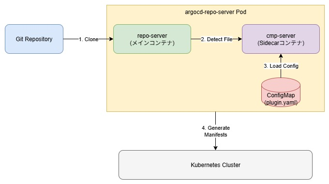
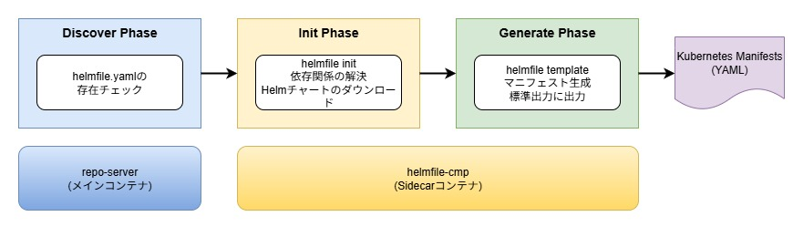
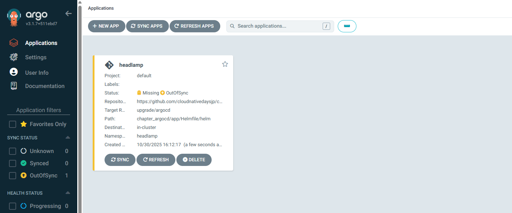
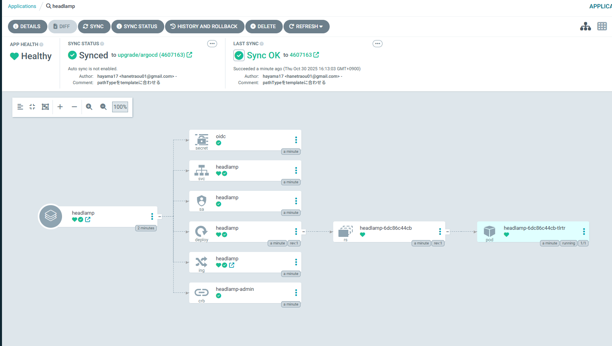

# ArgoCD Config Management Plugins (CMP)
## 目次
- [概要](#概要)
- [CMPのコンポーネント](#cmpのコンポーネント)
- [セットアップ](#セットアップ)
  - [Patch編](#cmpの適用方法patch編)
  - [Helmfile編](#cmpの適用方法helmfile編)
- [アプリケーションのデプロイ](#cmpを使用したアプリケーションのデプロイ)
- [推奨設定](#推奨されるプラグイン設定)
- [まとめ](#まとめ)

## 概要

ArgoCD Config Management Plugins (CMP)は、ArgoCDでネイティブにサポートされていないツール（HelmfileやTerraformなど）を使用してKubernetesマニフェストを生成・管理するための拡張機能です。その目的は、ArgoCDの標準機能（Helm、Kustomize、Jsonnet）を超えて、さまざまなツールチェーンを統合し、GitOpsワークフローを柔軟に構築することです。CMPを利用することで、開発者は既存のツールやワークフローを維持しながら、ArgoCDの宣言的なデプロイメント機能を活用できます。

CMPの代表的なコンポーネントは以下のとおりです。


* ConfigMapによるプラグイン定義
  * CMPの動作を定義する設定ファイル
  * discover、init、generateの3つのフェーズに対応
* argocd-repo-server Sidecar
  * 実際にプラグインを実行するコンテナ
  * 必要なツール（Helmfile、Terraformなど）がインストールされたイメージを使用

ArgoCDでCMPを利用する際は、ApplicationリソースでCMPのプラグイン名を指定することで、カスタムツールを使ったマニフェスト生成が可能になります。

このハンズオンでは、HelmfileをCMPとして統合し、ArgoCDでHelmfileを使ったデプロイメントを実現する方法について実際に体験します。

### CMPのコンポーネント

CMPは、内部的には3つのフェーズで構成されています。

* Discover
  * プラグインを適用する条件を判定するフェーズ
  * 特定のファイル（helmfile.yaml、terraform.tfなど）の存在をチェック
* Init
  * マニフェスト生成前の準備処理を行うフェーズ
  * 依存関係の解決やツールの初期化などを実行
* Generate
  * 実際にKubernetesマニフェストを生成するフェーズ
  * 各ツールのコマンドを実行してマニフェストを標準出力に出力

### CMPの適用方法

CMPを適用する方法は主に2通りあります。

* **Patchを使用した適用**
  * ConfigMapとしてプラグイン定義を作成
  * kubectl patchコマンドでargocd-repo-serverにSidecarを追加
  * 既存のArgoCD環境に後から追加する場合に適している
* **Helmfile values.yamlでの適用**
  * ArgoCD Helmチャートのvaluesファイルにプラグイン設定を記述
  * Helmfileでまとめてデプロイ
  * 新規環境のセットアップや構成管理に適している

CMPで利用可能なツールは、各コミュニティやベンダーが提供するコンテナイメージ次第で無限に拡張できます。

各種コンポーネントの詳細は、ArgoCDの公式ドキュメントで確認できます。

* [Config Management Plugins](https://argo-cd.readthedocs.io/en/stable/operator-manual/config-management-plugins/)
* [argocd-repo-server](https://argo-cd.readthedocs.io/en/stable/operator-manual/architecture/#repository-server)

## セットアップ

### ArgoCD Helmfileプラグインの準備

今回は、HelmfileをCMPとして利用できるようにします。
Helmfileは複数のHelmチャートを一括管理できるツールで、環境ごとの設定管理を効率化できます。

**方法1: Patchを使用（既存環境への追加に推奨）**
- 既にArgoCDが稼働している環境に適している

  [→ Patch編へ進む](#cmpの適用方法patch編)

**方法2: Helmfileを使用（新規環境に推奨）**
- ArgoCDと一緒に初期構築する場合に適している
  
  [→ Helmfile編へ進む](#cmpの適用方法helmfile編)

## CMPの適用方法～Patch編～

Patchを使用してCMPを適用する方法を説明します。
この方法は、既存のArgoCD環境に後からCMPを追加する場合に便利です。

### プラグイン用ConfigMapの作成

まず、CMPの動作を定義するConfigMapを作成します。
このConfigMapには、プラグインの検出条件と実行コマンドを記述します。

```yaml
apiVersion: v1
kind: ConfigMap
metadata:
  name: helmfile-plugin-config
  namespace: argo-cd
data:
  plugin.yaml: |
    apiVersion: argoproj.io/v1alpha1
    kind: ConfigManagementPlugin
    metadata:
      name: helmfile
    spec:
      version: v1.0
      discover:
        fileName: "helmfile.yaml"
      init:
        command: [sh, -c]
        args:
          - |
            echo "Initializing..."
            helmfile deps
      generate:
        command: [sh, -c]
        args:
          - |
            helmfile template --include-crds --skip-deps || exit 1
```

このConfigMapは以下の情報を定義しています。

* **discover**: `helmfile.yaml`ファイルが存在する場合にこのプラグインを使用
* **init**: Helmfileの依存関係を解決する前処理
* **generate**: Helmfileからマニフェストを生成するコマンド

実際にConfigMapをデプロイします。

```sh
kubectl apply -f cmp/patch/helmfile-cmp.yaml
```
```sh
# 実行結果
configmap/helmfile-plugin-config created
```

ConfigMapが作成されたことを確認します。

```sh
kubectl -n argo-cd get configmap helmfile-plugin-config 
```
```sh
# 実行結果
NAME                     DATA   AGE
helmfile-plugin-config   1      57s
```

### argocd-repo-serverへのSidecar追加

次に、argocd-repo-serverにCMPを実行するためのSidecarコンテナを追加します。
このSidecarコンテナには、Helmfileがインストールされたイメージを使用します。

```yaml
apiVersion: apps/v1
kind: Deployment
metadata:
  name: argo-cd-argocd-repo-server
  namespace: argo-cd
spec:
  template:
    spec:
      containers:
      - name: helmfile-cmp
        command: [/var/run/argocd/argocd-cmp-server]
        image: ghcr.io/helmfile/helmfile:latest
        env:
        - name: HELM_CACHE_HOME
          value: /tmp/helm/cache
        - name: HELM_CONFIG_HOME
          value: /tmp/helm/config
        - name: HELM_DATA_HOME
          value: /tmp/helm/data
        securityContext:
          runAsNonRoot: true
          runAsUser: 999
        volumeMounts:
        - mountPath: /var/run/argocd
          name: var-files
        - mountPath: /home/argocd/cmp-server/plugins
          name: plugins
        - mountPath: /home/argocd/cmp-server/config/plugin.yaml 
          subPath: plugin.yaml
          name: helmfile-plugin-config
        - mountPath: /tmp
          name: cmp-tmp
      volumes:
      - configMap:
          name: helmfile-plugin-config
        name: helmfile-plugin-config
      - emptyDir: {}
        name: cmp-tmp
```
> ⚠️ **重要な注意事項**
> 
> サイドカーコンテナはNon-Rootユーザーで実行されるため、書き込み権限がありません。
> HELM_*_HOME環境変数で、Helmの作業ディレクトリを書き込み可能な/tmpに変更してください

kubectl patchコマンドを使用してargocd-repo-serverにSidecarを追加します。

```sh
kubectl patch deployment argo-cd-argocd-repo-server -n argo-cd --patch-file cmp/patch/argocd-repo-server-patch.yaml 
```

```sh
# 実行結果
deployment.apps/argo-cd-argocd-repo-server patched
```

Podが再起動され、Sidecarコンテナが追加されたことを確認します。

```sh
kubectl get pods -l app.kubernetes.io/name=argocd-repo-server -n argo-cd
```
```sh
# 実行結果
NAME                                  READY   STATUS    RESTARTS   AGE
argocd-repo-server-7f5c8d9b8c-abc12   2/2     Running   0          30s
```

Podの詳細を確認すると、`helmfile-cmp`コンテナが追加されていることがわかります。

```sh
kubectl -n argo-cd describe pod -l app.kubernetes.io/name=argocd-repo-server
```

## CMPの適用方法～Helmfile編～

Helmfileのvalues.yamlにCMPの設定を追加してデプロイする方法を説明します。
この方法は、ArgoCD自体をHelmfileで管理している場合や、新規環境のセットアップに適しています。

### values.yamlにプラグイン設定を追加

ArgoCD HelmチャートのvaluesファイルにCMPの設定を追加します。
```yaml
# cmp/helm/values.yaml
configs:
  cmp:
    create: true
    plugins:
      helmfile-plugin:
        discover:
          fileName: "helmfile.yaml"
        init:
          command: [sh, -c]
          args: 
            - |
              echo "Initializing..."
              helmfile deps
        generate:
          command: [sh, -c]
          args:
            - |
              helmfile template --include-crds --skip-deps || exit 1

repoServer: 
  extraContainers: 
    - name: helmfile-cmp
      command: [/var/run/argocd/argocd-cmp-server]
      image: ghcr.io/helmfile/helmfile:latest
      env:
        - name: HELM_CACHE_HOME
          value: /tmp/helm/cache
        - name: HELM_CONFIG_HOME
          value: /tmp/helm/config
        - name: HELM_DATA_HOME
          value: /tmp/helm/data
      securityContext:
        runAsNonRoot: true
        runAsUser: 999
      volumeMounts:
        - mountPath: /var/run/argocd
          name: var-files
        - mountPath: /home/argocd/cmp-server/plugins
          name: plugins
        - mountPath: /home/argocd/cmp-server/config/plugin.yaml
          subPath: helmfile-plugin.yaml
          name: argocd-cmp-cm
        - mountPath: /tmp
          name: cmp-tmp

  volumes:
    - name: argocd-cmp-cm
      configMap:
        name: argocd-cmp-cm
    - name: cmp-tmp
      emptyDir: {}
```

この設定では、`repoServer.extraContainers`にHelmfile CMPのSidecarコンテナを定義しています。

values.yamlを配置します。

```sh
cp cmp/helm/values.yaml helm/values.yaml
```

Helmfileを使用してArgoCDをデプロイします。

```sh
helmfile sync -f helm/helmfile.yaml
```

デプロイが完了したら、argocd-repo-serverのPodを確認します。

```sh
kubectl -n argo-cd get pods -l app.kubernetes.io/name=argocd-repo-server
```
```sh
# 実行結果
NAME                                          READY   STATUS    RESTARTS   AGE
argo-cd-argocd-repo-server-86985f8c4b-6x7bp   2/2     Running   0          15m
```

## CMPを使用したアプリケーションのデプロイ

CMPが正しく設定されたら、実際にHelmfileを使用するApplicationリソースを作成してみましょう。
今回は、headlampをデプロイする例を試します。
**方法1: Web UIを使用（視覚的な操作を好む方向け）**
- ArgoCDのWeb画面から直感的に操作できる

  [→ Web UIでの作成へ進む](#web-uiでのアプリケーション作成)

**方法2: CLIを使用（コマンドライン操作に慣れた方向け）**
- スクリプトによる自動化が可能
  
  [→ CLIでの作成へ進む](#cliでのアプリケーション作成)

**方法3: YAMLを使用（GitOps管理・本番環境向け）**
- 設定をコードとして管理できる
  
  [→ YAMLでの作成へ進む](#yamlファイルでのアプリケーション作成)
---
### Web UIでのアプリケーション作成

ArgoCD Web UIからもCMPを使用するアプリケーションを作成できます。

Applicationsの画面において + NEW APPをクリックします。


上の画面上で各項目を次のように設定します。

設定のポイントはsourceのpathの部分でhelmfile.yamlが配置されているディレクトリを指定することです。
```
GENERAL
  Application Name: headlamp
  Project Name: default
  SYNC POLICY: Manual
  SYNC OPTIONS: AUTO CREATE NAMESPACE [v]
SOURCE
  Repository URL: https://github.com/自身のアカウント名/cnd-handson
  Revision: main
  Path: chapter_argocd/app/Helmfile/helm
DESTINATION
  Cluster URL: https://kubernetes.default.svc
  Namespace: headlamp
```


SYNC APPSをクリックしてアプリケーションのデプロイを実行してください。

### CLIでのアプリケーション作成

ArgoCD CLIを使用してアプリケーションを作成することもできます。

設定のポイントpathの部分でhelmfile.yamlが配置されているディレクトリを指定することです。

```sh
argocd app create headlamp \
  --repo https://github.com/ご自身のアカウント/cnd-handson.git \
  --path chapter_argocd/app/Helmfile/helm \
  --dest-server https://kubernetes.default.svc \
  --dest-namespace headlamp \
  --sync-policy automated
```

```sh
# 実行結果
{"level":"warning","msg":"Failed to invoke grpc call. Use flag --grpc-web in grpc calls. To avoid this warning message, use flag --grpc-web.","time":"2025-09-30T11:40:27+09:00"}
application 'headlamp' created
```

### YAMLファイルでのアプリケーション作成

YAMLファイルを使用してアプリケーションを作成する方法です。

設定のポイントはsource.pathの部分でhelmfile.yamlが配置されているディレクトリを指定することです。
```yaml
apiVersion: argoproj.io/v1alpha1
kind: Application
metadata:
  name: headlamp
  namespace: argo-cd
spec:
  destination:
    namespace: headlamp
    server: 'https://kubernetes.default.svc'
  project: default
  source:
    repoURL: https://github.com/ご自身のアカウント/cnd-handson.git
    targetRevision: HEAD
    path: chapter_argocd/app/Helmfile/helm
  syncPolicy:
    syncOptions:
      - CreateNamespace=true

```
適用します。

```sh
kubectl apply -f app/Helmfile/application.yaml
```
```sh
# 実行結果
application.argoproj.io/headlamp created
```

### 結果の確認

Applicationが作成されると、ArgoCDが自動的にGitリポジトリを監視し、helmfileを使用してマニフェストを生成・適用します。

```sh
kubectl -n argo-cd get application headlamp
```
```sh
# 実行結果
NAME       SYNC STATUS   HEALTH STATUS
headlamp   Synced        Healthy
```

ArgoCD Web UIでアプリケーションの詳細を確認できます。
`http://argocd.example.com/applications/headlamp` にアクセスすると、デプロイされたリソースの状態が視覚化されます。


実際にデプロイされたリソースを確認します。

```sh
kubectl -n headlamp get all
```
```sh
# 実行結果
NAME                            READY   STATUS    RESTARTS   AGE
pod/headlamp-6dc86c44cb-khcz7   1/1     Running   0          22m

NAME               TYPE        CLUSTER-IP     EXTERNAL-IP   PORT(S)   AGE
service/headlamp   ClusterIP   10.96.75.235   <none>        80/TCP    22m

NAME                       READY   UP-TO-DATE   AVAILABLE   AGE
deployment.apps/headlamp   1/1     1            1           22m

NAME                                  DESIRED   CURRENT   READY   AGE
replicaset.apps/headlamp-6dc86c44cb   1         1         1       22m
```

Helmfileでデプロイされたheadlampが正常に動作していることが確認できたら成功です！


## 推奨されるプラグイン設定

今回は最低設定でしたが、CMPを本番環境で使用する場合、以下の点に注意してください。

* **セキュリティ**: Sidecarコンテナは`runAsNonRoot: true,runAsUser: 999`で実行する
* **リソース制限**: `resources`フィールドでCPUとメモリの制限を設定する
* **エラーハンドリング**: init、generateコマンドで適切なエラー処理を実装する
* **ログ出力**: デバッグ用のログを標準エラー出力に出力する

セキュリティとパフォーマンスに関するベストプラクティスについては、[ArgoCDの公式ドキュメント](https://argo-cd.readthedocs.io/en/stable/operator-manual/config-management-plugins/#security-considerations)を参照してください。

## まとめ

このハンズオンでは、ArgoCD Config Management Pluginsを使用してHelmfileをArgoCDに統合する方法を学びました。CMPを活用することで、ArgoCDのエコシステムを拡張し、既存のツールチェーンを維持しながらGitOpsワークフローを実現できます。