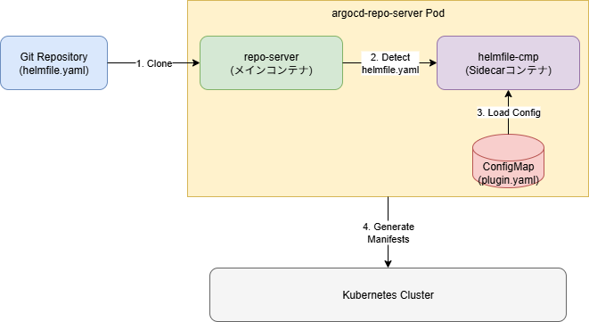
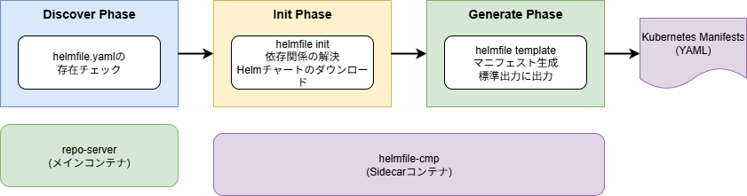

# ArgoCD Config Management Plugins (CMP)

## 概要

ArgoCD Config Management Plugins (CMP)は、ArgoCDでネイティブにサポートされていないツール（HelmfileやTerraformなど）を使用してKubernetesマニフェストを生成・管理するための拡張機能です。その目的は、ArgoCDの標準機能（Helm、Kustomize、Jsonnet）を超えて、さまざまなツールチェーンを統合し、GitOpsワークフローを柔軟に構築することです。CMPを利用することで、開発者は既存のツールやワークフローを維持しながら、ArgoCDの宣言的なデプロイメント機能を活用できます。

CMPの代表的なコンポーネントは以下のとおりです。


* ConfigMapによるプラグイン定義
  * CMPの動作を定義する設定ファイル
  * discover、init、generateの3つのフェーズに対応
* argocd-repo-server Sidecar
  * 実際にプラグインを実行するコンテナ
  * 必要なツール（Helmfile、Terraformなど）がインストールされたイメージを使用

ArgoCDでCMPを利用する際は、ApplicationリソースでCMPのプラグイン名を指定することで、カスタムツールを使ったマニフェスト生成が可能になります。

このハンズオンでは、HelmfileをCMPとして統合し、ArgoCDでHelmfileを使ったデプロイメントを実現する方法について実際に体験します。

### CMPのコンポーネント

CMPは、内部的には3つのフェーズで構成されています。

* Discover
  * プラグインを適用する条件を判定するフェーズ
  * 特定のファイル（helmfile.yaml、terraform.tfなど）の存在をチェック
* Init
  * マニフェスト生成前の準備処理を行うフェーズ
  * 依存関係の解決やツールの初期化などを実行
* Generate
  * 実際にKubernetesマニフェストを生成するフェーズ
  * 各ツールのコマンドを実行してマニフェストを標準出力に出力

### CMPの適用方法

CMPを適用する方法は主に2通りあります。

* **Patchを使用した適用**
  * ConfigMapとしてプラグイン定義を作成
  * kubectl patchコマンドでargocd-repo-serverにSidecarを追加
  * 既存のArgoCD環境に後から追加する場合に適している
* **Helmfile values.yamlでの適用**
  * ArgoCD Helmチャートのvaluesファイルにプラグイン設定を記述
  * Helmfileでまとめてデプロイ
  * 新規環境のセットアップや構成管理に適している

CMPで利用可能なツールは、各コミュニティやベンダーが提供するコンテナイメージ次第で無限に拡張できます。

各種コンポーネントの詳細は、ArgoCDの公式ドキュメントで確認できます。

* [Config Management Plugins](https://argo-cd.readthedocs.io/en/stable/operator-manual/config-management-plugins/)
* [argocd-repo-server](https://argo-cd.readthedocs.io/en/stable/operator-manual/architecture/#repository-server)

## セットアップ

### ArgoCD Helmfileプラグインの準備

今回は、HelmfileをCMPとして利用できるようにします。
Helmfileは複数のHelmチャートを一括管理できるツールで、環境ごとの設定管理を効率化できます。

## CMPの適用方法～Patch編～

Patchを使用してCMPを適用する方法を説明します。
この方法は、既存のArgoCD環境に後からCMPを追加する場合に便利です。

### プラグイン用ConfigMapの作成

まず、CMPの動作を定義するConfigMapを作成します。
このConfigMapには、プラグインの検出条件と実行コマンドを記述します。

```yaml
apiVersion: v1
kind: ConfigMap
metadata:
  name: cmp-plugin
  namespace: argocd
data:
  plugin.yaml: |
    apiVersion: argoproj.io/v1alpha1
    kind: ConfigManagementPlugin
    metadata:
      name: helmfile
    spec:
      version: v1.0
      discover:
        fileName: "helmfile.yaml"
      init:
        command: [sh, -c]
        args:
          - |
            helmfile init
      generate:
        command: [sh, -c]
        args:
          - |
            helmfile template
```

このConfigMapは以下の情報を定義しています。

* **discover**: `helmfile.yaml`ファイルが存在する場合にこのプラグインを使用
* **init**: Helmfileの依存関係を解決する前処理
* **generate**: Helmfileからマニフェストを生成するコマンド

実際にConfigMapをデプロイします。

```sh
kubectl apply -f ./CMP/helmfile-cmp-configmap.yaml
```

ConfigMapが作成されたことを確認します。

```sh
kubectl -n argocd get configmap cmp-plugin
```
```sh
# 実行結果
NAME         DATA   AGE
cmp-plugin   1      10s
```

### argocd-repo-serverへのSidecar追加

次に、argocd-repo-serverにCMPを実行するためのSidecarコンテナを追加します。
このSidecarコンテナには、Helmfileがインストールされたイメージを使用します。

```yaml
apiVersion: apps/v1
kind: Deployment
metadata:
  name: argocd-repo-server
  namespace: argocd
spec:
  template:
    spec:
      volumes:
      - name: cmp-plugin
        configMap:
          name: cmp-plugin
      - name: custom-tools
        emptyDir: {}
      containers:
      - name: helmfile-cmp
        image: ghcr.io/helmfile/helmfile:latest
        command: [/var/run/argocd/argocd-cmp-server]
        securityContext:
          runAsNonRoot: true
          runAsUser: 999
        volumeMounts:
        - mountPath: /var/run/argocd
          name: var-files
        - mountPath: /home/argocd/cmp-server/plugins
          name: plugins
        - mountPath: /home/argocd/cmp-server/config/plugin.yaml
          subPath: plugin.yaml
          name: cmp-plugin
        - mountPath: /tmp
          name: cmp-tmp
```

kubectl patchコマンドを使用してargocd-repo-serverにSidecarを追加します。

```sh
kubectl patch deployment argocd-repo-server -n argocd --patch-file ./CMP/helmfile-cmp-patch.yaml
```

Podが再起動され、Sidecarコンテナが追加されたことを確認します。

```sh
kubectl -n argocd get pods -l app.kubernetes.io/name=argocd-repo-server
```
```sh
# 実行結果
NAME                                  READY   STATUS    RESTARTS   AGE
argocd-repo-server-7f5c8d9b8c-abc12   2/2     Running   0          30s
```

Podの詳細を確認すると、`helmfile-cmp`コンテナが追加されていることがわかります。

```sh
kubectl -n argocd describe pod -l app.kubernetes.io/name=argocd-repo-server
```

## CMPの適用方法～Helmfile編～

Helmfileのvalues.yamlにCMPの設定を追加してデプロイする方法を説明します。
この方法は、ArgoCD自体をHelmfileで管理している場合や、新規環境のセットアップに適しています。

### values.yamlにプラグイン設定を追加

ArgoCD HelmチャートのvaluesファイルにCMPの設定を追加します。

```yaml
# helm/values.yaml
repoServer:
  volumes:
  - name: cmp-plugin
    configMap:
      name: cmp-plugin
  - name: cmp-tmp
    emptyDir: {}
  
  extraContainers:
  - name: helmfile-cmp
    image: ghcr.io/helmfile/helmfile:latest
    command: [/var/run/argocd/argocd-cmp-server]
    securityContext:
      runAsNonRoot: true
      runAsUser: 999
    volumeMounts:
    - mountPath: /var/run/argocd
      name: var-files
    - mountPath: /home/argocd/cmp-server/plugins
      name: plugins
    - mountPath: /home/argocd/cmp-server/config/plugin.yaml
      subPath: plugin.yaml
      name: cmp-plugin
    - mountPath: /tmp
      name: cmp-tmp
```

この設定では、`repoServer.extraContainers`にHelmfile CMPのSidecarコンテナを定義しています。

values.yamlを配置します。

```sh
cp ./CMP/values.yaml ./helm/values.yaml
```

Helmfileを使用してArgoCDをデプロイします。

```sh
helmfile sync -f helm/helmfile.yaml
```

デプロイが完了したら、argocd-repo-serverのPodを確認します。

```sh
kubectl -n argocd get pods -l app.kubernetes.io/name=argocd-repo-server
```
```sh
# 実行結果
NAME                                  READY   STATUS    RESTARTS   AGE
argocd-repo-server-7f5c8d9b8c-xyz34   2/2     Running   0          1m
```

## CMPを使用したアプリケーションのデプロイ

CMPが正しく設定されたら、実際にHelmfileを使用するApplicationリソースを作成してみましょう。
今回は、Prometheusをデプロイする例を試します。

### Applicationリソースの作成

CMPを使用するApplicationリソースでは、`plugin`フィールドにプラグイン名を指定します。

```yaml
apiVersion: argoproj.io/v1alpha1
kind: Application
metadata:
  name: prometheus
  namespace: argocd
spec:
  project: default
  source:
    repoURL: https://github.com/your-org/your-repo
    targetRevision: main
    path: prometheus
    plugin:
      name: helmfile
  destination:
    server: https://kubernetes.default.svc
    namespace: prometheus
  syncPolicy:
    automated:
      prune: true
      selfHeal: true
    syncOptions:
    - CreateNamespace=true
```

この設定のポイントは以下のとおりです。

* `source.plugin.name`: 使用するCMPの名前（`helmfile`）を指定
* `source.path`: helmfile.yamlが配置されているディレクトリを指定
* `destination.namespace`: デプロイ先のNamespaceを指定

### Web UIでのアプリケーション作成

ArgoCD Web UIからもCMPを使用するアプリケーションを作成できます。

1. `http://argocd.example.com/` にアクセス
2. `+ NEW APP`ボタンをクリック
3. Application Nameに`prometheus`を入力
4. Projectは`default`を選択
5. Sync Policyで`AUTOMATIC`を選択
6. Repository URLにGitリポジトリのURLを入力
7. Pathに`prometheus`を入力
8. Plugin欄で`helmfile`を選択
9. Cluster URLで`https://kubernetes.default.svc`を選択
10. Namespaceに`prometheus`を入力
11. `CREATE`ボタンをクリック


### CLIでのアプリケーション作成

ArgoCD CLIを使用してアプリケーションを作成することもできます。

```sh
argocd app create prometheus \
  --repo https://github.com/your-org/your-repo \
  --path prometheus \
  --dest-server https://kubernetes.default.svc \
  --dest-namespace prometheus \
  --sync-policy automated \
  --config-management-plugin helmfile
```

### YAMLファイルでのアプリケーション作成

YAMLファイルを使用してアプリケーションを作成する方法が最も再現性が高く推奨されます。

```sh
kubectl apply -f ./CMP/application.yaml
```

または、ArgoCD CLIを使用することもできます。

```sh
argocd app create -f ./CMP/application.yaml
```

### 結果の確認

Applicationが作成されると、ArgoCDが自動的にGitリポジトリを監視し、helmfileを使用してマニフェストを生成・適用します。

```sh
kubectl -n argocd get application prometheus
```
```sh
# 実行結果
NAME         SYNC STATUS   HEALTH STATUS
prometheus   Synced        Healthy
```

ArgoCD Web UIでアプリケーションの詳細を確認できます。
`http://argocd.example.com/applications/prometheus` にアクセスすると、デプロイされたリソースの状態が視覚化されます。


実際にデプロイされたリソースを確認します。

```sh
kubectl -n prometheus get all
```
```sh
# 実行結果
NAME                                      READY   STATUS    RESTARTS   AGE
pod/prometheus-server-7f5c8d9b8c-abc12    1/1     Running   0          2m

NAME                        TYPE        CLUSTER-IP      EXTERNAL-IP   PORT(S)    AGE
service/prometheus-server   ClusterIP   10.96.123.456   <none>        9090/TCP   2m

NAME                                READY   UP-TO-DATE   AVAILABLE   AGE
deployment.apps/prometheus-server   1/1     1            1           2m
```

HelmfileでデプロイされたPrometheusが正常に動作していることが確認できたら成功です！

## より高度なCMPの活用例

今回は簡単な例でしたが、CMPを使用することでさまざまなツールチェーンをArgoCDに統合できます。

### 複数のツールを組み合わせる例

Helmfileだけでなく、Kustomizeを組み合わせて使用することも可能です。


たとえば、以下のような構成も実現できます。

* Helmfileで複数のHelmチャートをデプロイ
* Kustomizeで環境ごとの差分を管理
* Terraformでクラウドリソースをプロビジョニング

### 推奨されるプラグイン設定

CMPを本番環境で使用する場合、以下の点に注意してください。

* **セキュリティ**: Sidecarコンテナは`runAsNonRoot: true`で実行する
* **リソース制限**: `resources`フィールドでCPUとメモリの制限を設定する
* **エラーハンドリング**: init、generateコマンドで適切なエラー処理を実装する
* **ログ出力**: デバッグ用のログを標準エラー出力に出力する

セキュリティとパフォーマンスに関するベストプラクティスについては、[ArgoCDの公式ドキュメント](https://argo-cd.readthedocs.io/en/stable/operator-manual/config-management-plugins/#security-considerations)を参照してください。

## まとめ

このハンズオンでは、ArgoCD Config Management Pluginsを使用してHelmfileをArgoCDに統合する方法を学びました。CMPを活用することで、ArgoCDのエコシステムを拡張し、既存のツールチェーンを維持しながらGitOpsワークフローを実現できます。

次のステップとして、以下のチャプターに進むことをお勧めします。

* [chapter_cicd](../chapter_cicd) - CI/CDパイプラインとArgoCDの統合
* [chapter_argo-rollouts](../chapter_argo-rollouts) - Progressive Deliveryの実践