# CI/CD


## 概要
この章では、CI/CDについて理解し、現在のCloud Nativeの実環境でなぜ利用されているか、そしてなぜ必要かを説明します。
現在、Continuous Delivery Fundation (https://cd.foundation/) が設立され、CI/CDのベストプラクティスなど業界仕様をさらに推進しています。

***
### CI/CDとは  
---
CI/CDについてですが、 **CI** は、(**Continuous Integration：継続的なインテグレーション**)の略称で、  
開発者がアプリケーション開発から統合(Intergration)まで、必要なプロセスを自動化します。  
開発プロセスとして、ソースコード取得、ビルト、ソースコード取得、アプリケーションの統合、  
パッケージング、単体・結合テストなどを実施します。  

**CD**は、(**Continuous Delivery: 継続的デリバリー**)の略称で、アプリケーションのリリースまでの自動化を担います。    
また、CDとしては、(Continuous Deploy: 継続的デプロイ)として意味合いも持ちます。  
その違いの棲み分けとしては、責任範囲の違いにあります。   
継続デリバリーは、上記の通り、アプリケーションのリリースまで自動化しますが、  
ユーザが機能を利用可能な状態までにはしません。CIで作成されたアプリケーションやマニフェストなどの  
資産を自動的に本番環境に公開可能な上状態まで運びます。

継続デプロイは、デプロイまでの自動化を担い、対象ソフトウェアを本番環境にデプロイした後、  
ユーザへの公開も自動的に行います。そして、ソフトウェアの有効性をテストし、条件を満たせば  
定められたタイミングユーザ公開をし、条件を満たせなければロールバックし、デプロイ前の状態に復旧する責任を持ちます。  


---
### なぜCI/CDが必要になるのか・・・
---
アプリケーションのマイクロサービス化が主流になっている中、CI/CDはマイクロサービス・アジャイル開発が  
登場する以前から存在した概念であり、CI/CD注目度、重要度が上がってきています。    
なぜならソフトウェアデリバリプロセスに対して、人の手が都度介入しなければならないデリバリプロセスには、  
コンテナイメージビルド、バリでション、テスト、デプロイ、ローンチがあり、あらゆる局面での品質やリードタイムに  
ばらつきを産む可能性があり、その点をCI/CDを使うことにより、「徹底的な自動化」をデリバリプロセスに提供することから、   
品質を一定に保つことが可能になります。  

最近では、Cloud Native環境においては、Gitopsを利用したKubernetesへのアプリケーションデプロイが  
増えてきており、例えば、CircleCIのみでもCI/CDの提供が可能ですが、CD部分を専用としてOSSであるArgoCDと  
組み合わせた利用事例が増えています。ArgoCDが多く利用される理由としては、GUIを通して設定が可能であり、  
且つステータスの確認やSync状況などを確認できる優位性があるためです。  


<参照: クラウドネイティブで実現するマイクロサービス開発・運用 実践ガイド>

---

今回は、CICDのCD部分に焦点を当てて説明します。  
ハンズオンのChapter_argocdにある、ArcoCDを使っていきます。  
ArgoCDの詳細については、[こちら](https://github.com/cloudnativedaysjp/cnd-handson/blob/main/chapter_argocd/README_webui.md)を参照ください。  

# 今回利用するリポジトリの準備  
## Gitリポジトリの準備(ローカル環境)

Argo CDを利用するため、GitHubへPush等が必要となり、それをトリガーとして利用します。  
このハンズオンのリポジトリをforkし、準備します。

[cnd-handson-infra](https://github.com/cloudnativedaysjp/cnd-handson-infra)
↑をクリックし、forkを実施していきます。  
実際には、その中の**chapter_cicd/apps/frontend**を利用して、展開していきます。  

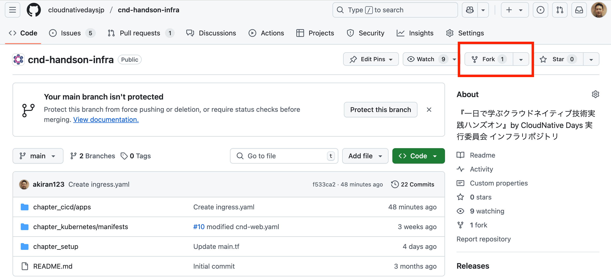

**forkをクリック**をして、Create a new forkで、名前を指定して自分のリポジトリへforkさせます。  

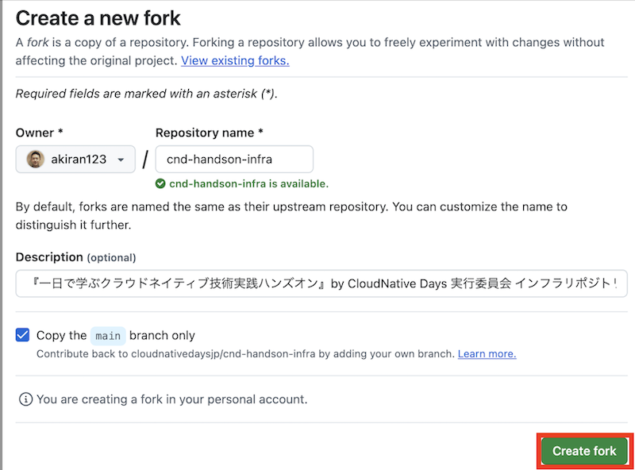

**create fork**をクリックします。  
自分のリポジトリを確認し、cnd-handson-infraがforkされていることを確認します。  

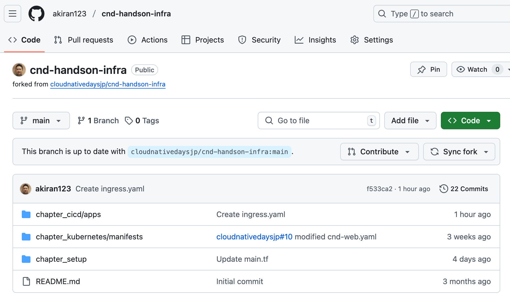

ここからは、Argo CDの詳細については、[ArgoCD](https://github.com/cloudnativedaysjp/cnd-handson/blob/main/chapter_argocd/README_webui.md)が動作している前提で解説していきます。  
動作していない場合には、上記リンクからインストールを実施してください。  
Argo CDのWebGUIへログインできれば問題ないです。  

## Argo CDのWebページへログイン
Argo CDのWebページへログインし、先ほどForkしたリポジトリを同期させます。  

**左のタブのSetting**をクリックし、**Repositories**をクリックします。

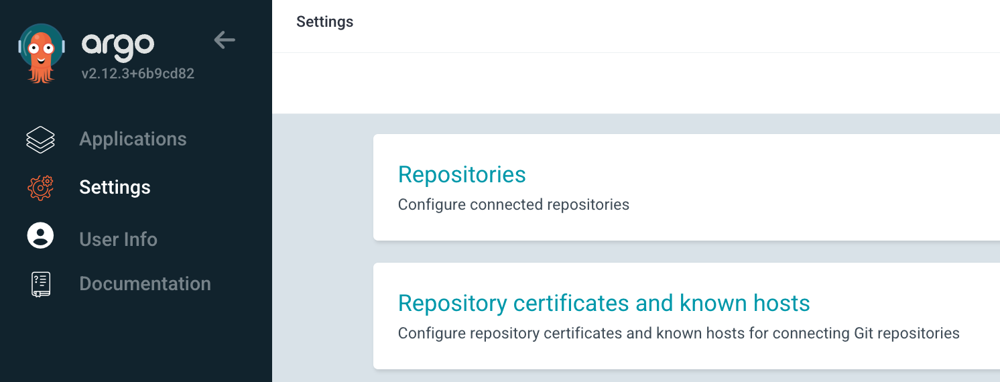

**CONNECT REOP**をクリックします。

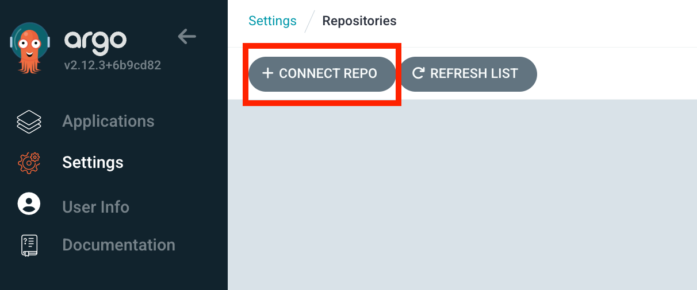

以下ように自分の設定あうように設定していきます。  

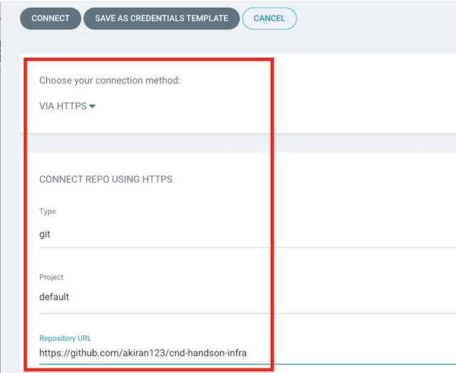

```
GENERAL
Choose your connection method: VIA HTTPS
Type: git
Project: default
Repository URL: https://github.com/自身のアカウント名/cnd-handson-infra
```
最後、** + CONNECT REPO **をクリックします。  
うまく繋がると、CONNECTIOM STATUSが **Successful** になります。  

## デモアプリをArgo CD上にデプロイ（Frontendアプリの実装）
デモアプリのデプロイを行い、Argo CDの一連の操作を行います。

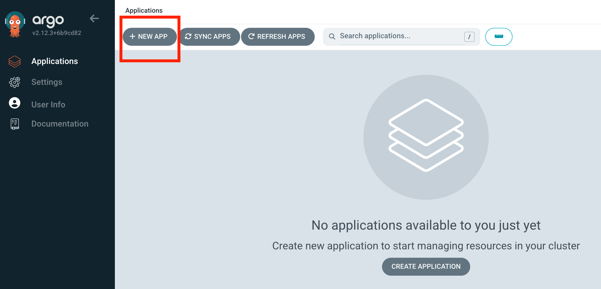

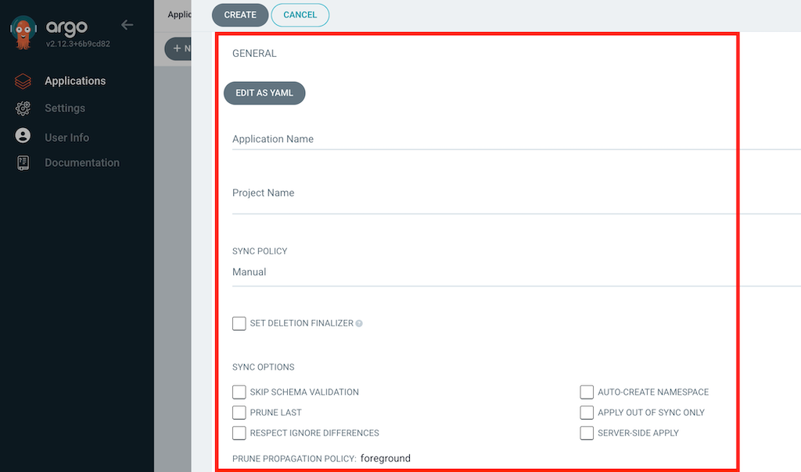

```
GENERAL
  Application Name: cicd-demo
  Project Name: default
  SYNC POLICY: Manual
  SYNC OPTIONS: AUTO CREATE NAMESPACE [v]
  SOURCE
    Repository URL: https://github.com/自身のアカウント名/cnd-handson-infra
    Revision: main
    Path: chapter_cicd/apps/frontend
  DESTINATION
    Cluster URL: https://kubernetes.default.svc
    Namespace: cicd-namespace
```

設定できたら、**CREATE**をクリックして、下記のように表示されていることを確認して下さい。　　

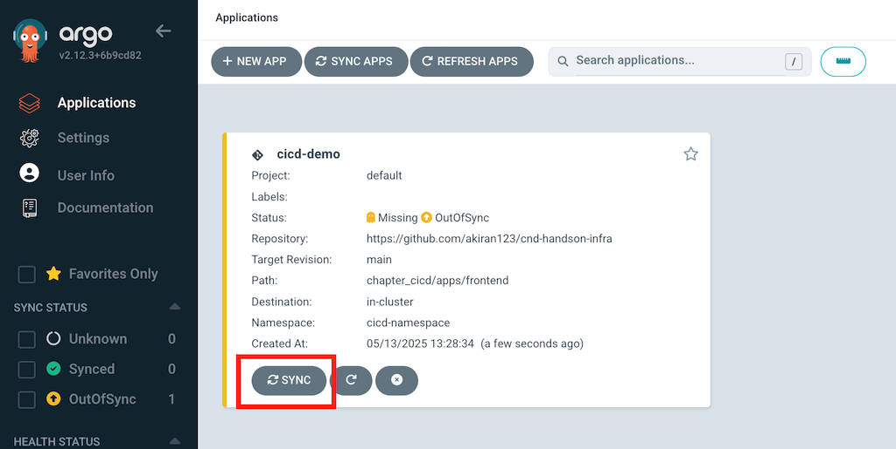

ページ上部にある**SYNC**をクリックして、無事デプロイされると下記のように表示されていることを確認して下さい。  


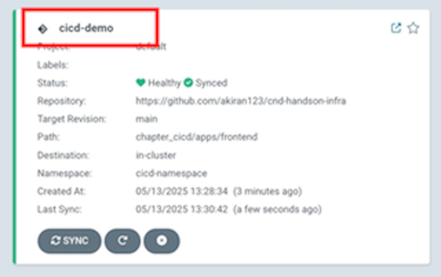

↑の赤枠クリックするとを詳細がみれます。
そして、**SYNCHRONIZE** をクリックしてください。  
ステータスが**HealthyとSynced**になることを確認してください。

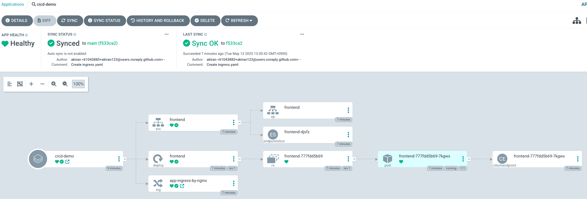

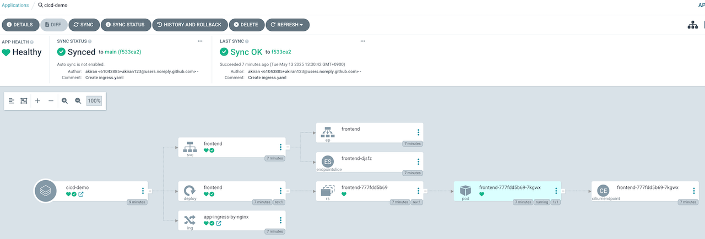

---
## ここまでで　Frontendアプリがきちんと導入された状態にになります。
では、Frontendのページへアクセスしてみます。  
`http://app.cicd.example.com/login`  
すると以下のログイン画面がでてきます。  

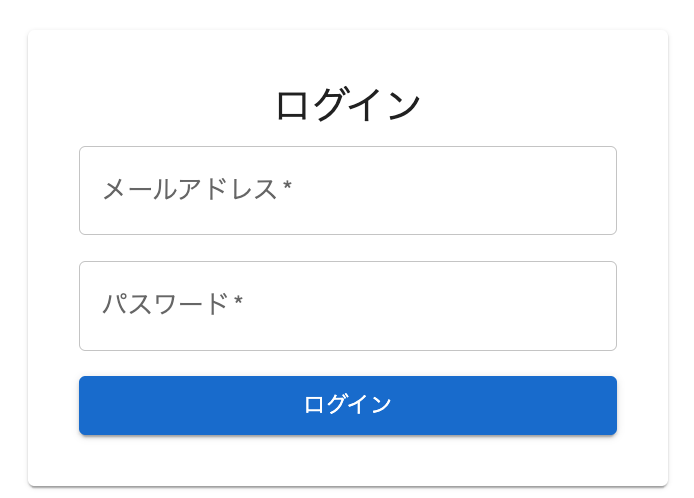

※メールアドレス、パスワードは、任意で入力してください。
認証機能を今回は動かしていないため、メールアドレス/パスワードを  
適当な文字列を入力することでログインできるようにしています。  
その後、**ログイン**をクリック。

```
例
メールアドレス: a@a
パスワード: 12345
```

すると、以下の**青いバー**の画面が表示されます。  

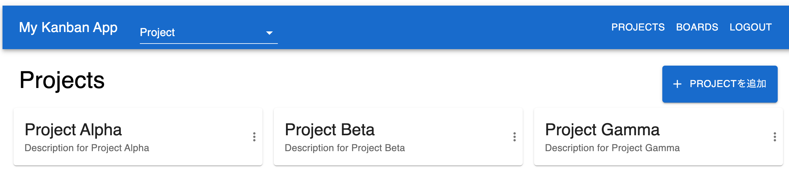

ここまでで、Frontendのアプリケーションが動作しているところまで確認できました。
では、CDの部分の動作を確認していきます。  
今回は先ほどforkしたリポジトリを直接変更します。  

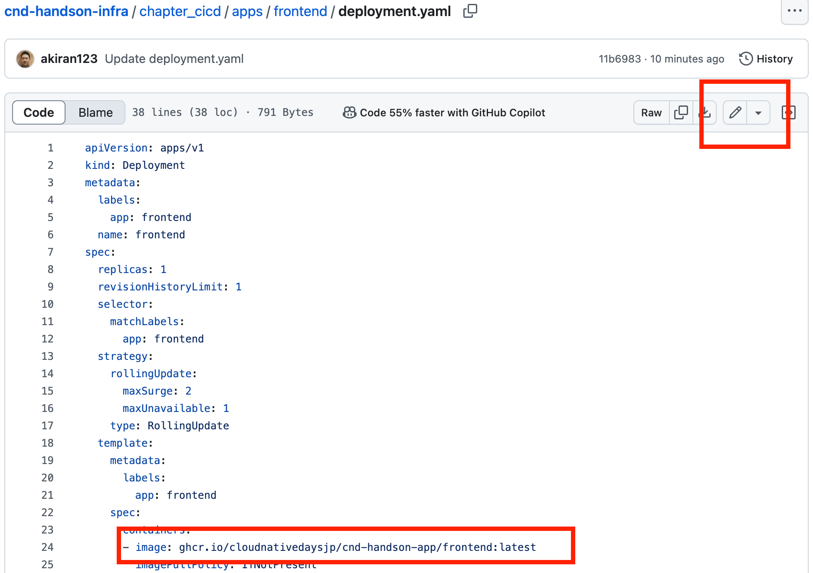

ここで、  
` - image: ghcr.io/cloudnativedaysjp/cnd-handson-app/frontend:latest`  
を  
` - image: ghcr.io/cloudnativedaysjp/cnd-handson-app/frontend-v1:latest`  
に変更し、`Commit Changes`します。  

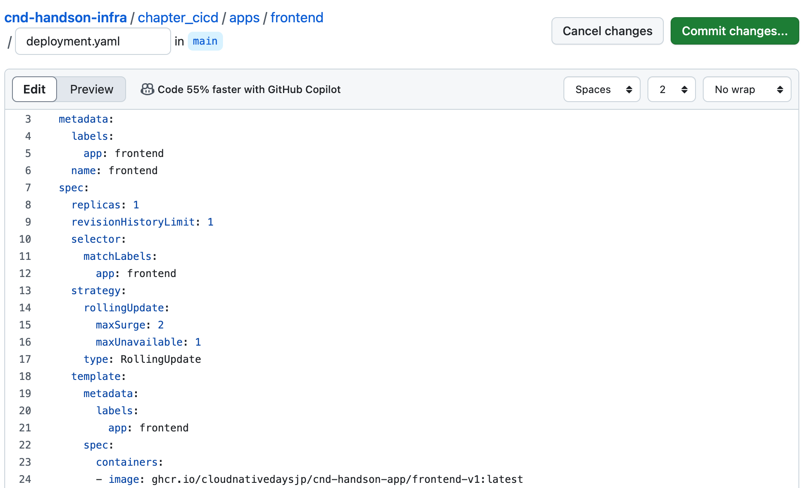

ArgoCDの画面に戻り、この状態で既存で動いているFrontendの変更をKickします。  
**SYNC**をクリックして、**SYNCHRONIZE**をクリックします。  

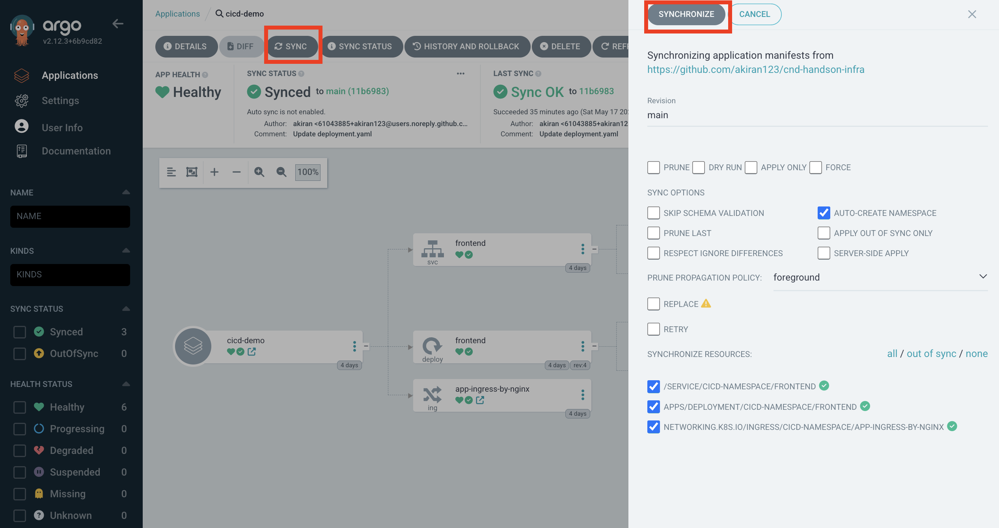

この状態で、新しく**Frontend**のアプリが更新されました。  
では、Frontendのページへアクセスしてみます。  
`http://app.cicd.example.com/login`  
先ほど同様に入力し、ログインします。  
すると、以下の**青いバー**の画面が表示されます。  

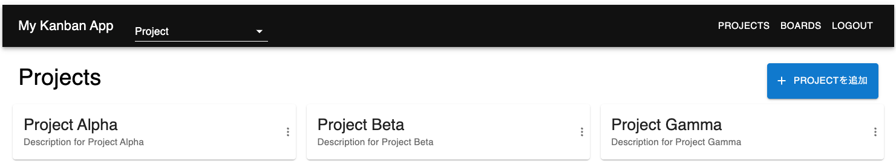

これで、Githubの設定変更をトリガーとしてアプリケーションが更新されるという、
CD部分のハンズオンが完了になります。


