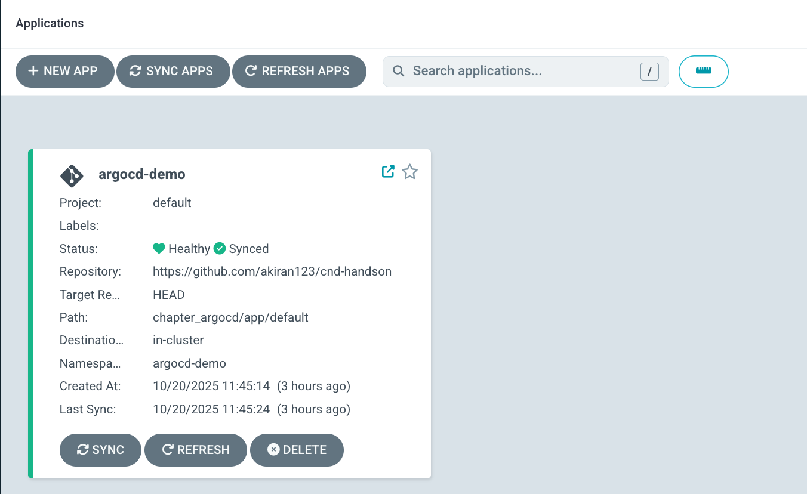
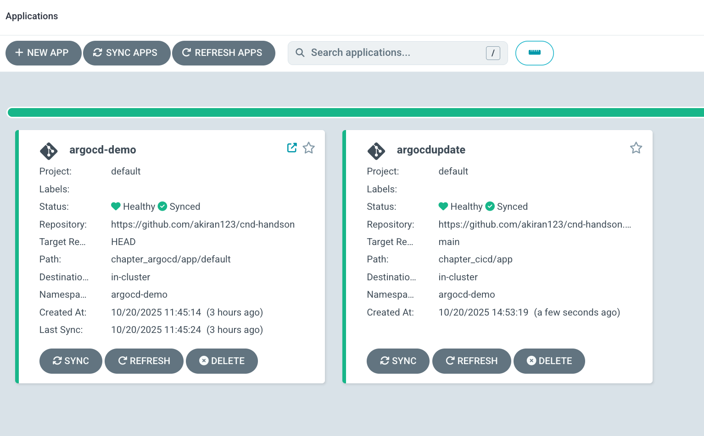
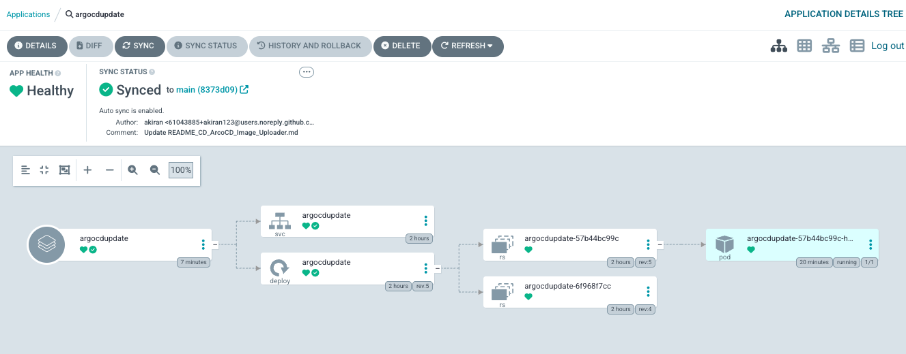
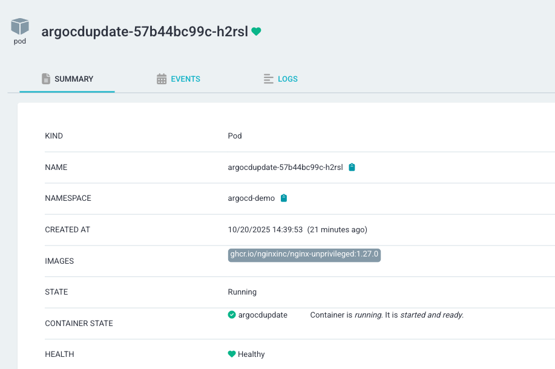
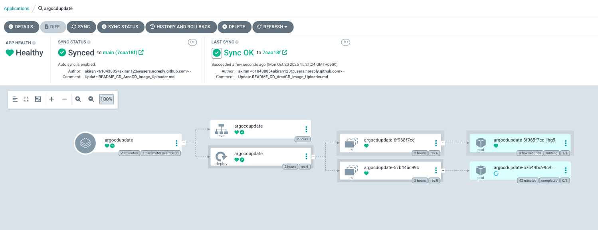
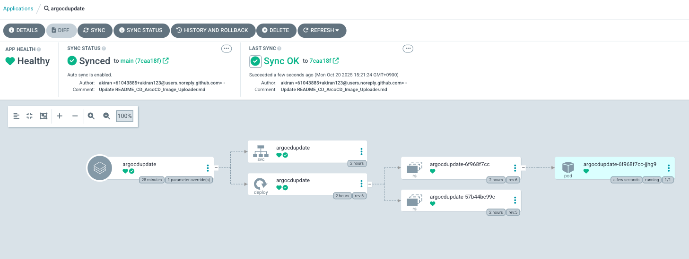
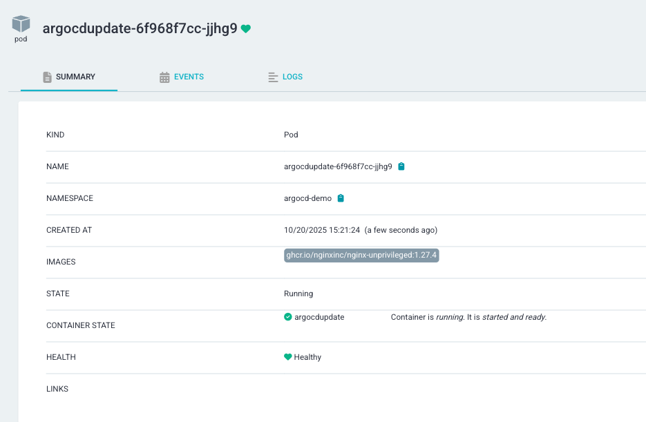

# ArgoCD Image Updater のハンズオンページ

このドキュメントは、CD(Countinuous Delivery)のハンズオン資料になります。  
ハンズオンのChapter_argocdにある、ArcoCDを利用して実施していきます。  
そのため、ArgoCDをインストールしていない場合には、以下サイトからインストールを実施してください。  
ArgoCDの詳細については、[こちら](https://github.com/cloudnativedaysjp/cnd-handson/blob/main/chapter_argocd/README_webui.md)を参照ください。  

また、このドキュメントについては、CICDのハンズオンにCD部分の拡張版として、<B>ArcoCD Image Updater</B> を使うことを  
目的としたものになります。  
ArgoCD Image Updaterの参照URL (https://argocd-image-updater.readthedocs.io/en/stable/)

# ArgoCD Image Updater とは

ArgoCDについては、ArgoCDの章にて説明がされていますが、今回利用する ArgoCD Image Updater は、Kubernetes の  
ワークロードでデプロイされているコンテナイメージの新しいバージョンを検出し、ArgoCD を使って許可された最新バージョンへ  
自動的に更新させることが可能で、ArgoCDで動作しているアプリケーションに対して適切なアプリケーションパラメータを設定する  
ことで動作します。使い方は簡単で、更新対象となるイメージの一覧と書くイメージのバージョンをArgoCDのアプリケーションリソースに  
Annotationとして付与します。その後、ArgoCD Image Updaterは、ArgoCDから設定済みのアプリケーションを定期的にポーリングし、  
対応するコンテナレジストリに新しい    バージョンがないかを確認し、レジストリに新しいバージョンが見つかり、バージョン制約を  
満たしていれば、ArgoCDに対して新しいイメージでアプリケーションを更新します。 
ArgoCDとの密接な統合により、Sync Windows や Application リソースに対するRBAC 認可などの高度な機能も完全にサポートされています。  

## ArgoCD Image Updaterが動作する条件
・　ArgoCDが動作していること
・　マニフェストが、KustomizeやHelmで管理させれていること
・　コンテナイメージリポジトリに使う認証情報は、ArgoCD Image updaterと同じクラスター上で存在すること
・　ArgoCD Image Updaterでは、Rollback機能がないため、ArgoCD側で対応、Roadmap上にはあるがまだ未定。


## 既存のArgoCDにあるアプリケーションの確認
・　chapter_argocdを実施した場合、アプリがすでに一つあります。




## ArgoCD Image Updaterで管理するアプリケーションを作成

・以下のmanifestの中で、レポジトリ設定があるため、自分のレポジトリに修正してください。

```
kubectl apply -f ./manifest/application_argocdupdate.yaml
```

・ <b>argocdupdate<b>のアプリが新しく作成されていることを確認  

```
Manifestについては、nginxのバージョン 1.27.0がインストールします。

Image Updater用アノテーション（自動イメージ更新の設定）

argocd-image-updater.argoproj.io/image-list: app=ghcr.io/nginxinc/nginx-unprivileged
追跡対象のイメージを定義（別名appを付与）。以降の設定でapp.〜の接頭辞に一致する

argocd-image-updater.argoproj.io/write-back-method: argocd
Gitには書き戻さず、Applicationの設定を直接更新して反映するモード

argocd-image-updater.argoproj.io/app.update-strategy: semver
　セマンティックバージョンに従って更新

argocd-image-updater.argoproj.io/app.semver: ">=1.27.0 <1.28.0"
　1.27系の最新（例: 1.27.4など）に自動追随する範囲指定

argocd-image-updater.argoproj.io/interval: "1m"
　・このアプリに対して1分間隔で新しいタグがないかチェック

全体的なmanifestの動きとしては、Argo CDは指定Gitのchapter_cicd/appを監視・同期し、argocd-demoにアプリを展開します。  
Image Updaterは1分ごとにこのApplicationをスキャンして、ghcr.io/nginxinc/nginx-unprivilegedのタグを取得。  
セマンティック範囲（>=1.27.0 <1.28.0）でより新しいタグが見つかれば、write-back-method=argocdに従い、
Applicationのバージョンを（内部的にspec.sourceのイメージ指定）を直接更新します。 (1.27.0 → 1.27.xのLatestへ) 
Argo CDはその更新を検知し、自動SyncによりDeploymentのコンテナイメージを新しいタグへ差し替えます。  
```






# ArgoCD Image Updater のインストール
### 以下のリンクがあるが、今回namespaceなど異なるため、内容を変更しています。
https://argocd-image-updater.readthedocs.io/en/stable/install/installation/

変更したものについては、chapter_cicd/app/にあります。
```
kubectl apply -f ./manifest/argocd_image_uploader.yaml
```

このmanifestにより、ArgoCD Image Updaterが動作します。 
すると、1.27.0のnginxバージョンから最新のnginx 1.27.xの最新版に更新されます。(作成当時は、1.27.4が最新版)  






