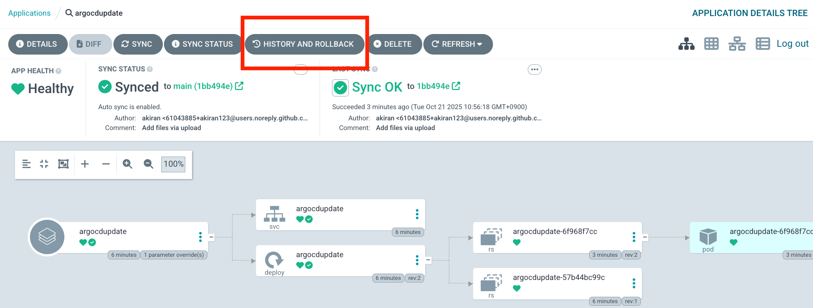
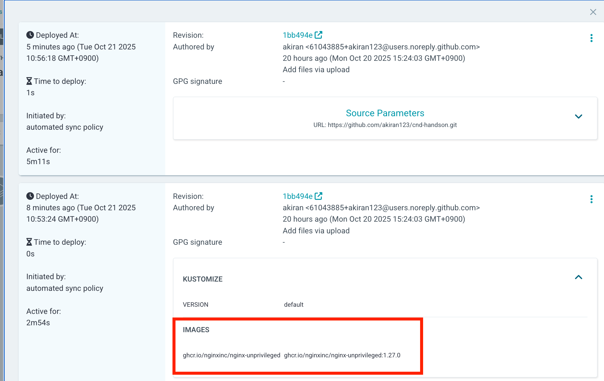
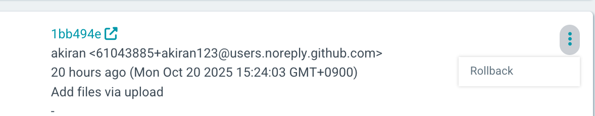
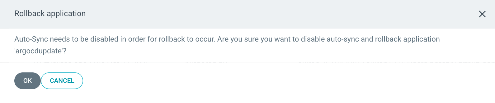
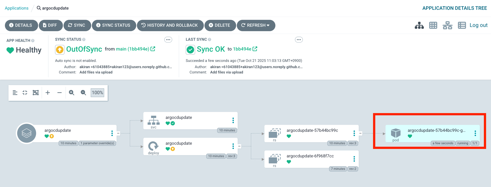
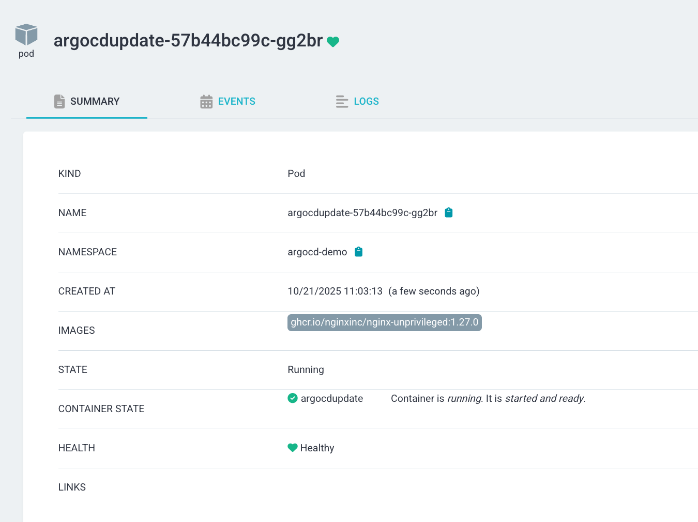

# ArgoCD Image Updater のハンズオンページ

このドキュメントは、CD(Countinuous Delivery)のハンズオン資料になります。  
ハンズオンのChapter_argocdにある、ArcoCDを利用して実施していきます。  
そのため、ArgoCDをインストールしていない場合には、以下サイトからインストールを実施してください。  
ArgoCDの詳細については、[こちら](https://github.com/cloudnativedaysjp/cnd-handson/blob/main/chapter_argocd/README_webui.md)を参照ください。  

また、このドキュメントについては、CICDのハンズオンにCD部分の拡張版として、<B>ArcoCD Image Updater</B> を使うことを  
目的としたものになります。  
ArgoCD Image Updaterの参照URL (https://argocd-image-updater.readthedocs.io/en/stable/)

# ArgoCD Image Updater とは

ArgoCDについては、ArgoCDの章にて説明がされていますが、今回利用する ArgoCD Image Updater は、Kubernetes の  
ワークロードでデプロイされているコンテナイメージの新しいバージョンを検出し、ArgoCD を使って許可された最新バージョンへ  
自動的に更新させることが可能で、ArgoCDで動作しているアプリケーションに対して適切なアプリケーションパラメータを設定する  
ことで動作します。使い方は簡単で、更新対象となるイメージの一覧と書くイメージのバージョンをArgoCDのアプリケーションリソースに  
Annotationとして付与します。その後、ArgoCD Image Updaterは、ArgoCDから設定済みのアプリケーションを定期的にポーリングし、  
対応するコンテナレジストリに新しい    バージョンがないかを確認し、レジストリに新しいバージョンが見つかり、バージョン制約を  
満たしていれば、ArgoCDに対して新しいイメージでアプリケーションを更新します。 
ArgoCDとの密接な統合により、Sync Windows や Application リソースに対するRBAC 認可などの高度な機能も完全にサポートされています。  

## ArgoCD Image Updaterが動作する条件
ArgoCDが動作していること
マニフェストが、KustomizeやHelmで管理させれていること
コンテナイメージリポジトリに使う認証情報は、ArgoCD Image updaterと同じクラスター上で存在すること
ArgoCD Image Updaterでは、Rollback機能がないため、ArgoCD側で対応、Roadmap上にはあるがまだ未定。

## 今回のハンズオンについて
Nginx 1.27.0をArgoCD Image Uploderにて監視する様にし、  
Nginxのレジストリにある、1.27.x台の最新Latest版へ更新するハンズオンとしています。  
ハンズオンなのでわかりやすい形で実施していますが、もちろん時前で管理しているアプリケーションの   
バージョン変更している環境での導入が可能です。  
https://argocd-image-updater.readthedocs.io/en/stable/basics/update-strategies/  

### バージョン管理の検知条件
semver: セマンティックバージョニング（意味のあるバージョン規則）の制約を考慮して、利用可能な最新バージョンへ更新する  
latest/newest-build: レジストリ上で最も新しくビルドされたイメージに更新する  
digest: 指定したバージョン（タグ名）は固定したまま、そのタグの最新のSHAダイジェストに更新する  
name/alphabetical: タグ名をアルファベット順に並べ、辞書順で最も後ろ（順位が高い）に来るタグへ更新する 


## 既存のArgoCDにあるアプリケーションの確認
chapter_argocdを実施した場合、アプリがすでに一つあります。


## ArgoCD Image Updaterで管理するアプリケーションを作成

・以下のmanifestの中で、レポジトリ設定があるため、自分のレポジトリに修正してください。
```
    repoURL: https://github.com/<自分のrepository>/cnd-handson.git → この部分を修正してください
```

```
kubectl apply -f ./manifest/application_argocdupdate.yaml
```

設定したmanifestが反映していること
```
kubectl get deploy,pod -n argocd-demo
```
```
NAME                           READY   UP-TO-DATE   AVAILABLE   AGE
deployment.apps/argocdupdate   1/1     1            1           8s    <-
deployment.apps/handson        1/1     1            1           8m5s

NAME                                READY   STATUS    RESTARTS   AGE
pod/argocdupdate-57b44bc99c-whh8b   1/1     Running   0          8s  <-
pod/handson-954b5b8f6-288v5         1/1     Running   0          8m4s
```

 <b>argocdupdate<b>のアプリが新しく作成されていることを確認  

<details><summary>Manifestの説明</summary>
Manifestについては、nginxのバージョン 1.27.0がインストールします。

Image Updater用アノテーション（自動イメージ更新の設定）

argocd-image-updater.argoproj.io/image-list: app=ghcr.io/nginxinc/nginx-unprivileged
追跡対象のイメージを定義（別名appを付与）。以降の設定でapp.〜の接頭辞に一致する

argocd-image-updater.argoproj.io/write-back-method: argocd
Gitには書き戻さず、Applicationの設定を直接更新して反映するモード

argocd-image-updater.argoproj.io/app.update-strategy: semver
　セマンティックバージョンに従って更新

argocd-image-updater.argoproj.io/app.semver: ">=1.27.0 <1.28.0"
　1.27系の最新（例: 1.27.4など）に自動追随する範囲指定

argocd-image-updater.argoproj.io/interval: "1m"
　このアプリに対して1分間隔で新しいタグがないかチェック

全体的なmanifestの動きとしては、Argo CDは指定Gitのchapter_cicd/appを監視・同期し、argocd-demoにアプリを展開します。  
Image Updaterは1分ごとにこのApplicationをスキャンして、ghcr.io/nginxinc/nginx-unprivilegedのタグを取得。  
xでより新しいタグが見つかれば、write-back-method=argocdに従い、
Applicationのバージョンを（内部的にspec.sourceのイメージ指定）を直接更新します。 (1.27.0 → 1.27.xのLatestへ) 
Argo CDはその更新を検知し、自動SyncによりDeploymentのコンテナイメージを新しいタグへ差し替えます。  
</details>


# ArgoCD Image Updater のインストール
### 以下のリンクがあるが、今回namespaceなど異なるため、内容を変更しています。
https://argocd-image-updater.readthedocs.io/en/stable/install/installation/

変更したものについては、chapter_cicd/app/にあります。
```
kubectl apply -f ./manifest/argocd_image_uploader.yaml
```

このmanifestにより、ArgoCD Image Updaterが動作します。 
すると、1.27.0のnginxバージョンから最新のnginx 1.27.xの最新版に更新されます。(作成当時は、1.27.4が最新版)  


<details><summary>Manifestの説明</summary>
「Argo CD Image Updaterをargo-cd名前空間にデプロイして、Argo CDのApplicationを監視・自動更新できるようにするためのmanifestです。
構成要素と役割は次の通りです。  

ServiceAccount  
 名前: argocd-image-updater（namespace: argo-cd）  

UpdaterのPodが使うサービスアカウント  
RBAC  
 Role/RoleBinding（namespace: argo-cd）  
 configmaps/secretsのget/list/watchを許可（Updaterが自分の設定CM/Secretを読むため）  
 ClusterRole/ClusterRoleBinding（クラスタ全体）  
 applications（argoproj.io）のget/list/watch/update/patchを許可（Applicationの監視・更新に必要）  
 eventsのcreateを許可（イベント出力用）  
 ConfigMap（設定）  
 argocd-image-updater-config（namespace: argo-cd）  
 applications_api: kubernetes  
 UpdaterがArgo CDのAPIトークンなしでKubernetes API経由でApplicationを読むモード  
 argocd.server_addr: argo-cd-argocd-server.argo-cd.svc:443  
 argocd.insecure: "true"  
 自己署名TLSの検証を緩める設定（APIモードに切り替える場合に有効）  
 interval: "1m"（1分間隔でチェック）  
 log.level: "debug"（詳細ログ）  
 kube.events: "true"（イベント出力）  
 registries.conf: GHCRを明示（公開利用で認証不要）  
 git.commit-message-template: Git書き戻し時のコミットメッセージテンプレート（argocdモードでは未使用）  
 argocd-image-updater-ssh-config（任意）  
 SSHでGitを使う場合のssh_config（HTTPSなら不要）  
 argocd-ssh-known-hosts-cm（任意）  
 SSHのknown_hostsを格納（SSHを使わないなら空でも問題なし）  
 Secret（任意）  
 argocd-image-updater-secret  
  ARGOCD_TOKEN（APIモードで使う場合のみ）やWebhook用シークレットの収納。今回のKubernetesモードでは未設定でOK  
Deployment（本体）  
 イメージ: quay.io/argoprojlabs/argocd-image-updater:v0.17.0  
          args: ["run"]（v0.17系の起動方法）  
      
  
  Updaterがargo-cd内のApplicationをKubernetes APIで定期スキャン（1分間隔）  
  対象Applicationに付けたアノテーション（image-list、update-strategy、semver、write-back-methodなど）に従って、利用イメージを自動更新  
  write-back-methodをargocdにすれば、Git認証なしでApplicationの設定を直接更新して反映可能  
  write-back-methodをgitに切り替える場合は、Argo CD側にRepository認証（Secretやargocd repo add）が必要    
</details>
  
```
Updaterが動作して、ImageのAutoupdateが動作しているか確認
kubectl -n argo-cd logs deploy/argocd-image-updater -f
```

すると、以下の様にコンテナイメージを検知して、その中で条件(>=1.27.0 <1.28.0)に合致するものを探し、自動更新がされる形になります。
```
(ログの抜粋)
time="2025-10-20T07:56:02Z" level=debug msg="found 268 from 268 tags eligible for consideration" image="ghcr.io/nginxinc/nginx-unprivileged:1.27.0"　
time="2025-10-20T07:56:02Z" level=info msg="Setting new image to ghcr.io/nginxinc/nginx-unprivileged:1.27.4" alias=app application=argocdupdate image_name=nginxinc/nginx-unprivileged image_tag=1.27.0 registry=ghcr.io
time="2025-10-20T07:56:02Z" level=info msg="Successfully updated image 'ghcr.io/nginxinc/nginx-unprivileged:1.27.0' to 'ghcr.io/nginxinc/nginx-unprivileged:1.27.4', but pending spec update (dry run=false)" alias=app application=argocdupdate image_name=nginxinc/nginx-unprivileged image_tag=1.27.0 registry=ghcr.io
time="2025-10-20T07:56:02Z" level=debug msg="Using commit message: "
time="2025-10-20T07:56:02Z" level=info msg="Committing 1 parameter update(s) for application argocdupdate" application=argocdupdate
time="2025-10-20T07:56:02Z" level=debug msg="Applications listed: 2"
time="2025-10-20T07:56:02Z" level=debug msg="Found application: argocd-demo in namespace argo-cd"
time="2025-10-20T07:56:02Z" level=debug msg="Found application: argocdupdate in namespace argo-cd"
time="2025-10-20T07:56:02Z" level=debug msg="Application argocdupdate matches the pattern"
time="2025-10-20T07:56:02Z" level=info msg="Successfully updated the live application spec" application=argocdupdate
```

上記にて、ArgoCDで動作しているアプリケーションが、コンテナイメージのバージョンアップを検知することより、　　
既存で動作しているアプリケーションの自動アップデートがされた形になります。　　
また、Webhook連携なども記載がありますので、ご興味がある方はぜひ確認いただければと思います。  
https://argocd-image-updater.readthedocs.io/en/stable/

## アプリケーションをrollbackする場合 (現状 ArgoCD Image UpdaterではRoadmapのため、ArgoCD上で対応します)

ArgoCD上で、<B>HISTORU AND ROLLBACK </>をクリック  


そこで、<B>Source Parameters</Bをクリックし、RollbackしたいVersionを確認する  


"..."をクリックして、"Rollback"　→ "OK"　をクリック  




すると、Rollbackされて、podが今回の場合、Version 1.27.4 → 1.27.0　に戻ります  





これで Rollback は終了です。  
もし、またpodを最新ものにしたい場合には、rollback または pod削除をすると、最新版の version 1.27.4に変わります。  
(as of 10/21　の最新版なので、ハンズオン時には変更になる可能性あり)


