## GitHub Actionsを使ったCI体験

この章では、GitHub Actionsを使って継続的インテグレーション(CI)の実践的な体験を行います。GitHub Actionsはコードリポジトリと密接に統合されています。様々なイベント（プッシュ、プルリクエスト作成など）をトリガーにワークフローを実行できるため、開発プロセスの自動化に非常に便利なツールです。


### 準備：サンプルアプリケーションのフォーク

Webブラウザから以下のリポジトリへアクセスします。

```bash
https://github.com/cloudnativedaysjp/cnd-handson-app
```

このリポジトリをご自身のGitHubアカウントのリポジトリへフォークします。
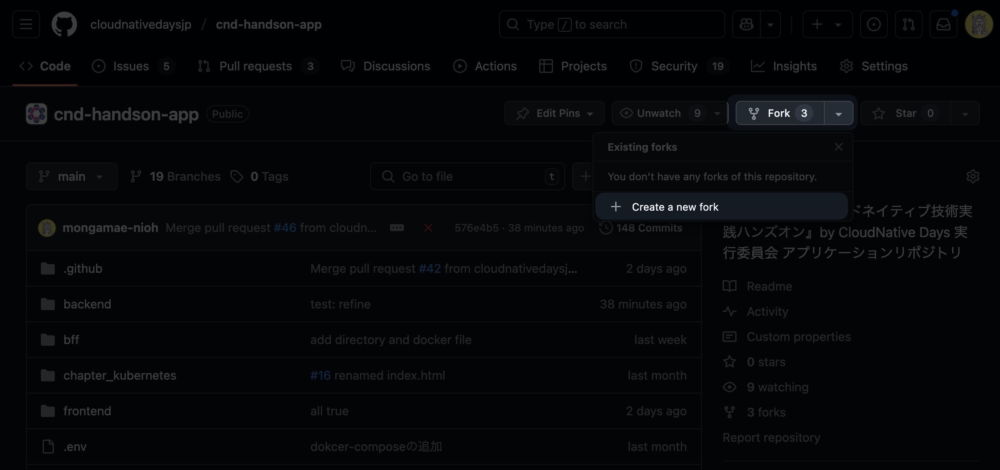

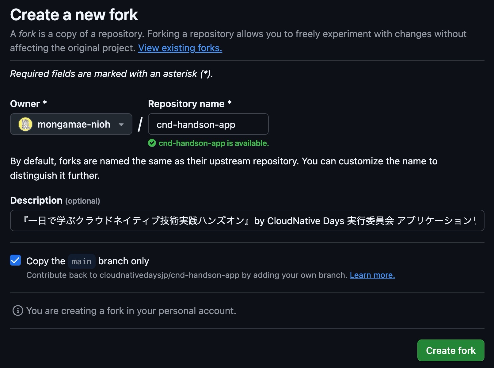


フォーク完了後にローカル環境へクローンします。

```bash
git clone https://github.com/<あなたのGitHubユーザー名>/cnd-handson-app.git
cd cnd-handson-app
```

もし別名でフォークした場合は`cnd-handson-app.git`の部分を修正してください。
フォークしたご自身のリポジトリの`Actions`タブから`I understand my workflows...`のボタンをクリックしてGitHub Actionsを有効化してください。
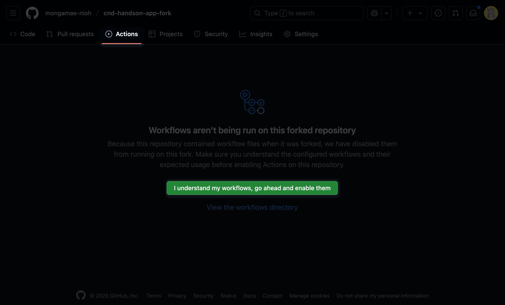

### CIパイプライン

フォークしたリポジトリには、以下のCIパイプラインが設定されています。

1. コードの品質チェック（Lint, Format）
2. テスト
3. ビルドとコンテナイメージの作成

これらはすべてGitHub Actionsのワークフローとして定義されており`.github/workflows/`ディレクトリに配置されています。

## コードの品質チェック（Lint, Format）

### Lintとは

コードの品質を向上させバグを減らすために行います。
Lintツールは、コード内の潜在的なエラー、バグ、スタイルの問題、疑わしい構造などを検出するためのツールです。

### Formatチェックとは

チーム内でコーディングスタイルを統一し、読みやすさと保守性を高めます。
コードフォーマッターは、コードの一貫性を保つためのツールです。

### 最適な実施タイミング

LintとFormatチェックは以下のタイミングで実行すると効果的です。

1. **ローカル開発中**: 開発者が自分のマシンでコードを書いている最中にLinterやFormatterを適用する
2. **コミット前**: Git hooks（pre-commit）を使って問題のあるコードがリポジトリに入るのを防ぐ
3. **CIパイプラインの初期段階**: プッシュ時に自動的に実行

早い段階でこれらのチェックを行うことで問題を早期に発見し、修正コストを低減できます。

### 実践：Lint

ローカルで開発中やコミット前にチェックすることが一般的ですが、このハンズオンではサンプルアプリケーションにLintエラーを含むコードをプッシュしてGitHub Actionsがどのように動作するかを確認します。


ブランチを作成します。
```bash
git checkout -b lint-format-fail-test
```

`backend/project/internal/project/handler/project.go`の`import`文の後に以下のコードを追加します。

```diff go
+ // 未使用の変数を追加
+ var unusedVariable  =  "this will cause lint error"

// projectService はプロジェクトサービスの実装
type projectService struct {
	repo repository.ProjectRepository
}
```

変更をコミットしてプッシュします。

```bash
git add .
git commit -m "test: lint errors"
git push --set-upstream origin lint-format-fail-test
```

GitHub上でリポジトリの`Actions`タブを開き、ワークフローの`Go lint and format(project)`の実行結果を確認します。
未使用の変数があるためLintチェックが失敗し、ワークフローは失敗して終了します。

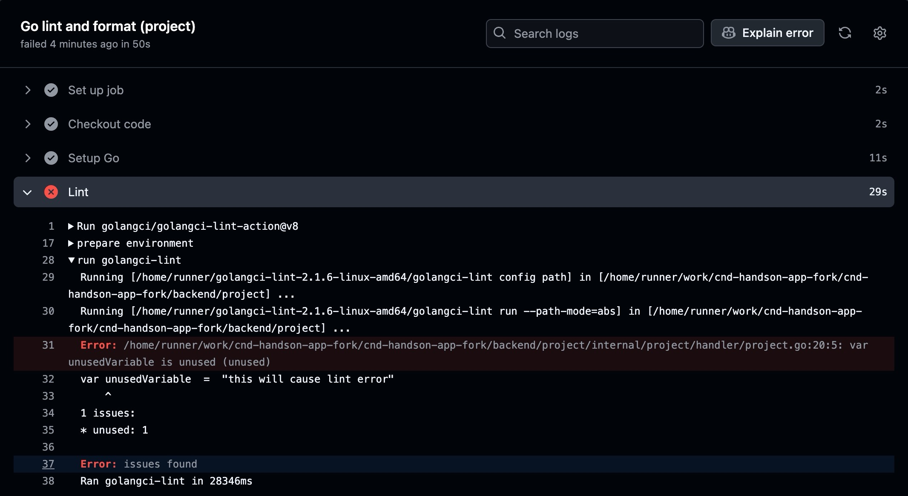

先ほど追加した未使用の変数はコードから削除しておきましょう。

### 実践： Format

次にFormatエラーの動作を確認してみましょう。先ほどと同じファイル
`backend/project/internal/project/handler/project.go`のコードのインデントをあえて崩してみましょう。

```diff go
func convertToProtoProject(project *model.Project) *projectpb.Project {
	return &projectpb.Project{
		Id:          project.ID.String(),
		Name:        project.Name,
-		Description: project.Description,
+	Description: project.Description,
		OwnerId:     project.OwnerID.String(),
		CreatedAt:   timestamppb.New(project.CreatedAt),
-		UpdatedAt:   timestamppb.New(project.UpdatedAt),
+	UpdatedAt:   timestamppb.New(project.UpdatedAt),
	}
}
```

変更をコミットしてプッシュします。

```bash
git add .
git commit -m "test: format errors"
git push --set-upstream origin lint-format-fail-test
```

リポジトリへプッシュするとワークフローが実行されます。
GitHub上でリポジトリの`Actions`タブを開き、ワークフローの`Go lint and format(project)`の実行結果を確認します。
インデントが揃っていないためFormatチェックが失敗します。

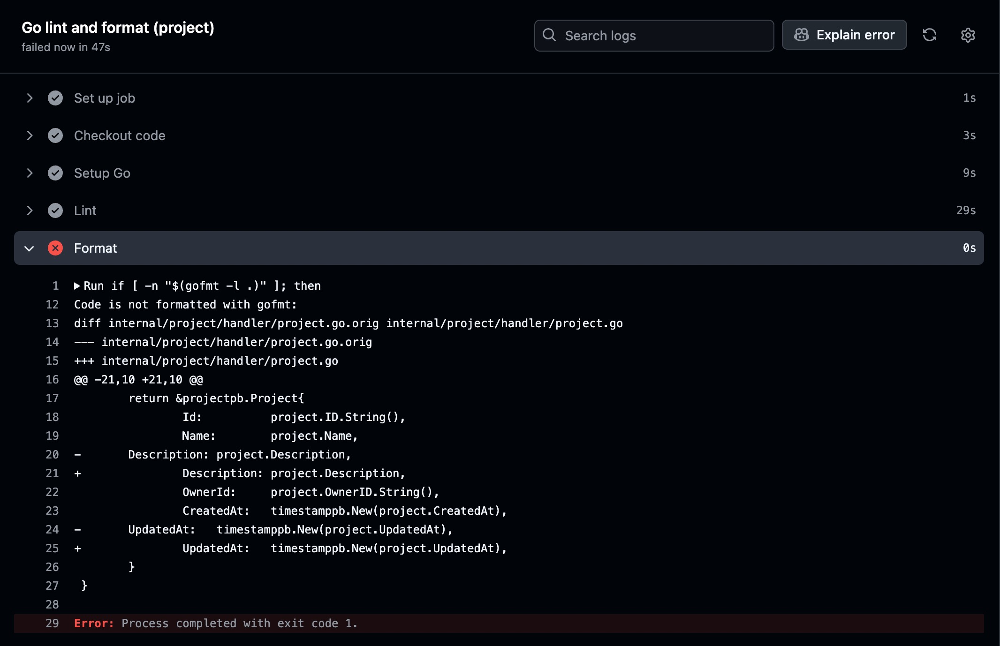

`backend/project/internal/project/handler/project.go`のインデントを戻しておきましょう。

### LintとFormatのまとめ

> [!IMPORTANT]  
> - コード品質を維持できる
> - 開発の早い段階で実施することで問題発見と修正コストを低減できる
> - チーム開発においてコードの一貫性と品質を保つことができる

## テスト

### テストの種類と役割

ソフトウェアテストには様々な種類、例えば以下のようなテストがあります。

1. **単体テスト**: 個々の機能やメソッドが正しく動作するかをテスト
2. **統合テスト**: 複数のコンポーネントが連携して正しく動作するかをテスト
3. **エンドツーエンドテスト**: ユーザーの視点からシステム全体の動作をテスト

### 最適な実施タイミング

1. **開発の早期段階**: コード実装と並行して早い段階でテストを書くことで設計の問題を早期に発見できる
2. **コード変更後**: 新機能の追加や既存コードの修正後に実行しリグレッションを防止する
3. **CIパイプライン内**: コードがマージされる前に自動的に実行し問題のある変更がmainブランチへ入るのを防ぐ


### 実践：テスト

故意にバグを混入してみましょう。まずブランチを作成します。
```
git checkout -b test-fail-test
```

`backend/project/internal/project/service/project.go`を以下のように修正します。


```diff go
import (
+	"strings"
	"time"

	"github.com/cloudnativedaysjp/cnd-handson-app/backend/project/internal/project/model"
	"github.com/cloudnativedaysjp/cnd-handson-app/backend/project/internal/project/repository"
	"github.com/google/uuid"
	"google.golang.org/grpc/codes"
	"google.golang.org/grpc/status"
)

(中略)

	project := model.Project{
		ID:          uuid.New(), // 新規UUIDを生成
-		Name:        name, 
+		Name:        strings.ToLower(name), // bug: 大文字を小文字に変換
		Description: description,
		OwnerID:     ownerID,
		CreatedAt:   time.Now(),
		UpdatedAt:   time.Now(),
	}
```

変更をコミットしてプッシュします。

```bash
git add .
git commit -m "test: failing test"
git push --set-upstream origin test-fail-test
```

プッシュしたブランチをmainブランチへマージするPull Requestを作成します。
> [!WARNING]  
> マージ先の`base repository`はフォークしたご自身のリポジトリを指定してください。

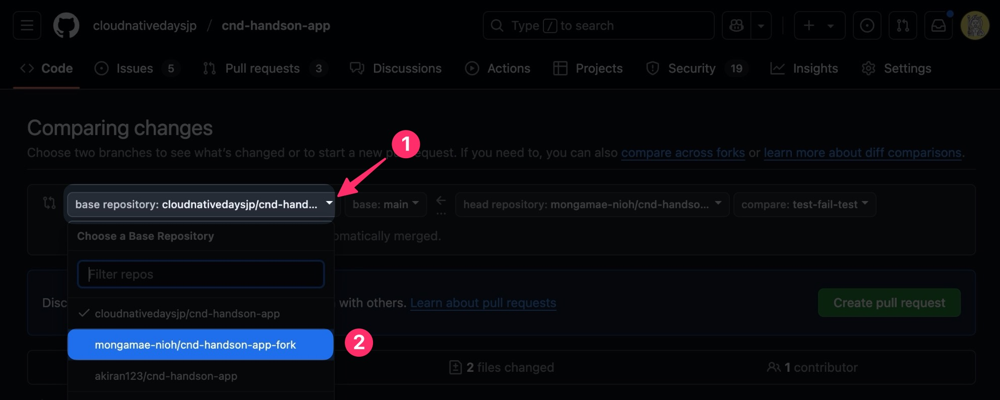

PRを作成するとテストのワークフローが実行されます。
GitHub上で`Actions`タブを開き`Go Test (project)`からテストが失敗したことを確認します。

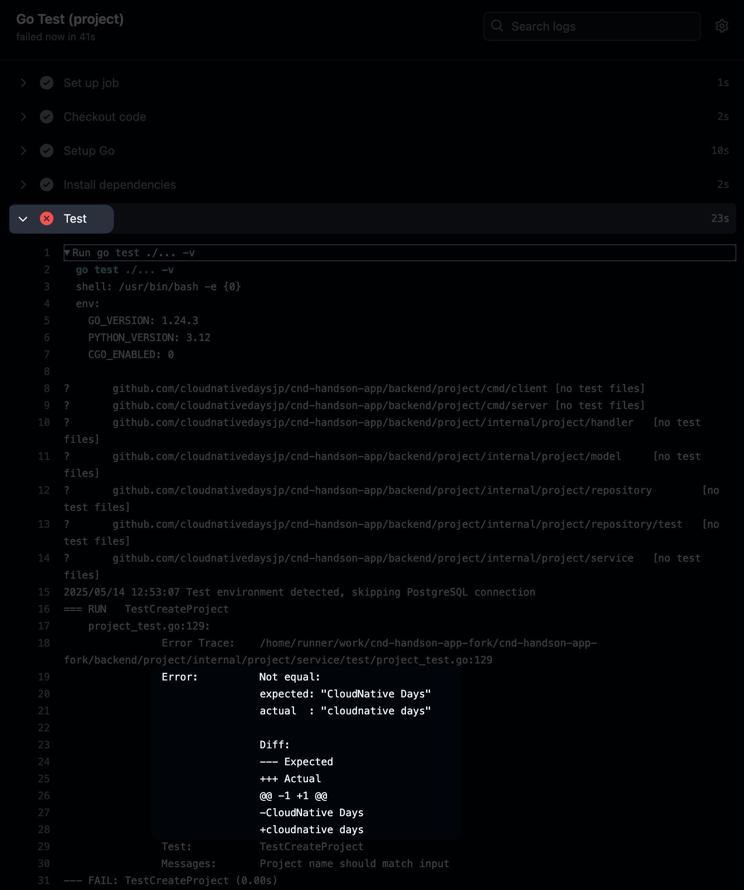

テストが期待する結果は`CloudNative Days`ですが、先ほど大文字を小文字へ変換する修正を加えたのが原因で結果が`cloudnative days`となりテストが失敗しました。
このようにテストをCIへ組み込むことでリリース前にバグに気づくことができます。

### テストのまとめ
> [!IMPORTANT]  
> - テストは品質保証の基盤でありバグの早期発見に役立つ
> - 自動テストにより繰り返し実行可能で一貫性のある検証が可能になる
> - CIパイプラインでのテスト自動化により、問題のあるコードがプロダクションに到達する前に検出できる

## ビルドとコンテナイメージの作成

CIの最終段階として、アプリケーションをビルドしコンテナイメージを作成するプロセスがあります。このステップが成功するとArgo CDなどのCDツールによって後続のデプロイプロセスで使用できる準備が整います。

### アプリケーションのビルド

アプリケーションのビルドステップでは、依存関係のインストール、静的ファイルの生成などが行われます。

### コンテナイメージの作成

コンテナイメージの作成は、アプリケーションを動作環境に依存せず実行できるようにするための重要なステップです。このハンズオンでは、GitHub Actionsを使ってコンテナイメージを自動的に作成し、コンテナレジストリ（GitHub Container Registry）へプッシュします。

ブランチを作成します。

```bash
git checkout main
git checkout -b build-and-push
```

ルートディレクトリの`README.md`へ任意の内容を追記します。
```diff md
# cnd-handson-app
『一日で学ぶクラウドネイティブ技術実践ハンズオン』by CloudNative Days 実行委員会 アプリケーションリポジトリ

+ Hello, CI/CD world!
```

変更をコミットしてプッシュします。

```bash
git add .
git commit -m "update readme"
git push --set-upstream origin build-and-push
```

プッシュしたブランチをmainブランチへマージするPull Requestを作成します。
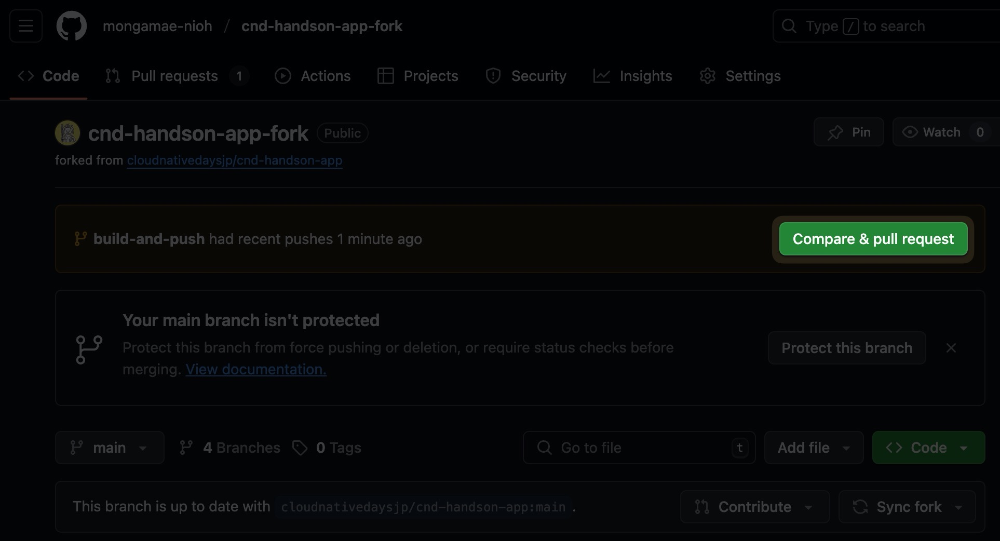

> [!WARNING]  
> マージ先の`base repository`はフォークしたご自身のリポジトリを指定してください。

作成したPRをmainブランチへマージします。

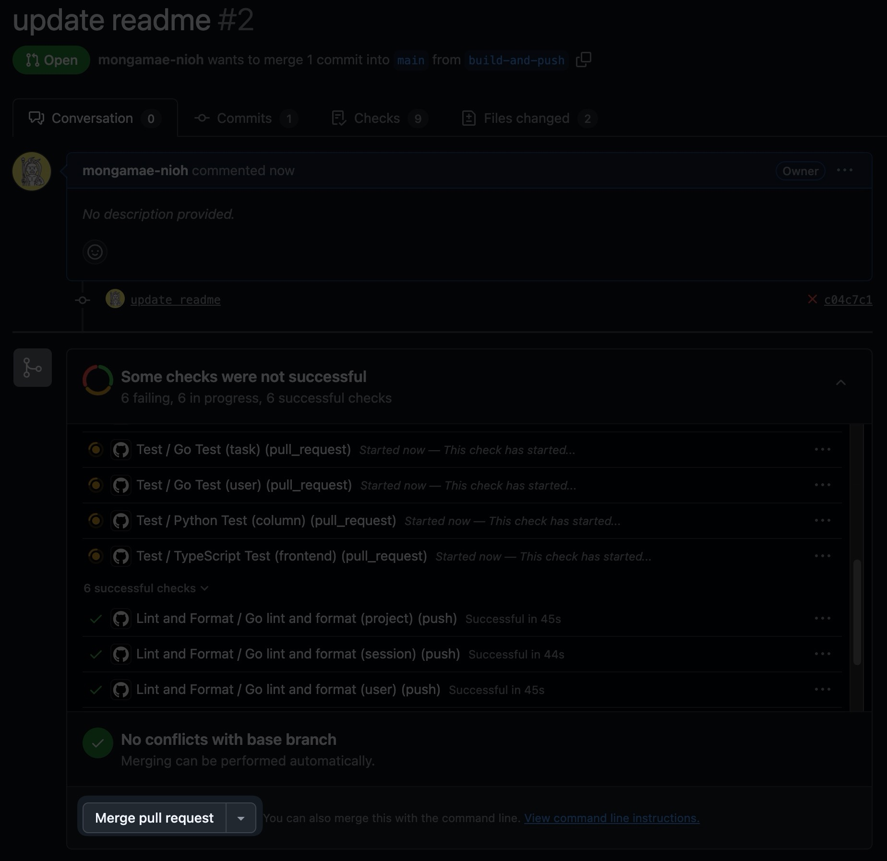

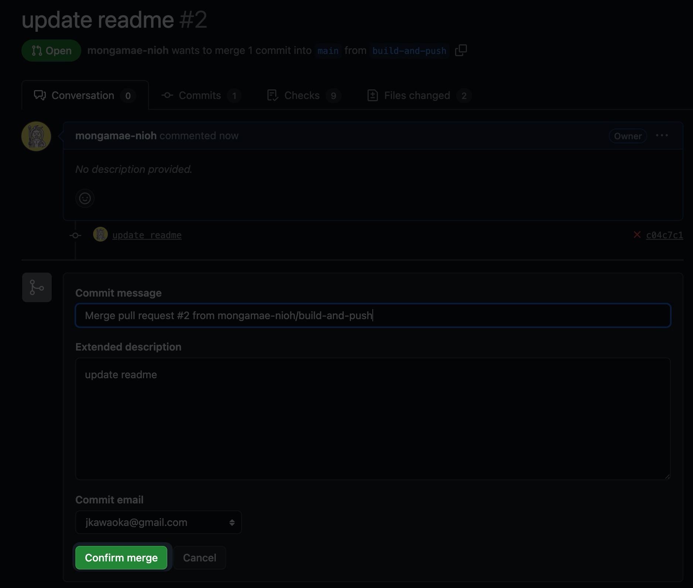

PRをマージするとアプリケーションのビルドが行われ、GitHub Container RegistryへDockerイメージがプッシュされます。
GitHub上で`Actions`タブを開き、最新のワークフローの結果をクリックします。

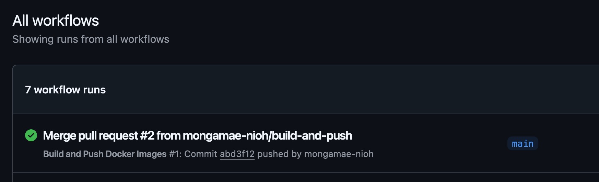

ワークフローが成功していることを確認します。
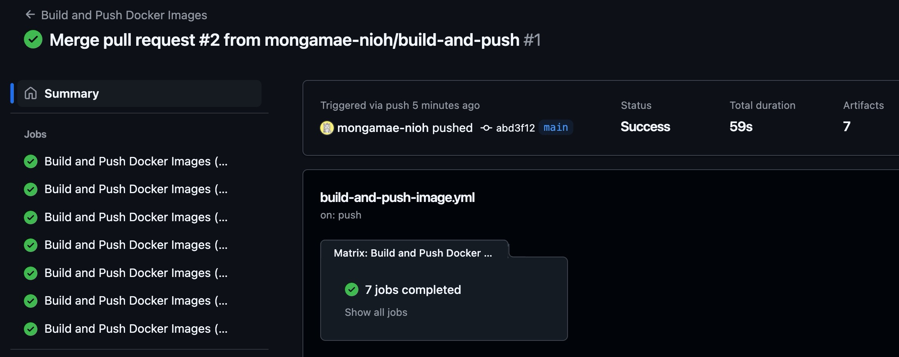

GitHub Container RegistryへDockerイメージがコンテナレジストリへプッシュされました。
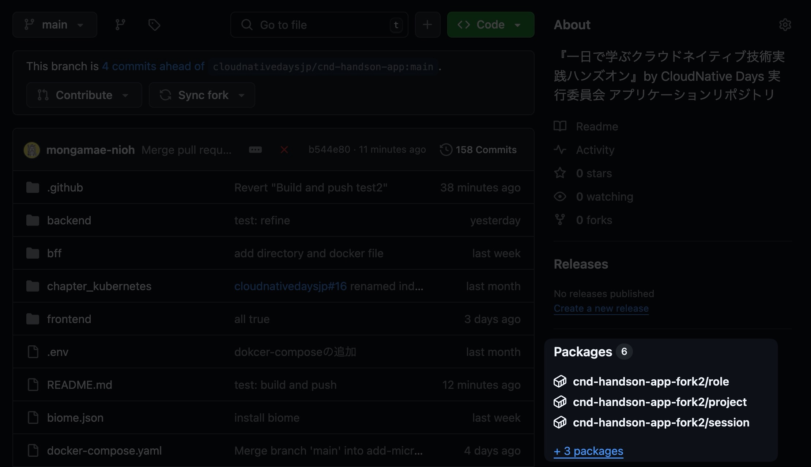

これでArgo CDなどのCDツールによって後続のデプロイプロセスで使用できる準備が整いました。

## まとめ

この章では、CI（継続的インテグレーション）の基本概念とGitHub Actionsを使った実践的な実装方法を学びました。

> [!IMPORTANT]  
> - CIは開発フローを自動化し、ソフトウェアの品質向上に貢献します。
> - LintとFormatチェックを早期に実施することでコード品質の問題を迅速に発見し、修正コストを削減できます。
> - 自動テストを組み込むことでバグの早期発見と修正が可能となり、安定したソフトウェアを提供できます。
> - コンテナ化することで一貫性のある環境でアプリケーションのビルドと実行を実現できます。
