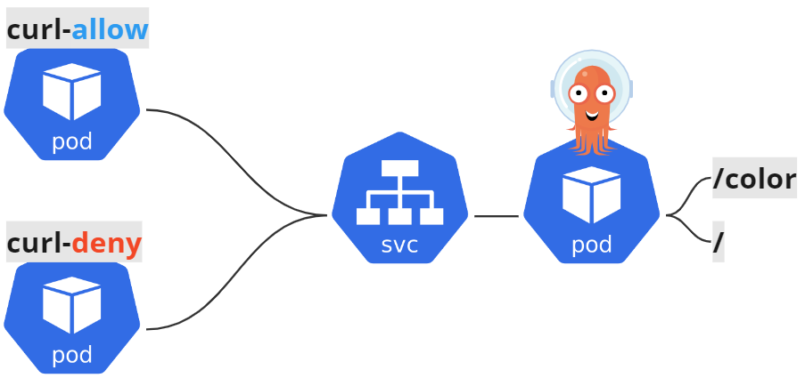

# Cilium

[What is Cilium](https://cilium.io/get-started/)で説明されるように、CiliumはKubernetesクラスターやその他のクラウドネイティブ環境にネットワーキング、セキュリティ、可観測性を提供するオープンソースプロジェクトです。
Ciliumの基盤となっているのは、eBPFと呼ばれるLinuxカーネルの技術であり、セキュリティや可視性、ネットワーク制御ロジックをLinuxカーネルに動的に挿入することが可能です。
eBPFについては[eBPF.io](https://ebpf.io/ja/)をご確認ください。


(出典：https://github.com/cilium/cilium/blob/main/Documentation/images/cilium-overview.png)

## CNI (Container Network Interface)

Ciliumは広義的にはCNIの1つとして挙げられます。

- CNIとは、Cloud Native Computing Foundationプロジェクトの1つになります
- CNIは、LinuxやWindowsコンテナーのネットワーク機能を抽象化し、APIインターフェイス仕様として切り出したものです
- コンテナのネットワーク接続性にのみ関与し、コンテナが削除されると割り当てられたリソースを削除します
- CNIの仕様など詳細については、[こちら](https://www.cni.dev/)をご参照ください

Cilium以外にもCNIとして提供されているプラグインは数多くあります。
その中のいくつかをご紹介します。

- [Flannel](https://github.com/flannel-io/flannel)
  - シンプルなセットアップで利用可能で、Kubernetesクラスター内でのネットワーク通信を容易にするために適しています
  - VXLANやHost-GWモードを使用したオーバーレイネットワークにもサポートしてます
  - 単一Kubernetesクラスターのシンプルなネットワーキングが必要なときや、シンプルな設定と高い拡張性が求められる場合に適しています
- [Calico](https://github.com/projectcalico/calico)
  - BGPを使用したルーティングでスケーラビリティが高いと言われています
  - セキュリティポリシーやセグメンテーションの管理が可能です
  - また、ポリシードリブンで柔軟な通信制御も可能です
  - 大規模かつ複雑なネットワーク環境がある場合や、セキュリティポリシーを重視し、通信の制御が必要な場合に適しています
- [Weave](https://github.com/weaveworks/weave)(アーカイブ済)
  - メッシュネットワークを提供し、コンテナの動的な発見が可能です
  - オーバーレイネットワークをサポートしており、シンプルで軽量な設計です
  - 動的なワークロードディスカバリが必要な場合や、シンプルで効率的なネットワーキングが求められる場合に適しています

## Components

Ciliumは下記の主要コンポーネントで構成されています。
詳細については[Component Overview](https://docs.cilium.io/en/stable/overview/component-overview/#component-overview)をご参照ください。

- Agent
  - Kubernetesクラスターの各ノードで実行され、Kubernetes APIサーバーとの接続を確立し、ネットワークおよびセキュリティポリシーを維持する役割を果たします
  - Linuxカーネルがコンテナのネットワークアクセスを制御するために使用するeBPFプログラムの管理を行います
- Operator
  - Kubernetesクラスター全体に対して実行されるタスクの管理を行います
  - 構成にもよりますが、一時的に利用できなくてもKubernetesクラスターは機能し続けます
- Debug Client(CLI)
  - Cilium Agentとともにインストールされるコマンドラインツールです
  - 同じノード上で動作するCilium AgentのREST APIと対話を行うことができ、Agentの状態やステータスの検査ができます
  - Ciliumのインストールや管理、トラブルシュートなどに使用されるCLIとは別物になります
- CNI Plugin
  - PodがNode上でスケジュールまたは終了される時にKubernetesによって呼び出されます
  - Cilium APIと対話し、ネットワーキング/ロードバランシング/ネットワークポリシーを提供するために必要な設定を起動します

[chapter Cluster Create](../chapter_cluster-create/)で導入したCiliumに対して、上記のコンポーネントを簡単に確認してみます。

最初にAgentはDaemonSetリソース、OperatorはDeploymentリソースとしてデプロイされていることを確認します。

```shell
kubectl get -n kube-system -l app.kubernetes.io/part-of=cilium ds,deploy
```

下記のような出力になるはずです。hubble-relayやhubble-uiに関しては[chapter_hubble](../chapter_hubble/)にて説明します。

```shell
NAME                    DESIRED   CURRENT   READY   UP-TO-DATE   AVAILABLE   NODE SELECTOR            AGE
daemonset.apps/cilium         3         3         3       3            3           kubernetes.io/os=linux   113m
daemonset.apps/cilium-envoy   3         3         3       3            3           kubernetes.io/os=linux   113m

NAME                              READY   UP-TO-DATE   AVAILABLE   AGE
deployment.apps/cilium-operator   2/2     2            2           113m
deployment.apps/hubble-relay      1/1     1            1           113m
deployment.apps/hubble-ui         1/1     1            1           113m
```

次に、Cilium AgentにインストールされるClient CLIのバージョンを確認します。

```shell
kubectl exec -n kube-system ds/cilium -c cilium-agent -- cilium version
```

下記のようにバージョンが確認できます。

```shell
Client: 1.18.1 e8a7070f 2025-08-13T14:47:02+00:00 go version go1.24.6 linux/amd64
Daemon: 1.18.1 e8a7070f 2025-08-13T14:47:02+00:00 go version go1.24.6 linux/amd64
```

この章ではCiliumの機能として下記について説明します。

- Networking
  - Network Policy
- ServiceMesh
  - Ingress
  - Gateway API
  - Traffic Management

Networkingに関しては、Network Policyを利用した特定のPodに対するL7のトラフィック制御を行います。
ServiceMeshに関しては、まず初めに、CiliumのIngressClassを設定したIngressリソースを利用するデモを行います。
次に、トラフィックを9:1に分割するデモをGateway APIとCiliumのEnvoy Configを利用した2パターン説明します。
今回はトラフィック分割のデモのみですが、他にもヘッダー変更、URLの書き換えなど行うことができます。
その他の例については下記のページをご参照ください。

- [Kubernetes Gateway API: Getting started with Gateway API](https://gateway-api.sigs.k8s.io/guides/#getting-started-with-gateway-api)
- [Cilium: L7-Aware Traffic Management/Examples](https://docs.cilium.io/en/stable/network/servicemesh/l7-traffic-management/#examples)

> [!NOTE]
>
> Observabilityについては[chapter_hubble](../chapter_hubble/)にて説明します。

## Networking

### Network Policy

Ciliumでは3種類のリソースでNetwork Policyを定義できます。
詳細は[Network Policy](https://docs.cilium.io/en/stable/network/kubernetes/policy/#network-policy)を参照してください。

- NetworkPolicy
  - PodのIngress/Egressに対しL3/L4のポリシーを定義することが可能です
  - 詳細は[Network Policies](https://kubernetes.io/docs/concepts/services-networking/network-policies/)を参照してください
- CiliumNetworkPolicy
  - NetworkPolicyリソースとよく似ていますが、NetworkPolicyと異なりL7のポリシーを定義することが可能です
- CiliumClusterwideNetworkPolicy
  - クラスター全体のポリシーを設定するためのリソースです
  - CiliumNetworkPolicyと同じ設定が可能ですが、CiliumNetworkPolicyと異なり名前空間の指定はありません

この節では`CiliumNetworkPolicy`の動作確認を行います。

動作確認は[chapter_cluster-create](../chapter_cluster-create/README.md#アプリケーションのデプロイ)でデプロイしたアプリケーションを利用します。
また、このアプリケーションに接続するためのクライアントを2種類デプロイします。

```shell
kubectl run curl-allow -n handson --image=curlimages/curl --labels="app=curl-allow" --command -- sleep infinity
kubectl run curl-deny  -n handson --image=curlimages/curl --labels="app=curl-deny"  --command -- sleep infinity
```

下記図のような構成になります。




現状は何も設定を行っていないので、`curl-allow`/`curl-deny`の両方から`/`と`/color`にアクセスできます。
また、HTTPステータスコードはすべて200が返ってきます。

```shell
kubectl exec -n handson curl-allow -- /bin/sh -c "echo -n 'curl-allow -> /     : ';curl -s -o /dev/null handson:8080 -w '%{http_code}\n'"
kubectl exec -n handson curl-allow -- /bin/sh -c "echo -n 'curl-allow -> /color: ';curl -s -o /dev/null handson:8080/color -w '%{http_code}\n'"
kubectl exec -n handson curl-deny  -- /bin/sh -c "echo -n 'curl-deny  -> /     : ';curl -s -o /dev/null handson:8080 -w '%{http_code}\n'"
kubectl exec -n handson curl-deny  -- /bin/sh -c "echo -n 'curl-deny  -> /color: ';curl -s -o /dev/null handson:8080/color -w '%{http_code}\n'"
```

下記のような実行結果になります。

```shell
curl-allow -> /     : 200
curl-allow -> /color: 200
curl-deny  -> /     : 200
curl-deny  -> /color: 200
```

動作確認として下記設定の`CiliumNetworkPolicy`をデプロイしてみます。
- `/`へは`curl-allow`からのみアクセス可能
- `/color`へは`curl-allow`と`curl-deny`の両方からアクセスが可能

```shell
kubectl apply -f manifest/cnp.yaml
```

`CiliumNetworkPolicy`リソースをデプロイした後に先ほどと同じコマンドを打ってみてください。

```shell
kubectl exec -n handson curl-allow -- /bin/sh -c "echo -n 'curl-allow -> /     : ';curl -s -o /dev/null handson:8080 -w '%{http_code}\n'"
kubectl exec -n handson curl-allow -- /bin/sh -c "echo -n 'curl-allow -> /color: ';curl -s -o /dev/null handson:8080/color -w '%{http_code}\n'"
kubectl exec -n handson curl-deny  -- /bin/sh -c "echo -n 'curl-deny  -> /     : ';curl -s -o /dev/null handson:8080 -w '%{http_code}\n'"
kubectl exec -n handson curl-deny  -- /bin/sh -c "echo -n 'curl-deny  -> /color: ';curl -s -o /dev/null handson:8080/color -w '%{http_code}\n'"
```

すると、curl-denyから`/`へのアクセスがHTTPステータスコード403でできなくなっています。
このように、Ciliumでは、`CiliumNetworkPolicy`を利用することで、L7のトラフィック制御が可能です。

```shell
curl-allow -> /     : 200
curl-allow -> /color: 200
curl-deny  -> /     : 403
curl-deny  -> /color: 200
```

> [!NOTE]
>
> L3/L4のポリシーとL7のポリシーでルール違反の際の挙動が変わります。
> L3/L4のポリシーに違反した場合は、パケットがDropされますが、L7のポリシー違反の場合は、HTTP 403 Access Deniedが返されます。
> 上記の例ではパスベースの制御が行われており、L7ポリシーのルール違反になるため、HTTP 403 Access Deniedとなります。

次節へ行く前に、作成したCiliumNetworkPolicyリソースを削除しておきます。

```shell
kubectl delete -f manifest/cnp.yaml
```

## Service Mesh

### Ingress

CiliumはIngressリソースをサポートしており、第1章でIngress NGINX Controllerをデプロイしましたが、Ingress NGINX Controllerを使わずとも、Cilium単体でIngressリソースを利用できます。
Ingressリソースを利用するためには、CiliumのHelm Chartで`ingressController.enabled: true`を指定する必要があります。
この設定はすでに[chapter_cluster-create](../chapter_cluster-create/)で行っており、現時点でIngressリソースは利用できる状態になっています。
詳細については[Kubernetes Ingress Support](https://docs.cilium.io/en/stable/network/servicemesh/ingress/)を参照ください。

この節では、IngressClassとしてCiliumを利用したトラフィックルーティングのデモを行います。
Ingressリソースを利用するためには、`ingressClassName`フィールドに`cilium`を設定したIngressをアプライすればIngressリソースを利用できます。

```shell
kubectl apply -f manifest/ingress.yaml
```

`app.cilium.example.com`の名前解決が可能な端末から、curlコマンドでHTTPステータスコード200が返ってくることを確認します。

```shell
curl -I app.cilium.example.com:8080
```

下記のような応答が返ってきます。

```shell
HTTP/1.1 200 OK
accept-ranges: bytes
content-length: 1395
content-type: text/html; charset=utf-8
last-modified: Tue, 22 Jun 2021 05:40:33 GMT
date: Wed, 01 Nov 2023 18:08:01 GMT
x-envoy-upstream-service-time: 0
server: envoy
```

### Gateway API

CiliumはGateway APIをサポートしており、Gateway APIを利用することで、トラフィックの分割、ヘッダー変更、URLの書き換えなどのより高度なルーティング機能を利用することが可能です。
この節ではGateway APIを利用したトラフックの分割を行います。
Gateway APIの詳細は[Kubernetes Gateway API](https://gateway-api.sigs.k8s.io/)を参照してください。

まず、デモのために第1章でデプロイした`blue`イメージに加えて、`yellow`イメージをデプロイします。
また、yellowイメージとblueイメージのそれぞれにアクセスするためのServiceリソースを作成します。

```shell
kubectl apply -Rf ../chapter_cluster-create/manifest/app -n handson -l color=yellow
kubectl apply -f manifest/service.yaml
```

次に、トラフィック分割機能を利用して下記のように9:1にトラフィックを分割してみます。


トラフィックを分割するためにGatewayリソースとHTTPRouteリソースをデプロイします。

```shell
kubectl apply -n handson  -f manifest/gateway_api.yaml
```

上記をデプロイすると、GatewayリソースとHTTPRouteリソース、そしてGatewayリソースに紐付くServiceリソースの`Type:Loadbalancer`が作成されます。

```shell
kubectl get gateway,httproute,svc -n handson
```

```shell
NAME                                         CLASS    ADDRESS        PROGRAMMED   AGE
gateway.gateway.networking.k8s.io/color-gw   cilium                  True         52s

NAME                                                HOSTNAMES   AGE
httproute.gateway.networking.k8s.io/color-route-1               52s

NAME                              TYPE           CLUSTER-IP      EXTERNAL-IP    PORT(S)        AGE
service/cilium-gateway-color-gw   LoadBalancer   10.96.50.28     <pending>   80:32720/TCP   52s
service/handson                   ClusterIP      10.96.131.226   <none>         8080/TCP       24m
service/handson-blue              ClusterIP      10.96.164.242   <none>         8080/TCP       113s
service/handson-yellow            ClusterIP      10.96.189.95    <none>         8080/TCP       113s
```

ここで、`Type:Loadbalancer`のEXTERNAL-IPが`<pending>`表示になっていることが分かります。
Serviceリソースの`Type:Loadbalancer`とは、awsやGoogle Cloudなどのクラウドプロバイダーで利用できる外部のロードバランサーを利用するためのリソースになります。
そのため、別途ロードバランサーが必要になるのですが、今回のハンズオン環境では用意していないので、`<pending>`表示のまま固まっています。

クラウドプロバイダーで利用できる外部のロードバランサーと説明しましたが、オンプレミスやローカルの開発環境でも`Type:Loadbalancer`を利用することは可能です。
やり方はいろいろありますが、有名なものとしては[MetalLB](https://metallb.universe.tf/)を利用する方法があげられます。
今回はせっかくCiliumについて学んでいるので、Cilium v1.14からサポートが始まった[L2 Announcement](https://docs.cilium.io/en/latest/network/l2-announcements/)を利用してみましょう。

> [!NOTE]
>
> L2 Announcementの詳細についてはここで解説しませんが、より深く知りたい方は
> [公式ドキュメント: L2 Announcement](https://docs.cilium.io/en/latest/network/l2-announcements/)や[Cilium L2 Announcement を使ってみる](https://sreake.com/blog/learn-about-cilium-l2-announcement)を参照してください。

> [!WARNING]
>
> ハンズオン作成時点で、L2 Announcementはβ機能なので本番利用には注意が必要です。

L2 Announcementを利用するためには、現行の設定に加えて、追加で`CiliumL2AnnouncementPolicy`と`CiliumLoadBalancerIPPool`を設定する必要があります。
下記コマンドでリソースを適用しましょう。

```shell
kubectl apply -f manifest/l2announcement.yaml
```

再度Serviceリソースの`Type:Loadbalancer`を確認すると、EXTERNAL-IPが振られていることが分かります。
docker network kindのIP帯を設定しているため、dockerを起動しているホストからのみアクセスすることが可能です。

```shell
kubectl get svc -n handson
```

```shell
NAME                      TYPE           CLUSTER-IP      EXTERNAL-IP    PORT(S)        AGE
cilium-gateway-color-gw   LoadBalancer   10.96.36.91     172.18.0.200   80:30183/TCP   12m
handson                   ClusterIP      10.96.238.128   <none>         8080/TCP       24m
handson-blue              ClusterIP      10.96.244.167   <none>         8080/TCP       23m
handson-yellow            ClusterIP      10.96.80.215    <none>         8080/TCP       23m
```

> [!WARNING]
>
> manifest/l2announcement.yamlでデプロイした`CiliumLoadBalancerIPPool`リソースの`spec.blocks`に設定する値は、docker kindネットワークのアドレス帯から選択する必要があります。
> 今回は既に設定済みのため意識する必要はありませんが、別環境でL2 Announcementを利用するときには注意してください。


Serviceリソースの`Type:Loadbalancer`のIPアドレスを取得します。

```shell
LB_IP=$(kubectl get -n handson svc -l io.cilium.gateway/owning-gateway=color-gw -o=jsonpath='{.items[0].status.loadBalancer.ingress[0].ip}')
```

取得したIPアドレス宛に10回ほどアクセスし、おおよそ9:1に分散していることを確認します。

```shell
for in in {1..10}; do \
echo -n "Color is "
curl ${LB_IP}/color;echo
sleep 0.1
done
```

次節へ行く前に、作成したGatewayリソースとHTTPRouteリソースを削除しておきます。

```shell
kubectl delete -f manifest/gateway_api.yaml
```

> [!NOTE]
>
> 今回のようなルーティング機能はCilium Service Meshの機能を利用しても提供することができます。
> 次節でCilium Service Meshを利用したトラフィック分割のデモを説明します。

### Traffic Management

Ciliumでは、Network Policyで定義されたL7トラフィックなどの処理にEnvoyを利用します。
デフォルトでEnvoyはCiliumのAgentに埋め込まれていますが、Deploymentリソースとして外だしすることも可能です。
`cilium status`コマンドを実行することで、現在どちらのモードで動作しているか確認することが可能です。

```shell
cilium status
```

Envoy DaemonSetがdisabledであれば、Cilium AgentにEnvoyが埋め込まれて動作しています。


```shell
    /¯¯\
 /¯¯\__/¯¯\    Cilium:             OK
 \__/¯¯\__/    Operator:           OK
 /¯¯\__/¯¯\    Envoy DaemonSet:    OK
 \__/¯¯\__/    Hubble Relay:       OK
    \__/       ClusterMesh:        disabled

Deployment             cilium-operator    Desired: 2, Ready: 2/2, Available: 2/2
DaemonSet              cilium-envoy       Desired: 3, Ready: 3/3, Available: 3/3
Deployment             hubble-relay       Desired: 1, Ready: 1/1, Available: 1/1
Deployment             hubble-ui          Desired: 1, Ready: 1/1, Available: 1/1
DaemonSet              cilium             Desired: 3, Ready: 3/3, Available: 3/3
Containers:            cilium-operator    Running: 2
                       cilium-envoy       Running: 3
                       hubble-ui          Running: 1
                       hubble-relay       Running: 1
                       cilium             Running: 3
Cluster Pods:          21/21 managed by Cilium
Helm chart version:    1.18.1
Image versions         cilium             quay.io/cilium/cilium:v1.18.1@sha256:65ab17c052d8758b2ad157ce766285e04173722df59bdee1ea6d5fda7149f0e9: 3
                       cilium-envoy       quay.io/cilium/cilium-envoy:v1.34.4-1754895458-68cffdfa568b6b226d70a7ef81fc65dda3b890bf@sha256:247e908700012f7ef56f75908f8c965215c26a27762f296068645eb55450bda2: 3
                       cilium-operator    quay.io/cilium/operator-generic:v1.18.1@sha256:97f4553afa443465bdfbc1cc4927c93f16ac5d78e4dd2706736e7395382201bc: 2
                       hubble-relay       quay.io/cilium/hubble-relay:v1.18.1@sha256:7e2fd4877387c7e112689db7c2b153a4d5c77d125b8d50d472dbe81fc1b139b0: 1
                       hubble-ui          quay.io/cilium/hubble-ui-backend:v0.13.2@sha256:a034b7e98e6ea796ed26df8f4e71f83fc16465a19d166eff67a03b822c0bfa15: 1
                       hubble-ui          quay.io/cilium/hubble-ui:v0.13.2@sha256:9e37c1296b802830834cc87342a9182ccbb71ffebb711971e849221bd9d59392: 1
```

Envoyの設定は、CRDとして定義された`CiliumEnvoyConfig`と`CiliumCllusterwideEnvoyConfig`を利用することで、L7トラフィック制御が可能です。
詳細は[L7-Aware Traffic Management](https://docs.cilium.io/en/latest/network/servicemesh/l7-traffic-management/)を参照してください。

Envoyの[Supported API versions](https://www.envoyproxy.io/docs/envoy/latest/api/api_supported_versions)にも記載がありますが、Envoy APIにはv1/v2/v3の3種類が存在します。
このうちCiliumでは、Envoy API v3のみをサポートしています。
なお、Envoy Extension Resource Typeへの対応状況に関しては[Envoy extensions configuration file](https://github.com/cilium/proxy/blob/main/envoy_build_config/extensions_build_config.bzl)を確認してください。

この節では、`envoy.filters.http.router`を利用したトラフィックシフトを行います。

`handson-blue`に10%、`handson-yellow`に90%のトラフィックを流すように設定します。

```shell
kubectl apply -f manifest/cec.yaml
```


下記コマンドを実行すると、`handson-blue"`に10%、`handson-yellow`に90%のトラフィックが流れることが確認できます。

```shell
for in in {1..10}; do \
kubectl exec -n handson curl-allow -- /bin/sh -c "echo -n 'curl-allow: Color is ';curl -s handson:8080/color -w '\n'"
sleep 0.1
done
```

確認が終わったら本章でデプロイしたリソースを削除しておきます。

```shell
kubectl delete -f manifest/cec.yaml
kubectl delete -Rf ../chapter_cluster-create/manifest/app -n handson -l color=yellow
kubectl delete -f manifest/service.yaml
kubectl delete -n handson pod curl-allow --force
kubectl delete -n handson pod curl-deny  --force
```
