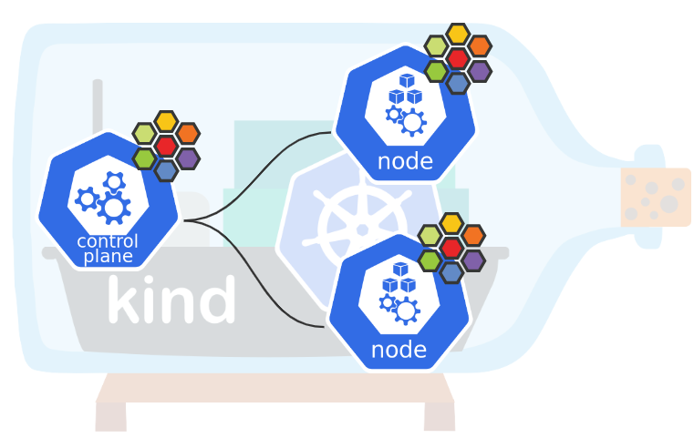
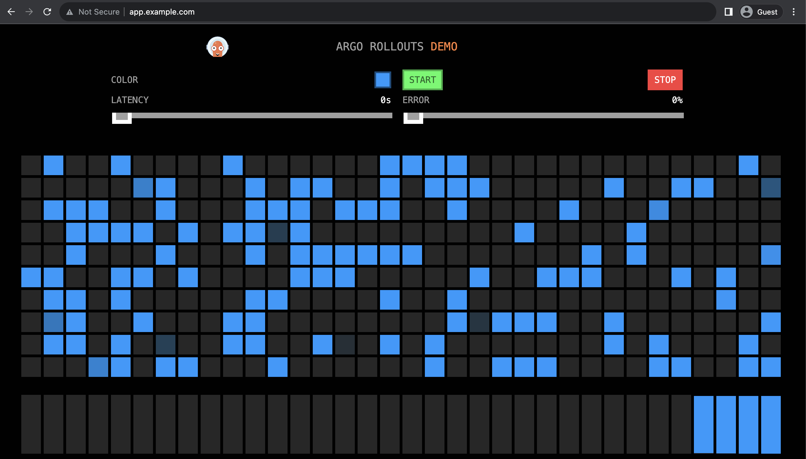

# Kubernetesクラスターの作成

## はじめに

この章では、以降の章で使用するKubernetesクラスターを作成します。

Kubernetesクラスターを作成する方法はいくつかありますが、今回のハンズオンではkindを利用してKubernetesクラスターを作成します。
構成としてはControl Plane 1台とWorker Node 2台の構成で作成します。
また、CNIとしてCiliumをデプロイします。
Ciliumの詳細は[chapter_cilium](../chapter_cilium/)にて説明します。



はじめに、Kubernetesクラスターの構築に必要な下記ツールをインストールします。

- [kind](https://kind.sigs.k8s.io/)
- [kubectl](https://kubernetes.io/ja/docs/reference/kubectl/)
- [Cilium CLI](https://github.com/cilium/cilium-cli)
- [Helm](https://helm.sh/ja/)
- [Helmfile](https://helmfile.readthedocs.io/en/latest/)

この章での作業ディレクトリは以下です。

```sh
cd cnd-handson/chapter_cluster-create/
```

kindはDockerを使用してローカル環境にKubernetesクラスターを構築するためのツールになります。
また、kubectlはKubernetes APIを使用してKubernetesクラスターのコントロールプレーンと通信をするためのコマンドラインツールです。
Cilium CLIはCiliumが動作しているKubernetesクラスターの管理やトラブルシュート等を行うためのコマンドラインツールになります。
HelmはKubernetes用のパッケージマネージャーであり、Helmfileを使用することで複数のHelmチャートを宣言的に管理できます。
各ツールの詳細については上記リンクをご参照ください。

上記のツールは`install-tools.sh`を実行することでインストールされます。

```shell
./install-tools.sh
```

インストールスクリプトの中で、ログインユーザを docker グループに所属させる設定を入れています。
一旦ログアウトしてログインし直してください。

> [!WARNING]
>
> [Known Issue#Pod errors due to "too many open files"](https://kind.sigs.k8s.io/docs/user/known-issues/#pod-errors-due-to-too-many-open-files)に記載があるように、kindではホストのinotifyリソースが不足しているとエラーが発生します。
> ハンズオン環境ではinotifyリソースが不足しているため、sysctlを利用してカーネルパラメータを修正する必要があります。
> ```shell
> sudo sysctl fs.inotify.max_user_watches=524288
> sudo sysctl fs.inotify.max_user_instances=512
> ```
>
> また、設定の永続化を行うためには、下記のコマンドを実行する必要があります。
> ```shell
> cat << EOF | sudo tee /etc/sysctl.conf >/dev/null
> fs.inotify.max_user_watches = 524288
> fs.inotify.max_user_instances = 512
> EOF
> ```

構築するKubernetesクラスターの設定は`kind-config.yaml`で行います。
今回は下記のような設定でKubernetesクラスターを構築します。
- ホスト上のポートを下記のようにkind上のControl Planeのポートにマッピング
  -    80 -> 30080
  -   443 -> 30443
  -  8080 -> 31080
  -  8443 -> 31443
  - 18080 -> 32080
  - 18443 -> 32443
- CiliumをCNIとして利用するため、DefaultのCNIの無効化
- Ciliumをkube-proxyの代替として利用するため、kube-proxyの無効化

configオプションで`kind-config.yaml`を指定してKubernetesクラスターを作成します。

```shell
kind create cluster --config=kind-config.yaml
```

コマンドを実行すると以下のような情報が出力されます。

```shell
Creating cluster "kind" ...
 ✓ Ensuring node image (kindest/node:v1.35.0) 🖼 
 ✓ Preparing nodes 📦 📦 📦  
 ✓ Writing configuration 📜 
 ✓ Starting control-plane 🕹️ 
 ✓ Installing StorageClass 💾 
 ✓ Joining worker nodes 🚜 
Set kubectl context to "kind-kind"
You can now use your cluster with:

kubectl cluster-info --context kind-kind

Have a question, bug, or feature request? Let us know! https://kind.sigs.k8s.io/#community 🙂
```

> [!NOTE]
>
> kubectlコマンドの実行時には、Kubernetesクラスターに接続するための認証情報などが必要になります。
> それらの情報は、kindでクラスターを作成した際に保存され、デフォルトで`~/.kube/config`に格納されます。
> このファイルに格納される情報は、kindコマンドを利用しても取得することが可能です
>
> ```shell
> kind get kubeconfig
>
> # ubuntu ユーザー（一般ユーザー）で実行する場合
> mkdir ~/.kube
> kind get kubeconfig > ~/.kube/config
> ```

最後に、下記のコンポーネントをデプロイします。

- [Gateway API](https://gateway-api.sigs.k8s.io/)
- [Cilium](https://cilium.io/)
- [Ingress NGINX Controller](https://github.com/kubernetes/ingress-nginx)

Gateway APIはKubernetesクラスター外からKubernetesクラスター内のServiceへのトラフィックを管理するためのものです。
Ciliumについては[chapter_cilium](../chapter_cilium/)で説明するのでそちらを参照してください。
Ingress NGINX Controllerはインターネットからkind上のServiceリソースへ通信をルーティングするためにインストールします。
各コンポーネントの詳細については上記リンクをご参照ください。

まず、最初にGateway APIのCRDをデプロイします。

```shell
kubectl apply --server-side -f https://github.com/kubernetes-sigs/gateway-api/releases/download/v1.4.1/standard-install.yaml
kubectl apply --server-side -f https://github.com/kubernetes-sigs/gateway-api/releases/download/v1.4.1/experimental-install.yaml
```

Gateway API以外のコンポーネントはhelmfileコマンドを利用することでデプロイできます。

```shell
helmfile sync -f helm/helmfile.yaml
```

> [!NOTE]
>
> Kubernetesのイングレスコントローラーとして、Ingress NGINX Controllerをインストールしていますが、Cilium自体もKubernetes Ingressリソースをサポートしています。
> こちらに関しては、[chapter_cilium](../chapter_cilium/)にて説明します。

## kubectlコマンドのシェル補完の有効化

tabキーで補完が効くように、kubectlコマンドのシェル補完を有効化します。

```sh
source <(kubectl completion bash)
```

次回以降もbash起動時にシェル補完を有効化する場合は下記のコマンドも実行しておきます。

```sh
echo 'source <(kubectl completion bash)' >>~/.bashrc
```

## Kubernetesクラスターへの接続確認

まずはKubernetesクラスターの情報が取得できることを確認します。

```shell
kubectl cluster-info
```

下記のような情報が出力されれば大丈夫です。

```shell
Kubernetes control plane is running at https://127.0.0.1:44707
CoreDNS is running at https://127.0.0.1:44707/api/v1/namespaces/kube-system/services/kube-dns:dns/proxy

To further debug and diagnose cluster problems, use 'kubectl cluster-info dump'.
```

> [!NOTE]
>
> [End-To-End Connectivity Testing](https://docs.cilium.io/en/stable/contributing/testing/e2e/#end-to-end-connectivity-testing)に記載があるように、Cilium CLIを利用することでEnd-To-Endのテストを行うこともできます。このテストは10分ほどかかります。
> ```shell
> cilium connectivity test
> ```

## アプリケーションのデプロイ
次章以降で使用する動作確認用アプリケーションとして、[Argo Rollouts Demo Application](https://github.com/argoproj/rollouts-demo)をデプロイします。

```shell
kubectl create namespace handson
kubectl apply -f manifest/app/serviceaccount.yaml -n handson -l color=blue
kubectl apply -f manifest/app/deployment.yaml -n handson -l color=blue
kubectl apply -f manifest/app/service.yaml -n handson
kubectl apply -f manifest/app/ingress.yaml -n handson
```

作成されるリソースは下記のとおりです。

```shell
kubectl get services,deployments,ingresses -n handson
```
```shell
# 実行結果
NAME              TYPE        CLUSTER-IP     EXTERNAL-IP   PORT(S)    AGE
service/handson   ClusterIP   10.96.82.202   <none>        8080/TCP   3m33s

NAME                           READY   UP-TO-DATE   AVAILABLE   AGE
deployment.apps/handson-blue   1/1     1            1           3m34s

NAME                                             CLASS   HOSTS             ADDRESS       PORTS   AGE
ingress.networking.k8s.io/app-ingress-by-nginx   nginx   app.example.com   10.96.54.28   80      3m9s
```

ブラウザから`http://app.example.com`に接続し、下記のような画面が表示されることを確認してください。


