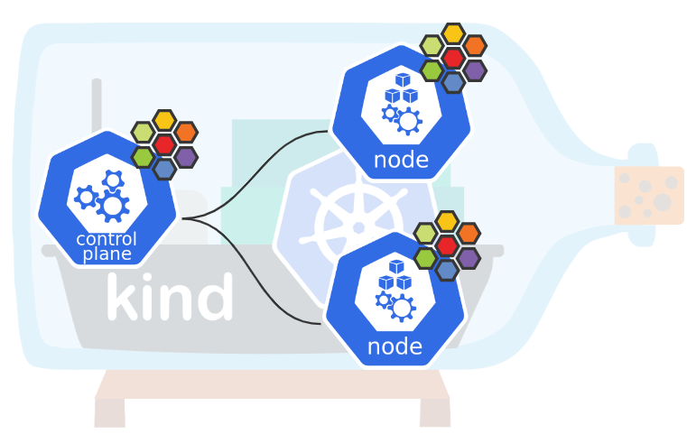
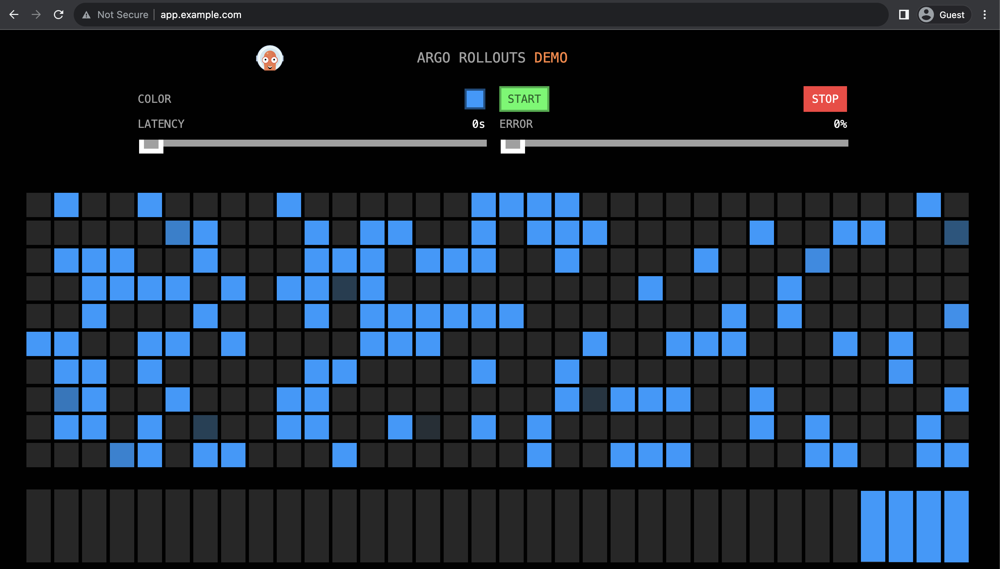

# Kubernetesクラスターの作成

## はじめに

この章では、以降の章で使用するKubernetesクラスターを作成します。

Kubernetesクラスターを作成する方法はいくつかありますが、今回のハンズオンではkindを利用してKubernetesクラスターを作成します。
構成としてはControl Plane 1台とWorker Node 2台の構成で作成します。
また、CNIとしてCiliumをデプロイします。
Ciliumの詳細は[chapter_cilium](../chapter_cilium/)にて説明します。



はじめに、Kubernetesクラスターの構築に必要な下記ツールをインストールします。

- [kind](https://kind.sigs.k8s.io/)
- [kubectl](https://kubernetes.io/ja/docs/reference/kubectl/)
- [Cilium CLI](https://github.com/cilium/cilium-cli)
- [Helm](https://helm.sh/ja/)
- [Helmfile](https://helmfile.readthedocs.io/en/latest/)

この章での作業ディレクトリは以下です。

```sh
cd cnd-handson/chapter_cluster-create/
```

kindはDockerを使用してローカル環境にKubernetesクラスターを構築するためのツールになります。
また、kubectlはKubernetes APIを使用してKubernetesクラスターのコントロールプレーンと通信をするためのコマンドラインツールです。
Cilium CLIはCiliumが動作しているKubernetesクラスターの管理やトラブルシュート等を行うためのコマンドラインツールになります。
HelmはKubernetes用のパッケージマネージャーであり、Helmfileを使用することで複数のHelmチャートを宣言的に管理できます。
各ツールの詳細については上記リンクをご参照ください。

上記のツールは`install-tools.sh`を実行することでインストールされます。

```shell
./install-tools.sh
```

インストールスクリプトの中で、ログインユーザを docker グループに所属させる設定を入れています。
一旦ログアウトしてログインし直してください。

> [!WARNING]
>
> [Known Issue#Pod errors due to "too many open files"](https://kind.sigs.k8s.io/docs/user/known-issues/#pod-errors-due-to-too-many-open-files)に記載があるように、kindではホストのinotifyリソースが不足しているとエラーが発生します。
> ハンズオン環境ではinotifyリソースが不足しているため、sysctlを利用してカーネルパラメータを修正する必要があります。
> ```shell
> sudo sysctl fs.inotify.max_user_watches=524288
> sudo sysctl fs.inotify.max_user_instances=512
> ```
>
> また、設定の永続化を行うためには、下記のコマンドを実行する必要があります。
> ```shell
> cat << EOF | sudo tee /etc/sysctl.conf >/dev/null
> fs.inotify.max_user_watches = 524288
> fs.inotify.max_user_instances = 512
> EOF
> ```

構築するKubernetesクラスターの設定は`kind-config.yaml`で行います。
今回は下記のような設定でKubernetesクラスターを構築します。
- ホスト上のポートを下記のようにkind上のControl Planeのポートにマッピング

  | 用途 | ホスト側のポート | Control Plane側のポート |
  | --- | --- | --- |
  | Gateway API (Envoy Gateway) | 80 | 30080 |
  | Cilium Ingress | 8080 | 31080 |
  | Cilium Ingress (HTTPS) | 8443 | 31443 |
  | Istio Ingress Gateway | 18080 | 32080 |
  | Istio Ingress Gateway (HTTPS) | 18443 | 32443 |

- CiliumをCNIとして利用するため、DefaultのCNIの無効化
- Ciliumをkube-proxyの代替として利用するため、kube-proxyの無効化

configオプションで`kind-config.yaml`を指定してKubernetesクラスターを作成します。

```shell
kind create cluster --config=kind-config.yaml
```

コマンドを実行すると以下のような情報が出力されます。

```shell
Creating cluster "kind" ...
 ✓ Ensuring node image (kindest/node:v1.36.4) 🖼 
 ✓ Preparing nodes 📦 📦 📦  
 ✓ Writing configuration 📜 
 ✓ Starting control-plane 🕹️ 
 ✓ Installing StorageClass 💾 
 ✓ Joining worker nodes 🚜 
Set kubectl context to "kind-kind"
You can now use your cluster with:

kubectl cluster-info --context kind-kind

Have a question, bug, or feature request? Let us know! https://kind.sigs.k8s.io/#community 🙂
```

> [!NOTE]
>
> kubectlコマンドの実行時には、Kubernetesクラスターに接続するための認証情報などが必要になります。
> それらの情報は、kindでクラスターを作成した際に保存され、デフォルトで`~/.kube/config`に格納されます。
> このファイルに格納される情報は、kindコマンドを利用しても取得することが可能です
>
> ```shell
> kind get kubeconfig
>
> # ubuntu ユーザー（一般ユーザー）で実行する場合
> mkdir ~/.kube
> kind get kubeconfig > ~/.kube/config
> ```

最後に、下記のコンポーネントをデプロイします。

- [Gateway API](https://gateway-api.sigs.k8s.io/)
- [Cilium](https://cilium.io/)
- [Envoy Gateway](https://gateway.envoyproxy.io/)

Gateway APIはKubernetesクラスター外からKubernetesクラスター内のServiceへのトラフィックを管理するためのAPIです。
従来Ingressリソースが担っていた役割を、より表現力の高いリソース（GatewayClass、Gateway、HTTPRouteなど）に分割して定義できるようになっています。
なお、これまでのハンズオンではIngress NGINX Controllerを利用していましたが、
[Ingress NGINX Controllerは2026年3月をもって開発・メンテナンスが終了](https://kubernetes.io/blog/2025/11/11/ingress-nginx-retirement/)しており、
KubernetesコミュニティからもGateway APIへの移行が推奨されています。
そのため、このハンズオンでもGateway APIを利用する構成に変更しています。

Gateway APIはあくまでAPIの仕様なので、実際にトラフィックを捌くコントローラー（実装）が別途必要になります。
実装は[複数存在](https://gateway-api.sigs.k8s.io/implementations/)しますが、このハンズオンではEnvoy Gatewayを利用します。
Envoy GatewayはEnvoy Proxyをデータプレーンとして利用するGateway APIの実装で、CNCFのプロジェクトです。
Ciliumについては[chapter_cilium](../chapter_cilium/)で説明するのでそちらを参照してください。
各コンポーネントの詳細については上記リンクをご参照ください。

> [!NOTE]
>
> Cilium自身もGateway APIの実装を持っています（[chapter_cilium](../chapter_cilium/)で扱います）が、
> このハンズオンではCNIとしてのCiliumとGateway APIの実装を分けて理解できるように、
> クラスター全体の入り口はEnvoy Gatewayが担当する構成にしています。

まず、最初にGateway APIのCRDをデプロイします。
Gateway APIはKubernetes本体には含まれておらず、CRDとして追加する必要があります。
Envoy Gateway v1.9が対応しているGateway APIはv1.6.1です。

```shell
kubectl apply --server-side -f https://github.com/kubernetes-sigs/gateway-api/releases/download/v1.6.1/experimental-install.yaml
```

> [!NOTE]
>
> experimental-install.yamlはstandard-install.yamlの内容をすべて含んでいます。
> standard-install.yamlを適用した後にexperimental-install.yamlを適用すると、
> standard-install.yamlに含まれるValidatingAdmissionPolicy（`safe-upgrades.gateway.networking.k8s.io`）によって拒否されるため、
> experimental-install.yamlのみを適用します。

続いて、Envoy Gateway独自のCRD（EnvoyProxyなど）をデプロイします。
これらのCRDはサイズが大きく、Helmのリリースとしてインストールするとリリース情報を保存するSecretの上限（1MiB）を超えてしまうため、
`helm template`でレンダリングした結果を`kubectl apply --server-side`で適用します。

```shell
helm template envoy-gateway-crds oci://docker.io/envoyproxy/gateway-crds-helm --version v1.9.1 -f helm/values/envoy-gateway-crds.values.yaml | kubectl apply --server-side -f -
```

CiliumとEnvoy Gatewayはhelmfileコマンドを利用することでデプロイできます。

```shell
helmfile sync -f helm/helmfile.yaml
```

デプロイが完了したら、Envoy Gatewayのコントローラーが起動していることを確認します。

```shell
kubectl get pods -n envoy-gateway-system
```

```shell
# 実行結果
NAME                             READY   STATUS      RESTARTS   AGE
envoy-gateway-6d8f4d6b8c-xxxxx   1/1     Running     0          60s
```

> [!NOTE]
>
> `helm/helmfile.yaml`では`needs`を指定して、Cilium → Envoy Gatewayの順にデプロイされるようにしています。
> Envoy GatewayのインストールにはPodを起動するJob（証明書生成）が含まれるため、
> CNIであるCiliumが先に動作している必要があるためです。

## kubectlコマンドのシェル補完の有効化

tabキーで補完が効くように、kubectlコマンドのシェル補完を有効化します。

```sh
source <(kubectl completion bash)
```

次回以降もbash起動時にシェル補完を有効化する場合は下記のコマンドも実行しておきます。

```sh
echo 'source <(kubectl completion bash)' >>~/.bashrc
```

## Kubernetesクラスターへの接続確認

まずはKubernetesクラスターの情報が取得できることを確認します。

```shell
kubectl cluster-info
```

下記のような情報が出力されれば大丈夫です。

```shell
Kubernetes control plane is running at https://127.0.0.1:44707
CoreDNS is running at https://127.0.0.1:44707/api/v1/namespaces/kube-system/services/kube-dns:dns/proxy

To further debug and diagnose cluster problems, use 'kubectl cluster-info dump'.
```

> [!NOTE]
>
> [End-To-End Connectivity Testing](https://docs.cilium.io/en/stable/contributing/testing/e2e/#end-to-end-connectivity-testing)に記載があるように、Cilium CLIを利用することでEnd-To-Endのテストを行うこともできます。このテストは10分ほどかかります。
> ```shell
> cilium connectivity test
> ```

## Gatewayのデプロイ

このハンズオンでは、各chapterのアプリケーションがクラスター外からのトラフィックを受けるための共通の入り口として、
`gateway` Namespaceに`handson-gateway`という名前のGatewayリソースを1つ作成します。
以降の各chapterでは、このGatewayに対してHTTPRouteリソースを紐付けることでルーティングを設定していきます。

`manifest/gateway/gateway.yaml`では下記の3つのリソースを定義しています。

- `GatewayClass` ... どの実装（コントローラー）がGatewayを処理するかを宣言するリソース。ここではEnvoy Gatewayを指定しています
- `EnvoyProxy` ... Envoy Gatewayが起動するEnvoyの設定を行う、Envoy Gateway独自のリソース
- `Gateway` ... 実際の入り口となるリソース。HTTPの80番ポートでリクエストを受け付けます

`EnvoyProxy`では、Envoyを公開するServiceを`Type: NodePort`にして、NodePortを`30080`に固定しています。
今回のハンズオン環境にはクラウドプロバイダーのロードバランサーが存在せず、`Type: LoadBalancer`のままでは
EXTERNAL-IPが割り当てられないためです。
`kind-config.yaml`でホストの80番ポートをControl Planeの30080番ポートにマッピングしているので、
これでブラウザからGatewayへ到達できるようになります。

```shell
kubectl apply -f manifest/gateway/gateway.yaml
```

Gatewayが正しく構成されたことを確認します。`PROGRAMMED`が`True`になっていれば成功です。

```shell
kubectl get gatewayclass,gateway -n gateway
```

```shell
# 実行結果
NAME                                            CONTROLLER                                      ACCEPTED   AGE
gatewayclass.gateway.networking.k8s.io/cilium   io.cilium/gateway-controller                    True       5m
gatewayclass.gateway.networking.k8s.io/eg       gateway.envoyproxy.io/gatewayclass-controller   True       25s

NAME                                                CLASS   ADDRESS      PROGRAMMED   AGE
gateway.gateway.networking.k8s.io/handson-gateway   eg      172.18.0.3   True         25s
```

Gatewayを作成すると、Envoy Gatewayが`envoy-gateway-system` NamespaceにEnvoyのDeploymentとServiceを作成します。
Serviceが`NodePort`で`30080`を公開していることを確認します。

```shell
kubectl get svc -n envoy-gateway-system -l gateway.envoyproxy.io/owning-gateway-name=handson-gateway
```

```shell
# 実行結果
NAME                              TYPE       CLUSTER-IP      EXTERNAL-IP   PORT(S)        AGE
envoy-gateway-handson-gatew-xxx   NodePort   10.96.120.134   <none>        80:30080/TCP   30s
```

> [!NOTE]
>
> Gatewayリソースの`spec.listeners[].allowedRoutes.namespaces.from`には`All`を指定しています。
> これにより、どのNamespaceからでもこのGatewayにHTTPRouteを紐付けられるようになります。
> 本番環境では`Same`や`Selector`を利用して、Gatewayを利用できるNamespaceを制限することが推奨されます。

## アプリケーションのデプロイ
次章以降で使用する動作確認用アプリケーションとして、[Argo Rollouts Demo Application](https://github.com/argoproj/rollouts-demo)をデプロイします。

```shell
kubectl create namespace handson
kubectl apply -f manifest/app/serviceaccount.yaml -n handson -l color=blue
kubectl apply -f manifest/app/deployment.yaml -n handson -l color=blue
kubectl apply -f manifest/app/service.yaml -n handson
kubectl apply -f manifest/app/httproute.yaml -n handson
```

作成されるリソースは下記のとおりです。

```shell
kubectl get services,deployments,httproutes -n handson
```
```shell
# 実行結果
NAME              TYPE        CLUSTER-IP     EXTERNAL-IP   PORT(S)    AGE
service/handson   ClusterIP   10.96.82.202   <none>        8080/TCP   3m33s

NAME                           READY   UP-TO-DATE   AVAILABLE   AGE
deployment.apps/handson-blue   1/1     1            1           3m34s

NAME                                             HOSTNAMES             AGE
httproute.gateway.networking.k8s.io/handson      ["app.example.com"]   3m9s
```

HTTPRouteがGatewayに正しく紐付いたかどうかは、`status`を確認することで分かります。

```shell
kubectl get httproute handson -n handson -o jsonpath='{.status.parents[0].conditions}' | jq
```

```shell
# 実行結果（抜粋）
[
  {
    "message": "Accepted HTTPRoute",
    "reason": "Accepted",
    "status": "True",
    "type": "Accepted"
  },
  {
    "message": "Service reference is valid",
    "reason": "ResolvedRefs",
    "status": "True",
    "type": "ResolvedRefs"
  }
]
```

ブラウザから`http://app.example.com`に接続し、下記のような画面が表示されることを確認してください。


