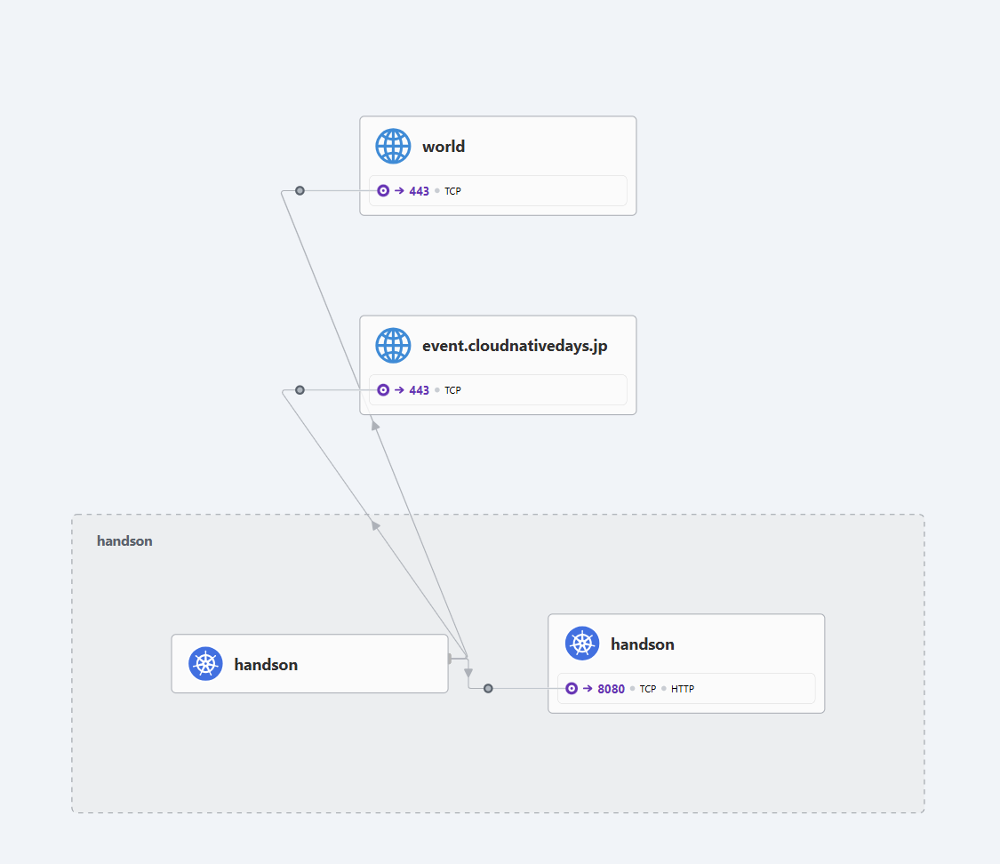

# Hubble

## はじめに

この節ではHubbleを利用したフロー情報の可視化について説明します。

## Hubbleの概要

HubbleはCiliumのために開発されたネットワークとセキュリティのObservabilityプラットフォームであり、
[Cilium Hubble Series (Part 1): Re-introducing Hubble](https://isovalent.com/blog/post/hubble-series-re-introducing-hubble/)で説明されるように、下記のコンポーネントで構成されます。


（ 出典：https://isovalent.com/blog/post/hubble-series-re-introducing-hubble/ ）

- Hubble Server
  - 各NodeのCilium Agentに組み込まれており、Prometheusメトリクスやネットワークおよびアプリケーションプロトコルレベルでのフロー情報の可視性を提供します
- Hubble Relay
  - クラスターをスコープとするHubble APIを提供します
- Hubble UI
  - グラフィカルなサービス依存関係マップと接続性マップを提供します
- Hubble CLI
  - コマンドラインバイナリであり、Hubble RelayのgRPC APIまたはローカルサーバーのいずれかに接続してフローイベントを取得します


## ステータス確認

Hubble RelayとHubble UIのステータスはciliumコマンドから確認可能です。

```shell
cilium status
```

```shell
    /¯¯\
 /¯¯\__/¯¯\    Cilium:             OK
 \__/¯¯\__/    Operator:           OK
 /¯¯\__/¯¯\    Envoy DaemonSet:    OK
 \__/¯¯\__/    Hubble Relay:       OK
    \__/       ClusterMesh:        disabled

DaemonSet              cilium-envoy       Desired: 3, Ready: 3/3, Available: 3/3
Deployment             hubble-ui          Desired: 1, Ready: 1/1, Available: 1/1
Deployment             hubble-relay       Desired: 1, Ready: 1/1, Available: 1/1
Deployment             cilium-operator    Desired: 2, Ready: 2/2, Available: 2/2
DaemonSet              cilium             Desired: 3, Ready: 3/3, Available: 3/3
Containers:            cilium             Running: 3
                       cilium-envoy       Running: 3
                       hubble-ui          Running: 1
                       cilium-operator    Running: 2
                       hubble-relay       Running: 1
Cluster Pods:          8/8 managed by Cilium
Helm chart version:    1.16.1
Image versions         hubble-relay       quay.io/cilium/hubble-relay:v1.16.1@sha256:2e1b4c739a676ae187d4c2bfc45c3e865bda2567cc0320a90cb666657fcfcc35: 1
                       cilium             quay.io/cilium/cilium:v1.16.1@sha256:0b4a3ab41a4760d86b7fc945b8783747ba27f29dac30dd434d94f2c9e3679f39: 3
                       cilium-envoy       quay.io/cilium/cilium-envoy:v1.29.7-39a2a56bbd5b3a591f69dbca51d3e30ef97e0e51@sha256:bd5ff8c66716080028f414ec1cb4f7dc66f40d2fb5a009fff187f4a9b90b566b: 3
                       hubble-ui          quay.io/cilium/hubble-ui:v0.13.1@sha256:e2e9313eb7caf64b0061d9da0efbdad59c6c461f6ca1752768942bfeda0796c6: 1
                       hubble-ui          quay.io/cilium/hubble-ui-backend:v0.13.1@sha256:0e0eed917653441fded4e7cdb096b7be6a3bddded5a2dd10812a27b1fc6ed95b: 1
                       cilium-operator    quay.io/cilium/operator-generic:v1.16.1@sha256:3bc7e7a43bc4a4d8989cb7936c5d96675dd2d02c306adf925ce0a7c35aa27dc4: 2
```

設定自体はすでに[chapter Cluster Create](./../chapter_cluster-create)で行っているため、Hubble-uiとHubble-relayが動作しています。
Helmを利用してアプライする場合、Hubble RelayとHubble UIのデプロイはそれぞれ`hubble.relay.enabled=true`と`hubble.ui.enabled=true`で設定可能です。
また、Ciliumが管理するKubernetes Podのネットワークを監視するために、Hubbleのメトリクスを有効化する設定を入れています。
使用可能なメトリクスに関しては、[Hubble Exported Metrics](https://docs.cilium.io/en/stable/observability/metrics/#hubble-exported-metrics)を参照ください。

## 動作確認

### Hubble Relayへのアクセス

概要で説明した通り、Hubble Relayへアクセスする方法として下記の2種類の方法があります。

- Hubble CLIを利用する方法
- Hubble UIを利用する方法

それぞれについて説明します。

### Hubble CLIの利用

Hubble CLIを利用してHubble Relayにアクセスします。

まずは、Hubble CLIをインストールします。

```shell
./install-tools.sh
```

次に、Hubble RelayへのReachabilityを確保します。
下記コマンドを実行することでReachabilityを確保できます。

```shell
cilium hubble port-forward &
```

> [!NOTE]
> 
> &をつけることによって、cilium hubble port-forwardコマンドをバックグラウンド実行しています。
> 本ページのリソース削除手順にも記載の通り、終了時は必ずcilium hubble port-forwardコマンドを忘れずにkillしてください。

下記コマンドでport-forwardがバックグラウンド実行されていることを確認します。

```shell
ps -eo pid,tty,cmd | grep "cilium hubble port-forward"
```
```shell
 9814 pts/0    cilium hubble port-forward
11775 pts/0    grep --color=auto cilium hubble port-forward
```

> [!NOTE]
>   
> ciliumコマンドではなく、下記のようなkubectlコマンドを実行することでもReachabilityを確保可能です。
> ```shell
> kubectl port-forward -n kube-system deploy/hubble-relay 4245:4245 &
> ```
> 
> port-forwardコマンドがバックグラウンドを実行されているかどうかは、下記コマンドで確認できます。
> ```
> ps -eo pid,tty,cmd | grep "kubectl port-forward -n kube-system deploy/hubble-relay"
> ```
> ```
> 12294 pts/0    kubectl port-forward -n kube-system deploy/hubble-relay 4245:4245
> 12427 pts/0    grep --color=auto kubectl port-forward -n kube-system deploy/hubble-relay
> ```

下記コマンドでStatusを確認し、HealthcheckがOKとなっていることを確認します。

```shell
hubble status
```
```shell
Healthcheck (via localhost:4245): Ok
Current/Max Flows: 7,479/12,285 (60.88%)
Flows/s: 33.34
Connected Nodes: 3/3
```

Hubble Relay経由で取得したHubble Serverのフロー情報は、下記コマンドで出力できます。

```shell
hubble observe flows
```

コマンドを実行すると下記のような情報が出力されます。


### Hubble UIの利用

Hubble UIからHubble Relayにアクセスし、Hubble Serverの情報を取得します。

Hubble UIへアクセスするために、Ingressリソースを作成します。

```shell
kubectl apply -f manifest/ingress.yaml
```

ブラウザで`hubble.cilium.vmXX.handson.cloudnativedays.jp:8080`にアクセスしkube-systemのnamespaceを確認すると、下記のような画面が出力されます。
これより、インターネット側からingress-nginxの80ポートにアクセスがあり、その後hubble-uiの8081ポートにアクセスしていることが分かります。


### Layer 7のイベントを可視化する

デフォルトではL3/L4のイベントのみ可視化の対象となっています。
L7のイベントを可視化の対象とするためには、CiliumNetworkPolicyリソースを作成し、CiliumNetworkPolicyのルールに一致させる必要があります。

> [!NOTE]
> 
> L7プロトコルを可視化する方法として、Podのannotationを利用する方法もありましたが、2023/11時点の最新のドキュメントではCiliumNetworkPolicyを利用する方法が推奨されています。  
> see: https://github.com/cilium/cilium/blob/82dbff8e5a5f7ced99e96cd85997fae90e035aac/Documentation/observability/visibility.rst

確認用にcurlを実行可能なクラアントを立てます。

```shell
kubectl run curl -n handson --image=curlimages/curl --command -- sleep infinity
```

別ターミナルを開き、hubbleで観測したイベントを流しておきます。

```shell
hubble observe flows --from-pod handson/curl -f
```

先ほど立てたクライアントからhandson:8080にアクセスしてみます。

```shell
kubectl exec -n handson curl -- /bin/sh -c "curl -s -o /dev/null handson:8080 -w '%{http_code}\n'"
```

するとhubble側では下記のような情報が出力されます。


L3/L4のイベントが可視化されており、ドメイン名やリクエストパスなどのL7の情報が表示されていないことが分かります。  
L7のイベントを可視化の対象とするために、ポート8080への通信がルールに含まれる下記CiliumNetworkPolicyを適用します。

```shell
kubectl apply -f manifest/cnp_http-visibility.yaml
```

先ほどと同様に、クライアントから`handson:8080`にアクセスしてみます。

```shell
kubectl exec -n handson curl -- /bin/sh -c "curl -s -o /dev/null handson:8080 -w '%{http_code}\n'"
```

今回はhandson:8080宛の通信がCiliumNetworkPolicyの対象となるため、hubble側でL7の情報が確認できるようになります。


### 外部ドメインを可視化する

クラスター外のドメインはkube-dnsやCoreDNSといったクラスター内のDNSサーバで解決されます。
DNSサーバへの通信を可視化の対象とすることで、通信が発生した外部ドメインを確認することが可能になります。

まず、現在の状態でクラスター外のドメイン`event.cloudnativedays.jp`にアクセスしてみます。

```shell
kubectl exec -n handson curl -- /bin/sh -c "curl -s -o /dev/null https://event.cloudnativedays.jp/ -w '%{http_code}\n'"
```

すると、下記のIPアドレスにアクセスがあることが分かります。


次に下記のManifestをアプライしてkube-dnsへの通信をCiliumNetworkPolicyのルールに含めます。

```shell
kubectl apply -f manifest/cnp_dns-visibility.yaml
```

再度、クラスター外のドメイン`event.cloudnativedays.jp`にアクセスしてみます。

```shell
kubectl exec -n handson curl -- /bin/sh -c "curl -s -o /dev/null https://event.cloudnativedays.jp/ -w '%{http_code}\n'"
```

すると、DNSクエリが可視化の対象となり、IPアドレスではなく、どのドメインにアクセスしたのかが分かるようになります。


また、上記の情報はHubble-UIにてhandsonのnamespaceからも確認可能です。




確認が終わったら、バックグラウンドで動かしたプロセスと本章でデプロイしたリソースを削除しておきます。
まず、バックグラウンドで動かしたプロセスを再度確認します。

```shell
ps -eo pid,tty,cmd | grep "cilium hubble port-forward"
```
```shell
 9814 pts/0    cilium hubble port-forward
11775 pts/0    grep --color=auto cilium hubble port-forward
```

この例では、該当プロセス番号が9814だったため、プロセスを終了するkillコマンドで9814を指定します。

```shell
kill 9814
```

その後、本章でデプロイしたリソースを削除します。

```shell
kubectl delete -Rf manifest
kubectl delete -n handson pod curl --force
```

## Grafanaを利用した可視化について

CiliumとHubbleから取得したメトリクスはGrafanaのダッシュボードから確認可能です。
[Monitoring & Metrics](https://docs.cilium.io/en/stable/observability/metrics/)に記載があるように、
Ciliumからはcilium-agentやcilium-envoy、cilium-operatorに関するCilium自身のメトリクスを取得でき、
HubbleからはCiliumが管理するPodのネットワーク動作に関するメトリクスを取得できます。

第2章でCilium/Hubbleに関するGrafanaダッシュボードも設定しているため、アクセスして確認してみてください。


