# Istio Ambient Mode
Istioの新しいデータプレーンであるIstio ambient modeを使用して、サービスメッシュ内のトラフィック管理、可視化をどのように実現するのか体験します。

なお、本chapterでは、Istio、およびサービスメッシュの内容には触れていませんので、詳細に関しては、[chapter_istio](../chapter_istio/README.md)を参照してください。

## 目次
- [概要](#概要)
- [データプレーン構成](#データプレーン構成)
- [セットアップ](#セットアップ)
- [L4アクセス管理](#L4アクセス管理)
- [L7アクセス管理](#L7アクセス管理)
- [まとめ](#まとめ)
- [最終クリーンアップ](#最終クリーンアップ)

## 概要
Istio ambientモードは、サイドカーを使用しない新しいデータプレーンモードで、このモードで作成されるサービスメッシュをIstio ambient meshと呼びます。従来のサイドカーモードのIstioは多くの本番運用実績がありますが、データプレーンとアプリケーションの分離ができず、下記のような課題があげられています。

- データプレーンはサイドカーとしてアプリケーションpodに注入されるため、Istioデータプレーンのインストール、アップグレード時はpodの再起動が必要になり、アプリケーションワークロードを阻害してしまう
- データプレーンが提供する機能の選択ができないため、一部の機能(mTLS実装のみ等)しか使用しないワークロードにとっては不要なリソースをpodに確保する必要があり、全体のリソースを効率的に使用できなくなる
- HTTP準拠でないアプリケーション実装をしている場合、解析エラーや、誤ったL7プロトコルの解釈を引き起こす可能性がある

Istio ambientモードはこれらの問題を解決する目的で、Google, Solo.ioが主導して開発が始まりました。2023年2月に[main branchにマージ](https://github.com/istio/istio/pull/43422)されて以来、2024年5月にリリースされたv1.22で[production-readyなベータ版](https://istio.io/latest/news/releases/1.22.x/announcing-1.22/#ambient-mode-now-in-beta)となり、2024年11月にリリースされたv1.24でついに[GA](https://istio.io/latest/news/releases/1.24.x/announcing-1.24/#ambient-mode-is-generally-available)となりました。

## データプレーン構成
L4、L7機能の全てを管理しているサイドカーモードとは異なり、ambientモードではデータプレーンの機能を2つの層に分けて管理をします。

- Secure overlay layer
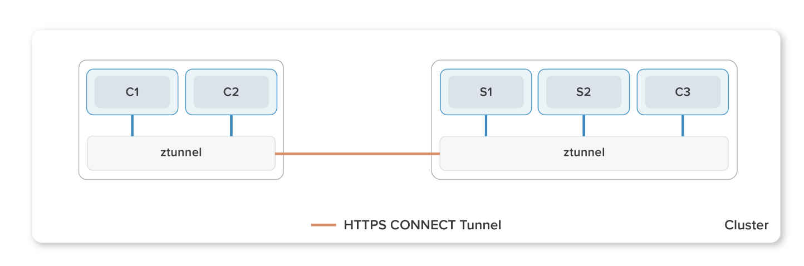

(出展元: https://istio.io/v1.16/blog/2022/introducing-ambient-mesh/)

サービスメッシュ内のワークロード間のセキュアな通信を確立する層で、[ztunnel](https://github.com/istio/ztunnel)というコンポーネントによって管理されます。Ztunnelの主な役割は1)通信暗号のためのmTLS確立、2)L4レベルの認可、3)TCPメトリクス、ログ収集です。

ZtunnelはKubernetes DaemonSetとしてデプロイされます。サイドカーモードでは、Envoyが各pod内で通信のproxyをしますが、ambientモードではztunnelがメッシュ内のワークロードをnode単位でproxyします。また、サービスメッシュ内のKubernetes node間通信は、Istio v1.16リリースで公開されたHTTP/2のCONNECTメソッドをベースにした[HBONE](https://istio.io/latest/news/releases/1.16.x/announcing-1.16/#hbone-for-sidecars-and-ingress-experimental)(HTTP-Based Overlay Network Environment)というトンネリングプロトコルを用いたmTLS接続によって行われます。

- Waypoint proxy layer
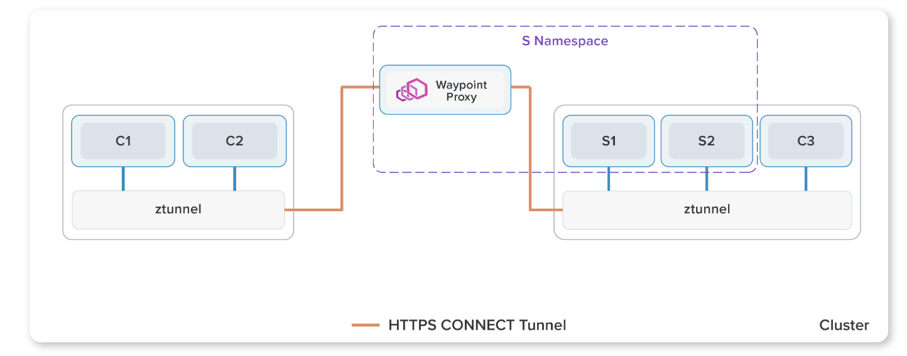

(出展元: https://istio.io/v1.16/blog/2022/introducing-ambient-mesh/)

1)HTTPプロトコル、2)L7レベルの認可、3)HTTPメトリクス、ログ収集等のL7の管理をする層です。Waypoint proxyの実態はEnvoyをベースとした[Istio Proxy](https://github.com/istio/proxy)コンテナイメージを使用した[Kubernetes Gateway API](https://gateway-api.sigs.k8s.io/)のGatewayリソースが作成、管理するKubernetes podです。Ztunnelによるsecure overlay layer作成後にKubernetes namespaceごとにwaypoint proxyを作成することで、Istioが提供するL7機能を使用することができます。また、waypoint proxyはワークロード(Kubernetes pod IP、VM IP)、または、Kubernetes service単位で作成することができます。Waypoint proxyが作成されると、ztunnelによって作成されたsecure overlay layerはトラフィックをwaypoint proxyにルーティングすることでL7機能が使えるようになります。

## セットアップ
> [!NOTE]
>
> Istio ambientモードではCNIとしてCiliumを使用することができますが、制限事項があります。[chapter_cluster-create](../chapter_cluster-create/)はCNIとしてCiliumを使用しているため、本chapter用に新たにKind clusterを作成します。
> 制限事項につきましては、 [Ciliumのドキュメント](https://docs.cilium.io/en/stable/network/servicemesh/istio/#istio-configuration)を参照してください。

### Kubernetesクラスター作成

```sh
kind create cluster --config kind/config.yaml
```

Kubernetesクラスター作成後、現在のKubernetes contextが`kind-istio-ambient`であることを確認してください。

```sh
kubectl config current-context
```

```sh
# 結果表示
kind-istio-ambient

```
もし、結果が異なる場合は、contextを変更してください(`kind-istio-ambient`の場合はスキップしてください)。

```sh
kubectl config use-context kind-istio-ambient
```

現在のnodeを確認してください。

```sh
kubectl get nodes
```

```sh
# 実行結果
NAME                          STATUS   ROLES           AGE     VERSION
istio-ambient-control-plane   Ready    control-plane   2m33s   v1.31.0
istio-ambient-worker          Ready    <none>          2m17s   v1.31.0
```

### インストール
Istio ambientコンポーネントと併せて、Kiali, Prometheusをインストールします。PrometheusはKialiでグラフを表示するために必要となります。

> [!NOTE]
>
> KialiはIstioサービスメッシュ用のコンソールであり、Kialiが提供するダッシュボードから、サービスメッシュの構造の確認、トラフィックフローの監視、および、サービスメッシュ設定の確認、変更をすることが可能です。本chapterでは説明は省略していますので、詳細は[こちら](https://kiali.io/docs/)をご確認ください。

```sh
helmfile sync -f helm/helmfile.yaml
```

作成されるリソースは下記のとおりです(Prometheusコンポーネントは省略しています。)

```sh
kubectl get services,daemonsets,deployments -n istio-system
```

```sh
# 実行結果(cluster IPは異なる可能性があります。)
NAME             TYPE        CLUSTER-IP      EXTERNAL-IP   PORT(S)                                 AGE
service/istiod   ClusterIP   10.96.45.99     <none>        15010/TCP,15012/TCP,443/TCP,15014/TCP   116s
service/kiali    NodePort    10.96.103.147   <none>        20001:32766/TCP                         86s

NAME                            DESIRED   CURRENT   READY   UP-TO-DATE   AVAILABLE   NODE SELECTOR            AGE
daemonset.apps/istio-cni-node   2         2         2       2            2           kubernetes.io/os=linux   86s
daemonset.apps/ztunnel          2         2         2       2            2           kubernetes.io/os=linux   86s

NAME                     READY   UP-TO-DATE   AVAILABLE   AGE
deployment.apps/istiod   1/1     1            1           116s
deployment.apps/kiali    1/1     1            1           86s
```

### アプリケーションのデプロイ
ハンズオン用のアプリケーションをデプロイします。

```sh
kubectl apply -f ../chapter_cluster-create/manifest/app/serviceaccount.yaml -l color=blue
kubectl apply -f ../chapter_cluster-create/manifest/app/deployment.yaml -l color=blue
kubectl apply -f ../chapter_cluster-create/manifest/app/service.yaml
```

作成されるリソースは下記のとおりです。

```sh
kubectl get services,deployments -l app=handson
```

```sh
# 実行結果(cluster IPは異なる可能性があります。)
NAME              TYPE        CLUSTER-IP   EXTERNAL-IP   PORT(S)    AGE
service/handson   ClusterIP   10.96.47.9   <none>        8080/TCP   7s

NAME                           READY   UP-TO-DATE   AVAILABLE   AGE
deployment.apps/handson-blue   1/1     1            1           8s
```

アプリケーションpodがambient meshの一部になるように、デプロイ先のKubernetes namespaceにラベルを追加します。

```sh
kubectl label namespace default istio.io/dataplane-mode=ambient
```
ラベルが追加されたことを確認してください。

```sh
kubectl get namespace default --show-labels
```

```sh
# 実行結果
NAME      STATUS   AGE     LABELS
default   Active   3m43s   istio.io/dataplane-mode=ambient,kubernetes.io/metadata.name=default
```

Ambient mesh内でアプリケーションが正しく起動しているかを確認をするために疎通確認を行います。なお、Kubernetes cluster外からはアクセス出来ないため、handsonアプリケーションのKubernetes serviceをポートフォワードしてホスト側から疎通確認を行います。

```sh
kubectl port-forward service/handson 8081:8080 >/dev/null &
```

アプリケーションにアクセスします。

```sh
curl -I http://127.0.0.1:8081/
```

HTTPステータスコード200が返却されれば疎通確認完了です。HTTPステータスコードが5XXを返した場合は、`handson-blue` ワークロードを再起動して再度疎通確認を行ってください。

(HTTPステータスコードが5XXの時のみ実施。)

```sh
kubectl rollout restart deploy/handson-blue
```

疎通確認完了後、port forwardを実行しているjobを停止します。

```sh
jobs
```

```sh
# 実行結果
[1]+  Running  kubectl port-forward service/handson 8081:8080 > /dev/null &
```

`kubectl port-forward`を実行しているjobを停止。

```sh
kill %1
```

### メッシュの可視化
Kialiを用いてIstioサービスメッシュ内のトラフィックを見てみましょう。Kialiはすでにインストールされており、外部からアクセス出来るようになっています。ブラウザから<http://kiali-ambient.vmXX.handson.cloudnativedays.jp:28080>にアクセスをしてKialiダッシュボードが表示されることを確認してください。

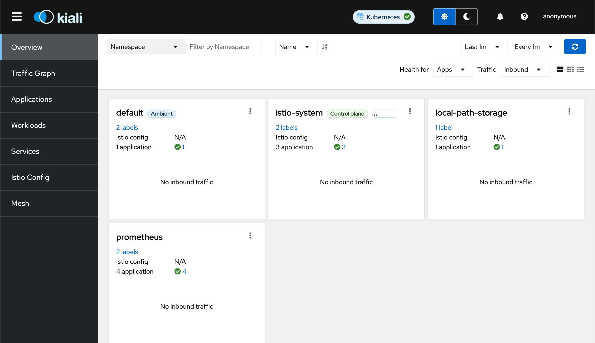

## L4アクセス管理
Ztunnelによって管理されるL4レベルのトラフィックに対し、Istio Authorization Policyを作成してアクセス管理を実装します。サービスメッシュ内において、あるワークロードに対して、特定のワークロードからのL4レベルでのアクセス制御をしたい時がユースケースとして挙げられます。本ケースでは、`handson-blue`ワークロードが待ち構えているport 8080へアクセスするワークロードを2つ用意し、ひとつのワークロードからは許可を、もうひとつからは拒否をするケースを想定します。

[セットアップ](#セットアップ)が完了していることを前提とします。

### Kialiグラフ設定
TCPトラフィックの状態を確認するために、TOP画面左のサイドメニューの`Traffic Graph`をクリックし、下記のとおり設定をしてください。
- `Namespace`の`default`にチェック

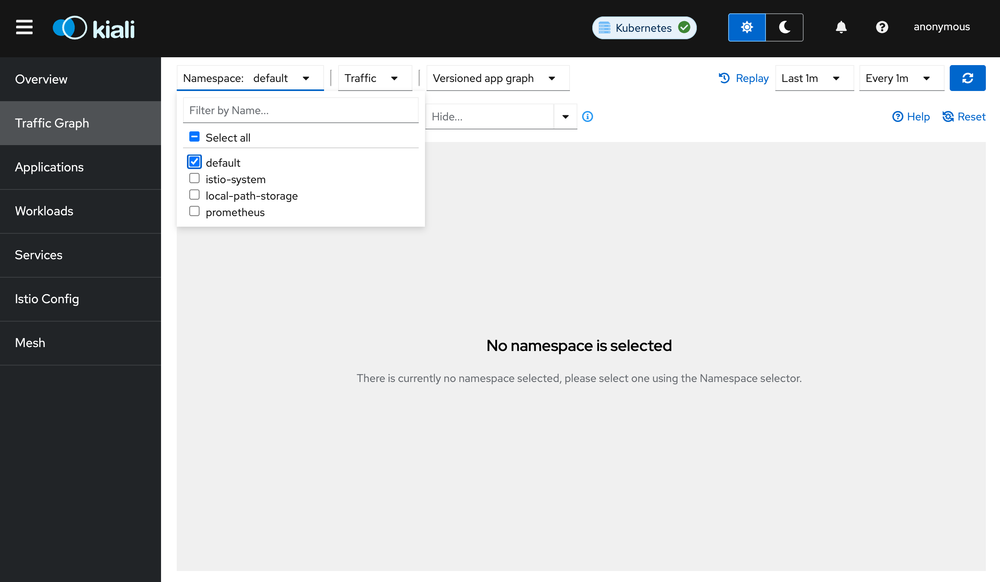

- `Traffic`の`Tcp`のみにチェック

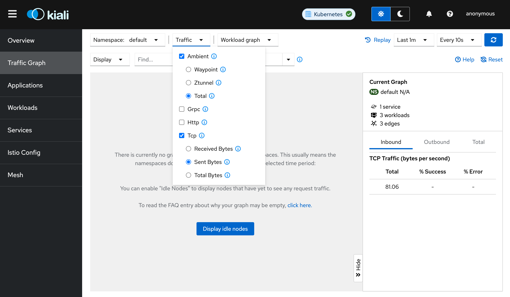

- `Versioned app graph`から`Workload graph`に変更

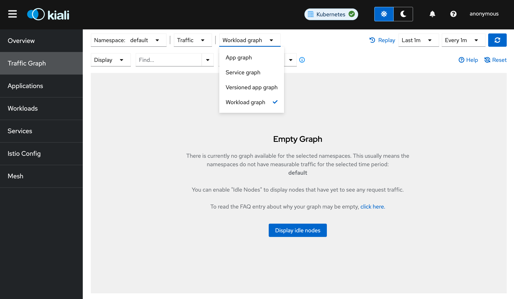

グラフの種類は他にも選択できますが、今回はアプリケーションのバージョン管理を行なっていないため、ワークロード単位でトラフィックの流れを可視化できるように`Workload graph`を選択しています。グラフの種類はIstio公式ドキュメントである、[Visualizing Your Mesh#Generating a graph](https://istio.io/latest/docs/tasks/observability/kiali/#generating-a-graph)の第9項を参照してください。

- グラフ更新期間を`Every 1m`から`Every 10s`に変更

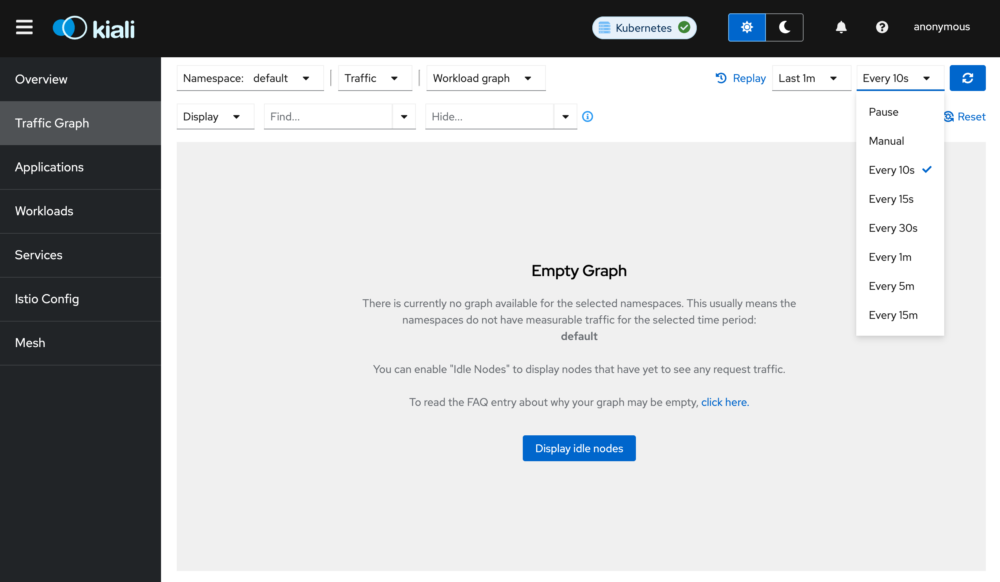

### 追加アプリケーションのデプロイ
`handson-blue`ワークロードにアクセスする追加のワークロード2つをデプロイします。

```sh
kubectl apply -f app/curl-allow.yaml,app/curl-deny.yaml
```

作成されるリソースは下記の通りです。

```sh
kubectl get pods -l content=layer4-authz
```

```sh
# 実行結果
NAME         READY   STATUS    RESTARTS   AGE
curl-allow   1/1     Running   0          9s
curl-deny    1/1     Running   0          9s
```

それでは`curl-allow`, `curl-deny` podから、`handson-blue` ワークロードに対してリクエストを送信します。

```sh
while :; do
kubectl exec curl-allow -- /bin/sh -c "echo -n 'curl-allow: ';curl -s -o /dev/null handson:8080 -w '%{http_code}\n'";
kubectl exec curl-deny -- /bin/sh -c "echo -n 'curl-deny:  ';curl -s -o /dev/null handson:8080 -w '%{http_code}\n'";
echo ----------------;sleep 1;
done
```

双方のワークロードからのリクエストが成功していることが分かります。

```sh
# 出力結果
curl-allow: 200
curl-deny:  200
----------------
curl-allow: 200
curl-deny:  200
----------------
curl-allow: 200
curl-deny:  200
----------------
.
.
.
```

リクエスト送信を続けたまま、Kiali dashboardからトラフィックを確認してみましょう。`curl-allow`, `curl-deny` podのワークロードが`handson-blue`ワークロードにアクセス出来ていることが確認できます(紺色の矢印はTCP通信を表しています)。グラフが表示されない場合は、Kialiダッシュボード右上の青い`Refresh`ボタンを押して状態を更新してください。

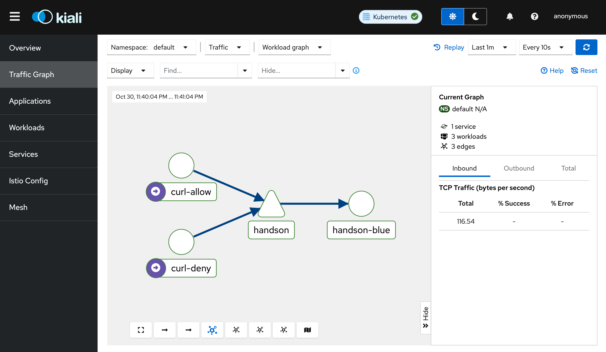

確認ができたら、リクエストを停止してください。

### Istio Authorization Policyの適用
それでは、Istio Authorization Policyを作成して、`curl-deny` ワークロードからのport 8080宛のリクエストを拒否する設定を追加します。

```sh
kubectl apply -f networking/L4-authorization-policy.yaml
```

作成されるリソースは下記の通りです。

```sh
kubectl get authorizationpolicies -l content=layer4-authz
```

```sh
# 実行結果
NAME           ACTION   AGE
layer4-authz   DENY     5s
```

再度リクエストをします。

```sh
while :; do
  kubectl exec curl-allow -- /bin/sh -c "echo -n 'curl-allow: ';curl -s -o /dev/null -w '%{http_code}\n' handson:8080"
  kubectl exec curl-deny -- /bin/sh -c "echo -n 'curl-deny:  ';curl -s -o /dev/null -w '%{http_code}\n' handson:8080"
  echo ----------------;sleep 1
done
```

しばらくすると、`curl-deny` podからのリクエストは拒否されます。

```sh
# 出力結果例
curl-allow: 200
curl-deny:  200
----------------
curl-allow: 200
curl-deny:  200
----------------
curl-allow: 200
curl-deny:  000
command terminated with exit code 56
----------------
curl-allow: 200
curl-deny:  000
command terminated with exit code 56
----------------
curl-allow: 200
curl-deny:  000
command terminated with exit code 56
----------------
.
.
.
```

Http status code 000はレスポンスが何もなかったという意味で、`command terminated with exit code 56`はcurlがデータを何も受け取らなかった(コネクションがリセットされた)ということを意味しています(参考: [curl man page/Exit Codes 56](https://curl.se/docs/manpage.html))。

リクエストを流したまま、再度Kiali dashboardを見てみましょう。しばらくすると、`curl-allow` podからのリクエストのみグラフに表示されるようになります(グラフに変化が見られない場合は、Kialiダッシュボード右上の青い`Refresh`ボタンを押して状態を更新してください)。これは`curl-deny` podからのport 8080のリクエストをztunnelがAuthorization Policyの設定に基づいて`handson-blue`ワークロードへのproxyを拒否しているためです。

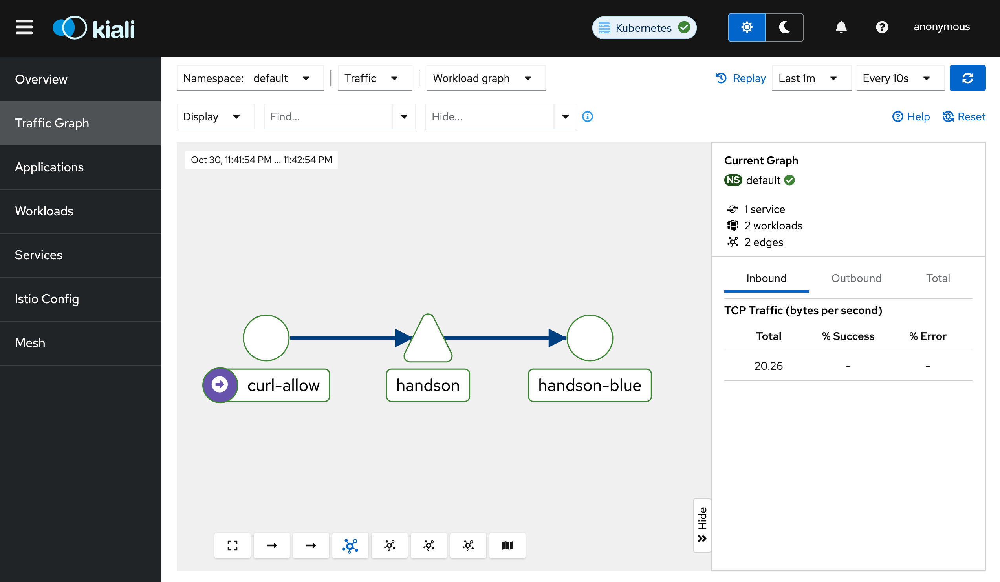

リクエストを停止してください。

それでは、Istio Authorization Policyによってアクセスが拒否された`curl-deny` podのみからリクエストをしてztunnelのログを見てみましょう。

ログを見る前に、まずは各podのIPを確認します。

```sh
kubectl get pods -o=custom-columns='Name:.metadata.name, IP:.status.podIP'
```

```sh
# 実行結果(pod IPは異なる可能性があります。)
Name                             IP
curl-allow                      10.244.1.14
curl-deny                       10.244.1.13
handson-blue-5cb87cdfc8-24npj   10.244.1.12
```

`curl-deny` podから`handson`サービスに向けてリクエストをします。

```sh
for _ in $(seq 2); do
  kubectl exec curl-deny -- /bin/sh -c "curl -s -o /dev/null handson:8080 -w '%{http_code}\n'"
  sleep 1
done
```

```sh
# 出力結果
000
command terminated with exit code 56
000
command terminated with exit code 56
```

それではztunnelのログを確認します。

```sh
ZTUNNEL_POD=$(kubectl get pod -n istio-system -l app=ztunnel --field-selector=spec.nodeName=istio-ambient-worker -o=jsonpath={.items..metadata.name})
kubectl logs "$ZTUNNEL_POD" -n istio-system --tail 4
```

```sh
# 実行結果(jqコマンドで成形をしています。)
{
  "level": "error",
  "time": "2024-10-19T01:39:58.302146Z",
  "scope": "access",
  "message": "connection complete",
  "src.addr": "10.244.1.13:52252",
  "src.workload": "curl-deny",
  "src.namespace": "default",
  "src.identity": "spiffe://cluster.local/ns/default/sa/curl-deny",
  "dst.addr": "10.244.1.12:15008",
  "dst.hbone_addr": "10.244.1.12:8080",
  "dst.service": "handson.default.svc.cluster.local",
  "dst.workload": "handson-blue-5cb87cdfc8-24npj",
  "dst.namespace": "default",
  "dst.identity": "spiffe://cluster.local/ns/default/sa/handson-blue",
  "direction": "inbound",
  "bytes_sent": 0,
  "bytes_recv": 0,
  "duration": "0ms",
  "error": "connection closed due to policy rejection"
}
{
  "level": "error",
  "time": "2024-10-19T01:39:58.302311Z",
  "scope": "access",
  "message": "connection complete",
  "src.addr": "10.244.1.13:35262",
  "src.workload": "curl-deny",
  "src.namespace": "default",
  "src.identity": "spiffe://cluster.local/ns/default/sa/curl-deny",
  "dst.addr": "10.244.1.12:15008",
  "dst.hbone_addr": "10.244.1.12:8080",
  "dst.service": "handson.default.svc.cluster.local",
  "dst.workload": "handson-blue-5cb87cdfc8-24npj",
  "dst.namespace": "default",
  "dst.identity": "spiffe://cluster.local/ns/default/sa/handson-blue",
  "direction": "outbound",
  "bytes_sent": 0,
  "bytes_recv": 0,
  "duration": "0ms",
  "error": "http status: 401 Unauthorized"
}
.
.
.
```

出力されたログは2行で1セットになっています。1行目がinbound用、つまりリクエストを受ける側、2行目がoutbount用、リクエストを送る側です。これを念頭に、出力されたログを見てみましょう。

- Inbound方向では、`curl-deny` pod(IP address: 10.244.1.13)からHBONE経由での`handson-blue-5cb87cdfc8-24npj`(IP address: 10.244.1.12)へのリクエストは、拒否ポリシーによってコネクションが閉じられていることが分かります。

- Outbound方向では、`curl-deny` podから`handson-blue-5cb87cdfc8-24npj` podへのリクエストはクライアントエラー(HTTP status: 401)によって失敗しています。

この2つのログをまとめると、`curl-deny` podから`handson-blue-5cb87cdfc8-24npj` podへのリクエストは先に設定したIstio Authorization Policyにより拒否された結果、outbound方向では401エラーを、inbound方向では、リクエストが到達せず、結果コネクションが閉じられたということになります。

なお、ログの出力項目にある`src.identity="spiffe://~~"`に関して、IstioはmTLSによるサービスメッシュ内のサービス間通信を実現させるための方法としてSPIFF(Secure Production Identity Framework for Everyone)を採用しています。SPIFFEは、クラウドやコンテナ化された環境で動作するサービスやアプリケーションに対して、標準化されたアイデンティティの枠組みを提供するためのオープンスタンダードで、従来のユーザー認証の代わりに、サービス(マイクロサービスやアプリケーション)同士が相互に信頼できるアイデンティティを持つように設計されており、SPIFF IDと呼ばれるアイデンティティを使用してmTLSによる認証と暗号化を実現します。SPIFFの詳細に関しては、[こちら](https://spiffe.io/docs/latest/spiffe-about/overview/)をご確認ください。

Ztunnelが管理するIstio ambient mesh内のL4レベルのトラフィックにおいて、Istio Authorization Policyを使用してアクセス管理を実装しました。Istioの機能を使うことで、アプリケーション側にロジックを追加することなくL4レベルのアクセス管理を実現することができます。

### クリーンアップ

```sh
kubectl delete -f networking/L4-authorization-policy.yaml
kubectl delete -f app/curl-allow.yaml,app/curl-deny.yaml
```

`handson-blue` podのみが動作していることを確認してください。

```sh
kubectl get pods
```

```sh
# 実行結果(pod名は異なる可能性があります。)
NAME                            READY   STATUS    RESTARTS   AGE
handson-blue-5cb87cdfc8-24npj   1/1     Running   0          14m
```

## L7アクセス管理
Waypoint proxyによって管理されるL7レベルのトラフィックに対し、Istio Authorization Policyを作成してアクセス管理を実装します。サービスメッシュ内の、あるワークロードに対して、特定のワークロードからのL7レベルでのアクセス制御をしたい時がユースケースとして挙げられます。本ケースでは`handson-blue`ワークロードにアクセスをするワークロードを1つ用意し、GETメソッドのみ許可(削除、更新系のメソッドは拒否)をするケースを想定します。

[セットアップ](#セットアップ)が完了していることを前提とします。

### Kialiグラフ設定
HTTPトラフィックの状態を確認するために、TOP画面左のサイドメニューのTraffic Graphをクリックし、下記のとおり設定してください(設定済みの項目はスキップしてください。)
- `Namespace`の`default`にチェック


- `Traffic`の`Http`のみにチェック

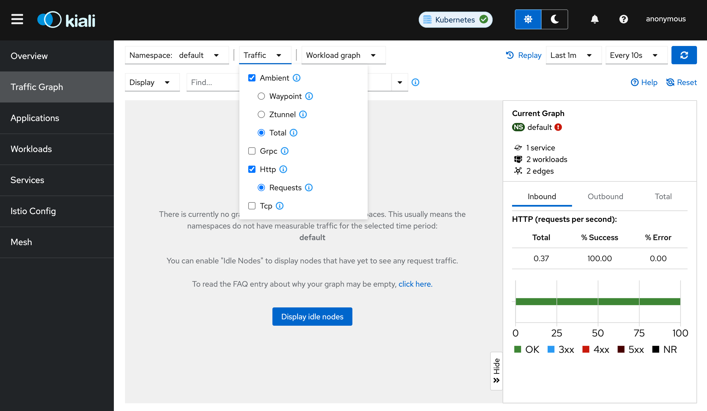

- `Versioned app graph`から`Workload graph`に変更


- グラフ更新期間を`Every 1m`から`Every 10s`に変更


### Waypoint proxyのデプロイ
Waypoint proxyを有効にするにはKubernetes Gateway APIの`gateway`リソースが必要になるため、まずはKubernetes Gateway API CRDsをインストールします。

```sh
kubectl apply -f https://github.com/kubernetes-sigs/gateway-api/releases/download/v1.1.0/standard-install.yaml
```

```sh
# 実行結果
customresourcedefinition.apiextensions.k8s.io/gatewayclasses.gateway.networking.k8s.io created
customresourcedefinition.apiextensions.k8s.io/gateways.gateway.networking.k8s.io created
customresourcedefinition.apiextensions.k8s.io/grpcroutes.gateway.networking.k8s.io created
customresourcedefinition.apiextensions.k8s.io/httproutes.gateway.networking.k8s.io created
customresourcedefinition.apiextensions.k8s.io/referencegrants.gateway.networking.k8s.io created
```

> [!NOTE]
>
> Kubernetes Gateway APIは[SIG-Network](https://github.com/kubernetes/community/tree/master/sig-network)コミニティによって開発が行われている、Kubernetesサービスを外部公開するために用いられるKubernetes APIリソースです。本chapterでは説明は省略していますので、詳細は[こちら](https://gateway-api.sigs.k8s.io/)をご確認ください。

Kubernetes Gateway APIの`gateway`リソースを作成して、waypoint proxyをデプロイします。

```sh
kubectl apply -f networking/k8s-gateway.yaml
```

作成されるリソースは下記の通りです。

```sh
kubectl get gateways,deployments,services -l app.kubernetes.io/component=waypoint-proxy
```

```sh
# 実行結果(gateway address, cluster IPは異なる可能性があります。)
NAME                                         CLASS            ADDRESS         PROGRAMMED   AGE
gateway.gateway.networking.k8s.io/waypoint   istio-waypoint   10.96.172.234   True         7s

NAME                       READY   UP-TO-DATE   AVAILABLE   AGE
deployment.apps/waypoint   1/1     1            1           7s

NAME               TYPE        CLUSTER-IP      EXTERNAL-IP   PORT(S)               AGE
service/waypoint   ClusterIP   10.96.172.234   <none>        15021/TCP,15008/TCP   7s
```

Waypoint proxyをデプロイしただけでは、サービスメッシュ内のリソースはこのwaypoint proxyを使用しません。Ztunnelを通過したトラフィックがwaypoint proxyを経由するようにするために、対象のwaypoint proxy名を、先ほど作成したKubernetes gatewayリソースのnamespaceにラベルとして追加する必要があります。

```sh
kubectl label namespace default istio.io/use-waypoint=waypoint
```

該当のKubernetes namespaceにラベルが追加されたか確認をします。

```sh
kubectl get namespace default --show-labels
```

```sh
# 実行結果
NAME      STATUS   AGE    LABELS
default   Active   154m   istio.io/dataplane-mode=ambient,istio.io/use-waypoint=waypoint,kubernetes.io/metadata.name=default
```

> [!NOTE]
>
> Waypoint proxyを使用するKubernetesリソースを特定のネームスペース全体ではなく、Kubernetesサービスで指定することも可能です。その場合は、対象のKubernetesサービスに`istio.io/use-waypoint=/対象のwaypoint proxy名/`のラベルを付与することで実現が可能です。

これで、waypoint proxyを使用する設定が完了したので、このwaypoint proxyを使用するリソースをデプロイします。

### 追加アプリケーションのデプロイ
`handson-blue`ワークロードにアクセスするpodをデプロイします。

```sh
kubectl apply -f app/curl.yaml
```

作成されるリソースは下記の通りです。
```sh
kubectl get pods,serviceaccounts -l content=layer7-authz
```

```sh
# 実行結果
NAME       READY   STATUS    RESTARTS   AGE
pod/curl   1/1     Running   0          26s

NAME                  SECRETS   AGE
serviceaccount/curl   0         26s
```

それでは、`curl` podから`handson-blue`ワークロードに対してリクエストをします。

```sh
while :; do kubectl exec curl -- curl -s -o /dev/null handson:8080 -w '%{http_code}\n';sleep 1;done
```

リクエストは成功していることを確認してください。

```sh
# 出力結果
200
200
200
.
.
.
```

Kiali dashboardからも確認してみましょう。リクエストを流した状態でブラウザから<http://kiali-ambient.vmXX.handson.cloudnativedays.jp:28080>にアクセスをしてください。`curl` podから`handson-blue`ワークロードにアクセス出来ていることが確認できます(緑色の矢印はHTTP通信を表しています)。グラフが表示されない場合は、Kialiダッシュボード右上の青いRefreshボタンを押して状態を更新してください。

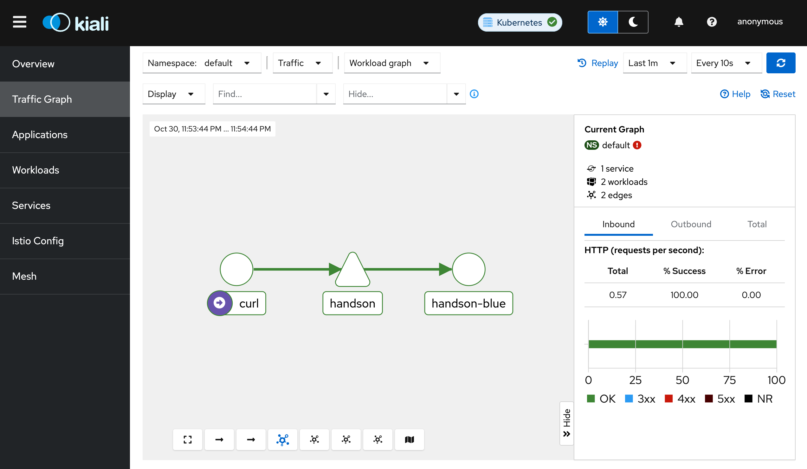

確認ができたら、リクエストを停止してください。

### Istio Authorization Policyの適用
それでは、Istio Authorization Policyを適用して、curl ワークロードからのGETリクエストのみを許可し、削除、更新系のメソッドを拒否します。

```sh
kubectl apply -f networking/L7-authorization-policy.yaml
```

作成されたリソースは下記の通りです。

```sh
kubectl get authorizationpolicies -l content=layer7-authz
```

```sh
# 実行結果
NAME           ACTION   AGE
layer7-authz   DENY     4s
```

まずは確認のためにGETリクエストをします(明示的にGETを指定しています)。

```sh
while :; do kubectl exec curl -- curl -s -X GET -o /dev/null -w '%{http_code}\n' handson:8080;sleep 1;done
```

先ほどと同じく、リクエストが成功していることを確認してください。

```sh
# 実行結果
200
200
200
.
.
.
```

リクエストを停止してください。

それでは、POSTメソッドでリクエストをしてみましょう。`handson-blue`ワークロードにPOSTメソッドは実装されていないので、空データを使用します。

```sh
while :; do kubectl exec curl -- curl -X POST -s -o /dev/null -d '{}' -w '%{http_code}\n' handson:8080;sleep 1;done
```

しばらくすると、403にて拒否されるようになります。

```sh
# 実行結果
200
200
403
403
403
.
.
.
```

改めてKiali dashboardから確認してみましょう。ブラウザから<http://kiali-ambient.vmXX.handson.cloudnativedays.jp:28080>にアクセスをしてください。しばらくすると、`curl` ワークロードからのPOSTリクエストは拒否されていることが確認できます(赤色の矢印は4XXのエラーを表しています)。グラフに変化が見られない場合は、Kialiダッシュボード右上の青い`Refresh`ボタンを押して状態を更新してください。

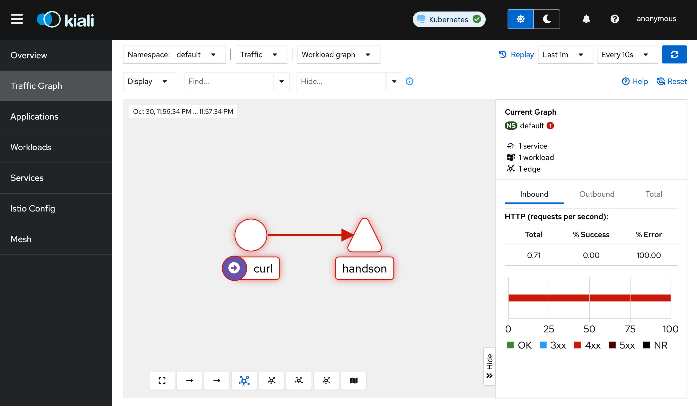

確認ができたらリクエストを停止してください。

それでは、Istio Authorization Policyを有効にしたことによって、ztunnelとwaypoint proxyが、それぞれどのような動きをしたのかログを確認してみましょう。

まずは各service, podのIPを確認します。

```sh
echo
echo "> Kubernetes service:"
kubectl get svc -o custom-columns="Name:.metadata.name,cluster IP:.spec.clusterIP"
echo "-------------------------------------------"
echo "> Kubernetes pods:"
kubectl get pods -o=custom-columns='Name:.metadata.name, IP:.status.podIP'
```

```sh
# 実行結果(cluster IP, pod IPは異なる可能性があります。)
> Kubernetes service:
Name         cluster IP
handson      10.96.47.9
kubernetes   10.96.0.1
waypoint     10.96.172.234
-------------------------------------------
> Kubernetes pods:
Name                             IP
curl                            10.244.1.16
handson-blue-5cb87cdfc8-24npj   10.244.1.12
waypoint-57f4fcd686-6vwck       10.244.1.15
```

`curl` podから`handon`サービスに向けてリクエストをします。

```sh
for _ in $(seq 2); do
  kubectl exec curl -- curl -X POST -s -o /dev/null -d '{}' -w '%{http_code}\n' handson:8080
  sleep 1
done
```

```sh
# 実行結果
403
403
```

それでは、ztunnelのログを見てみましょう。

```sh
ZTUNNEL_POD=$(kubectl get pod -n istio-system -l app=ztunnel --field-selector=spec.nodeName=istio-ambient-worker -o=jsonpath={.items..metadata.name})
kubectl logs "$ZTUNNEL_POD" -n istio-system --tail 2
```

```sh
# 実行結果(jqコマンドで成形をしています。)
{
  "level": "info",
  "time": "2024-10-19T02:01:06.549342Z",
  "scope": "access",
  "message": "connection complete",
  "src.addr": "10.244.1.16:40270",
  "src.workload": "curl",
  "src.namespace": "default",
  "src.identity": "spiffe://cluster.local/ns/default/sa/curl",
  "dst.addr": "10.244.1.15:15008",
  "dst.hbone_addr": "10.96.47.9:8080",
  "dst.service": "handson.default.svc.cluster.local",
  "dst.workload": "waypoint-57f4fcd686-6vwck",
  "dst.namespace": "default",
  "dst.identity": "spiffe://cluster.local/ns/default/sa/waypoint",
  "direction": "outbound",
  "bytes_sent": 147,
  "bytes_recv": 239,
  "duration": "5ms"
}
.
.
.
```

`curl` pod(IP address: 10.244.1.16)から`handson-blue`ワークロードへのリクエストは、HBONEトネリングプロトコルを用いて行なっています。ここで注目するべきは、先述したようにztunnelはL4管理しか行わないということです。L7管理はwaypoint proxyによって行われるため、ztunnelの仕事はやってきたトラフィックをwaypoit proxyにproxyするまでです。ログからも見てわかるように、`dst.service`ではクライアントが最終的に到達をしようとしているKubernetes serviceを示していますが、`dst.workload`はwaypoint podになっており、これはztunnelが実際にリクエストを送信(厳密にはproxy)する宛先となっています。クライアントである`curl` podからは実際403が返却されていますが、ztunnelからは通信は無事に終了し、`message`には`connection complete`と出力されています。

それでは、次は、waypoint proxyのログを確認してみましょう。

```sh
WAYPOINT_PROXY_POD=$(kubectl get pods -l app.kubernetes.io/component=waypoint-proxy -o=jsonpath={.items..metadata.name})
kubectl logs "$WAYPOINT_PROXY_POD" --tail 2
```

```sh
# 実行結果(jqコマンドで成形をしています。)
{
  "bytes_received": 0,
  "x_forwarded_for": null,
  "route_name": "default",
  "path": "/",
  "upstream_local_address": null,
  "request_id": "ebcf8abf-d7b9-410c-a218-5e68d829e073",
  "upstream_cluster": "inbound-vip|8080|http|handson.default.svc.cluster.local;",
  "upstream_host": null,
  "method": "POST",
  "authority": "handson:8080",
  "start_time": "2024-10-19T02:01:06.547Z",
  "upstream_transport_failure_reason": null,
  "duration": 0,
  "connection_termination_details": null,
  "downstream_local_address": "10.96.47.9:8080",
  "response_flags": "-",
  "bytes_sent": 19,
  "protocol": "HTTP/1.1",
  "downstream_remote_address": "10.244.1.16:34498",
  "requested_server_name": null,
  "user_agent": "curl/8.10.1",
  "response_code_details": "rbac_access_denied_matched_policy[ns[default]-policy[layer7-authz]-rule[0]]",
  "response_code": 403,
  "upstream_service_time": null
}
.
.
.
```

Ztunnelからトラフィックのproxyを受けたwaypoint proxyは、`upstream_cluster`として`handson` serviceを認識していますが、`response_code_details`では先ほど設定をしたIstio Authorization Policy(layer7-authz)の1つ目のルールによって403を返却していることが確認できます。

最後にDELETEメソッドも拒否されるか確認してみましょう。`handson-blue`ワークロードにDELETEメソッドは実装されていないので、ダミーIDを削除することとします。

```sh
while :; do kubectl exec curl -- curl -X DELETE -s -o /dev/null -w '%{http_code}\n' handson:8080/id/123;sleep 1;done
```

こちらも、403にて拒否されることを確認してください。

```sh
# 実行結果
403
403
403
.
.
.
```

確認ができたら、リクエストを停止してください。

Waypoint proxyが管理するIstio ambient mesh内のL7レベルのトラフィックにおいて、Istio Authorization Policyを使用してアクセス管理を実装しました。Istioの機能を使うことで、アプリケーション側にロジックを追加することなくL7レベルのアクセス管理を実現することができます。

### クリーンアップ
```sh
kubectl delete -f networking/L7-authorization-policy.yaml,networking/k8s-gateway.yaml
kubectl delete -f app/curl.yaml
```

## まとめ
サイドカーを用いないIstioの新しいデータプレーンである、Istio ambientモードによって作成されるIstio ambient meshを使用することで、アプリケーションと、データプレーンの分離が可能になります。これにより、データプレーン起因によるアプリケーションワークロードの阻害を防止することができます。さらに、サイドカーを使用せずに、ztunnel, waypoint proxyを用いることにより、L4, L7管理をアプリケーションの必要に応じて実装することができるようになります。


## 最終クリーンアップ
本chapter用に作成したKindクラスターを削除します。

```sh
kind delete cluster --name istio-ambient
```

すでに[chapter_cluster-create](../chapter_cluster-create/README.md)でkindクラスターを作成していて、他のchapterに進む場合は、クラスター削除後にKubernetes contextを`kind-kind`に設定してください。

```sh
kubectl config use-context kind-kind
```

現在のKubernetes contextのが`kind-kind`であることを確認してください。

```sh
kubectl config current-context
```

```sh
# 実行結果
kind-kind
```
