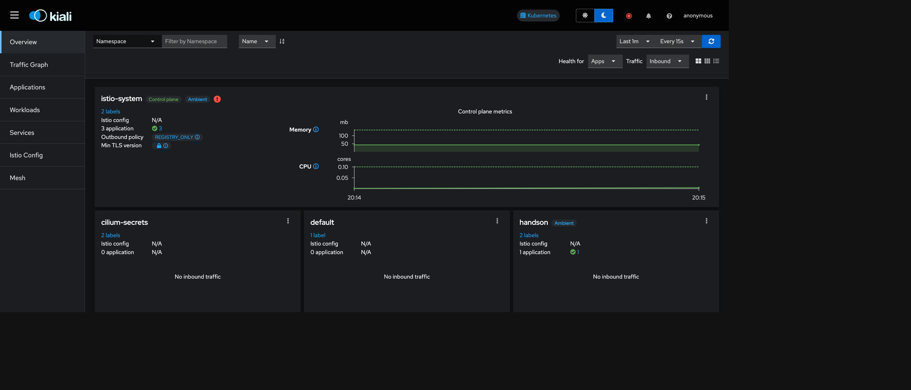
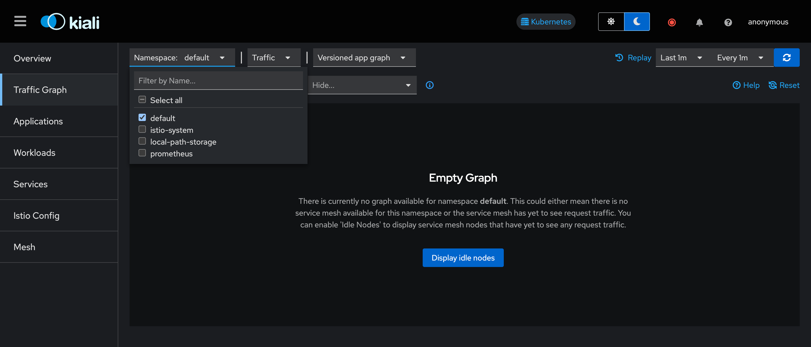
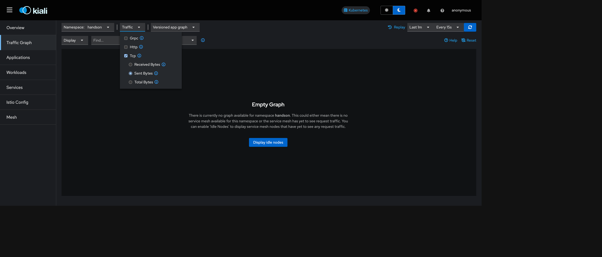
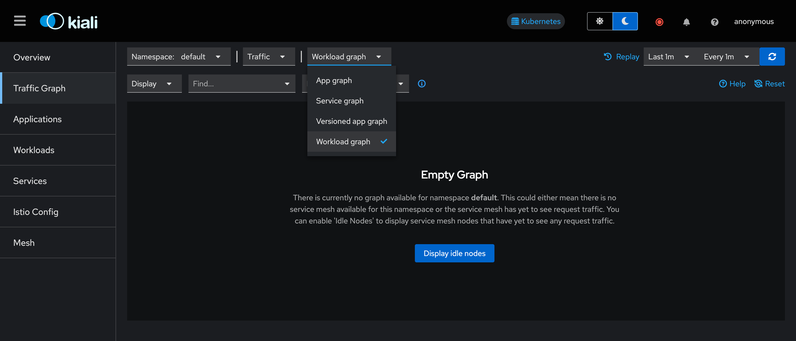
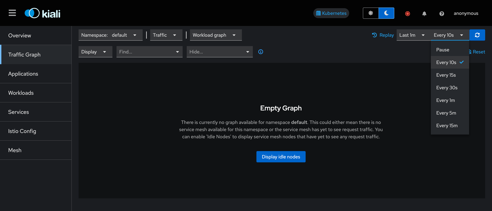
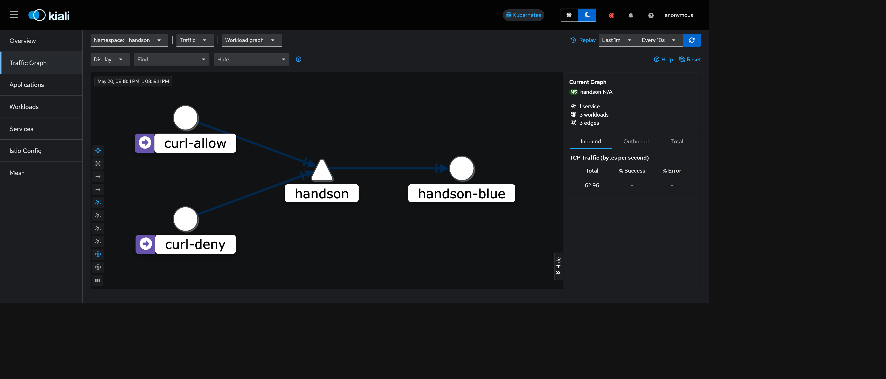
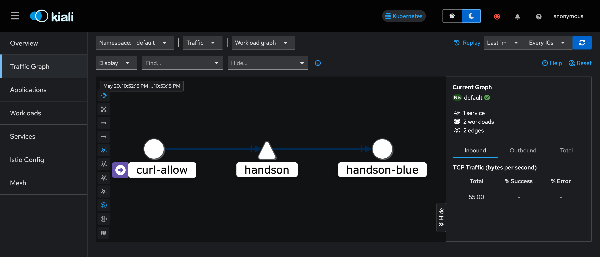
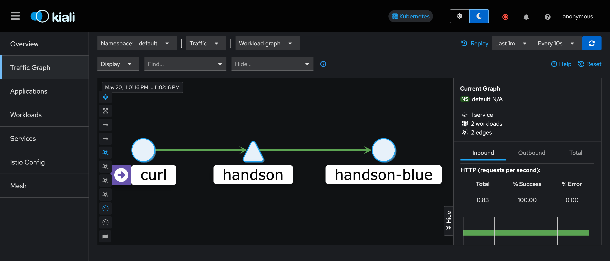

# Istio Amebient Mesh
本chapterではIstio ambient meshを使用して、サービスメッシュ内のトラフィック管理、可視化をどのように実現するのか体験します。

## 目次
- [概要](#概要)
- [セットアップ](#セットアップ)
- [l4アクセス管理](#l4アクセス管理)
- [l7アクセス管理](#l7アクセス管理)
- [まとめ](#まとめ)
- [最終クリーンアップ](#最終クリーンアップ)

## 概要
### Istio ambient meshとは
2023年2月に[main branchにマージ](https://github.com/istio/istio/pull/43422)された、サイドカーを使用しない新しいIstioデータプレーンモードです。従来のサイドカーモードのIstioは多くの本番運用実績がありますが、データプレーンとアプリケーションの分離ができず、結果下記のような課題があげられています。

- データプレーンはサイドカーとしてアプリケーションpodに注入されるため、Istioデータプレーンのインストール、アップグレード時はpodの再起動が必要になり、アプリケーションワークロードを阻害してしまう
- データプレーンが提供する機能の選択ができないため、一部の機能(mTLS実装のみ等)しか使用しないワークロードにとっては不要なリソースをpodに確保する必要があり、全体のリソースを効率的に使用できなくなる
- HTTP準拠でないアプリケーション実装をしている場合、解析エラーや、誤ったL7プロトコルの解釈を引き起こす可能性がある

Istio ambient meshはこれらの問題を解決する目的で、Google, Solo.ioによって開発が始まりました。

> [!IMPORTANT]
>  Istio ambient meshは2023年11月末時点ではαステータスです。本番環境への導入は控え、検証用途でのみ使用してください。

### Istio ambient mesh構成
L4、L7機能のすべてを管理しているサイドカーモードにおけるデータプレーンと異なり、Istio ambientモードではデータプレーンの機能を2つの層に分けて管理をします。

- Secure overlay layer


(出展元: https://istio.io/v1.16/blog/2022/introducing-ambient-mesh/)

メッシュ内ワークロード内のセキュアな通信の確立を行う層で、[ztunnel](https://github.com/istio/ztunnel)というコンポーネントによって管理されます。Ztunnelの主な役割は1)通信暗号のためのmTLS確立、2)L4レベルの認可、3)TCPメトリクス、ログ収集です。

ZtunnelはKubernetesクラスタ上でDaemonSetとしてデプロイされます。サイドカーモードでは、envoyが各pod内で通信のproxyをしますが、ambientモードではztunnelがメッシュ内のワークロードをnode単位でproxyします。また、node間通信(もう少し厳密に言うと、メッシュ内のサービス間通信)は、Istio 1.16リリースで公開されたHTTP/2のCONNECTメソッドをベースにした[HBONE](https://istio.io/latest/news/releases/1.16.x/announcing-1.16/#hbone-for-sidecars-and-ingress-experimental)(HTTP-Based Overlay Network Environment)というトンネリングを用いたmTLS接続によって行われます。

- waypoint proxy layer


(出展元: https://istio.io/v1.16/blog/2022/introducing-ambient-mesh/)

1)HTTPプロトコル、2)L7レベルの認可、3)HTTPメトリクス、ログ収集等のL7の管理をする層です。Waypoint proxyの実態はenvoyイメージを使用した[Kubernetes Gateway API](https://gateway-api.sigs.k8s.io/)のGatewayリソースが作成、管理するpodです。Ztunnelによるsecure overlay layer作成後にKubernetes namespaceごとにwaypoint proxyを作成することで、Istioが提供するL7機能を使用することができます。また、waypoint proxyはワークロード、service account単位でも作成することができます。Waypoint proxyが作成されると、ztunnelによって作成されたsecure overlay layerはトラフィックをそのwaypoint proxyにルーティングすることでL7機能が使えるようになります。


## セットアップ

### インストール
Istio ambientコンポーネントと併せて、Kiali, Prometheusをインストールします。PrometheusはKialiでグラフを表示するために必要となります。

> [!NOTE]
>
> KialiはIstioサービスメッシュ用のコンソールであり、Kialiが提供するダッシュボードから、サービスメッシュの構造の確認、トラフィックフローの監視、および、サービスメッシュ設定の確認、変更をすることが可能です。本chapterでは説明は省略していますので、詳細は[こちら](https://kiali.io)をご確認ください。

```sh
helmfile sync -f helm/helmfile.yaml
```

作成されるリソースは下記のとおりです(Prometheusコンポーネントは省略しています)。
```sh
kubectl get services,daemonsets,deployments -n istio-system
```
```sh
# 実行結果
NAME                           TYPE        CLUSTER-IP      EXTERNAL-IP   PORT(S)                                 AGE
service/istio-ingressgateway   NodePort    10.96.193.212   <none>        18080:32080/TCP,18443:32443/TCP         24m
service/istiod                 ClusterIP   10.96.176.138   <none>        15010/TCP,15012/TCP,443/TCP,15014/TCP   24m
service/kiali                  ClusterIP   10.96.246.59    <none>        20001/TCP                               24m

NAME                            DESIRED   CURRENT   READY   UP-TO-DATE   AVAILABLE   NODE SELECTOR            AGE
daemonset.apps/istio-cni-node   3         3         3       3            3           kubernetes.io/os=linux   9m34s
daemonset.apps/ztunnel          3         3         3       3            3           kubernetes.io/os=linux   9m35s

NAME                                   READY   UP-TO-DATE   AVAILABLE   AGE
deployment.apps/istio-ingressgateway   1/1     1            1           24m
deployment.apps/istiod                 1/1     1            1           24m
deployment.apps/kiali                  1/1     1            1           24m
```

アプリケーションpodがambient meshの一部になるように、デプロイ先のKubernetes namespaceにラベルを追加します。
```sh
kubectl label namespace handson istio.io/dataplane-mode=ambient
```
ラベルが追加されたことを確認してください。
```sh
kubectl get namespace handson --show-labels
```
```sh
# 実行結果
NAME      STATUS   AGE     LABELS
handson   Active   8m41s   istio.io/dataplane-mode=ambient,kubernetes.io/metadata.name=handson
```

Ambient mesh内でアプリケーションが正しく起動しているかを確認をするために疎通確認をします。Kubernetes cluster外からはアクセス出来ないため、handsonアプリケーションのKubernetes serviceをポートフォワードしてホスト側から疎通確認をします。

```sh
kubectl port-forward -n handson service/handson 8081:8080 >/dev/null &
```

ホストから疎通確認をします。
```sh
curl -I http://127.0.0.1:8081/
```
HTTP status code 200が返却されれば疎通確認完了です。5XXが返却された場合は、`handson-blue` ワークロードを再起動して再度疎通確認を行ってください。

(HTTP status codeが5XXの時のみ実施。)
```sh
kubectl rollout restart -n handson deploy/handson-blue
```

疎通確認完了後、Port forwardのjobを停止してください。
```sh
jobs
```
```sh
# 実行結果
[1]+  Running  kubectl port-forward service/handson 8081:8080 > /dev/null &
```

`kubectl port-forward`を実行しているjobを停止。
```sh
kill %1
```

### メッシュの可視化
Kialiを用いてIstioサービスメッシュ内のトラフィックを見てみましょう。Kialiは[インストール](#インストール)でインストール済みなので、外部(インターネット)からアクセスできるようにするためにIngressリソースを作成します。

```sh
kubectl apply -f ingress/kiali-ingress.yaml
```

しばらくすると、ingressリソースにIPが付与されます。
```sh
kubectl get ingresses -n istio-system -l app=kiali
```
```sh
# 実行結果
NAME             CLASS   HOSTS               ADDRESS        PORTS   AGE
kiali-by-nginx   nginx   kiali.example.com   10.96.88.164   80      2m5s
```

### Kialiグラフ設定

ブラウザから<http://kiali.example.com>にアクセスをしてKialiダッシュボードが表示されることを確認してください。



TCPトラフィックの状態を確認するために、TOP画面左のサイドメニューの`Traffic Graph`をクリックし、下記のとおり設定をしてください。
- `Namespace`の`handson`にチェック



- `Traffic`の`Tcp`のみにチェック



- `Versioned app graph`から`Workload graph`に変更



- グラフ更新期間を`Every 1m`から`Every 10s`に変更




## L4アクセス管理
Ztunnelによって管理されるL4レベルのトラフィックに対し、Istio Authorization Policyを作成してアクセス管理を実装します。Istio ambient mesh内において、あるワークロードに対して、特定のワークロードからのL4レベルでのアクセス制御をしたい時がユースケースとして挙げられます。本ケースでは、`handson-blue`ワークロードが待ち構えているport 8080へアクセスするワークロードを2つ用意し、ひとつからは許可を、もうひとつからは拒否をするケースを想定します。

[セットアップ](#セットアップ)が完了していることを前提とします。

### 追加アプリケーションのデプロイ
`handson-blue`ワークロードにアクセスする追加のワークロード2つをデプロイします。
```sh
kubectl apply -f ./app/curl-allow.yaml,./app/curl-deny.yaml
```

作成されるリソースは下記の通りです。
```sh
kubectl get pods -n handson -l content=layer4-authz
```
```sh
# 実行結果
NAME         READY   STATUS    RESTARTS   AGE
curl-allow   1/1     Running   0          46s
curl-deny    1/1     Running   0          46s
```

それでは双方のpodから`handson-blue` ワークロードに対してリクエストをします。
```sh
while :; do
kubectl exec -n handson curl-allow -- /bin/sh -c "echo -n 'curl-allow: ';curl -s -o /dev/null handson:8080 -w '%{http_code}\n'";
kubectl exec -n handson curl-deny -- /bin/sh -c "echo -n 'curl-deny:  ';curl -s -o /dev/null handson:8080 -w '%{http_code}\n'";
echo ----------------;sleep 1;
done
```

双方のワークロードからのリクエストが成功していることが分かります。
```sh
# 出力結果
curl-allow: 200
curl-deny:  200
----------------
curl-allow: 200
curl-deny:  200
----------------
curl-allow: 200
curl-deny:  200
----------------
.
.
.
```

Kiali dashboardからも確認してみましょう。リクエストを流した状態でブラウザから<http://kiali.example.com>にアクセスをしてください。`curl-allow`, `curl-deny` podのワークロードが`handson-blue`ワークロードにアクセス出来ていることが確認できます(紺色の矢印はTCP通信を表しています)。グラフが表示されない場合は、Kialiダッシュボード右上の青い`Refresh`ボタンを押して状態を更新してください。



確認ができたら、リクエストをいったん停止してください。

### Istio Authorization Policyの適用
それでは、Istio Authorization Policyを作成して、`curl-deny` ワークロードからのport 8080宛のリクエストを拒否する設定を追加します。
```sh
kubectl apply -f networking/L4-authorization-policy.yaml
```

作成されるリソースは下記の通りです。
```sh
kubectl get authorizationpolicies -n handson -l content=layer4-authz
```
```sh
# 実行結果
NAME           AGE
layer4-authz   20s
```

再度リクエストをします。
```sh
while :; do
kubectl exec -n handson curl-allow -- /bin/sh -c "echo -n 'curl-allow: ';curl -s -o /dev/null -w '%{http_code}\n' handson:8080";
kubectl exec -n handson curl-deny -- /bin/sh -c "echo -n 'curl-deny:  ';curl -s -o /dev/null -w '%{http_code}\n' handson:8080";
echo ----------------;sleep 1;
done
```

しばらくすると、`curl-deny` podからのリクエストは拒否されるようになります。
```sh
# 出力結果例
curl-allow: 200
curl-deny:  200
----------------
curl-allow: 200
curl-deny:  200
----------------
curl-allow: 200
curl-deny:  000
command terminated with exit code 56
----------------
curl-allow: 200
curl-deny:  000
command terminated with exit code 56
----------------
curl-allow: 200
curl-deny:  000
command terminated with exit code 56
----------------
.
.
.
```
Http code 000はレスポンスが何もなかったという意味で、`command terminated with exit code 56`はcurlがデータを何も受け取らなかった(コネクションがリセットされた)ということを意味しています。(参考: [curl man page/"Exit Codes"の56](https://curl.se/docs/manpage.html))。

改めてKiali dashboardから確認してみましょう。ブラウザから<http://kiali-ambient.example.com:28080>にアクセスをしてください。しばらくすると、`curl-allow` podからのリクエストのみグラフに表示されるようになります(グラフに変化が見られない場合は、Kialiダッシュボード右上の青い`Refresh`ボタンを押して状態を更新してください)。これは`curl-deny` podからのport 8080のリクエストをztunnelがAuthorization Poliyの設定に基づいて`handson-blue`ワークロードへのproxyを拒否しているためです。



リクエストを停止し、次は`curl-deny` podのみからリクエストをしてztunnelのログを見てみましょう。
```sh
for _ in $(seq 1 100); do
kubectl exec -n handson curl-deny -- /bin/sh -c "echo -n 'curl-deny:  ';curl -s -o /dev/null handson:8080 -w '%{http_code}\n'";
echo ----------------;sleep 1;
done
```

```sh
# 出力結果
curl-deny:  000
command terminated with exit code 56
----------------
curl-deny:  000
command terminated with exit code 56
----------------
curl-deny:  000
command terminated with exit code 56
----------------
.
.
.
```

Ztunnelのログを見る前に、各podのIPと配置されたnodeを確認します。
```sh
kubectl get pods -n handson -o=custom-columns='Name:.metadata.name, IP:.status.podIP, Node:.spec.nodeName'
```
```sh
# 実行結果
Name                           IP           Node
curl-allow                    10.0.0.62    kind-worker
curl-deny                     10.0.0.202   kind-worker
handson-blue-7db86c58-bkdgh   10.0.2.103   kind-worker2
```

それではztunnelのlogを確認します。まずリクエストの送信元と同一nodeに配置されたpodのログを見てみます。
下記変数`ZTUNNEL_NODE`に、`curl-deny`が配置されたノード名を設定してください。kind-workerの場合は下記のようになります。

```sh
ZTUNNEL_NODE=kind-worker
```

```sh
ZTUNNEL_POD=$(kubectl get pod -n istio-system -l app=ztunnel --field-selector=spec.nodeName=${ZTUNNEL_NODE} -o=jsonpath={.items..metadata.name})
kubectl logs "${ZTUNNEL_POD}" -n istio-system --tail 10
```

```sh
# 実行結果(1行が長いためtimestampは表示は省略しています)
INFO proxy{uid=e50ffaf0-9486-468b-85ba-1399f0793ffa}:outbound{id=9f733045fc630ba161476e6e1dc01a16}: ztunnel::proxy::outbound: proxy to 10.0.2.103:8080 using HBONE via 10.0.2.103:15008 type Direct
WARN proxy{uid=e50ffaf0-9486-468b-85ba-1399f0793ffa}:outbound{id=9f733045fc630ba161476e6e1dc01a16}: ztunnel::proxy::outbound: failed dur=1.143567ms err=http status: 401 Unauthorized
INFO proxy{uid=e50ffaf0-9486-468b-85ba-1399f0793ffa}:outbound{id=2d7c69f5c7a8f71ad8ac81fd2cc3b748}: ztunnel::proxy::outbound: proxy to 10.0.2.103:8080 using HBONE via 10.0.2.103:15008 type Direct
WARN proxy{uid=e50ffaf0-9486-468b-85ba-1399f0793ffa}:outbound{id=2d7c69f5c7a8f71ad8ac81fd2cc3b748}: ztunnel::proxy::outbound: failed dur=1.088443ms err=http status: 401 Unauthorized
.
.
.
```

ログの2行目を見ると、ztunnelは`handson-blue`pod(IP: 10.0.2.103)にproxyしようしていますが、結果401が返却されていることが分かります。

次にリクエスト受信側のztunnelのlogを確認します。`handson-blue` と同じnodeに配置されたpodのログを見てみます。
下記変数`ZTUNNEL_NODE`に、`handson-blue`が配置されたノード名を設定してください。kind-worker2の場合は下記のようになります。

```sh
ZTUNNEL_NODE=kind-worker2
```

```sh
ZTUNNEL_POD=$(kubectl get pod -n istio-system -l app=ztunnel --field-selector=spec.nodeName=${ZTUNNEL_NODE} -o=jsonpath={.items..metadata.name})
kubectl logs "${ZTUNNEL_POD}" -n istio-system --tail 10
```

```sh
INFO inbound{id=d2e7731ffc641ce3337056d9361c7b17 peer_ip=10.0.0.202 peer_id=spiffe://cluster.local/ns/handson/sa/curl-deny}: ztunnel::proxy::inbound: got CONNECT request to 10.0.2.103:8080
INFO inbound{id=d2e7731ffc641ce3337056d9361c7b17 peer_ip=10.0.0.202 peer_id=spiffe://cluster.local/ns/handson/sa/curl-deny}: ztunnel::proxy::inbound: RBAC rejected conn=10.0.0.202(spiffe://cluster.local/ns/handson/sa/curl-deny)->10.0.2.103:8080
INFO inbound{id=6ad42ab384945882c41475a4f3d366e7 peer_ip=10.0.0.202 peer_id=spiffe://cluster.local/ns/handson/sa/curl-deny}: ztunnel::proxy::inbound: got CONNECT request to 10.0.2.103:8080
INFO inbound{id=6ad42ab384945882c41475a4f3d366e7 peer_ip=10.0.0.202 peer_id=spiffe://cluster.local/ns/handson/sa/curl-deny}: ztunnel::proxy::inbound: RBAC rejected conn=10.0.0.202(spiffe://cluster.local/ns/handson/sa/curl-deny)->10.0.2.103:8080
.
.
.
```

ログの1行目を見ると、ztunnelはcurl-deny pod(IP: 10.0.0.202)からのリクエストをhandson-blue pod(IP: 10.0.2.103)にproxyしようしていますが、次の行でcurl-deny podからhandson-blue podへSPIFFEを用いたアクセスはRBAC(先に設定したIstio Authorization Policy)によって拒否されていることがわかります。

> [!NOTE]
>
> SPIFFEはCNCFのgratuatedプロジェクトで、アプリケーションサービス間の通信を識別し、保護するためのフレームワークと標準セットを定義しています。本chapterでは説明は省略していますので、詳細は[こちら](https://spiffe.io/docs/latest/spiffe-about/overview/)をご確認ください。

ztunnelが管理するIstio ambient mesh内のL4レベルのトラフィックにおいて、Istio Authorization Policyを使用してアクセス管理を実装しました。Istioの機能を使うことで、アプリケーション側にロジックを追加することなくL4レベルのアクセス管理を実現することができます。

### クリーンアップ
```sh
kubectl delete -f networking/L4-authorization-policy.yaml
kubectl delete -f app/curl-allow.yaml,app/curl-deny.yaml
```

## L7アクセス管理
waypoint proxyによって管理されるL7レベルのトラフィックに対し、Istio Authorization Policyを作成してアクセス管理を実装します。Istio ambient mesh内において、あるワークロードに対して、特定のワークロードからのL7レベルでのアクセス制御をしたい時がユースケースとして挙げられます。本ケースでは`handson-blue`ワークロードにアクセスをするワークロードを1つ用意し、GETメソッドのみ許可(削除、更新系のメソッドは拒否)をするケースを想定します。

### Waypoint proxyのデプロイ

Kubernetes Gateway APIの`gateway`リソースを作成して、waypoint proxyを有効にします。
```sh
kubectl apply -f networking/k8s-gateway.yaml
```

作成されるリソースは下記の通りです。
```sh
kubectl get services,pods,gateways -n handson -l app.kubernetes.io/component=waypoint-proxy
```
```sh
# 実行結果
NAME                             TYPE        CLUSTER-IP     EXTERNAL-IP   PORT(S)               AGE
service/handson-istio-waypoint   ClusterIP   10.96.134.92   <none>        15021/TCP,15008/TCP   54s

NAME                                         READY   STATUS    RESTARTS   AGE
pod/handson-istio-waypoint-b7bb499c6-jx2zz   1/1     Running   0          54s

NAME                                        CLASS            ADDRESS                                            PROGRAMMED   AGE
gateway.gateway.networking.k8s.io/handson   istio-waypoint   handson-istio-waypoint.default.svc.cluster.local   True         54s
```

### 追加アプリケーションのデプロイ
`handson-blue`ワークロードにアクセスするpodをデプロイします。
```sh
kubectl apply -f app/curl.yaml
```

作成されるリソースは下記の通りです。
```sh
kubectl get pods -n handson -l content=layer7-authz
```
```sh
# 実行結果
NAME   READY   STATUS    RESTARTS   AGE
curl   1/1     Running   0          15s
```

それでは、`curl` podから`handson-blue`ワークロードに対してリクエストをします。
```sh
while :; do kubectl exec -n handson curl -- curl -s -o /dev/null handson:8080 -w '%{http_code}\n';sleep 1;done
```

リクエストは成功していることを確認してください。
```sh
# 出力結果
200
200
200
.
.
.
```

Kiali dashboardからも確認してみましょう。リクエストを流した状態でブラウザから<http://kiali.example.com>にアクセスをしてください(グラフに変化が見られない場合は、Kialiダッシュボード右上の青い`Refresh`ボタンを押して状態を更新してください)。`curl` podから`handson-blue`ワークロードにアクセス出来ていることが確認できます。



確認ができたら、リクエストを一旦停止してください。

### Istio Authorization Policyの適用
それでは、Istio Authorization Policyを適用して、curl ワークロードからのGETリクエストのみを許可し、削除、更新系のメソッドを拒否します。
```sh
kubectl apply -f networking/L7-authorization-policy.yaml -n handson
```

作成されたリソースは下記の通りです。
```sh
kubectl get authorizationpolicy -n handson -l content=layer7-authz
```
```sh
# 実行結果
NAME           AGE
layer7-authz   2m24s
```

まずは確認のためにGETリクエストをします(明示的にGETを指定しています)。
```sh
while :; do kubectl exec -n handson curl -- curl -s -X GET -o /dev/null -w '%{http_code}\n' handson:8080;sleep 1;done
```

先ほどと同じく、リクエストが成功していることを確認してください。
```sh
# 実行結果
200
200
200
.
.
.
```

リクエストを一旦停止してください。

それでは、POSTメソッドでリクエストをしてみましょう。`handson-blue`ワークロードにPOSTメソッドは実装されていないので、空データを使用します。
```sh
while :; do kubectl exec -n handson curl -- curl -X POST -s -o /dev/null -d '{}' -w '%{http_code}\n' handson:8080;sleep 1;done
```

しばらくすると、403にて拒否されるようになります。
```sh
# 実行結果
200
200
403
403
403
.
.
.
```

確認ができたらリクエストを停止してください。

ここで、ztunnelとwaypoint proxyがどのような動きをしたのかログで確認してみます。


Ztunnelのログを見る前に、各podのIPと配置されたnodeを確認します。
```sh
kubectl get pods -n handson -o=custom-columns='Name:.metadata.name, IP:.status.podIP, Node:.spec.nodeName'
```

```sh
# 実行結果
Name                                      IP           Node
curl                                     10.0.0.45    kind-worker
handson-blue-78778d5975-kk592            10.0.0.107   kind-worker
handson-istio-waypoint-589b9f7b4-487mx   10.0.2.107   kind-worker2
```

それではztunnelのlogを確認します。まずリクエストの送信元と同一nodeに配置されたpodのログを見てみます。
下記変数`ZTUNNEL_NODE`に、`curl`が配置されたノード名を設定してください。kind-workerの場合は下記のようになります。

```sh
ZTUNNEL_NODE=kind-worker
```


```sh
ZTUNNEL_POD=$(kubectl get pod -n istio-system -l app=ztunnel --field-selector=spec.nodeName=${ZTUNNEL_NODE} -o=jsonpath={.items..metadata.name})
kubectl logs "$ZTUNNEL_POD" -n istio-system --tail 10
```
```sh
# 実行結果 (1行が長いためtimestampは表示は省略しています)
INFO proxy{uid=96b58d59-bbd3-47a8-98a7-92d3161baaaa}:outbound{id=92a256918e9bb753c701e6bcc49e57da}: ztunnel::proxy::outbound: proxy to 10.96.172.67:8080 using HBONE via 10.0.2.107:15008 type ToServerWaypoint
INFO proxy{uid=96b58d59-bbd3-47a8-98a7-92d3161baaaa}:outbound{id=92a256918e9bb753c701e6bcc49e57da}: ztunnel::proxy::outbound: complete dur=2.69223ms
INFO proxy{uid=96b58d59-bbd3-47a8-98a7-92d3161baaaa}:outbound{id=02d1b42fd57b44b45fabee454d8e8d99}: ztunnel::proxy::outbound: proxy to 10.96.172.67:8080 using HBONE via 10.0.2.107:15008 type ToServerWaypoint
INFO proxy{uid=96b58d59-bbd3-47a8-98a7-92d3161baaaa}:outbound{id=02d1b42fd57b44b45fabee454d8e8d99}: ztunnel::proxy::outbound: complete dur=3.929477ms
.
.
.
```
1行目のログを見ると、HBONEトネリングを使用して、waypoint proxy pod(ID: 10.0.2.107)を経由して`handson` Kubernetes service(IP: 10.96.172.67)にアクセスをしていることがわかります。

次は、waypoint proxyのログを確認してみましょう(JSON出力なので、`jq`コマンドがあれば可視性のために併用してください)。
```sh
WAYPOINT_PROXY_POD=$(kubectl get pods -n handson -l app.kubernetes.io/component=waypoint-proxy -o=jsonpath={.items..metadata.name})
kubectl logs -n handson "$WAYPOINT_PROXY_POD" --tail 5
```
```sh
# 実行結果 (見やすいようにjqで成形しています)。
{
    "bytes_sent": 19,
    "method": "POST",
    "bytes_received": 0,
    "route_name": "default",
    "response_code_details": "rbac_access_denied_matched_policy[ns[handson]-policy[layer7-authz]-rule[0]]",
    "upstream_local_address": null,
    "authority": "handson:8080",
    "protocol": "HTTP/1.1",
    "upstream_cluster": "inbound-vip|8080|http|handson.handson.svc.cluster.local",
    "upstream_transport_failure_reason": null,
    "duration": 0,
    "path": "/",
    "response_flags": "-",
    "connection_termination_details": null,
    "downstream_local_address": "10.96.172.67:8080",
    "user_agent": "curl/8.7.1",
    "request_id": "a4ca8a3d-7680-4f08-916f-c98e7f4a3ec5",
    "requested_server_name": null,
    "response_code": 403,
    "upstream_host": null,
    "x_forwarded_for": null,
    "start_time": "2024-05-20T11:48:57.029Z",
    "upstream_service_time": null,
    "downstream_remote_address": "10.0.0.45:56041"
}
.
.
.
```

`upstream_cluster`として`handson` serviceが認識されていますが、先に設定をしたAuthorization PolicyのRBACによってアクセスが拒否され、upstream(`handson-blue` pod)までリクエストが到達していないことが分かります。

確認ができたらリクエストを停止してください。

最後にDELETEメソッドも拒否されるか確認してみましょう。`handson-blue`ワークロードにDELETEメソッドは実装されていないので、dummy IDを削除することとします。
```sh
while :; do kubectl exec -n handson curl -- curl -X DELETE -s -o /dev/null -w '%{http_code}\n' handson:8080/id/123;sleep 1;done
```
こちらも、403にて拒否されることを確認してください。
```sh
# 実行結果
403
403
403
.
.
.
```
確認ができたら、リクエストを停止してください。

Waypoint proxyが管理するIstio ambient mesh内のL7レベルのトラフィックにおいて、Istio Authorization Policyを使用してアクセス管理を実装しました。Istioの機能を使うことで、アプリケーション側にロジックを追加することなくL7レベルのアクセス管理を実現することができます。

> [!NOTE]
>
> Ciliumを導入している場合、Istioのztunnel間の通信はCiliumによって暗号化され、L7レベルのトラフィック情報を取得できません。そのためkialiで表示はTCPレベルtなります。


### クリーンアップ
```sh
kubectl delete -f networking/L7-authorization-policy.yaml,networking/k8s-gateway.yaml
kubectl delete -f app/curl.yaml
kubectl label namespace handson istio.io/dataplane-mode-
kubectl rollout restart deployment/handson-blue -n handson
```

## まとめ
サイドカーを用いないIstioの新しいデータプレーンであるIstio ambient meshを使用することで、アプリケーションと、データプレーンの分離が可能になります。これにより、データプレーン起因によるアプリケーションワークロードの阻害を防止することができます。さらに、サイドカーを使用せずに、ztunnel, waypoint proxyを用いることにより、L4, L7管理をアプリケーションの必要に応じて実装することができるようになります。2024年04月の段階ではalphaステータスでありますが、Istio ambient meshをぜひ試してみてください。

Istio ambient meshに関するGitHub Issue: https://github.com/istio/istio/labels/area%2Fambient

> [!NOTE]
>
> Istio ambient meshは、2024年5月、v1.22にてbetaになりました。
> https://istio.io/latest/news/releases/1.22.x/announcing-1.22/
