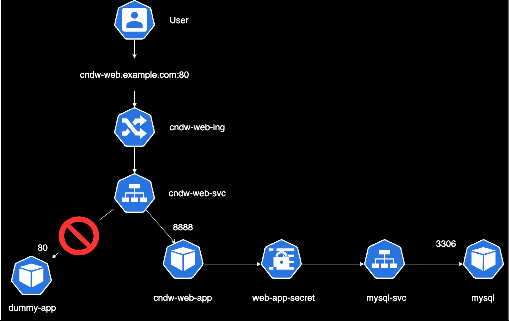

# Kubernetesハンズオン

## 1. 事前準備

まずは、CLIツールが正常に動作しているか確認します。
以下のコマンドを入力してください。

```sh
kubectl get nodes
```

Nodeの一覧が出力されるはずです。

```Log
NAME                 STATUS   ROLES           AGE   VERSION
kind-control-plane   Ready    control-plane   32d   v1.31.0
kind-worker          Ready    <none>          32d   v1.31.0
kind-worker2         Ready    <none>          32d   v1.31.0
```

Nodeが表示されない場合は、kubeconfigが設定されていない可能性があります。

以下のコマンドでkubeconfigの設定を確認します。

```sh
kubectl config get-contexts
```

```
# 実行結果
CURRENT   NAME        CLUSTER     AUTHINFO    NAMESPACE
*         kind-kind   kind-kind   kind-kind   
```


Kubernetesは、kubectlというCLIツールを提供しています。
kubectlは、ネットワークリーチャビリティのあるController NodeにAPIのリクエストを送ることで
リモートでの操作を可能にするものです。
正しくセットアップされていないとAPIリクエストを送ることができずに
Kubernetesの操作ができなくなってしまいます。

以下のコマンドでkubectlコマンドのバージョンの確認ができます。
```sh
kubectl version --client
```

```
# 実行結果
Client Version: v1.31.1
Kustomize Version: v5.4.2
```

続いて、chapter_kubernetesにcurrent directoryを移動します。

```sh
cd ~/cnd-handson/chapter_kubernetes/
```

## 2. アプリケーションデプロイ

### 2.1. DeploymentをApply

続いて、簡単なテスト用アプリケーションをデプロイします。
Kubernetesでは、Manifestと呼ばれるファイルによって各リソースの状態が定義されます。
manifestファイルはyaml形式もしくはjson形式がサポートされています。
今回はyaml形式のmanifestを用意していますので、そのManifestを使ってPodをデプロイします。
以下のコマンドを入力してください。

```sh
cd manifests
kubectl apply -f test-deployment.yaml
```

以下のコマンドでPodの確認ができます。

```sh
kubectl get pods
```

### 2.2. ポートフォワードと通信確認

続いて、作成したPodにアクセスします。
今回はポートフォワードを使いpodにアクセスしていきます。

```sh
kubectl port-forward <Pod名>  8888:80
```

以下のように出力されたら操作が受け付けられなくなりますが、ctrl＋Cを押さずにそのままでいてください。

```Log
Forwarding from 127.0.0.1:8888 -> 80
Forwarding from [::1]:8888 -> 80
```

この時点でアクセスが可能になっているはずなので、新しくターミナルを開き、以下のコマンドでアクセスしてみましょう。

```sh
curl -I http://localhost:8888
```

成功すると、リターンコード200が返却されるはずです。

動作確認後、ctrl＋Cでポートフォワードを停止します。

### 2.3. Pod削除

続いて、Podを削除してみます。
以下のコマンドを入力してください。

```sh
kubectl delete pod <pod名>
```

Pod名、及び削除されたかどうかは以下で調べることができます。

```sh
kubectl get pods
```

上記の対応では、対象PodのRESTARTSのみがリセットされPodが削除できていないことがわかります。
Kubernetesはあるべき状態をManifestとして定義します。
このケースではPodを削除したことをトリガーにあるべき状態、つまり対象のPodが1つ存在する状態に戻そうと、Podの上位リソースであるReplicasetが働きかけたことが原因です。Replicasetはさらに上位リソースであるDeploymentによって管理されています。
従って、このようなケースでPodを完全に削除したい場合はDeploymentごと削除する必要があります。

まず、以下のコマンドでDeploymentの状態を確認します。

```sh
kubectl get deployments
```

続いて、以下のコマンドで対象PodのDeploymentを削除します。

```sh
kubectl delete deployment test
```

以下のコマンドでDeployment及びPodが削除されたことを確認します。

```sh
kubectl get deployments
kubectl get pods
```

### 2.4. Tips

先ほどまではDeployment Manifestを作成しPodを作成しましたが、簡単なテストを実行したい場合などに手軽にPodを起動したい場合などがあると思います。
以下のようなコマンドを実行すると、ワンライナーでPodの起動までが行えます。

```sh

kubectl run <Pod名> --image=<image名> 

```

また、Manifestを1から書くことが難しい場合は、以下のようにdry-runとyaml出力を組み合わせてファイルに書き込むことでサンプルファイルを作成することができます。

```sh

kubectl run <pod名> --image=<image名> --dry-run=client -o yaml > <ファイル名>
```

## 3. オリジナルコンテナデプロイ (Secretの活用)

### 3.1. Deployment Manifestの修正

続いて、前回DockerHubにPushしたオリジナルのImageを使い
Podを作成していきます。

まずはmanifestを編集します。

```sh
vi hello-world.yaml
```


```Yaml
apiVersion: apps/v1
kind: Deployment
metadata:
  annotations:
    deployment.kubernetes.io/revision: "1"
  labels:
    app: hello-world
  name: hello-world
spec:
  replicas: 1
  selector:
    matchLabels:
      app: hello-world
  template:
    spec:
    metadata:
      labels:
        app: hello-world
    spec:
      containers:
      - image: <DockerHubのユーザ名>/<リポジトリ名>:<タグ名>
        imagePullPolicy: Always
        name: hello-world
        ports:
        - containerPort: 80
```

以下を、ご自身のDockerHubのユーザ名、リポジトリ名、タグに変更してください。

```
      - image: <DockerHubのユーザ名>/<リポジトリ名>:<タグ名>
```


### 3.2. Deploymentの適用

デプロイを試みます。

```sh
kubectl apply -f hello-world.yaml
```

以下のコマンドで確認すると、Podの作成が失敗していることがわかります。

```sh
kubectl get pods
```

```Log
NAME                           READY   STATUS         RESTARTS   AGE
hello-world-69db5b6c68-xdktt   0/1     ErrImagePull   0          4s
```

このようなエラーが起こった場合は、原因の解析にPodの詳細出力が役立つ場合があります。
以下のコマンドを入力します。

```sh
kubectl describe pod hello-world
```

```Log
# 実行結果

Name:             hello-world-69db5b6c68-xdktt
Namespace:        default
Priority:         0
Service Account:  default
Node:             kind-worker/172.18.0.2
Start Time:       Tue, 07 May 2024 05:25:55 +0000
Labels:           app=hello-world
                  pod-template-hash=69db5b6c68
Annotations:      <none>
Status:           Pending
IP:               10.0.0.58
IPs:
  IP:           10.0.0.58
Controlled By:  ReplicaSet/hello-world-69db5b6c68
Containers:
  hello-world:
    Container ID:   
    Image:          ryuichitakei/hello-world:1.0
    Image ID:       
    Port:           80/TCP
    Host Port:      0/TCP
    State:          Waiting
      Reason:       ImagePullBackOff
    Ready:          False
    Restart Count:  0
    Environment:    <none>
    Mounts:
      /var/run/secrets/kubernetes.io/serviceaccount from kube-api-access-5hq2z (ro)
Conditions:
  Type              Status
  Initialized       True 
  Ready             False 
  ContainersReady   False 
  PodScheduled      True 
Volumes:
  kube-api-access-5hq2z:
    Type:                    Projected (a volume that contains injected data from multiple sources)
    TokenExpirationSeconds:  3607
    ConfigMapName:           kube-root-ca.crt
    ConfigMapOptional:       <nil>
    DownwardAPI:             true
QoS Class:                   BestEffort
Node-Selectors:              <none>
Tolerations:                 node.kubernetes.io/not-ready:NoExecute op=Exists for 300s
                             node.kubernetes.io/unreachable:NoExecute op=Exists for 300s
Events:
  Type     Reason     Age                From               Message
  ----     ------     ----               ----               -------
  Normal   Scheduled  93s                default-scheduler  Successfully assigned default/hello-world-69db5b6c68-xdktt to kind-worker
  Normal   BackOff    22s (x4 over 91s)  kubelet            Back-off pulling image "ryuichitakei/hello-world:1.0"
  Warning  Failed     22s (x4 over 91s)  kubelet            Error: ImagePullBackOff
  Normal   Pulling    8s (x4 over 93s)   kubelet            Pulling image "ryuichitakei/hello-world:1.0"
  Warning  Failed     7s (x4 over 91s)   kubelet            Failed to pull image "ryuichitakei/hello-world:1.0": rpc error: code = Unknown desc = failed to pull and unpack image "docker.io/ryuichitakei/hello-world:1.0": failed to resolve reference "docker.io/ryuichitakei/hello-world:1.0": pull access denied, repository does not exist or may require authorization: server message: insufficient_scope: authorization failed
  Warning  Failed     7s (x4 over 91s)   kubelet            Error: ErrImagePull
```
### 3.3. Secretの追加

上記のログから、最終的にImageのPullに失敗しErrorになっているのがわかります。
この原因は、格納されているリポジトリがプライベート設定であることです。
外部公開されていないイメージをPullしたい場合は、Secretと呼ばれる認証情報を格納するためのリソース指定が必要です。

現状、Default NameSpaceにはSecretリソースが存在しないことを確認します。

```sh
kubectl get secrets
```

```
# 実行結果
No resources found in  default namespace.
```

今回はそれぞれのnamespaceにPodをデプロイする想定なので、namespace毎に認証情報が必要です。namespaceから外のリソースは互いに干渉しないため、それぞれのnamespace内でのみ認証情報の共有が有効となります。
今回のケースでは、ImageをPullする際にこのSecretを使うようManifestに指示を書くことでプライベートリポジトリからもImageのPullが可能になります。
では、`dockerhub-secret`という名前のsecretリソースを作成してみましょう。

以下のコマンドでSecretを作成します。

```sh
kubectl create secret docker-registry dockerhub-secret --docker-username=<DockerHubのユーザ名> --docker-password='<Dockerhubのパスワード>'
```

### 3.4. SecretをDeploymentで利用

先ほどのManifestに、Secretに関する指示を追記します。

```sh
vi hello-world.yaml
``` 

```Yaml
apiVersion: apps/v1
kind: Deployment
metadata:
  annotations:
    deployment.kubernetes.io/revision: "1"
  labels:
    app: hello-world
  name: hello-world
spec:
  replicas: 1
  selector:
    matchLabels:
      app: hello-world
  template:
    spec:
    metadata:
      labels:
        app: hello-world
    spec:
      containers:
      - image: <DockerHubのユーザ名>/<リポジトリ名>:<タグ>
        imagePullPolicy: Always
        name: hello-world
        ports:
        - containerPort: 80
      imagePullSecrets: # 追記
      - name: dockerhub-secret # 追記
```

先ほど作成したPodの設定を更新します。

```sh
kubectl apply -f hello-world.yaml
```

ImageのPullが成功し、Podが起動しているはずです。

```sh
kubectl get pods
```

## 4. ReplicaSetの仕組み

ReplicaSetは稼働しているPod数を明示的に指定し、それを維持するためのリソースです。
2.アプリケーションデプロイの章でも体感していただきましたが、指定したReplica数を維持するために
自動的にPodの作成、削除が行われます。
現在、みなさんのManifestにはReplica数1が設定されています。
そのため、起動しているPodも1つになっているはずです。

```Yaml
apiVersion: apps/v1
kind: Deployment
metadata:
  annotations:
    deployment.kubernetes.io/revision: "1"
  labels:
    app: hello-world
  name: hello-world
spec:
  replicas: 1 #ここが1になっている 
  selector:
    matchLabels:
      app: hello-world
  template:
    spec:
    metadata:
      labels:
        app: hello-world
    spec:
      containers:
      - image: ryuichitakei/hello-world:1.0
        name: hello-world
        ports:
        - containerPort: 80
      imagePullSecrets:
      - name: dockerhub-secret
```

では以下のようにManifestを修正し、再度Manifestを登録しなおしてみます。

```Yaml
apiVersion: apps/v1
kind: Deployment
metadata:
  annotations:
    deployment.kubernetes.io/revision: "1"
  labels:
    app: hello-world
  name: hello-world
spec:
  replicas: 2 # 修正
  selector:
    matchLabels:
      app: hello-world
  template:
    spec:
    metadata:
      labels:
        app: hello-world
    spec:
      containers:
      - image: ryuichitakei/hello-world:1.0
        name: hello-world
        ports:
        - containerPort: 80
      imagePullSecrets:
      - name: dockerhub-secret
```

```sh
kubectl apply -f hello-world.yaml
```

Podが2つに増えているか確認します。

```sh
kubectl get pods
```

> 出力例

```Log
NAME                           READY   STATUS    RESTARTS   AGE
hello-world-5b48b68bb6-bh27l   1/1     Running   0          2m12s
hello-world-5b48b68bb6-ftwtz   1/1     Running   0          23s
```

## 5. Podの外部公開

続いて、Podの外部公開の方法を紹介します。
前回のセッションではPortForwardを使ってPodのアクセスを行いましたが
本セクション以降はIngressというリソースを使って外部公開を行います。


### 5.1. Service/Ingressリソースの作成

では、Serviceを作成していきます。


以下のManifestが配置されていますので、それをapplyします。

```Yaml
apiVersion: v1
kind: Service
metadata:
  labels:
    app: hello-world
  name: hello-world-service
spec:
  ports:
  - port: 80
    protocol: TCP
    targetPort: 80
  selector:
    app: hello-world
  type: ClusterIP
```

```sh
kubectl apply -f hello-world-service.yaml
```

Serviceについては以下で確認が可能です。

```sh
kubectl get services
```

> 出力例

```Log
NAME                  TYPE        CLUSTER-IP     EXTERNAL-IP   PORT(S)   AGE
hello-world-service   ClusterIP   10.96.110.56   <none>        80/TCP    16m
```

続いてIngressリソースを作成します。
Serviceリソース同様、予め用意されているManifestを使用します。


```Yaml
apiVersion: networking.k8s.io/v1
kind: Ingress
metadata:
  name: hello-world-ingress
spec:
  ingressClassName: nginx
  rules:
  - host: hello-world.vmXX.handson.cloudnativedays.jp
    http:
      paths:
      - pathType: Prefix
        path: "/"
        backend:
          service:
            name: hello-world-service
            port:
              number: 80
```

```sh
kubectl apply -f hello-world-ingress.yaml 
```

作成したIngressは以下で確認が可能です。

```sh
kubectl get ingress
```

> 出力例

```Log
NAME                  CLASS   HOSTS                                         ADDRESS        PORTS   AGE
hello-world-ingress   nginx   hello-world.vmXX.handson.cloudnativedays.jp   10.96.246.72   80      17m
```

### 5.2. 動作確認

続いて、ブラウザで以下にアクセス確認を行います。
Hello Worldの文字が表示されたら成功です。

```
 hello-world.vmXX.handson.cloudnativedays.jp
```

動作確認後、リソースを削除します。

```
kubectl delete ingress hello-world-ingress
kubectl delete service hello-world-service
kubectl delete deployment hello-world
kubectl delete secret dockerhub-secret
```

## 6. アプリケーションの更新

このセクションでは、Kubernetesが持つPodの更新方法について紹介します。

### 6.1. Rolling Update

Kubernetesには、Podを別のイメージに変更したりバージョンを更新する際に、サービスに影響が出ないよう段階的に更新の動作を行うRolling Updateという機能があります。

それでは、実際に更新動作を確認していきましょう。
更新するときの処理はstrategy で指定します。デフォルトはRollingUpdateです。
ローリングアップデートの処理をコントロールするためにmaxUnavailableとmaxSurgeを指定することができます。

- minReadySeconds
  新しく作成されたPodが利用可能となるために、最低どれくらいの秒数コンテナーがクラッシュすることなく稼働し続ければよいか
- maxSurge
  理想状態のPod数を超えて作成できる最大のPod数(割合でも設定可)
- maxUnavailable
  更新処理において利用不可となる最大のPod数(割合でも設定可)


今回は4つのReplica数に対してmaxSurgeを25%、つまり1つずつ更新がかかるような設定をしています。
また、Podは作成後直ぐに利用可能になるので、動作イメージをつかみやすくするためにminReadySecondsは10秒に設定しています。


動作確認用のManifestを適用しましょう。

```sh
kubectl apply -f rollout.yaml
```

続いて、ブラウザで以下にアクセスを行います。

```
http://rollout.vmXX.handson.cloudnativedays.jp
```

Pod更新前の状態では、`This app is Blue`の画面が表示がされていると思います。


続いて、先ほどデプロイしたDeploymentに対して、イメージの更新を行います。


その際、Rolling Updateの機能が働き、25%のPod数(1個)ずつ追加されていく様子が確認できます。

```sh
# 適用
kubectl set image deployment/rollout rollout-app=ryuichitakei/green-app:1.0
```

```sh
# 確認
kubectl rollout status deployment 
kubectl rollout history deployment 
kubectl get pods
kubectl get deployments
```

更新後、ブラウザで再度以下にアクセスを行うと`This app is Green`の表示に更新されていることが確認できます。

```
http://rollout.vmXX.handson.cloudnativedays.jp
```

尚、ロールバックを行う場合は以下のコマンドで実行可能です。

```sh
kubectl rollout undo deployment rollout
```

動作確認実施後、リソースの削除を行います。

```sh
kubectl delete deployment rollout
kubectl delete service rollout-service
kubectl delete ingress rollout-ingress
```

### 6.2 Blue-Green Deployment


古い環境と新しい環境を混在させ、ルーティングなどによってトラフィックを制御し、ダウンタイム無しで環境を切り替えます。
今回はIngressのHost名によって、新旧どちらのアプリケーションにもアクセスできるような環境を用意しています。


まずは、対象のManifestを適用します。

```sh
kubectl apply -f blue-green.yaml
```

続いて、Pod,Service,Ingressがそれぞれデプロイされているか確認を行います。


```sh
kubectl get pods,services,ingress
```

それぞれのリソースが正常に動作していることが確認できたら、ブラウザから以下のようにアクセスができるはずです。


```
http://blue.vmXX.handson.cloudnativedays.jp → Blue App
http://green.vmXX.handson.cloudnativedays.jp → Green App
```

動作確認実施後、リソースの削除を行います。

```sh
kubectl delete pod blue
kubectl delete pod green
kubectl delete service blue-service
kubectl delete service green-service
kubectl delete ingress blue-green
```

## 7. データの永続化 (PVとPVC)

ここまでのハンズオンで、コンテナの特性がある程度見えてきたかと思います。
おさらいすると、以下のような特性があります。

- カーネルを持たず、プロセスのような振る舞いをする
- 起動・停止がVMに比べて高速で行える
- データを自身で持たずエフェメラルな存在として扱う。

上記の特性から、コンテナのデータをどう扱う(システムとしてどう設計する)かは非常に重要な観点です。
このセクションでは、Nodeが持つストレージにPodをマウントさせ、データの永続化が確認できるまでのテストを行います。


PV(Persistent Volume)は外部ストレージとの接続を司るリソースです。
以下がPVを作成するためのサンプルコードです。


```Yaml
apiVersion: v1
kind: PersistentVolume
metadata:
  name: handson-pv 
spec:
  capacity:
    storage: 1Gi
  volumeMode: Filesystem
  accessModes:
    - ReadWriteMany
  persistentVolumeReclaimPolicy: Retain
  storageClassName: standard
  hostPath:
    path: /tmp
```


PVC(Persistent Volume Claim)は、PodのVolumeに関する要求事項を定義するためのリソースです。

```Yaml
apiVersion: v1
kind: PersistentVolumeClaim
metadata:
  name: handson-pvc
spec:
  accessModes:
    - ReadWriteMany
  storageClassName: standard
  resources:
    requests:
      storage: 1Gi
```


データの永続化を行うPodは、volumes属性に使いたいPVCの名前を書くことで作成できます。

```Yaml
apiVersion: v1
kind: Pod
metadata:
  name: volume-pod
spec:
  containers:
  - name: volume-app
    image: busybox
    command: ["/bin/sh"]
    args: ["-c","while true; do echo $(date -u) >> /data/out1.txt; sleep 5; done"]
    volumeMounts:
    - name: persistent-storage
      mountPath: /data
  volumes:
  - name: persistent-storage
    persistentVolumeClaim:
      claimName: handson-pvc
```


以下のコマンドで各リソースの作成を行います。


```sh
kubectl apply -f handson-volume.yaml
```


以下のコマンドで各リソースの確認を行います。

```sh
kubectl get pv,pvc,pods
kubectl describe pv handson-pv
kubectl describe pvc handson-pvc
```

今回のシナリオでは、5秒ごとにdateコマンドで日付をマウント先のファイル`/data/out1.txt`に書き込むPodを作成しています。
以下のコマンドで動作確認が行えます。

```sh
kubectl exec volume-pod -- tail /data/out1.txt
```

動作確認後、リソースの削除を行います。


```sh
kubectl delete pod volume-pod
kubectl delete pvc handson-pvc
kubectl delete pv handson-pv
```

### 8. Init Container


PodはKubernetesにおける最小の単位ですが、その実態は複数(単独の場合もある)のコンテナで実行するリソースです。
例えば、Service Meshを実現するためにネットワークプロキシとなるコンテナAとサービスアプリケーションとなるコンテナBを1つのPodとして稼働させることで、ネットワーク周りの処理をコンテナBに任せてコンテナはサービスの提供に全てのリソースを割くといったことができます。
また、init containerと呼ばれる一時的な用途のコンテナを作成することも可能です。

今回はinit containerの動作を確認してみましょう。
このシナリオでは、起動時に作成されるコンテナ(Init Container)が'CNDT2024!!'というメッセージを出力するコンテンツを作成しマウント先のボリュームに保存します。
その後、nginxが起動しInit Containerが作成したコンテンツを参照することで、nginxにアクセスした際に上記メッセージが返却されます。

まずは以下のManifestをapplyします。

```sh
kubectl apply -f handson-init.yaml
```

続いて、動作確認のためPodのIPを確認します。

```sh
kubectl get pods -o wide | grep init
```

最後に一時的な確認Podを使ってcurlでのアクセス確認をしてみましょう。


```sh
kubectl run tmp --restart=Never --rm -i --image=nginx:alpine -- curl <PodのIP>
```

以下のように`CNDW2024!!`のメッセージが確認できます。


```
# 実行結果


  % Total    % Received % Xferd  Average Speed   Time    Time     Time  Current
                                 Dload  Upload   Total   Spent    Left  Speed
CNDW2024!!
100    11  100    11    0     0   8094      0 --:--:-- --:--:-- --:--:-- 11000
pod "tmp" deleted
```

動作確認後、リソースを削除します。

```sh
kubectl delete deployment handson-init-container
```


### 9. 認証・認可

すべてのKubernetesクラスターには、2種類のユーザーがあります。Kubernetesによって管理されるService Accountと、通常のユーザーです。

Service AccountはKubernetes APIによって管理されるユーザーです。特定の名前空間にバインドされており、APIサーバーによって自動的に作成されるか、APIコールによって手動で作成されます。
また、Service Accountは、Secretsとして保存された資格情報の集合に紐付けられています。これをPodにマウントすることで、クラスター内のプロセスがKubernetes APIと通信できるようにします。

一方、クラスターから独立したサービスは通常のユーザーを以下の方法で管理することを想定されています。

- 秘密鍵を配布する管理者
- KeystoneやGoogle Accountsのようなユーザーストア
- ユーザー名とパスワードのリストを持つファイル
  
これを考慮すると、 Kubernetesは通常のユーザーアカウントを表すオブジェクトを持ちません。 APIコールを介して、通常のユーザーをクラスターに追加することはできません。

APIコールを介して通常のユーザーを追加できませんが、クラスターの認証局(CA)に署名された有効な証明書で表すユーザーは認証済みと判断されます。
この構成では、Kubernetesは証明書の‘subject’内にある一般的な名前フィールド(例えば、“/CN=bob”)からユーザー名を特定します。
そこから、ロールベースアクセス制御(RBAC)サブシステムは、ユーザーがあるリソースにおける特定の操作を実行するために認証済みかどうか特定します。


#### 9.1. Service Accountの作成と動作確認

> ServiceAccount作成

```sh
kubectl get serviceaccounts
kubectl create serviceaccount handson-sa
kubectl get serviceaccounts
```

> Role作成

```sh
kubectl get role
kubectl create role handson-role --resource=pods --verb=get,watch,list
kubectl get role
```

> RoleBinding作成

```sh
kubectl get rolebinding
kubectl create rolebinding handson-rolebinding --role=handson-role --serviceaccount=default:handson-sa
kubectl get rolebinding
```

> Podデプロイ

```sh
kubectl apply -f kubectl-pod.yaml
```

> ログからコマンドを実行していることを確認

```sh
kubectl logs kubectl-pod
```

> 一度Podを削除し、コマンドを変更して再デプロイ

```sh
kubectl delete pod kubectl-pod
```

vimなどのエディタを使って、Pod内で実行するコマンドを変更します。

```Yaml
apiVersion: v1
kind: Pod
metadata:
  name: kubectl-pod
spec:
  containers:
  - image: bitnami/kubectl
    name: kubectl
    command:
    - sh
    - -c
    - |
      while true
      do
        kubectl get deployment # 変更箇所
        sleep 30
      done
  serviceAccountName: handson-sa
```

```sh
kubectl apply -f kubectl-pod.yaml
```

> ログからコマンドが弾かれていることを確認

```sh
kubectl logs kubectl-pod
```

>確認できたらPodを削除

```sh
kubectl delete pod kubectl-pod
```

#### 9.2. ユーザの作成と動作確認

続いてユーザの作成を行います。
前述した通り、KubernetesにはユーザーをAPIコールによって追加することはできませんが、Kuberrnetes Cluster内の認証局にて署名された証明書を持たせることによって、認証されたユーザーとしてAPIを呼び出すことができるようになります。
今回は、CSRの作成後、認証局での承認を行い証明書を発行したのち、roleの作成を行い実際の動作確認を行います。
その後、新しいクレデンシャルを作成し、contextを切り替えることで追加したユーザを使ったAPIコールの動作確認を行います。
尚、本シナリオはPodに関する操作のみが行えるroleを作成します。

> 秘密鍵とCSRの作成

まずは秘密鍵とCSRの作成を行います。

```sh
openssl genrsa -out handson-user.pem 2048
openssl req -new -key handson-user.pem -out handson-user.csr -subj "/CN=handson-user"
```

> CSRをbase64にエンコード

```sh
cat handson-user.csr | base64 | tr -d '\n'
```

> CSRの作成

handson-csr.yamlを用意しています。
その中に、先ほどエンコードした文字列を貼り付けます。


```Yaml
apiVersion: certificates.k8s.io/v1
kind: CertificateSigningRequest
metadata:
  name: handson-user
spec:
  signerName: kubernetes.io/kube-apiserver-client
  request: <base64でエンコードしたテキストを貼り付ける>
  usages:
  - client auth
```

その後、Manifestをapplyします。

```sh
kubectl apply -f handson-csr.yaml
```

> CSRをApprove

続いて、作成したCSRをApploveします。

```sh
kubectl get csr
```

```sh
kubectl certificate approve handson-user
```

```sh
kubectl get csr
```

> 証明書の取得

続いて、CSRから証明書を取得します。
実際の証明書の値は`status.certificate`を見ると確認できます。

```sh
kubectl get csr/handson-user -o yaml
```

これをbase64でencodeした形でエクスポートします。


```sh
kubectl get csr handson-user -o jsonpath='{.status.certificate}'| base64 -d > handson-user.crt
```

> Role作成

`handson-user`に割り当てるroleを作成します。
今回はPodに関する一連の操作のみを許可する設定です。

```sh
kubectl get role
kubectl create role handson-user-role --resource=pods --verb=create,list,get,update,delete,watch
kubectl get role
```

> RoleBinding作成

続いてRoleBindingを作成します。先ほど作成したRoleとhandson-userを実際に紐づける設定です。

```sh
kubectl get rolebinding
kubectl create rolebinding handson-user-rolebinding --role=handson-user-role --user=handson-user
kubectl get rolebinding
```

> kubeconfigに追加

以下のコマンドで、新しいクレデンシャルを追加します。

```sh
kubectl config set-credentials handson-user --client-key=handson-user.pem --client-certificate=handson-user.crt --embed-certs=true
```

続いて、contextを追加します。


```sh
kubectl config set-context handson-user --cluster=kind-kind --user=handson-user
```

追加されると、以下のようにcontextが増えているのが確認できます。

```sh
kubectl config get-contexts
```


```Log
CURRENT   NAME           CLUSTER     AUTHINFO       NAMESPACE
          handson-user   kind-kind   handson-user   
*         kind-kind      kind-kind   kind-kind
```

続いて、handson-userにcontextを変更します。

```sh
kubectl config use-context handson-user
```

再度contextの状態を確認すると、handson-userに*が付いていることがわかります。

```Log
CURRENT   NAME           CLUSTER     AUTHINFO       NAMESPACE
*         handson-user   kind-kind   handson-user   
          kind-kind      kind-kind   kind-kind
```


```sh
kubectl config get-contexts
```

> 動作確認

この状態でいくつかコマンドを実行してみます。


まずはPodの作成、確認コマンドを実行します。
Podの作成、確認に関してはroleにより権限が付与されているため実行可能です。

```sh
kubectl run test --image=nginx
```

```sh
 kubectl get pods
```

```Log
NAME   READY   STATUS    RESTARTS   AGE
test   1/1     Running   0          28s
```

削除も同様に行うことが可能です。

```sh
kubectl delete pod test
```

しかしながら、Deploymentなど他のリソースに関するロールは割り当てられていないためエラーとなります。

```sh
kubectl create deployment test --image=nginx
```

```Log
error: failed to create deployment: deployments.apps is forbidden: User "handson-user" cannot create resource "deployments" in API group "apps" in the namespace "default"
```

続いて、contextを元々使用していたものに再度変更し同じコマンドを実行してみます。

```sh
kubectl config use-context kind-kind
```

```sh
kubectl create deployment test --image=nginx
```

問題なく実行できることが確認できます。

```sh
kubectl get deployment
```

```Log
NAME   READY   UP-TO-DATE   AVAILABLE   AGE
test   1/1     1            1           8s
```

動作確認後、リソースを削除します。

```sh
kubectl config delete-context handson-user 
kubectl delete rolebinding handson-user-rolebinding 
kubectl delete role handson-user-role
kubectl delete csr handson-user
kubectl delete deployment test
```


## 10. Readiness/Liveness Probe

KubernetesにはPodが正常に起動したか、または正常に動作を続けているかを監視する機能が存在します。
このセクションで取り扱うReadiness/Liveness Probeは、コマンドの実行結果やTCP・HTTPリクエストなどのリターンコードによって
そのPodの準備が出来ているかどうか、または正常に動作しているかどうかを判断します。


以下はヘルスチェックのオプションです。


- initialDelaySeconds

  
  初回ヘルスチェックまでの遅延時間（秒）

  
- periodSeconds

  
  Probeが実行される間隔（秒）

  
- timeoutSeconds

  
  タイムアウトまでの時間（秒）

  
- successThreshold

  
  成功と判断する最小連続成功数（回数）

  
- failureThreshold

  
  失敗と判断する試行回数（回数）


### 10.1 Readiness Probe

今回は`/tmp/ready`ファイルの有無によって、Podの準備が出来ているかを判断するシナリオです。
まずは対象のファイルを作成しない状態でPodをデプロイしてみます。


```sh
kubectl apply -f readiness-pod.yaml
```

対象のファイルが作成されていない状態ではPodがReadyのステータスにならないことがわかります。

```sh
kubectl get pods
```

```Log
# 実行結果

NAME                    READY   STATUS    RESTARTS      AGE
readiness-pod           0/1     Running   0             7s
```


続いてreadiness-pod.yamlを以下のように編集して、コンテナ内に対象のファイルを作成するようにします。

```Yaml
apiVersion: v1
kind: Pod
metadata:
  labels:
    app: readiness-pod
  name: readiness-pod
spec:
  containers:
  - command:
    - sh
    - -c
    - touch /tmp/ready && sleep 1d # 編集
    image: busybox:1.31.0
    name: readiness-container
    resources: {}
    readinessProbe:
      exec:
        command:
        - sh
        - -c
        - cat /tmp/ready
      initialDelaySeconds: 5
      periodSeconds: 5
      timeoutSeconds: 1
      successThreshold: 1
      failureThreshold: 1
```

以下のコマンドでPodを入れ替えてみましょう。

```sh
kubectl replace -f readiness-pod.yaml --force
```

再度Podの状態を確認すると、状態がReadyになっていることが確認できます。


```Log
# 実行結果


NAME                    READY   STATUS    RESTARTS      AGE
readiness-pod           1/1     Running   0             7s
```

動作確認後、リソースを削除します。

```sh
kubectl delete pod readiness-pod
```

### 10.2 Liveness Probe


続いて、Liveness Probeの動作確認を行います。
Readiness Probe同様、ファイルの有無によってPodの正常性を確認します。
このシナリオでは`/tmp/healthy`ファイルが自動的に削除されます。
そのため、ヘルスチェックに失敗したPodは自動的にリスタートを行います。

まず、PodをApplyします。

```sh
kubectl apply -f liveness-pod.yaml
```

以下のコマンドでPodの挙動が確認できます。
Pod作成からしばらく経つと、`RESTARTS`のカウンタが上昇していくのが確認できます。

```sh
watch -n 1 kubectl get pods
```

動作確認後、リソースを削除します。

```sh
kubectl delete pod liveness-pod
```

## 11. Network Policy

Network PolicyはPod同士の通信を制御し、特定のPodやプロトコルを許可/拒否させることができるリソースです。

前提として、以下のCNIのいずれかを使ってクラスタを構築している必要があります。

- Calico
- Cilium
- Kube-router
- Romana
- Weave Net

尚、今回はCiliumを使用しています。

設定方法として、以下を意識する必要があります。

- 通信の方向
  - Ingress：　あるPodからの通信（インバウンド）
  - Egress：　あるPodへの通信（アウトバウンド）
- Policy
  - podSelector: あるPodから、もしくはあるPodへの通信可否
  - namespaceSelector: あるNamespaceから、もしくはあるNamespaceへの通信可否
  - ipBlock: あるIPアドレスから、もしくはあるIPアドレスへの通信可否

今回は3つのテスト用のPodをデプロイし、curlを使って通信確認を行なっていきます。

```sh
kubectl apply -f netpol-pod.yaml
```

通信確認を行うためにPodに付与されているIPアドレスを確認します。

```sh
kubectl get pods -o wide -L app | grep app
```

以下のように、curlを使ってPod同士の通信確認をそれぞれ行なっていきます。

```sh
kubectl exec -it nginx-app1 -- curl -I <PodのIP>
kubectl exec -it nginx-app2 -- curl -I <PodのIP>
kubectl exec -it nginx-app3 -- curl -I <PodのIP>
```

続いて、すべての通信を拒否するNetwork Policyを適用します。


```sh
kubectl apply -f default-deny-all.yaml
```

先ほどと同じようにcurlを投げても、タイムアウトになることが確認できます。

```sh
kubectl exec -it nginx-app1 -- curl -I <PodのIP>
kubectl exec -it nginx-app2 -- curl -I <PodのIP>
kubectl exec -it nginx-app3 -- curl -I <PodのIP>
```

続いて、`app1`と`app3`同士の通信のみが許可されるポリシーを適用していきます。
今回は`podSelector`を使用してポリシーを設定しています。

```sh
kubectl apply -f handson-policy.yaml
```

設定後、`app1`と`app3`同士の通信のみが可能であることが確認できます。

```sh
kubectl exec -it nginx-app1 -- curl -I <PodのIP>
kubectl exec -it nginx-app2 -- curl -I <PodのIP>
kubectl exec -it nginx-app3 -- curl -I <PodのIP>
```

動作確認後、リソースを削除します。

```sh
kubectl delete networkpolicy default-deny-all
kubectl delete networkpolicy app1-app3
kubectl delete networkpolicy app3-app1
kubectl delete pod nginx-app1
kubectl delete pod nginx-app2
kubectl delete pod nginx-app3
```


## 12. JobとCronJob

### 12.1. Job

Jobは、ReplicaSetと同様、Podを管理するためのPodの上位リソースに該当します。
Podを使って一時的な処理を行う際に利用するリソースで、処理を実行後にPodは自動的に削除されます。
今回はechoでメッセージを出力する簡単なJobを実行します。

Jobリソースは、並列動作や繰り返し動作に関するオプションのパラメータを設定することが可能です。


- completion
  指定した回数Podが正常終了したら、Jobが終了する
- parallelism
  指定した数値分Podを並列で起動する
- backoffLimit
  指定した回数分Podをリトライする。リトライ回数が上限に達するとエラー判定となる


今回は以下のように設定しているため、計6回Jobが実行され
2つのPodが並列で動作します。

```Yaml
completion: 6
parallelism: 2
```

以下のManifestを適用します。

```sh
kubectl apply -f handson-job.yaml
```

動作確認は以下のコマンドで行います。

```sh
kubectl get job
```

以下のように、完了したJobは`COMPLETIONS`としてカウントされていきます。

```Log
# 実行結果


NAME          COMPLETIONS   DURATION   AGE
handson-job   6/6           15s        58s
```

また、Podの挙動を観察することで動作確認をすることも可能です。
以下のコマンドで2つずつ並列でJobが実行されていくのが確認できます。

```sh
watch -n 1 kubectl get pod
```

実際のJobの実行結果はLogを確認します。

```sh
kubectl logs <Pod名>
```

確認が完了したらリソースを削除します。


```sh
kubectl delete job handson-job
```

### 12.2. CronJob

CronJobは、リソース内のCronに従って、スケジュールされた時間にJobを実行します。
CronJobは、先ほど実行したJobの上位リソースに当たります。

今回は1分ごとにJobを動作させるシナリオです。
それでは、前回のJobのシナリオ同様にManifestをapplyして動作を確認していきましょう。

```sh
kubectl apply -f handson-cronjob.yaml
```

1分ごとにJobが増えていくのが確認できます。

```sh
watch -n 1 kubectl get pods
```

今回はdateコマンドを実行するJobなので、日付が出力されているはずです。

```sh
kubectl logs <Pod名>
```

以下のコマンドはCron Jobのステータスや詳細が確認できます。

```sh
kubectl get cronjob
```

```sh
kubectl describe cronjob handson-cronjob
```

Cron Jobを一時停止したい場合は、kubectl patchコマンドを使用します。
リソース内の`spec.suspend`パラメータを`true`にすることで停止が可能です。

`kubectl get cronjob`を実行すると、現在は`SUSPEND`が`False`になっていることが確認できます。

```Log
# 実行結果


NAME              SCHEDULE      SUSPEND   ACTIVE   LAST SCHEDULE   AGE
handson-cronjob   */1 * * * *   False     0        24s             7m24s
```

以下のコマンドを実行します。

```sh
kubectl patch cronjob handson-cronjob -p '{"spec":{"suspend":true}}'
```

実行後、以下のようにステータスが変更されていることが確認できます。

```Log
# 実行結果


NAME              SCHEDULE      SUSPEND   ACTIVE   LAST SCHEDULE   AGE
handson-cronjob   */1 * * * *   True      0        8s              13m
```

動作確認後、リソースを削除します。


```sh
kubectl delete cronjob handson-cronjob
```

## 13. ConfigMap

ConfigMapは、機密性のないデータをキーと値のペアで保存するために使用されるリソースです。
環境固有の設定などをコンテナイメージから分離できるため、アプリケーションを簡単に移植できるようになります。

但し、機密性や暗号化の機能を持たないため保存したいデータが機密情報である場合はSecretやサードパーティツールを使用する必要があります。
今回は`CNDW2024 ConfigMap Handson`というHTML形式のデータをConfigMapに保存し、Podにマウントさせています。
クライアントからのリクエストはマウントされたConfigMapのHTMLデータを参照するため、`CNDW2024 ConfigMap Handson`という文字列が返却されるはずです。


まずは、ConfigMapを作成します。

```sh
kubectl apply -f handson-configmap.yaml
```

続いてPodを作成します。

```sh
kubectl apply -f configmap-pod.yaml
```

次に、PodにアクセスするためIPアドレスを調べます。以下のコマンドでPodに紐づくIPアドレスが判ります。

```sh
kubectl get pods -o wide
```

最後にテンポラリのPodを作成し、curlでアクセスを試みます。
`CNDW2024 ConfigMap Handson`という文字列が返却されると成功です。

```sh
kubectl run tmp --restart=Never --rm -i --image=nginx:alpine -- curl <PodのIPアドレス>
```

動作確認後、リソースを削除します。

```sh
kubectl delete pod configmap-pod
kubectl delete configmap handson-configmap
```

## 14. Resources

KubernetesにはNamespace単位でリソースを制御することができるResource Quotaという機能があります。
制御できる機能は以下です。

- Compute Resource Quota
- Storage Resource Quota
- Object Count Quota

今回はCompute Resource Quotaを使ってCPU/メモリに対して上限と下限を設定するシナリオを用意しています。

まずは`resource-test`という名前のnamespaceを作成します。


```sh
kubectl create namespace resource-test
```

以下のようにnamespaceが作成されます。

```sh
kubectl get namespace
```

```Log
# 実行結果

NAME                 STATUS   AGE
resource-test        Active   6s
```

続いて、作成したnamespaceにCompute Resource Quotaを設定します。

```sh
kubectl apply -f test-resource-quota.yaml 
```

以下のように作成されていることが確認できます。


```sh
kubectl get resourcequotas -n resource-test
```

> 出力例

```Log
# 実行結果


NAME                  AGE   REQUEST   LIMIT
test-resource-quota   14s             limits.cpu: 0/200m, limits.memory: 0/200Mi
```

続いて、テスト用Podのデプロイを試みます。
今回はテスト用のDeployment Manifestを用意しています。

```sh
kubectl apply -f resource-test.yaml
```


動作確認をすると、Podが起動していないことが確認できます。

```sh
kubectl get pods -n resource-test
```


```
# 実行結果

No resources found in resource-test namespace.
```

Deploymentも同様にREADYのPodが0であることが確認できます。

```sh
kubectl get deployments -n resource-test
```


```Log

# 実行結果

NAME            READY   UP-TO-DATE   AVAILABLE   AGE
resource-test   0/1     0            0           52s
```

この時、Replicasetの状態を確認するとCPUやMemoryなどQuotaで設定したリソースの制限は必須であるため、エラーになっていることが判ります。

```sh
kubectl describe -n resource-test replicasets.apps resource-test
```


```Log
# 実行結果


Name:           resource-test-6cb9b54b4c
Namespace:      resource-test
Selector:       app=resource-test,pod-template-hash=6cb9b54b4c
Labels:         app=resource-test
                pod-template-hash=6cb9b54b4c
Annotations:    deployment.kubernetes.io/desired-replicas: 1
                deployment.kubernetes.io/max-replicas: 2
                deployment.kubernetes.io/revision: 1
Controlled By:  Deployment/resource-test
Replicas:       0 current / 1 desired
Pods Status:    0 Running / 0 Waiting / 0 Succeeded / 0 Failed
Pod Template:
  Labels:  app=resource-test
           pod-template-hash=6cb9b54b4c
  Containers:
   nginx:
    Image:        nginx:latest
    Port:         <none>
    Host Port:    <none>
    Environment:  <none>
    Mounts:       <none>
  Volumes:        <none>
Conditions:
  Type             Status  Reason
  ----             ------  ------
  ReplicaFailure   True    FailedCreate
Events:
  Type     Reason        Age                  From                   Message
  ----     ------        ----                 ----                   -------
  Warning  FailedCreate  10m                  replicaset-controller  Error creating: pods "resource-test-6cb9b54b4c-s9m9f" is forbidden: failed quota: test-resource-quota: must specify limits.cpu for: nginx; limits.memory for: nginx
  Warning  FailedCreate  10m                  replicaset-controller  Error creating: pods "resource-test-6cb9b54b4c-xchht" is forbidden: failed quota: test-resource-quota: must specify limits.cpu for: nginx; limits.memory for: nginx
  Warning  FailedCreate  10m                  replicaset-controller  Error creating: pods "resource-test-6cb9b54b4c-hs6tz" is forbidden: failed quota: test-resource-quota: must specify limits.cpu for: nginx; limits.memory for: nginx
  Warning  FailedCreate  10m                  replicaset-controller  Error creating: pods "resource-test-6cb9b54b4c-qdph7" is forbidden: failed quota: test-resource-quota: must specify limits.cpu for: nginx; limits.memory for: nginx
  Warning  FailedCreate  10m                  replicaset-controller  Error creating: pods "resource-test-6cb9b54b4c-dxflr" is forbidden: failed quota: test-resource-quota: must specify limits.cpu for: nginx; limits.memory for: nginx
  Warning  FailedCreate  10m                  replicaset-controller  Error creating: pods "resource-test-6cb9b54b4c-xfw8z" is forbidden: failed quota: test-resource-quota: must specify limits.cpu for: nginx; limits.memory for: nginx
  Warning  FailedCreate  10m                  replicaset-controller  Error creating: pods "resource-test-6cb9b54b4c-465t2" is forbidden: failed quota: test-resource-quota: must specify limits.cpu for: nginx; limits.memory for: nginx
  Warning  FailedCreate  10m                  replicaset-controller  Error creating: pods "resource-test-6cb9b54b4c-6ml62" is forbidden: failed quota: test-resource-quota: must specify limits.cpu for: nginx; limits.memory for: nginx
  Warning  FailedCreate  10m                  replicaset-controller  Error creating: pods "resource-test-6cb9b54b4c-bvc5t" is forbidden: failed quota: test-resource-quota: must specify limits.cpu for: nginx; limits.memory for: nginx
  Warning  FailedCreate  5m15s (x8 over 10m)  replicaset-controller  (combined from similar events): Error creating: pods "resource-test-6cb9b54b4c-z92sl" is forbidden: failed quota: test-resource-quota: must specify limits.cpu for: nginx; limits.memory for: nginx
```

では、先ほどのDeployment Manifest resource-test.yamlをvimなどのエディタを利用して編集し、リソースの上限と下限を割り当ててみましょう。

```Yaml
apiVersion: apps/v1
kind: Deployment
metadata:
  name: resource-test
  namespace: resource-test
spec:
  replicas: 1
  selector:
    matchLabels:
      app: resource-test
  template:
    metadata:
      labels:
        app: resource-test
    spec:
      containers:
        - name: nginx
          image: nginx:latest
          ## ↓ここから追記
          resources:
            requests:
              memory: 100Mi
              cpu: 100m
            limits:
              memory: 200Mi 
              cpu: 200m 
```


再度Deployment Manifestをapplyします。

```sh
kubectl apply -f resource-test.yaml 
```

すると、Podが対象のnamespaceにデプロイされたことが確認できます。

```sh
kubectl get pods -n resource-test 
```


```Log
# 実行結果


NAME                             READY   STATUS    RESTARTS   AGE
resource-test-695d9849c7-6dg2v   1/1     Running   0          8s
```

動作確認後、リソースを削除します。

```sh
kubectl delete -n resource-test deployments.apps resource-test
kubectl delete -n resource-test resourcequotas test-resource-quota
kubectl delete namespaces resource-test
```

### 15. トラブルシュート

セクションの最後に、簡単なWebアプリケーションを使ったトラブルシュートに挑戦してみましょう。
構成図右下にあるcnd-web-appに接続し、適切なWebページを表示させることがゴールです。



> [!NOTE]
> - 動作確認は、ブラウザから以下のURLにアクセスすることで行います。
>   - http://cndw-web.vmXX.handson.cloudnativedays.jp
> - リソースの更新後もWeb画面の表示が変わらない場合があります。1-2分待ってからブラウザのリフレッシュを行なってください。
> - 改修箇所は1箇所ではない可能性があります。また、構成図とエラーメッセージがヒントになる場合があります。


以下のコマンドでアプリのデプロイを行なってください。
```sh
kubectl apply -f cndw-web.yaml
```


動作確認後、リソースを削除します。

```sh
kubectl delete pod cndw-web-app
kubectl delete pod dummy-app
kubectl delete pod mysql
kubectl delete service cndw-web-svc
kubectl delete service mysql-svc
kubectl delete ingress cndw-web-ing
kubectl delete secret app-secret
```


### 16. おまけ(jsonpath)

jsonpathは、ワンライナーで欲しい情報のみを引き抜く際に便利な機能です。
jsonpathでNodeの内部IPのみをファイルに書き出してみましょう。

```sh
kubectl get nodes -o jsonpath='{.items[*].status.addresses[?(@.type=="InternalIP")].address}' > <ファイルのPathとファイル名>
```
