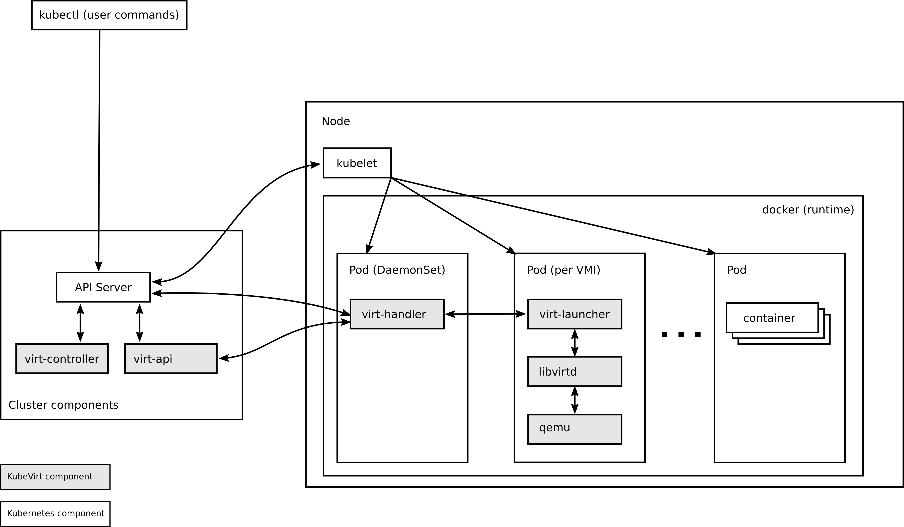

# KubeVirt
本chapterではKubernetesクラスタ上で仮想マシンを動作させるKubeVirtを体験し、コンテナワークロードと仮想化ワークロードの統合管理について学習します。

## 目次
- [概要](#概要)
- [始める前に](#始める前に)
- [事前準備](#事前準備)
- [仮想マシンの作成と管理](#仮想マシンの作成と管理)
- [Ubuntu仮想マシンの作成](#ubuntu仮想マシンの作成)
- [ネットワーク設定](#ネットワーク設定)
- [データボリュームとPersistentVolume](#データボリュームとpersistentvolume)
- [KubeVirtの監視](#kubevirtの監視)
- [トラブルシューティング](#トラブルシューティング)
- [まとめ](#まとめ)
- [最終クリーンアップ](#最終クリーンアップ)

## 概要
### KubeVirtとは

KubeVirt は、Kubernetes上で仮想マシンを動作させるためのKubernetes拡張機能です。
これにより、コンテナワークロードと仮想化ワークロードを同一のKubernetes環境で統合して管理できるようになります。

### KubeVirtの特徴

- **ハイブリッド環境の実現**: コンテナと仮想マシンを同一のKubernetesクラスタで管理
- **Kubernetesネイティブ**: Kubernetes APIを使用した仮想マシンの管理
- **リソース管理**: Kubernetesのリソース管理機能（CPU、メモリ、ストレージ）を仮想マシンにも適用
- **スケジューリング**: Kubernetesのスケジューラーが仮想マシンの配置も管理
- **ライブマイグレーション**: 仮想マシンのライブマイグレーション機能



### アーキテクチャ

KubeVirtは以下の主要コンポーネントで構成されています：

- **virt-operator**: KubeVirtのライフサイクルを管理
- **virt-api**: VirtualMachineやVirtualMachineInstanceのAPI server
- **virt-controller**: 仮想マシンの状態を管理するコントローラ
- **virt-handler**: 各ノードで動作し、仮想マシンの実際の管理を行う
- **virt-launcher**: 個々の仮想マシンを実行するPod

## セットアップ

KubeVirtは以下のコマンドでインストールします：

 ```sh
 export RELEASE=$(curl https://storage.googleapis.com/kubevirt-prow/release/kubevirt/kubevirt/stable.txt)

 # 1. KubeVirt Operatorのインストール
 kubectl apply -f https://github.com/kubevirt/kubevirt/releases/download/${RELEASE}/kubevirt-operator.yaml

 # 2. KubeVirt CRのインストール
 kubectl apply -f https://github.com/kubevirt/kubevirt/releases/download/${RELEASE}/kubevirt-cr.yaml

 # 本環境ではネスト仮想化するために以下設定を追加
 kubectl -n kubevirt patch kubevirt kubevirt --type=merge --patch '{"spec":{"configuration":{"developerConfiguration":{"useEmulation":true}}}}'

 # 3. インストール確認
 kubectl wait --for=condition=Ready pods -l kubevirt.io=virt-operator -n kubevirt --timeout=300s

 # 4. virtctl CLIのインストール
 curl -L -o virtctl https://github.com/kubevirt/kubevirt/releases/download/${RELEASE}/virtctl-${RELEASE}-linux-amd64
 chmod +x virtctl
 sudo mv virtctl /usr/local/bin

```

### KubeVirtのインストール確認

まずは、KubeVirtが正常にインストールされているか確認します。

```sh
kubectl get pods -n kubevirt

以下のようなPodが実行されているはずです：

NAME                               READY   STATUS    RESTARTS   AGE
virt-api-c7557fd74-7lqtr           1/1     Running   0          4m51s
virt-api-c7557fd74-hsmd6           1/1     Running   0          4m51s
virt-controller-5677985698-dsdnb   1/1     Running   0          4m3s
virt-controller-5677985698-rp9c9   1/1     Running   0          4m3s
virt-handler-2xcbq                 1/1     Running   0          4m3s
virt-handler-ffhfn                 1/1     Running   0          4m3s
virt-operator-86d97799c8-g6xgm     1/1     Running   0          5m38s
virt-operator-86d97799c8-jb4dc     1/1     Running   0          5m38s
```

### virtctl CLIの確認

KubeVirtの仮想マシン操作には`virtctl`コマンドを使用します。
バージョンを確認して正常にインストールされていることを確認します。

```sh
virtctl version

Client Version: version.Info{GitVersion:"v1.7.1", GitCommit:"96c648f96cc18489ae1fe1685486c5f5aa681935", GitTreeState:"clean", BuildDate:"2026-02-23T16:40:28Z", GoVersion:"go1.24.9 X:nocoverageredesign", Compiler:"gc", Platform:"linux/amd64"}
Server Version: version.Info{GitVersion:"v1.7.1", GitCommit:"96c648f96cc18489ae1fe1685486c5f5aa681935", GitTreeState:"clean", BuildDate:"2026-02-23T18:35:21Z", GoVersion:"go1.24.9 X:nocoverageredesign", Compiler:"gc", Platform:"linux/amd64"}
```


## 仮想マシンの作成と管理

### 最初の仮想マシンを作成

シンプルなCirros（軽量なLinux OS）仮想マシンを作成します。

```sh
kubectl apply -f manifest/cirros-vm.yaml
```

作成された仮想マシンの状態を確認します：

```sh
kubectl get vms
```

```log
NAME        AGE   STATUS    READY
cirros-vm   30s   Stopped   False
```

仮想マシンを起動します：

```sh
# 以下コマンドいずれかを実行
virtctl start cirros-vm

kubectl patch virtualmachine cirros-vm --type merge -p '{"spec":{"runStrategy": "Always"}}'
```

起動後の状態を確認：

```sh
kubectl get vms
kubectl get vmis
```

### 仮想マシンへの接続

仮想マシンのコンソールに接続します：

```sh
virtctl console cirros-vm
```

ログイン情報：
- ユーザー: `cirros`
- パスワード: `gocubsgo`

コンソールから抜ける場合は `Ctrl + ]` を使用します。

### 仮想マシンの操作

#### 仮想マシンの停止

```sh
# 以下コマンドいずれかを実行
virtctl stop cirros-vm

kubectl patch virtualmachine cirros-vm --type merge -p '{"spec":{"runStrategy": "Halted"}}'
```

#### 仮想マシンの再起動

```sh
virtctl restart cirros-vm
```

#### 仮想マシンの削除

```sh
kubectl delete vm cirros-vm
```

## Fedora仮想マシンの作成

### Fedora仮想マシンのデプロイ

より実用的なFedora仮想マシンを作成します：

```sh
kubectl apply -f manifest/fedora-vm.yaml
```

### 仮想マシンの起動と接続

```sh
virtctl start fedora-vm
virtctl console fedora-vm
```

ログイン情報：
- ユーザー: `fedora`
- パスワード: `password`

## ネットワーク設定

### 仮想マシン用サービスの作成

仮想マシンにSSH接続できるようにServiceを作成します：

```sh
# 以下コマンドいずれかを実行
kubectl apply -f manifest/vm-service.yaml

virtctl expose vm fedora-vm --name fedora-svc --port 22 --target-port 22
```

ポートフォワードによる接続

```sh
kubectl port-forward service/vm-ssh-service 2222:22
```

別のターミナルからSSH接続：

```sh
ssh -p 2222 fedora@localhost
```

## データボリュームとPersistentVolume

### データボリューム付き仮想マシンの作成

永続化ストレージを使用する仮想マシンを作成します：

```sh
kubectl apply -f manifest/vm-with-datavolume.yaml
```

### ライブマイグレーション

ノード間での仮想マシンの移動を体験します：

```sh
virtctl migrate ubuntu-vm
```

マイグレーション状況の確認：

```sh
# 別のノードに仮想マシンが起動し直していることを確認
kubectl get vmi
```

## KubeVirtの監視

### 仮想マシンのメトリクス確認

```sh
kubectl get --raw /api/v1/nodes/$(kubectl get nodes -o jsonpath='{.items[0].metadata.name}')/proxy/metrics | grep kubevirt
```

### 仮想マシンの詳細情報

```sh
kubectl describe vm ubuntu-vm
kubectl describe vmi ubuntu-vm
```

## 最終クリーンアップ

全ての仮想マシンを削除：

```sh
kubectl delete vm --all
kubectl delete pvc --all
```
