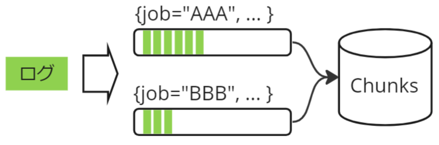
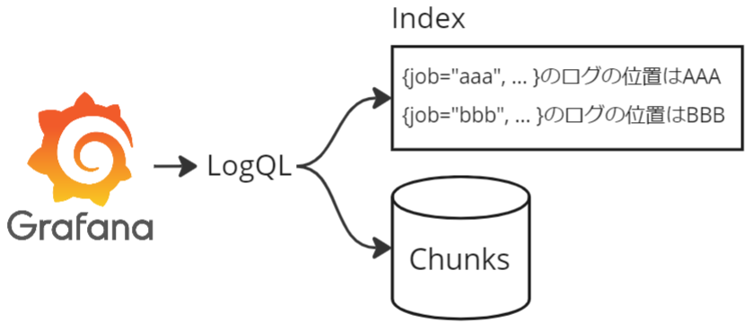
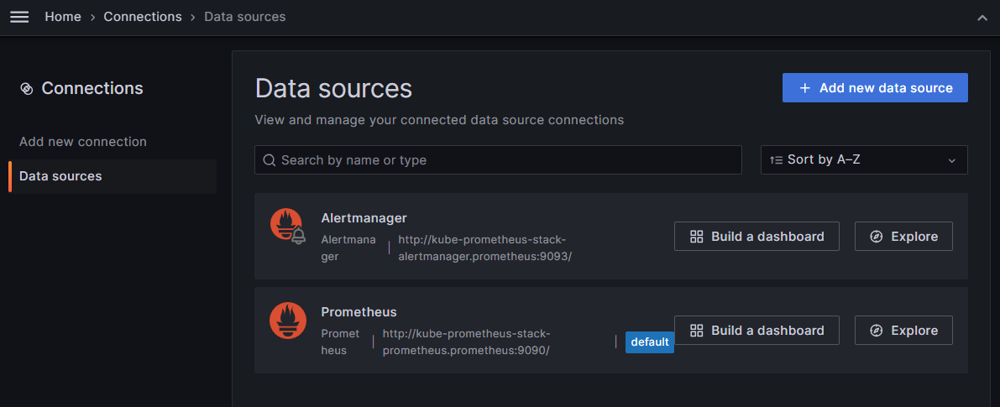
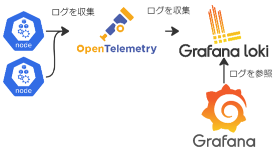
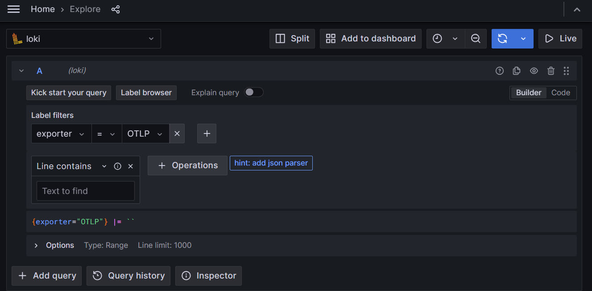
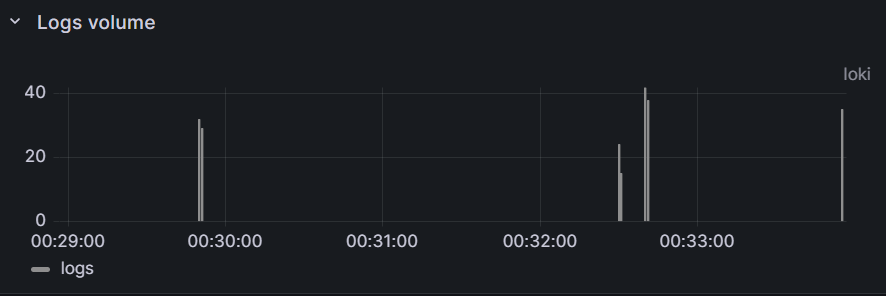
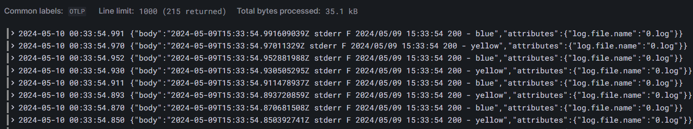
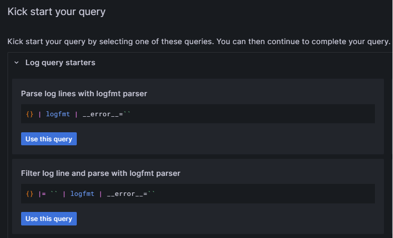
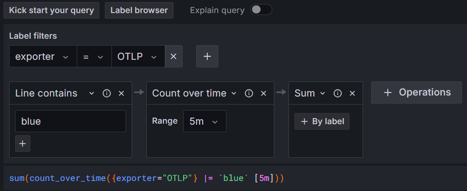
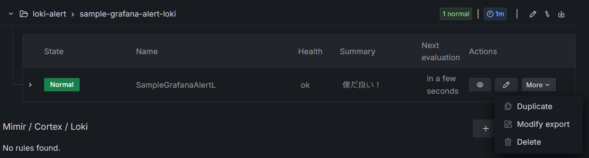

# Grafana Loki

本章では[Grafana Loki](https://github.com/grafana/loki)（以降、Loki）について紹介します。
本章を行うには[chapter_opentelemetry](https://github.com/cloudnativedaysjp/cnd-handson/tree/cndw2024/chapter_opentelemetry)を行う必要あります。
下記の流れで説明します。

- Lokiの概要
- アーキテクチャについて
- Lokiのデプロイモード
- 実践
  - Lokiの構築
  - Grafanaを利用したログの検索
  - アラートの設定

## 概要

LokiはPrometheusを参考に作成されたログの集約システムです。
LokiをベースにしたLogging Stackの利用イメージは下記の図になります。
LokiはPull型ではなくPush型を採用しており、ログを取得してLokiに送付するAgentが必要になります。
Agentとしては、[Promtail](https://grafana.com/docs/loki/latest/send-data/promtail/)や[fluentbit](https://fluentbit.io/)、[OpenTelemetry](https://opentelemetry.io/)などがあげられます。
また、集約したログは[Grafana](https://github.com/grafana/grafana)や[LogCLI](https://grafana.com/docs/loki/latest/query/logcli/)のようなツールで参照します。


Lokiの特徴として、ログに付与されたラベルに対してのみインデックスを作成することによる、ラベルを条件にしたログ参照の高速化があげられます。

下記の図は簡単なログの格納処理になります。
Lokiでは、ログのラベルのキーと値の組み合わせの数だけ、ログストリームと呼ばれるものが作成されます。
Lokiで受け取ったログは、ラベルのキーと値をもとにログストリームへ振り分けられ、一定数たまると圧縮され、Chunkとしてオブジェクトストレージに格納されます。
たとえば、Lokiがjobラベルの値として`AAA`と`BBB`を認識している例を考えます（以下の図）。
この場合、`{job="AAA"}`と`{job="BBB"}`の2種類のログストリームが定義され、Lokiがjobラベルの値が`AAA`であるログを受け取ると、`{job="AAA"}`のログストリームにまとめられます。



前述した通り、Lokiではラベルに対しIndexを付与します。
読み取り時は、タイムスタンプやログのラベルの情報をもとにログが含まれるChunkの位置を特定し、読み込み処理を行います。
読み込んだChunkのデータに対して、ログの検索や集計等が行われます。



> [!WARNING]
> とぢらも説明の簡易化のために、かなり処理を省いています。
> より詳しい処理は[Select the chunks by inverted index](https://taisho6339.gitbook.io/grafana-loki-deep-dive/query-process/determine-the-chunks-to-fetch-using-inverted-indexes)を参照してください。

## Loki Architecture

Lokiのアーキテクチャについて説明します。
Grafana Lokiは複数のマイクロサービスで構成されており、水平スケールが可能なシステムとして設計されています。
各サービスをマイクロサービスのように個別にデプロイすることも可能ですし、1つのコンテナイメージとしてデプロイすることも可能な設計となっています。
Loki自体はシングルバイナリとなっており、実行時に`-target`オプションを指定して動作を切り替えます。

まずはGrafana Lokiのアーキテクチャを見てみましょう。
以下がGrafana Lokiの簡単なアーキテクチャになります。


この図には以下のコンポーネントとストレージが図示されており、それぞれについて次節以降で説明します。

- コンポーネント
  - Distributor
  - Ingester
  - Querier
  - Query Frontend
  - Ruler
  - Compactor
  - Consul
- ストレージ
  - オブジェクトストレージ
  - Memcached

> [!NOTE]
> 上記の図で示したコンポーネントは一部です。
> たとえば、Loki v3.0.0からBloom CompactorとBloom Gatewayというコンポーネントが追加されました。
> これはクエリの速度向上を目的に実装されたBloomフィルターを実現するためのコンポーネントです。
> ここでの説明は省きますが、この機能を利用することで、ログが格納されているChunkをより効果的に見つけることができます。
> 詳細は[Query Acceleration with Blooms (Experimental)](https://grafana.com/docs/loki/latest/operations/query-acceleration-blooms/?pg=blog&plcmt=body-txt)を参照してください。

### コンポーネント

先ほどの図のコンポーネントについて説明します。

- Distributor
  - Agentからのログの書き込みリクエストを受信し、検証を行い、Ingesterにリクエストを回送するコンポーネントです
    - 同じリクエストを複数のIngesterに送付し、冗長化を設定することも可能です
    - 他にもログの前処理や、Ingesterを守るためのRate Limitなどの設定も可能です
  - ステートレスなサービスです
- Ingester
  - Distributorからログの書き込みリクエストを受け取ると、オブジェクトストレージに格納します
    - オブジェクトストレージへはログを圧縮し送付します
    - 送付前にログを一時的に貯めておくことで、オブジェクトストレージの操作を削減します
  - ログの読み取りリクエストを受け取ると、インメモリーに一時的に貯められたログデータを返却します
- Querier
  - Log Query Language(LogQL)の実行を担当するコンポーネントです
  - Ingesterとオブジェクトストレージからログを取得します
    - ログの冗長化設定が入っているとログの重複が発生する場合がありますが、その際には重複したログを削除します
  - オプションでQuerier-frontend/Query-Schedulerと連携が可能です
- Query-frontend
  - ログのクエリ処理を高速化するためのオプションのコンポーネントです
    - Querierの前段に配置し、キューやキャッシュの機構が実装されています
- Ruler
  - rule configurationで構成されたRuleや/またはAlertを評価し管理するコンポーネント
  - rule configurationはオブジェクトストレージに格納され、Ruler APIを介すか、直接アップロードすることで管理します
- Compactor
  - オブジェクトストレージに格納された複数のIndexファイルをテナントや日ごとのファイルに圧縮します
    - 定期的にオブジェクトストレージからファイルをダウンロードし、統合し、アップロードします
  - また、ログの保持と削除も担当します
- Consul
  - 一部のコンポーネントで利用される情報を格納するためのKey-Value Storeです
    - どのような情報がどのコンポーネントで利用されるかは[Hash Ring](https://grafana.com/docs/loki/latest/get-started/hash-rings/)をご参照ください
  - 図ではConsulとなっていますが、ほかにもetcdやInmemoryなどがサポートされています

> [!NOTE]
> 上記のコンポーネントは一部になります。
> Lokiがサポートしているコンポーネントの一覧は下記のコマンドで確認できます。
> また、後述するDeploy Modeのグルーピングに関しても、こちらのコマンドで確認できます。
>
> ```shell
> loki -config.file=/etc/loki/config/config.yaml -list-targets
> ```

### ストレージ

次に、先ほどの図のストレージについて説明します。

- オブジェクトストレージ
  - IndexとChunkのデータを格納するために利用します
  - オブジェクトストレージとして、AWS S3やGoogle Cloud Storageなどが利用できます
  - 図ではオブジェクトストレージとなっていますが、ファイルシステムも利用可能です
    - 推奨はされていません。詳細は[Manage storage](https://grafana.com/docs/loki/latest/operations/storage/#manage-storage)を参照してください
- Memcached
  - 各コンポーネントで利用されるキャッシュです
  - 図ではMemcachedとなっていますが、他にもRedisなどが利用できます
    - 詳細は[configure: cache config](https://grafana.com/docs/loki/latest/configure/#cache_config)を参照してください

## Deploy Model

前述したように、Lokiは多くのマイクロサービスで構成される分散システムであり、以下の3つのデプロイモードがあります。
どれもメリット・デメリットがあり、運用者の要件に応じて使い分けることが大切です。

- Microservice Mode
- Simple Scalable Deployment
- Monolithic Mode

### Microservice mode

このモードでは、Lokiの各コンポーネントを個々のマイクロサービスとして実行します。
個々の要件に合わせたきめ細かな設定が可能になります。
一方で、設定やメンテナンスの複雑度が一番高いモードになっており、非常に大規模なLokiクラスターや、スケーリングやオペレーションを正確に制御する必要がある場合にのみ推奨されるモードです。

### Simple Scalable Deployment

LokiのHelm Chartでデフォルトの設定です。
Simple Scalable Deploymentを略してSSDと呼ばれることもあります。
1日あたり数TBのログまでスケールアップが可能であり、これを大幅に超える場合にはMicroservice Modeを検討する必要があります。
SSDでは各コンポーネントをWrite Target/Read Target/Backend Targetに分類し運用します。

- Write Target
  - Kubernetesリソース: StatefulSet
  - 含まれるコンポーネント: Distributor、Ingester
- Read Target
  - Kubernetesリソース: Deployment
  - 含まれるコンポーネント: Query front end、Queriers
- Backend Target
  - Kubernetesリソース: StatefulSet
  - 含まれるコンポーネント: Compactor

### Monolithic mode

このモードはもっとも単純な動作モードであり、すべてのコンポーネントを単一バイナリ（またはコンテナイメージ）として単一のプロセス内で実行します。
1日あたり約20GBまでの少量のRead/Writeが発生する場合や、動作確認のために起動する場合などで便利です。
共有オブジェクトストレージを使用することで、水平スケールも可能です。

## 実践

### Lokiの構築

まずはLokiをKubernetesクラスターに展開してみましょう。
今回はMonolithic modeでデプロイします。

```shell
helmfile sync -f helm/helmfile.yaml
```

> [!WARNING]
> 今回、オブジェクトストレージとしてminIOを構築し利用する設定が入っています。
> これはローカルで確認するために選定しており、推奨される設定ではないことに注意してください。
> 詳細は[supported-chunks-stores-not-typically-recommended-for-production-use](https://grafana.com/docs/loki/latest/operations/storage/)を確認してください。

次にLokiを利用するGrafanaのDatasourceの設定をしましょう。
`http://grafana.vmXX.handson.cloudnativedays.jp/connections/datasources`にアクセスしてください。



「Connections」-> 「Data sources」-> 「Add new data source」をクリックし、`Loki`を選択します。
下記の設定値をいれて、「Save & test」をクリックしてください。

- `URL`: `http://loki-gateway.monitoring.svc.cluster.local`
- `Header`: `X-Scope-OrgID`
- `value`: `tenant1`

`URL`はGrafanaがアクセスするLokiのURLです。
Lokiはマルチテナントにも対応しており、`Header`と`value`で使い分けられます。
この値は、Lokiにログを送付するAgentに設定してあります。
今回の場合、`manifest/log-collector.yaml`の`exporters.loki.headers`に設定している値と同じ値を`Header`と`value`として設定します。

設定が完了すると、`http://grafana.vmXX.handson.cloudnativedays.jp/connections/datasources`にLokiが表示されます。
また、Grafana Exploreの画面でLokiが選択できるようになります。


> [!TIP]
> 今回はDatasouceの設定をGUIから行いましたが、本来であれば設定はコードに起こして管理した方が良いでしょう。
> たとえば、Helm Chartの[kube-prometheus-stack](https://artifacthub.io/packages/helm/prometheus-community/kube-prometheus-stack)でデプロイしたGrafanaのDatasourceに同様の設定をするのであれば、
> 下記のような設定を`value.yaml`に記載することで、コードとして管理ができます。
>
> ```yaml
> additionalDataSources:
>   - name: loki
>     access: proxy
>     basicAuth: false
>     editable: true
>     jsonData:
>       httpHeaderName1: "X-Scope-OrgID"
>     secureJsonData:
>       httpHeaderValue1: "tenant1"
>     type: loki
>     url: http://loki-gateway.monitoring.svc.cluster.local
> ```

### PodのログをGrafanaで確認

この節では、OpenTelemetry Collectorを利用して各Nodeのログを収集し、Lokiに格納する設定を行います。
また、格納したログをGrafana経由で確認します。



まずは、OpenTelemetry CollectorをアプライしてLokiにログを送付します。

```shell
kubectl apply -f manifest/log-collector.yaml
```

次にログを発生させます。
サンプルアプリは`http://app.vmXX.handson.cloudnativedays.jp/`にアクセスしてみてください。
色がついたパネルが発生するたびに、バックエンドのアプリケーションにログが出力されます。

> [!NOTE]
> Podのログは下記のコマンドで確認できます。
> 下記コマンドをコンソールで実行しておくと、実際にブラウザでアクセスした際にログが表示されていることを確認できます。
>
> ```sh
> kubectl logs -n handson -l app=handson -f
> ```

それでは実際にGrafanaからログを確認してみましょう。
`http://grafana.vmXX.handson.cloudnativedays.jp/explore`にアクセスします。
Label filtersに`exporter`と`OTLP`を設定して検索ボタンを押します。
すると、`exporter`ラベルの値が`OTLP`ログの数や、内容を確認できます。







> [!NOTE]
> Lokiではログの検索や集約にLogQLを利用します。
> さきほど、`exporter`ラベルの値が`OTLP`を指定すると、`{exporter="OTLP"} |= ""`という文字列が表示されていると思います。
> これがLogQLになります。
> 他にもさまざまなことがLogQLでできます。詳細は[LogQL: Log query language](https://grafana.com/docs/loki/latest/query/)をご確認ください。

### Grafana Explore: Kick start your query機能

Grafana Exploreの画面からよく使われるクエリのパターンを確認することもできます。
「Kick start your query」をクリックしてみてください。
下記の2種類のグループが表示されると思います。

- Log Query Starters：ログの検索や集計等に利用できるパターン
- Metrics Query starters：ログからメトリクスを生成する際に利用できるパターン



Log Query Startersには、特定の文字列でフィルターしたログをlogfmtで解析する例や、ラベルやログの内容の書き換えなどの例が確認できます。
また、Metrics Query startersには、ログをもとにメトリクスを生成するパターンが紹介されています。
たとえば、特定の文字列を持つログの数やラベルの数などのメトリクスに変換して視覚化できます。
どのパターンもそのまま適用することはできませんが、クエリを書く際のヒントとして利用できます。

試しに、Metric Query startersの`Total requests per label of streams`をクリックしてみましょう。
選択肢が表示される場合、「Replace query」を選択します。
すると、LogQLが自動で構築されるので、追加で下記の設定をしてください。

- `Line contains`: `blue`
- `Range`: `5m`



この場合、`sum(count_over_time({exporter="OTLP"} |= "blue" [5m]))`がLogQLになります。
このLogQLの意味は下記となり、直近5分間で`exporter`ラベルの値が`OTLP`であるログのうちblueを含むログの数を表示します。

- `{exporter="OTLP"}`: `exporter`ラベルの値が`OTLP`であるログを選択
- `|= "blue"`: blueという文字列が含まれるログを選択
- `count_over_time(...)[5m]`: 直近5分間のログの数をカウント
- `sum()`: 合計する

### アラートを投げる

`http://grafana.vmXX.handson.cloudnativedays.jp/alerting/list`にアクセスしてアラートを設定してみましょう！

> [!WARNING]
> Grafanaの章で設定したContact PointとNotification Policyを利用します。

`New alert rule`をクリックして、下記の項目を入力します。
入力が終わると`Save rule and exit`をクリックして適用します。

- `Rule name` ... `SampleGrafanaAlertLoki`
- `Datastore` ... `Loki`
- `Label filter` ... `exporter = OTLP`
- `Operation` ... 以下を順に設定
  - `Line Filter > Line contains` をクリックし、 `blue` に設定
  - `Range Functions > Count over time` をクリックし、 `Range` を `5m` に設定
  - `Aggregations > Sum` をクリック
- `Expressions`
  - `Reduce > Mode` ... `Replace Non-numeric value`を`0`に設定
    - この設定をいれることで、値が無い場合は0とみなします
  - `Threshold` ... `IS ABOVE`を`100`に設定
    - 100より大きい場合、アラートを発報します
- `Set evaluation behavior`
  - `Folder` ... New folderで`loki-alert`を作成
  - `Evaluation group` ... `New evaluation group` をクリックし、 `Evaluation group name` を `sample-grafana-alert-loki`, `Evaluation Interval` を `1m` に設定
  - `Pending period` ... `0s`に設定（即時発報）
- `Configure labels and notifications` ... `alert-route`と`slack`を設定
- `Summary` ... 任意の文字列を追加
  - 他の参加者とアラートが被った場合でも、自分が設定したアラートだと識別できるように設定

このアラートは、`sum(count_over_time({exporter="OTLP"} |= "blue" [5m]))`が100を超えた場合にアラートを発報するというルールになっています。
アラートを設定したら`http://app.vmXX.handson.cloudnativedays.jp/`にアクセスして、ログを増やしてみましょう。

> [!TIP]
> アラートの発表状況は`http://grafana.vmXX.handson.cloudnativedays.jp/alerting/list`から確認できます。
> Datasoucesにlokiを指定すると、先ほど設定したアラートの状況が確認できます。
> 通常はStateが`Normal`となっており、`Firing`となればアラートが発報されている状態です。

Slackにアラートが連携されることを確認したら、アラートの設定を削除しておきましょう
`http://grafana.vmXX.handson.cloudnativedays.jp/alerting/list?search=datasource:loki`にアクセスし、Moreから「Delete」を選択肢削除しておきます。



