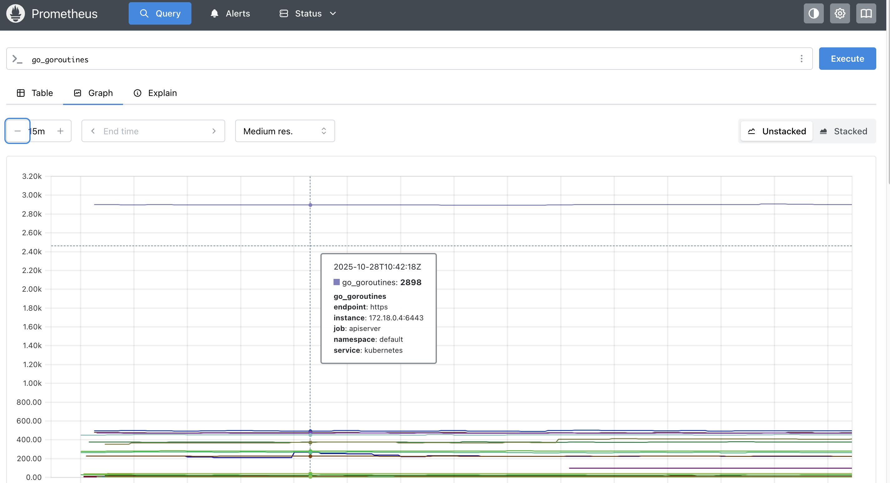
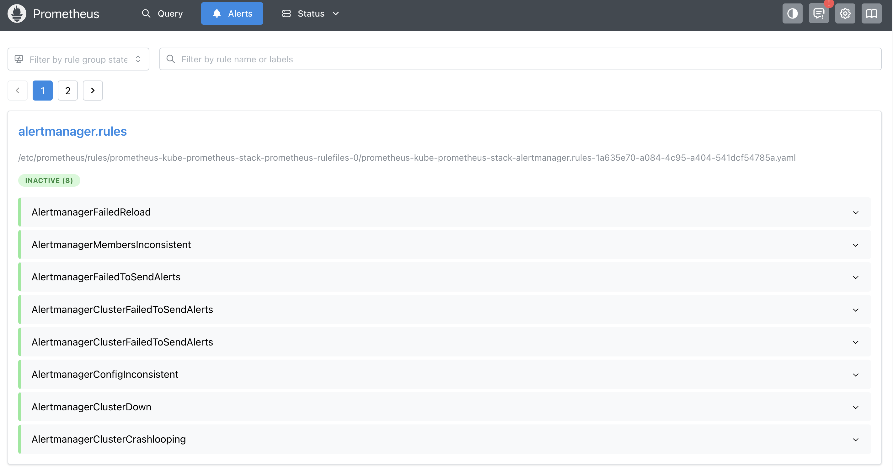
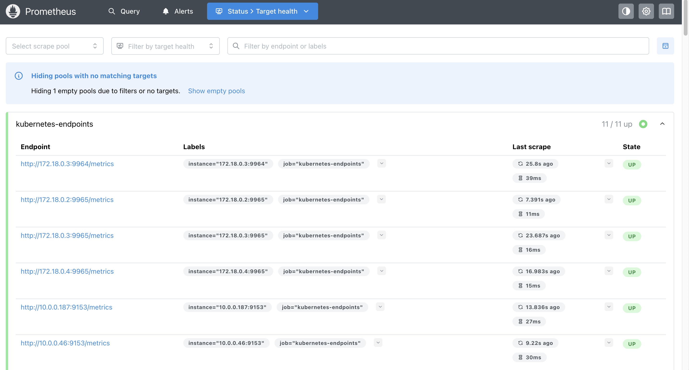

# Prometheus

この章では、Kubernetes上での様々なメトリクスの監視ツールであるPrometheusを紹介し、実際に導入してみます。

## Prometheusについて

Prometheusはモニタリング/アラートに関する基盤として利用することができるOSSです。  
2012年にSoundCloud社のエンジニアによって開発され、2016年にCNCF (Cloud Native Computing Foundation) Projectに加わり、現在は「Graduated」となっています。

Prometheusでは、監視対象のメトリクス情報を時系列データとして収集し、保存します。  
メトリクス情報は、ラベルと呼ばれるキーと値のペアで指定された対象から記録された情報をタイムスタンプと共に保存されます。

メトリクス収集についてはプル型アーキテクチャによって実現されており、対象システムから能動的にメトリクス（計測データ）を収集する点が特徴です。Prometheusではプル型の収集を、スクレイプ（Scrape）と呼称しています。
また、サービスからのプッシュも、PushGatewayというバッチジョブの仕組みまたは、Prometheus Remote-Write APIエンドポイントへ直接リクエストすることにより可能です。
Prometheusのアーキテクチャは以下の通りです。


独自のクエリ言語「PromQL」を備えており、閾値監視でメモリなど閾値を越えた場合に、Alert Managerと連携してAlertを出すことも可能であり、また、Grafanaといった可視化ツールと連携することで収集したデータを簡単に可視化することが可能です。  
これらにより、リアルタイム性の高いモニタリングを実現する重要なツールとして普及しています。

## PromQLについて

Prometheusが提供するメトリクスのクエリ言語で、多次元的にラベルがつけられた時系列データに対して様々な計算を適用することが可能です。
例えば以下の式では、特定の環境で、GET以外のHTTPリクエストメソッドを持つリクエスト数のデータを取得することができます。

```text
http_requests_total{environment=~"staging|testing|development",method!="GET"}
```

## Prometheus Operatorについて

Prometheus Operatorは、Prometheusや関連する監視コンポーネントのデプロイメントと管理をKubernetesネイティブな方法で提供します。  

KubernetesクラスタのPrometheusベースの監視スタックの設定を簡素化および自動化することを目的としており、以下のような特徴があります。

* Kubernetesカスタムリソース：Kubernetesのカスタムリソースを使用して、PrometheusやAlertmanager、関連するコンポーネントをデプロイし、管理します。
* 簡素化されたデプロイメント設定：Prometheusの基本設定であるバージョン、永続性、保持ポリシー、KubernetesリソースのReplicaなどを設定することができます。
* Prometheusターゲット設定：Prometheus固有の言語を学ぶ必要なく、Kubernetesラベルクエリに基づいて監視ターゲット設定を自動的に生成します。


### メトリクスの収集

メトリクスを収集するために、Prometheus Operator は `ServiceMonitor`や`PodMonitor`を使用して、監視対象のサービスを指定します。  
これにより、CPUやメモリ使用率、HTTPリクエスト数、レイテンシーなどのメトリクスを追跡できます。

例として、replicaが3つでport`8080`で以下のようなアプリケーションが公開されていることを前提として説明していきます。

```yaml
apiVersion: apps/v1
kind: Deployment
metadata:
  name: example-app
spec:
  replicas: 3
  selector:
    matchLabels:
      app: example-app
  template:
    metadata:
      labels:
        app: example-app
    spec:
      containers:
        - name: example-app
          image: fabxc/instrumented_app
          ports:
            - name: web
              containerPort: 8080
---
kind: Service
apiVersion: v1
metadata:
  name: example-app
  labels:
    app: example-app
spec:
  selector:
    app: example-app
  ports:
    - name: web
      port: 8080
```

### ServiceMonitorの設定

`ServiceMonitor`オブジェクトは、Serviceリソースに基づいて、対象のエンドポイントからメトリクスを収集することができます。  
具体的には、Serviceオブジェクトに紐づくPodを検出し、そのPodからのメトリクスを収集する場合に便利です。

```yaml
apiVersion: monitoring.coreos.com/v1
kind: ServiceMonitor
metadata:
  name: example-app
  labels:
    team: frontend
spec:
  selector:
    matchLabels:
      app: example-app
  endpoints:
    - port: web
```

### PodMonitorの設定

`PodMonitor`オブジェクトは、KubernetesのPodリソースを監視するためのカスタムリソースです。こちらはServiceを介さず、直接Podを監視するために使用されます。  
個々のPodからメトリクスを収集する場合に便利です。

```yaml
apiVersion: monitoring.coreos.com/v1
kind: PodMonitor
metadata:
  name: example-app
  labels:
    team: frontend
spec:
  selector:
    matchLabels:
      app: example-app
  podMetricsEndpoints:
    - port: web
```


---

## 実践: Prometheusの導入
### Helmでインストール

KubernetesクラスタにPrometheusをインストールする方法として、
Prometheusおよび各種ExporterをDaemonset等でデプロイする方法もありますが、
ここではkube-prometheus-stackというHelm Chartを利用します。

kube-prometheus-stackでは、以下のようなコンポーネントをまとめてインストールすることができ、
YAML形式で宣言的に各種設定ができるため、導入/管理が比較的容易に実現できます。

- Prometheus
- Grafana
- AlertManager
- kube-state-metrics
- Node Exporter
- Prometheus Operator

helmfile.yaml、およびその中で指定している prometheus-values.yaml を利用して、`helmfile sync` を実行し、release(Helmの管理単位)をインストールしましょう。

```bash
cat helm/helmfile.yaml

helmfile sync -f helm/helmfile.yaml
```

実際に各種サービスが起動しているか確認してみましょう。  
各Podの「STATUS」が`Running`になっており、「READY」が`1/1`,`2/2`,`3/3`となっていれば問題ありません。

```bash
kubectl get all -n prometheus
```

```bash
# 実行結果
NAME                                                            READY   STATUS    RESTARTS   AGE
pod/alertmanager-kube-prometheus-stack-alertmanager-0           2/2     Running   0          40s
pod/kube-prometheus-stack-grafana-7ddf785959-87xlh              3/3     Running   0          48s
pod/kube-prometheus-stack-kube-state-metrics-55cb9c8889-4c9qq   1/1     Running   0          48s
pod/kube-prometheus-stack-operator-77975fd5b8-r6tdl             1/1     Running   0          48s
pod/kube-prometheus-stack-prometheus-node-exporter-b462n        1/1     Running   0          49s
pod/kube-prometheus-stack-prometheus-node-exporter-fpfm8        1/1     Running   0          49s
pod/kube-prometheus-stack-prometheus-node-exporter-qrphj        1/1     Running   0          49s
pod/prometheus-kube-prometheus-stack-prometheus-0               2/2     Running   0          40s

NAME                                                     TYPE        CLUSTER-IP      EXTERNAL-IP   PORT(S)                      AGE
service/alertmanager-operated                            ClusterIP   None            <none>        9093/TCP,9094/TCP,9094/UDP   40s
service/kube-prometheus-stack-alertmanager               ClusterIP   xx.xx.xx.xx    <none>        9093/TCP,8080/TCP            49s
service/kube-prometheus-stack-grafana                    ClusterIP   xx.xx.xx.xx    <none>        80/TCP                       49s
service/kube-prometheus-stack-kube-state-metrics         ClusterIP   xx.xx.xx.xx    <none>        8080/TCP                     49s
service/kube-prometheus-stack-operator                   ClusterIP   xx.xx.xx.xx   <none>        443/TCP                      49s
service/kube-prometheus-stack-prometheus                 ClusterIP   xx.xx.xx.xx   <none>        9090/TCP,8080/TCP            49s
service/kube-prometheus-stack-prometheus-node-exporter   ClusterIP   xx.xx.xx.xx    <none>        9100/TCP                     49s
service/prometheus-operated                              ClusterIP   None            <none>        9090/TCP                     40s

NAME                                                            DESIRED   CURRENT   READY   UP-TO-DATE   AVAILABLE   NODE SELECTOR            AGE
daemonset.apps/kube-prometheus-stack-prometheus-node-exporter   3         3         3       3            3           kubernetes.io/os=linux   49s

NAME                                                       READY   UP-TO-DATE   AVAILABLE   AGE
deployment.apps/kube-prometheus-stack-grafana              1/1     1            1           49s
deployment.apps/kube-prometheus-stack-kube-state-metrics   1/1     1            1           49s
deployment.apps/kube-prometheus-stack-operator             1/1     1            1           49s

NAME                                                                  DESIRED   CURRENT   READY   AGE
replicaset.apps/kube-prometheus-stack-grafana-7ddf785959              1         1         1       49s
replicaset.apps/kube-prometheus-stack-kube-state-metrics-55cb9c8889   1         1         1       49s
replicaset.apps/kube-prometheus-stack-operator-77975fd5b8             1         1         1       49s

NAME                                                               READY   AGE
statefulset.apps/alertmanager-kube-prometheus-stack-alertmanager   1/1     40s
statefulset.apps/prometheus-kube-prometheus-stack-prometheus       1/1     40s
```

Prometheusのバージョンは、コンテナイメージのタグやPodのログで確認することができます。
```bash
kubectl get pods -n prometheus -l app.kubernetes.io/name=prometheus -o jsonpath='{.items[0].spec.containers[?(@.name=="prometheus")].image}'; echo
```

```bash
kubectl logs -n prometheus $(kubectl get pods -n prometheus -l app.kubernetes.io/name=prometheus -o jsonpath='{.items[0].metadata.name}') -c prometheus | grep "version"
```

### Ingressによるサービスの公開

続いて、PrometheusやGrafana等の各UIをIngressで公開していきます。  
すでにIngress NGINX Controllerがデプロイされていると思うので、以下のような設定でIngressをデプロイして公開します。

```yaml
---
apiVersion: networking.k8s.io/v1
kind: Ingress
metadata:
  name: grafana-ingress-by-nginx
  namespace: prometheus
  annotations:
    nginx.ingress.kubernetes.io/ssl-redirect: "false"
spec:
  ingressClassName: nginx
  rules:
    - host: grafana.example.com
      http:
        paths:
          - path: /
            pathType: Prefix
            backend:
              service:
                name: kube-prometheus-stack-grafana
                port:
                  number: 80

---
apiVersion: networking.k8s.io/v1
kind: Ingress
metadata:
  name: prometheus-ingress-by-nginx
  namespace: prometheus
  annotations:
    nginx.ingress.kubernetes.io/ssl-redirect: "false"
spec:
  ingressClassName: nginx
  rules:
    - host: prometheus.example.com
      http:
        paths:
          - path: /
            pathType: Prefix
            backend:
              service:
                name: kube-prometheus-stack-prometheus
                port:
                  number: 9090
```

```bash
kubectl apply -f ingress.yaml
```

### Web UIへアクセス 
実際にそれぞれのUIが公開されているか確認してみましょう。

```bash
kubectl get ingress -n prometheus
```

```bash
# 実行結果
NAME                          CLASS   HOSTS                    ADDRESS         PORTS   AGE
grafana-ingress-by-nginx      nginx   grafana.example.com      xx.xx.xx.xx   80      58m
prometheus-ingress-by-nginx   nginx   prometheus.example.com   xx.xx.xx.xx   80      58m
```

ローカル端末のブラウザから <http://prometheus.example.com> と <http://grafana.example.com> にアクセスしてみましょう。  
※[chapter_setup](https://github.com/cloudnativedaysjp/cnd-handson/tree/main/chapter_setup)にてローカル端末のhostsファイルに`prometheus.example.com` と `grafana.example.com`が登録されている前提です。

Grafanaではユーザログインが必要ですが、Helm設定した prometheus-values.yaml の内容でログインできます。(`username: admin, password: handson_saiko!`)  
values.yamlに記載した認証情報でログインできなかった場合は、以下のコマンドを実行してパスワードを確認し、ログインしてください。

```bash
kubectl get secrets -n prometheus kube-prometheus-stack-grafana -o json | jq -r .data[\"admin-password\"] | base64 -d; echo
```

---

## 実践: Prometheus Web UIを触ってみよう

### PromQL

Prometheus Web UIでは、独自のクエリ言語である「PromQL」を利用してインタラクティブに簡単なモニタリングを行うことができます。
ここではkube-prometheus-stackがデフォルトでインストールするExporterの様子を掴むために、実際にPromQLを使ってメトリクスを見てみましょう。

PromQLの詳細な仕様についてはこちらを御覧ください。

> https://prometheus.io/docs/prometheus/latest/querying/basics/

<http://prometheus.example.com/graph> にアクセスして、PromQL入力欄に `go_goroutines` と入力してみます。
その後、 `Graph` のタブをクリックすると、以下のようなグラフが見れるはずです。



これは、Go言語で実装されたExporterでよく公開されている、現在のgoroutineの発行数となるメトリックです。
これは「Gauge」となっているので、単調増加ではなく微妙に増減しているのが確認できます。
後ほど、いくつかのPromQL実践例を紹介します。

### Alerts

kube-prometheus-stackでデフォルトで導入されているアラートルールを確認することができます。

<http://prometheus.example.com/alerts>



### Status

現在稼働しているPrometheusの状態確認をすることができます。  
以下のスクリーンショットでは、scrape_configに設定されたexporterに対するスクレイプが正しくおこなえているかどうか等の情報が表示されています。

<http://prometheus.example.com/targets>



## 実践: Ingress NGINX Controllerからメトリクスを収集

ここでは、`Ingress NGINX Controller`のメトリクスをPrometheusとGrafanaによる収集方法を説明します。

- `emptyDir`をPrometheusとGrafanaに使っている場合は、データを失う可能性があるので気をつけてください。

### Nginx Ingressのメトリクスを外部公開する

Ingress NGINX Controllerのメトリクスを外部公開するために、ServiceMonitorを作成し、PrometheusがIngress NGINX Controllerのメトリクスを取得できるようにします。

```yaml
apiVersion: monitoring.coreos.com/v1
kind: ServiceMonitor
metadata:
  name: ingress-nginx-controller
  namespace: ingress-nginx
spec:
  endpoints:
    - port: metrics
      interval: 30s
  namespaceSelector:
    matchNames:
      - ingress-nginx
  selector:
    matchLabels:
      app.kubernetes.io/name: ingress-nginx
      app.kubernetes.io/instance: ingress-nginx
      app.kubernetes.io/component: controller
```

```shell
kubectl apply -f manifests/ingress-nginx-servicemonitor.yaml
```

<http://prometheus.example.com/graph> を開き (またはリロードして)、PromQL入力欄に ngi のように入力し、nginx のメトリクスが追加されているのを確認しましょう。
※ServiceMonitorをapplyしてから反映（メトリクスが追加）されるまでに数分かかります。


## PromQL実例集

ここでは、 <https://prometheus.io/docs/prometheus/latest/querying/basics/> の内容をもとに、
PromQLでよく使われる表現をいくつか見ていきたいと思います。

より包括的なチートシートとしては、 <https://promlabs.com/promql-cheat-sheet/> も参考になります。

```text
# Instant Vector(http_requests_totalにおける、サンプリングデータの集合)
http_requests_total

# Instant Vector with Selector(http_requests_totalのうち、指定したラベルを持つデータの集合)
http_requests_total{job="prometheus",group="canary"}

# Instant Vector with Matching Expression
http_requests_total{environment=~"staging|testing|development",method!="GET"}

# Range Vector(過去5分間における、http_requests_totalのデータ)
http_requests_total{job="prometheus"}[5m]

# Built-in function with Range Vector(過去5分間における、http_requests_totalの平均)
# 各組み込み関数のシグネチャはこちら https://prometheus.io/docs/prometheus/latest/querying/functions/#aggregation_over_time
avg_over_time(http_requests_total{job="prometheus"}[5m])

# Aggregation Operators(application, groupごとに集計したhttp_requests_totalの合計)
 sum by (application, group) (http_requests_total)

# 実例1(利用可能になっているKubernetes Nodeの数)
sum(kube_node_status_condition{condition="Ready", status="true"}==1)

# 実例2(Namespaceごとに集計した、準備可能になっていないPodの数)
sum by (kube_namespace_name) (kube_pod_status_ready{condition="false"})
```

## 参考文献

- [Prometheusの公式ドキュメント](https://prometheus.io/docs/introduction/overview/)
- [Prometheus Operatorの公式ドキュメント](https://prometheus-operator.dev/)
- [Nginx Ingressのメトリクス収集](https://github.com/kubernetes/ingress-nginx/blob/main/docs/user-guide/monitoring.md)
