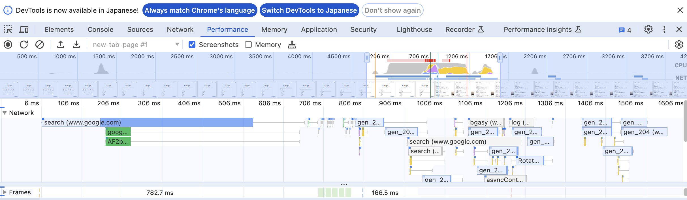
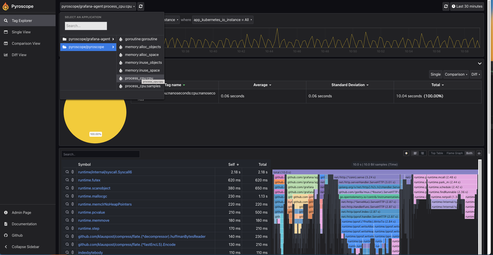
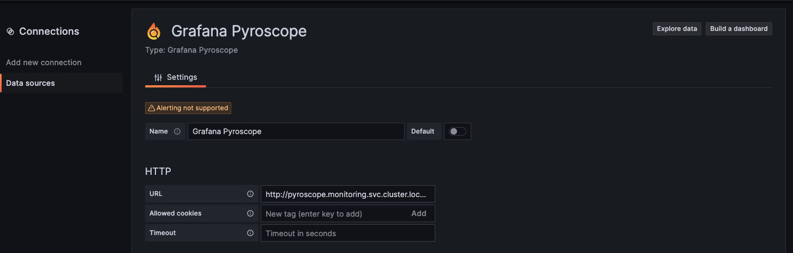
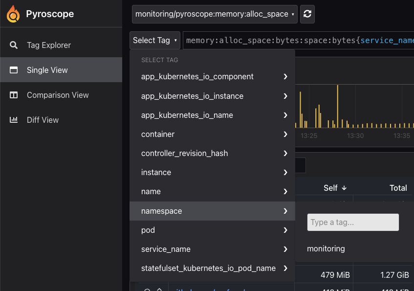
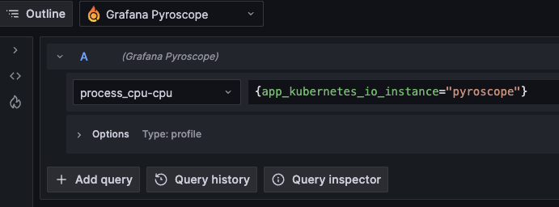
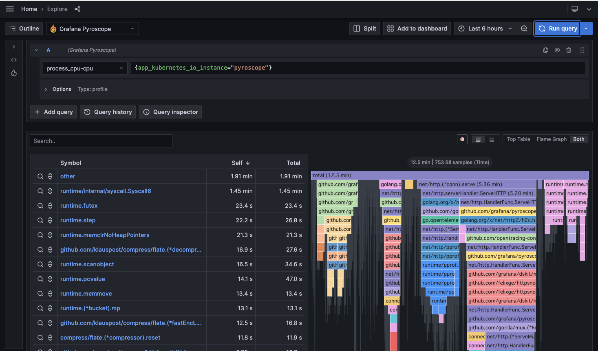
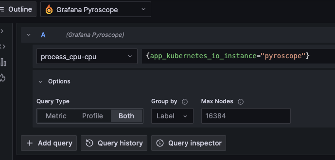
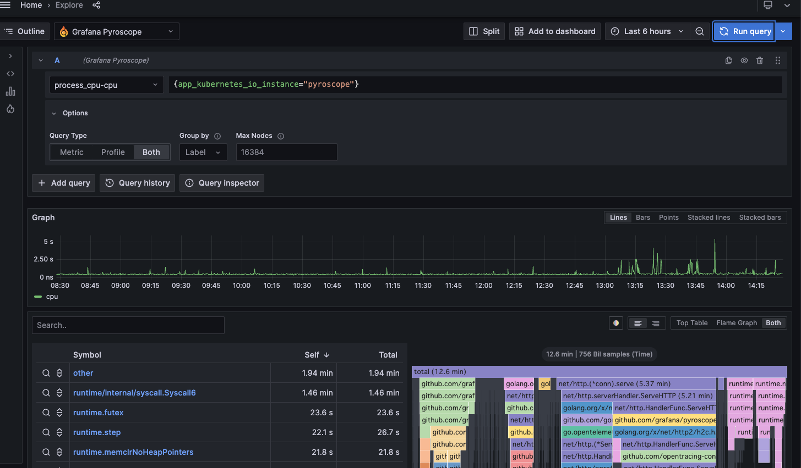
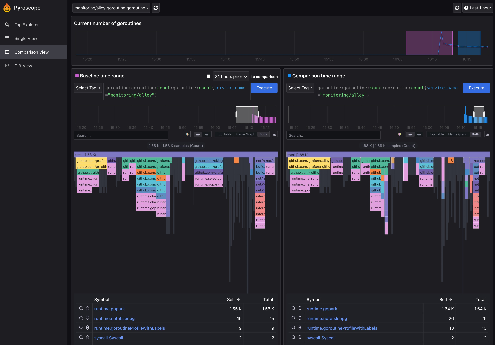
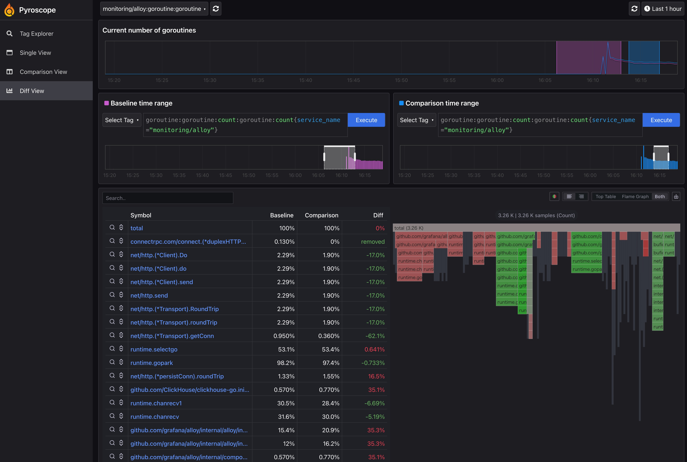

# Pyroscope
この章では、オブザーバビリティの主要シグナルとして注目される、プロファイルについて紹介し、オブザーバビリティのバックエンドとして、GrafanaLabsのPyroscopeを導入します。

## プロファイルについて
**プロファイル**とは、ツールによりプログラム実行時の各種データを収集し、得られたデータの統計的な要約を行うことです。あるいは、そのデータのこともプロファイルと呼びます。また、プロファイルを収集する行為のことを、**プロファイリング**と呼びます。

メトリクスとは異なる概念で、アプリケーションがリソースをどのように消費しているかを断面的に見ることができ、リソース消費の多いプログラムを、即座に特定すること等に役立ちます。

## 従来のプロファイリング（非連続）と継続的プロファイリング

### 従来のプロファイリング（非連続）
従来のプロファイリングは、手動で記録を開始・停止する必要があり、開発環境での使用が中心でした。オーバーヘッドが高く、本番環境での継続的な実行は困難でした。

**例：Chrome DevTools**
1. DevToolsを開く（F12 または右クリック→検証）
2. Performanceタブを選択
3. 記録開始（▶︎ボタン）
4. 対象操作を実行
5. 記録停止（■ボタン）



### 継続的プロファイリング

継続的プロファイリングでは、低オーバーヘッドのサンプリングを使用して本番環境でも安全に実行でき、長期にわたってプロファイルを収集・分析できます。分散システム全体の動作把握に特に有効です。
継続的プロファイリングでは、オーバヘッドの低いサンプリングを使用して、プロファイルを安全に収集します。そのプロファイルはデータベースに保存するため、後で分析できます。

継続的プロファイリングを使用すると、分散サービス化しているアプリケーションが、本番環境でどのように動作するかを、全体的に把握することにも役立ちます。


## Pyroscopeについて


**Pyroscope**は、Grafana Labsにより展開されている、継続的プロファイリングのOSS製品です。

元々、Grafana Phlare というプロジェクトがありましたが、2023/3 に、Grafana LabsがPyroscope社を買収し、Grafana Phlare と Pyroscope が統合され「Grafana Pyroscope」となりました。
2023/9 に v1.0.0 がリリースされています。

### Write（プロファイルの書き込み）


1. distributorは、ingesterへプロファイルをPushします。
2. ingesterは、受信したプロファイルを、Pyroscopeのデータベースに保存します。プロファイルをすぐに書き込むのでなく、一度ingesterのメモリ領域か、ingesterのディスク領域に保持します。最終的に、全てのプロファイルがディスクに書き込まれ、長期ストレージに追加されます。ingesterはレプリケートされており、デフォルトでは3つのingesterが動いてます。
3. Compactorは、各ingesterからのブロックを1つにマージし、重複部分を削除します。ブロック圧縮により、ストレージ使用率を大幅に削減します。


### Read（プロファイルの読み込み）


1. Pyroscope上で実行されたクエリはAPIリクエストとして、query-frontendで受け取ります。
2. query-frontendは、query-schedulerに通信しに行きます。query-schedulerはクエリのキューを維持し、各テナントが公平に実行されるようにします。
3. querierは、query-schedulerのキューから、クエリを取得します。
4. querierの参照先は、最近のデータからならingesterから、長期ストレージからならstore-gatewayからデータを取得します。

## Pyroscopeへのプロファイルの送信（クライアント）
プロファイルをPyroscopeに送信する場合、各言語ごとのPyroscope SDKを使うか、Grafana Agentを使うかの2択でしたが、2024/04のGrafanaCONで、**Grafana Alloy**という、OTLP(OpenTelemetry Protocol)互換の新たなCollectorが発表されました。

当ハンズオンでは、初期構築時にGrafana Alloyがインストールされています。

> [!NOTE]
> Grafana Agentは2025年にEOLとなり、Alloyへとプロジェクト移行されます。

## 実践: Grafana Pyroscopeのインストール
実践として、Pyroscopeをインストールします。以降のハンズオンででは、pyroscopeのchapterを作業ディレクトリとしてください。
```bash
cd chapter_pyroscope
```

Kubernetesクラスタ上にPyroscopeをインストールします。
ここでは、grafanaのHelm Chartから利用します。

Pyroscopeでは、モノリシックモードと、マイクロサービスモードという、2つのデプロイ方式が選択できます。本章ではデフォルトでマイクロサービスモードを採用します。

用意されているhelmfile.yamlおよび `helm/values-micro-services.yaml` を利用して、 `helmfile sync` を実行し、Pyroscopeをインストールしましょう。

```bash
helmfile sync -f helm/helmfile.yaml
```

実際に各種サービスが起動しているか確認します。

```bash
kubectl get pods -n monitoring -l app.kubernetes.io/instance=pyroscope
```

```bash
# 実行結果（マイクロサービスモード）
pyroscope-alloy-0                            2/2     Running   0          29m
pyroscope-compactor-0                        1/1     Running   0          27m
pyroscope-compactor-1                        1/1     Running   0          27m
pyroscope-distributor-7d6969bdb4-4x9jh       1/1     Running   0          5m29s
pyroscope-ingester-0                         1/1     Running   0          27m
pyroscope-ingester-1                         1/1     Running   0          27m
pyroscope-minio-0                            1/1     Running   0          5m27s
pyroscope-querier-7867466d84-gg5qg           1/1     Running   0          27m
pyroscope-querier-7867466d84-nb2sd           1/1     Running   0          27m
pyroscope-querier-7867466d84-xtc4z           1/1     Running   0          27m
pyroscope-query-frontend-97bb84b78-mbpml     1/1     Running   0          5m28s
pyroscope-query-scheduler-857746b8b6-mgph2   1/1     Running   0          5m28s
pyroscope-store-gateway-0                    1/1     Running   0          27m
pyroscope-store-gateway-1                    1/1     Running   0          27m
```


## Pyroscopeフロントエンドへのアクセス
Pyoscopeの画面にアクセスします。pyroscopeの画面を参照するために、ingressリソースを追加します。

```bash
kubectl apply -f ingress.yaml
```

[http://pyroscope.example.com](http://pyroscope.example.com)にアクセスしましょう。すでにPyroscope自身のプロファイルが確認できます。




## Grafanaへのデータソース追加
chapter_grafanaで構築したGrafanaに、Pyroscopeのデータソースを追加します。
* Data sourse：Grafana Pyroscope
* HTTP>URL：http://pyroscope-query-frontend.monitoring.svc.cluster.local:4040



※kube-prometheus-stackで使用したhelmのvaluesに追加する手順でも対応できます。
```helmのvalues.yaml
datasources:
  - name: Grafana Pyroscope
    type: grafana-pyroscope-datasource
    url: http://pyroscope-query-frontend.monitoring.svc.cluster.local:4040
```

## Grafanaからのプロファイル参照
GrafanaのExplore([http://grafana.example.com/explore](http://grafana.example.com/explore))からプロファイルを見てみましょう。GarafanaのExploreでは、プロファイルタイプの選択と、ラベルセレクターでの絞り込みで、容易に表示できます。

プロファイルタイプは、cpu、memory、goroutineなどがあり、各言語ごとにサポートされています。詳細は、[Pyroscopeのドキュメント](https://grafana.com/docs/pyroscope/latest/view-and-analyze-profile-data/profiling-types/#available-profiling-types)を参照ください。

ラベルセレクターは、対象をtagで絞りたい場合に有効です。これは、Pyroscopeのclient側で付与されたtagになります。helmでinstallしたgrafana-agentでは、自動計装として使用可能なtagが付与されています。（[Pyroscope](http://pyroscope.example.com)のSingle View>Select Tagでの確認が簡単です。）空欄のままでもプロファイルを参照可能です。




1. プロファイルタイプを選択します。試しに、`process_cpu-cpu`を選択します。


2. ラベルセレクターで、対象を絞り込みます。記法は`{<tag>=<value>}`です。 試しに、`{app_kubernetes_io_instance="pyroscope"}`を入力します。



3. 「Run query」を実行して、プロファイルを表示します。




1. メトリクスも同時に表示できます。「Options」で表示項目を増やし、「Query Type」を「Both」にします。



5. 再度、「Run query」を実行すれば、メトリクスとプロファイルを同時に表示できます。（※「Query Type」を「Metric」にすれば、メトリクスだけ表示します）



## プロファイルの比較によるアプリケーションの改善
プロファイルは、ラベルセットや期間で比較することができ、パフォーマンスの変化を可視化できます。
たとえば、あるリリースからメモリリークが発生するようになり、プロファイルを比較することで原因の関数を特定するなど、アプリケーションの改善に役立ちます。

[http://pyroscope.example.com](http://pyroscope.example.com/) の`Comparison View`から、`Baseline time range`で比較元の期間、`Comparison time range`で比較先の期間を選択すると、比較結果が表示されます。




`Diff View`は上の`Comparison View`を拡張したもので、2つのプロファイルの差分を見ることができます。各関数が費やした時間を比較できるため、たとえばパフォーマンスの劣化や改善を認識できます。




## まとめ
当ハンズオンでは、プロファイルとは何かという原理・原則的な話から、実際にGrafanaLabsのPyroscopeを使ったプロファイリングの実装を、手短に説明してみました。プロファイルは、アプリケーションのどのプログラムがパフォーマンスに影響しているかを、一発で見つけることに貢献します。また、メトリクスはもちろん、トレース、ログとの紐付けなども期待できますので、ぜひ実装にチャレンジしてみてください。

## 参考: モノリシックモードで動かす場合
本章はマイクロサービスモードを前提としますが、参考としてモノリシックモードの手順も記載します。

1) `helm/helmfile.yaml` の `values` を一時的にコメントアウトし、`values-micro-services.yaml` を無効化します。
```helmfile.yaml
releases:
- name: pyroscope
  namespace: monitoring
  createNamespace: true
  chart: grafana/pyroscope
  version: 1.15.0
  # values:
  # - values-micro-services.yaml
```

2) 再デプロイします。
```bash
helmfile sync -f helm/helmfile.yaml
```

3) Ingress のバックエンドServiceを `pyroscope` に戻します（`ingress.yaml`）。
```ingress.yaml
  rules:
  - host: pyroscope.example.com
    http:
      paths:
      - path: /
        pathType: Prefix
        backend:
          service:
            # name: pyroscope-query-frontend # マイクロサービスモードで指定するservice名
            name: pyroscope # モノリシックモードの場合はこちらに変更
            port:
              number: 4040
```

4) Pod例（モノリシック）：
```bash
pyroscope-0         1/1     Running   0          22s
pyroscope-alloy-0   2/2     Running   0          22s
```

5) Grafana のデータソースURL例（モノリシック）：
```
http://pyroscope.monitoring.svc.cluster.local:4040
```

## 参考文献

- [Pyroscopeの公式ドキュメント](https://grafana.com/docs/pyroscope/latest/)
- [What is continuous profiling, and what is Pyroscope?](https://isitobservable.io/open-telemetry/what-is-continuous-profiling-and-what-is-pyroscope)
