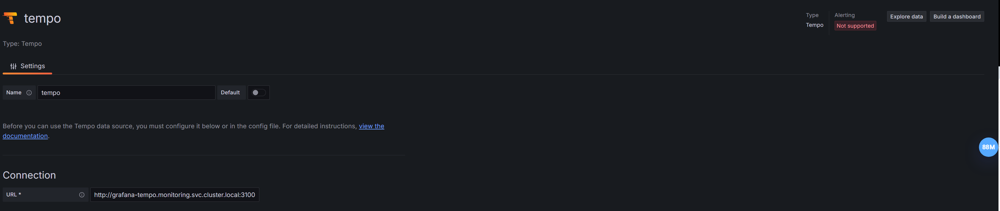
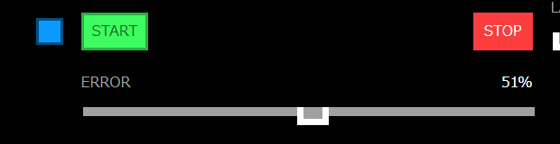
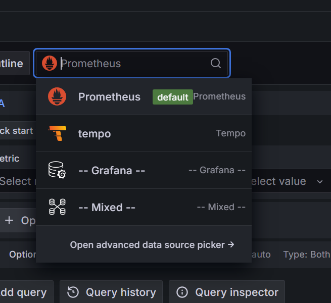
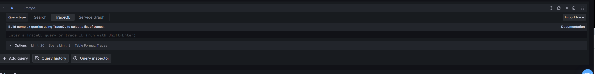
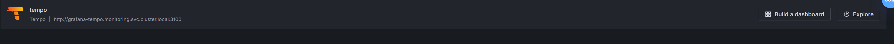
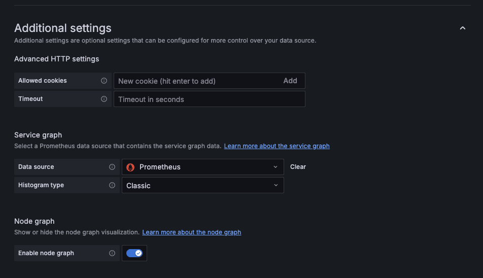
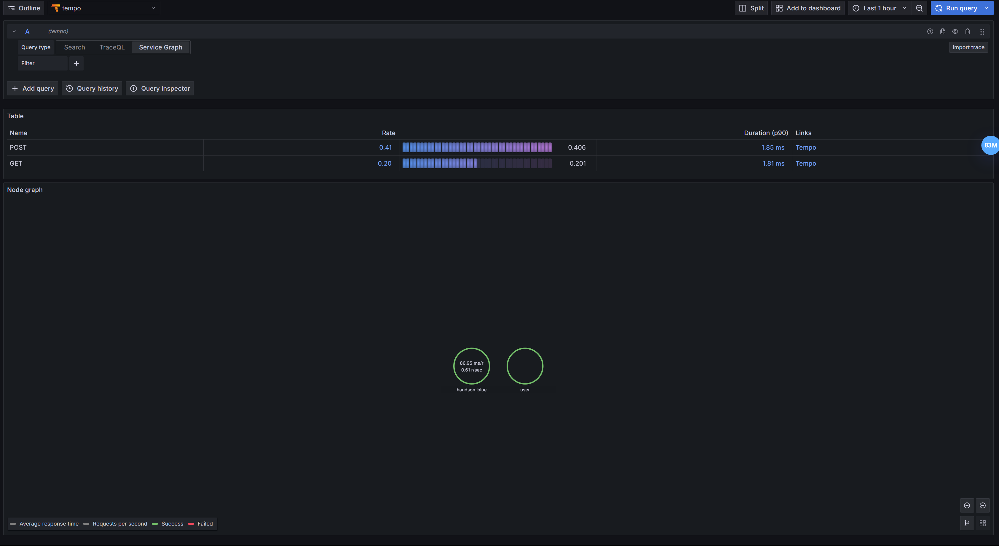
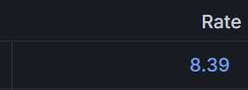

# Grafana Tempo
## 概要
[Grafana Tempo](https://github.com/grafana/tempo)は[GrafanaLab](https://github.com/grafana)が開発をしているOSSで、大規模な分散トレース バックエンドです。
Tempoを利用するとトレースを検索し、スパンからメトリクスを生成し、トレーシングデータをログとメトリクスにリンクすることができます。
動作にはオブジェクト ストレージのみが必要で、[Grafana](https://github.com/grafana/grafana)、[Prometheus](https://github.com/prometheus/prometheus)、[Loki](https://github.com/grafana/loki) などと連携することができます。


TempoはJaeger、OpenTelemetry と互換性があります。Azure、GCS、S3、またはローカル ディスクに書き込みます。

Tempo は、LogQL と PromQL からインスピレーションを得たトレースファーストのクエリ言語であるTraceQLを実装しています。このクエリ言語を使用すると、ユーザーは非常に正確かつ簡単にスパンを選択し、指定された条件を満たすスパンに直接ジャンプできます。

## アーキテクチャ


Tempoは以下のコンポーネントで構成されています。
- Distributor
- Ingester
- Query Frontend
- Querier
- Compactor
- Metrics generator
またストレージとして以下の2つが使われています。
- Cache(Redis Memcached)
- Object Storage(S3 GCS Azure)

### Distributor
 - Distributorは、Jaeger、OpenTelemetry、などの複数の形式のスパンを受け入れます。
 - traceIDをハッシュして、使用することによって、スパンをIngesterにルーティングします。
 - Distributorは、OpenTelemetry Collectorのレシーバーを使用します。

### Ingester
- Ingesterは、トレースをブロックにバッチ処理し、ブルーム フィルターとインデックスを作成して、それをすべてバックエンドにフラッシュします。
- バックエンドのブロックは以下のレイアウトで生成されます。

```
<bucketname> / <tenantID> / <blockID> / <meta.json>
                                      / <index>
                                      / <data>
                                      / <bloom_0>
                                      / <bloom_1>
                                        ...
                                      / <bloom_n>
```                         
### Query Frontend
- Query Frontendは、受信クエリの検索スペースをシャーディングする役割を果たします。
- トレースは、単純な HTTP エンドポイントを介して公開されます。 `GET /api/traces/<traceID>`
-  Query Frontendはクエリキューに入れます。Queriersは gRPC 接続を介してQuery Frontendに接続し、これらのシャード クエリを処理します。

### Queriers
- Querierは、Ingesterまたはバックエンドストレージ内のリクエストされたトレースIDを検索します。
- パラメータに応じて、Ingesterとバックエンドからブルーム/インデックスを取得してオブジェクトストレージ内のブロックを検索します
- Queriersは HTTP エンドポイントを次の場所に公開しますが `GET /querier/api/traces/<traceID>`、直接使用されることは想定されていません。
- クエリはQuery Frontendに送信する必要があります。

### Compactor
- Compactorは、ブロックをバックエンド ストレージとの間でストリーミングして、ブロックの総数を減らします。

### Metrics generator
- 取り込まれたトレースからメトリクスを生成し、メトリクス ストレージに書き込むオプションのコンポーネントです。
- 利用する場合DistributorはIngesterとMetrics generatorの両方に書き込みます。
- Metrics generatorはPrometheusのremote_writeを利用してPrometheusに書き込みます。

## デプロイ方法
Tempo は、モノリシック モードまたはマイクロサービスモードでデプロイできます。

### モノリシックモード
- モノリシック モードでは、すべてのコンポーネントが 1 つのプロセスで実行され、Tempo のインスタンスが形成されます。
- モノリシック モードは展開が最も簡単ですが、コンポーネントの量を増やして水平方向にスケールアウトすることはできません。
- 今回のハンズオンではこちらを利用しています。

### スケーリングモノリシックモード
- スケーリングモノリシック モードは水平方向にスケールアウトすることが可能です。
- スケーリングモノリシック モードはすべてのコンポーネントが 1 つのプロセス内で実行されるという点でモノリシック モードに似ています。
- マイクロサービスモードと比べて、ある程度の柔軟性を備えたスケーリングが可能になります。


### マイクロサービスモード
- マイクロサービス モードではコンポーネントは個別のプロセスにデプロイされます。
- スケーリングはコンポーネントごとに行われるため、スケーリングの柔軟性が向上しより詳細に設定できるようになります。
- これはProduction環境で推奨される方法ですが、最も複雑でもあります。

## Trace QLの概要
TraceQL は、PromQL と LogQL からインスピレーションを得て、Tempo でトレースを選択するために設計されたクエリ言語です。現在、TraceQL クエリは以下に基づいてトレースを選択できます。
- スパンとリソースの属性、タイミング、期間
- 基本的な集計: count()、avg()、min()、max()、およびsum()
TraceQL の設計の詳細については、[TraceQL コンセプトの設計提案](https://github.com/grafana/tempo/blob/main/docs/design-proposals/2022-04%20TraceQL%20Concepts.md)を参照してください。

## セットアップ
この章を行うにはPrometheusとGrafanaとOpentelemetryをデプロイしておく必要があります。
各章へ行きデプロイしてきてください。
`helmfile sync` を実行し Tempoをデプロイします。
```
helmfile sync -f helm/helmfile.yaml
```
デプロイが完了したら起動しているかどうかを確認してください。
```
kubectl get pod -n monitoring
```

```
NAME                                      READY   STATUS    RESTARTS   AGE
grafana-tempo-0                           1/1     Running   0          102s
opentelemetry-operator-569f6b668c-zrzdb   2/2     Running   0          23h
```
デプロイが完了したら次にGrafanaにTempoを追加する設定を行います。
`http://grafana.vmXX.handson.cloudnativedays.jp/connections/datasources`にアクセスしAdd data sourceをクリックしてください。
下のほうへスクロールするとTempoが存在するのでクリックします。
設定画面に遷移するので`Connection`の`URL`欄に`http://grafana-tempo.monitoring.svc.cluster.local:3100`を入力して一番下にあるSave & testをクリックしてください。

`Data source successfully connected.`と表示されると設定が完了しています。
今回はGUIで設定しましたが`prometheus/helm/prometheus-valus.yaml`に設定を追加することでコード上で設定を追加することも可能です。

次にOpenTelemetryの設定をApplyします。

```
kubectl apply -f manifests/
```

OpenTelemetryの章ではJaegerに向けていた設定をTempoへ書き換えています。
自動インスツルメンテーションを利用するためにhandson-blue Deploymentに対しても設定を行います。kubectl patchコマンドを利用してこれらのアノテーションを付与します。

```
kubectl -n handson patch deployment handson-blue -p '{"spec":{"template":{"metadata":{"annotations":{"instrumentation.opentelemetry.io/inject-go": "go-instrumentation"}}}}}'
kubectl -n handson patch deployment handson-blue -p '{"spec":{"template":{"metadata":{"annotations":{"instrumentation.opentelemetry.io/otel-go-auto-target-exe": "/rollouts-demo"}}}}}'
```

これでセットアップは完了です。
## search
まず`http://app.vmXX.handson.cloudnativedays.jp/`にアクセス後Errorのバーをスライドしてエラーを出力します。

次に`http://grafana.vmXX.handson.cloudnativedays.jp/explore`を開きます。
Promethusと書かれてるトグルメニューをクリックしてください。するとメニューが展開されるのでTempoを選択します。



Run Queryボタンをクリックしてください。


すると一覧が表示されます。


一覧の中から1つTrace IDを選択してクリックしてください。


右にTrace IDの詳細が展開されます。この画面はTrace IDを直接 Trace QLの欄に記入しても開くことができます。


## TraceQL
次にTrace QLタブをクリックしてください。


空欄があるので`{span.http.response.status_code=500}` と入力してみましょう。
すると表示されます。


## Service Graph
Service Graphを表示させるには追加で設定が必要です。
`http://grafana.vmXX.handson.cloudnativedays.jp/connections/datasources`にアクセスしたあとTempoを選択します。


下のほうまでスクロールして`Additional settings`のメニューを展開します。
展開した後Service graphの項目のData sourceにPrometheusを選択して一番下にあるSave & testをクリックします。
`Data source successfully connected.`と表示されると設定が完了しています。


`http://grafana.vmXX.handson.cloudnativedays.jp/explore`を開きます。Service GraphタブをクリックしてRun Queryボタンをクリックしてください。
すると下の画像のような表示になります。


`Rate`をクリックしてください。



すると右にPrometheusのパネルが展開してAPIがコールされた回数がグラフで表示されます。


## おまけ
今回は時間の都合上省略しますがLokiと連携してTraceとLogを接続する方法やPrometheusと連携してTraceとMetricsを連携する方法、
Pyroscopeと連携してTraceとprofilesを連携する方法があります。
Tempoを深く知るためにこちらもぜひ挑戦してみてください。
